[TOC]


# 绪论

## 数据结构的基本概念

## 算法和算法评价

# 线性表

## 线性表的定义和基本操作
## 线性表的顺序表示
## 线性表的链式表示

# 栈和队列


## 栈
+ **只允许在一端进行插入或删除** 操作的 **线性表**
+ **卡特兰数**：n个不同元素进栈，出栈元素不同排列的个数为**$\frac{1}{n+1} C^n_{2n}$**

### 基本操作

```c
// 初始化一个空栈
InitStack(&S)
          
// 判断一个栈是否为空，若栈S为空则返回true，否则返回false
StackEmpty(S)
          
// 进栈，若栈S未满，则将x加入使之成为新栈顶
Push(&S, x)
          
// 出栈，若栈S非空，则弹出栈顶元素，并用x返回
Pop(&S, &x)
          
// 读栈顶元素，若栈S非空，则用x返回栈顶元素
GetTop(S, &x)
          
// 销毁栈，并释放栈S占用的存储空间
DestroyStack(&S)
```

> 解答算法题时，若题干未做出限制，则可直接使用这些基本的操作函数


### 栈的顺序存储结构

+ 顺序栈

  一组地址连续的存储单元存放自**栈底到栈顶**的数据元素，同时附设一个指针（top）指示当前栈顶元素的位置。 

```c
// 定义栈中元素的最大个数
#define MaxSize 50
typedef struct {
	// 存放栈中元素
	Elemtype data[MaxSize];
	// 栈顶指针
	int top;
} SqStack;
```

初始时，设置 **S.top = -1**，栈顶元素 **S.data[S.top]**

**进栈**：栈不满时，栈顶指针先加1，再送值到栈顶元素
**出栈**：栈非空时，先取栈顶元素值，再将栈顶指针减1
**栈空条件**：**S.top == -1**

**栈满条件**：**S.top == MaxSize - 1**
**栈长**：**S.top+1**

+ 共享栈
  + 利用**栈底位置相对不变**的特性，可让两个**顺序栈**共享一个一维数组空间，将两个 **栈的栈底** 分别设置在共享空间的两端，两个 **栈顶** 向共享空间的中间延伸。
  + top0=-1时，0号栈为空，top1=MaxSize时，1号栈为空。仅当两个栈顶指针相邻时（**top1-top0==1**），判断栈满。

### 栈的链式存储

+ 通常采用 **单链表** 实现，并规定所有操作都是在 **单链表** 的 **表头** 进行。规定**链栈没有头结点**。    
```c
typedef struct Linknode {
	// 数据域
	ElemType data;
	// 指针域
	struct Linknode *next;
} *LiStack;  // 栈类型定义
```

+ 出栈序列判断
	+ **在原序列中，相对位置比它小的，必须是逆序**
	+ **在原序列中，相对位置比它大的，顺序没有要求**
	+ **以上两点可以穿插进行**

## 队列

操作受限的线性表。只允许在**表的一端进行插入**，在**表的另一端进行删除**。

**队头**：允许删除的一端，又称 **队首**

**队尾**：允许插入的一端


### 队列常见的基本操作
+ **InitQueue(&Q)**：初始化队列，构造一个空队列
+ **QueueEmpty(Q)**：判队列空，若队列Q为空返回true，否则返回false
+ **EnQueue(&Q, x)**：入队，若队列Q未满，将x加入，使之成为新的队尾
+ **DeQueue(&Q, &x)**：出队，若队列Q非空，删除队头元素，并用x返回
+ **GetHead(Q, &x)**：读队头元素，若队列Q非空，则将队头元素赋值给x

> 栈和队列是操作受限的线性表，因此不是任何线性表的操作都可以作为栈和队列的操作。比如，不可以随便读取栈或队列中间的某个数据。

### 队列的顺序存储结构


+ 队列的顺序存储
	队列的顺序实现是指**分配一块连续的存储单元存放队列中的元素，并附设两个指针：队头指针front指向队头元素，队尾指针rear指向队尾元素的下一个位置（不同教材的定义不同）**。

    ```c
    #define MaxSize 50
    typedef struct {
          ElemType data[MaxSize];
          int front, rear;
    } SqQueue;
    ```

    **初始状态（队空条件）**：Q.front == Q.rear == 0

    **进队操作**：队不满时，先送值到队尾元素，再将队尾指针加1。

    **出队操作**：队不空时，先取队头元素值，再将队头指针加1。

    > 如果出队之后，不及时移动元素到队头位置，即固定队头位置，则可能出现假溢出，也就是队尾指针等于MaxSize，但实际上还有空余位置。如下

    

+ 循环队列

    解决上面顺序存储队列的问题。将顺序队列 **臆造** 为一个环状的空间，即把存储队列元素的表，从 **逻辑上** 视为一个环。当队首指针 **Q.front = MaxSize - 1**后，再前进一个位置就自动到0，这可以利用**除法取余**运算实现。

    **初始时：Q.front = Q.rear = 0**

    **队首指针进1:  Q.front = （Q.front + 1）% MaxSize**

    **队尾指针进1:  Q.rear = （Q.rear + 1）% MaxSize**

    **队列长度：（Q.rear + MaxSize - Q.front）% MaxSize**

    出队入队时：指针都按顺时针方向进1，如下图

    

### 队列的链式存储结构

+ 队列的链式存储

    **链队列**，实际上是一个同时带有**队头指针**和**队尾指针**的单链表。**头指针指向队头结点**，**尾指针指向队尾结点**，即**单链表的最后一个结点**（注意与顺序存储的不同）

    队列的链式存储类型可描述为

    ```c
    // 链式队列结点
    typedef struct {
          ElemType data;
          struct LinkNode *next;
    } LinkNode;
        
    // 链式队列
    typedef struct {
          LinkNode *front, *rear;
    } LinkQueue;
    ```

    当**Q.front == NULL** 且 **Q.rear == NULL** 时，队列为空。

    >不带头结点的链式队列，在操作上，往往比较麻烦。因此通常设计成，带头结点的单链表。这样 插入 和 删除 就统一了。

    用单链表表示的链式队列特别适合于数据元素变动比较大的情况，而且不存在队列满且产生溢出的问题。另外，假如程序中要使用多个队列，与多个栈的情形一样，最好使用链式队列，这样就不会出现存储分配不合理和溢出问题。

### 双端队列
+ 指两端都可以进行**入队**和**出队**操作的队列。如图，其元素的**逻辑结构**还是**线性结构**。


+ 输出受限的双端队列：允许在一端进行插入和删除，但在另一端只允许插入的双端队列
	
+ 输入受限的双端队列：允许在一端进行插入和删除，但在另一端只允许删除的双端队列
	
> 若限定双端队列从某个端点插入的元素只能从该端点删除，则该双端队列就蜕变为两个栈底相邻接的栈。

+ **解对应的题目时，根据输入受限，或者输出受限，对着给定选项，从里面开始，模拟左边进，右边进。左边出，右边出。**

## 栈和队列的应用


### 栈在括号匹配中的应用
### 栈在表达式求值中的应用
+ 表达式求值，中缀表达式->后缀表达式 **重要**

### 栈在递归中的应用

+ 递归模型不能是**循环定义**的
	+ 递归表达式（递归体）
	+ 边界条件（递归出口）
+ 递归算法转换为非递归算法，通常需要**栈**来实现
### 队列在层次遍历中的应用
### 队列在计算机系统中的应用
+ 解决主机与外部设备之间速度不匹配的问题
+ 解决由多用户引起的资源竞争问题

## 特殊矩阵的压缩存储

### 数组的定义

+ 每个数据元素称为一个**数据元素**，每个元素在**n**个线性关系中的序号称为该元素的**下标**，下标的取值范围称为**数组的维界**
+ **数组**与**线性表**的关系
  + **数组**是**线性表**的推广，一维数组可视为一个**线性表**；二维数组可视为其元素也是**定长线性表**的**线性表**
  + 数组一旦被定义，其**维数**和**维界**就不再改变
    + 除结构的初始化和销毁外，数组只会有**存取、修改**元素的操作

### 数组的存储结构

### 矩阵的压缩存储

+ **压缩存储**，指为多个**值相同**的元素只分配一个存储空间，对零元素不分配存储空间。其目的是**节省存储空间**

+ **特殊矩阵**，指具有许多**相同矩阵元素**或**零元素**，并且这些相同矩阵元素或零元素的分布有一定规律性的矩阵

  + 常见的有**对称矩阵、上下三角矩阵、对角矩阵**等

+ 特殊矩阵的**压缩存储**方法，找出特殊矩阵中值相同的矩阵元素的**分布规律**，把那些呈现规律性分布的、值相同的多个矩阵元素压缩存储到一个存储空间中

  + `对称矩阵`

    + 若对一个**n**阶方阵**A\[1...n][1...n]**中的任意一个元素**$a_{i,j}$**都有**$a_{i,j}=a_{j,i}$**(1 <= i, j <= n)，则称其为**对称矩阵**。对于一个**n**阶方阵，其中的元素可以划分为3个部分，即**上三角区、主对角线、下三角区**

    + 将对称矩阵**A\[1...n][1...n]**存放在一维数组**B\[n(n+1)/2]**中，即元素**$a_{i,j}$**存放在**$b_k$**中，只存放下三角区（含**对角线**）的元素

      

    + 元素**$a_{i,j}$**在数组B中的下标**$k=1+2+\dots+(i-1)+j-1 = i(i-1)/2 + j-1$**，数组下标从**0**开始，因此，元素下标之间的对应关系如下
      $$
      k= \begin{cases}
      \frac{i(i-1)}{2}+j-1, i \ge j (下三角区和主对角线元素) \newline
      \frac{j(j-1)}{2}+i-1, i \lt j (上三角区元素 a_{ij} = a_{ji})
      \end{cases}
      $$
      

  + `三角矩阵`

    + 下三角矩阵中，上三角区的所有元素均为**同一常量**。其存储思想与对称矩阵类似，不同之处在于存储完**下三角区**和**主对角线**上的元素之后，紧接着存储**对角线上方**的常量一次，故可以将下三角矩阵**A\[1...n][1...n]**压缩存储在**B\[n(n+1)/2+1]**中

      

    + 元素下标之间的对应关系为
      $$
      k=\begin{cases}
      \frac{i(i-1)}{2} + j - 1, i \ge j (下三角区和主对角线元素) \newline
      \frac{n(n+1)}{2}, i \lt j (上三角区元素)
      \end{cases}
      $$
      

  + `三对角矩阵`

    + 对角矩阵也称**带状矩阵**。对于**n**阶方阵A 中的任意元素**$a_{i,j}$**，当**$|i - j| > 1$**，有**$a_{i,j}=0 (1 \le i, j \le n)$**，则称为**三对角矩阵**。

    + 所有**非零**元素都集中在以主对角线为中心的**3**条对角线的区域，其他区域的元素都为**零**

    + 三对角矩阵A也可以采用**压缩存储**，将3条对角线上的元素按**行优先**方式存放在一维数组B中，且**$a_{1,1}$**存放于B[0]中

      

      

  + `稀疏矩阵`

    + 矩阵中**非零元素**的个数**t**，相对矩阵元素的个数**s**来说非常少，即**s >> t**的矩阵称为**稀疏矩阵**
  
    + 将**非零元素、相应的行、列**构成一个**三元组**（行标，列标，值），如下图，然后按照某种规律存储这些三元组。稀疏矩阵压缩存储后便失去了**随机存取**特性
  
      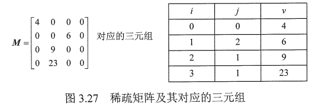
  
    + 稀疏矩阵的三元组既可以采用**数组存储**，也可以采用**十字链表法**存储


# 串
## 串的定义和实现

### 串的定义

+ **串**是由零个或多个字符组成的有限序列

### 串的存储结构

+ 定长顺序存储表示

  + 用一组**地址连续**的存储单元存储串值的字符序列

    ```c
    // 预定义最大串长为255
    #define MAXLEN 255
    typedef struct {
        // 每个分量存储一个字符
        char ch[MAXLEN];
        // 串的实际长度
        int length;
    } SString;
    ```

+ 堆分配存储表示

  + 用一组**地址连续**的存储单元存放串值的字符序列，但它们的存储空间是在程序执行过程中**动态分配**得到的

    > C语言中，存在一个**堆**的自由存储区，并用malloc()和free()函数来完成动态存储管理。利用malloc()为每个新产生的串分配一块实际串长所需的存储空间
    >
    > + 若分配**成功**，则返回一个指向**起始地址**的指针，作为串的**基地址**，这个串由指针来指示
    > + 若分配**失败**，则返回NULL，已分配的空间可用free()释放掉

    ```c
    typedef struct {
        // 按串长分配存储区，ch指向串的基地址
        char *ch;
        // 串的长度
        int length;
    } HString;
    ```

+ 块链存储表示

  + 类似于**线性表**的链式存储结构，也可采用**链表**方式存储串值

### 串的基本操作

+ **StrAssign（&T，chars）**：赋值操作。把串T赋值为chars
+ **StrCopy（&T，S）**：复制操作。由串S复制得到串T
+ **StrEmpty（S）**：判空操作。若S为空串，则返回TRUE，否则返回FALSE
+ **StrCompare（S，T）**：比较操作。若S > T，则返回值 > 0；若S = T，则返回值 = 0；若S < T，则返回值 < 0
+ **StrLength（S）**：求串长。返回串S的元素个数
+ **SubString（&Sub，S，pos，len）**：求子串。用Sub返回串S的第pos个字符起长度为len的子串
+ **Concat（&T，S1，S2）**：串联接。用T返回由S1和S2联接而成的新串
+ **Index（S，T）**：定位操作。若主串S中存在与串T值相同的子串，则返回它在主串S中第一次出现的位置；否则函数值为0
+ **ClearString（&S）**：清空操作。将S清为空串
+ **DestroyString（&S）**：销毁串。将串S销毁

## 串的模式匹配

### 简单的模式匹配算法

+ 子串的定位操作通常称为串的**模式匹配**，它求的是**子串**（常称模式**串**）在主串中的位置。这里采用**定长顺序**存储结构，给出一种不依赖于其他串操作的暴力匹配算法

  ```c
  int Index(SString S, SString T) {
      int i = 1, j = 1;
      while(i <= S.length && j <= T.length) {
          if (S.ch[i] == T.ch[j]) {
              // 继续比较后续字符
              ++i;
              ++j;
          } else {
              // 指针后退重新开始匹配
              i = i - j + 2;
              j = 1;
          }
      }
      if (j > T.length)
          return i - T.length;
      else
          return 0;
  }
  ```
  

### 改进的模式匹配算法——KMP算法

+ 在暴力匹配中，每趟匹配失败都是模式后移一位再从头开始比较。而某趟**已匹配相等**的字符序列是模式的某个**前缀**，这种频繁的重复比较相当于模式串在**不断地进行自我比较**，这就是低效率的根源。因此，可以从**分析模式本身**的结构着手，如果**已匹配相等**的前缀序列中有某个后缀正好是模式的前缀，那么就可以将模式**向后滑动**到与这些相等字符对齐的位置，主串**i**指针无须回溯，并从该位置开始继续比较。而模式向后滑动位数的计算仅与模式本身的结构有关，与主串无关。

+ `字符串的前缀、后缀、部分匹配值`
  + **前缀**指除**最后一个字符**以外，字符串的所有头部子串
  
  + **后缀**指除**第一个字符**外，字符串的所有尾部子串
  
  + **部分匹配值**指字符串的前缀和后缀的最长相等前后缀长度
  
    + 'a'的前缀、后缀都是空集，最长相等前后缀长度为**0**
    + 'ab'的前缀为{a}，后缀为{b}，{a}$\cap${b}=$\varnothing$，最长相等前缀后长度为**0**
    + 'aba'的前缀为{a, ab}，后缀为{a, ba}，{a, ab}$\cap${a, ba}={a}，最长相等前后缀长度为**1**
    + 'abab'的前缀为{a, ab, aba} $\cap$ 后缀{b, ab, bab} = {ab}，最长相等前后缀长度为**2**
    + 。。。最长相等前后缀长度为**3**
    + 所以字符串'ababa'的**部分匹配值**为**00123**
  
  + 利用上述方法，将**部分匹配值**写成数组形式，就得到了部分匹配值（Partial Match，PM）的表
  
    | 编号 | 1    | 2    | 3    | 4    | 5    |
    | ---- | ---- | ---- | ---- | ---- | ---- |
    | S    | a    | b    | c    | a    | c    |
    | PM   | 0    | 0    | 0    | 1    | 0    |
  
  + 匹配过程中，发现第**3**位不匹配，前面**2**个字符是匹配的，查表可知，最后一个匹配字符**b**对应的部分匹配值为**0**，因此按照下面的公式算出子串需要向后移动的**位数**
  
    + **移动位数 = 已匹配的字符数 - 对应的部分匹配值**
  
  + 因为2 - 0 = 2，所以将子串向后移动**2**位，再进行匹配
  
+ `KMP算法的原理是什么`

  + **太难啦**


# 树与二叉树

## 树的基本概念

### 树的定义

+ 树是n（n>=0)个结点的有限集。当n=0时，称为**空树**。在任意一棵非空树中应满足
  + 有且仅有一个特定的称为**根**的结点
  + 当n>1时，其余结点可分为m（m>0)个互不相交的有限集T1，T2...Tm，其中每个集合本身又是一棵树，并且称为**根的子树**
+ 树作为一种**逻辑结构**，同时也是一种**分层结构**，具有以下特点
  + 树的**根结点**没有前驱，除**根结点**外的所有结点有且只有一个前驱
  + 树中所有结点可以有**零个、多个**后继

### 基本术语

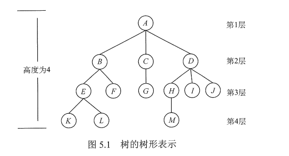

+ 结点关系
  + **根A**到结点**K**的唯一路径上的任意结点，称为结点**K**的**祖先**
    + 结点**B**是结点**K**的祖先
    + 结点**K**是结点**B**的子孙
  + 路径上最接近结点**K**的结点**E**称为**K的双亲**，**K**为结点**E**的孩子
  + 根**A**是树中唯一没有双亲的结点
  + 有相同双亲的结点称为**兄弟**，如**K**和**L**
+ 树中一个结点的**孩子个数**称为该结点的**度**，树中结点的最大度数称为树的**度**
+ **度**大于0的结点称为**分支结点**（又称**非终端结点**）；**度**为0（没有子女结点）的结点称为**叶子结点**（又称**终端结点**）。在分支结构中，每个结点的分支数就是该结点的度
+ 结点的**深度、高度、层次**
  + `层次`
    + 从**树根**开始定义，根结点为**第1层**，它的子结点为**第2层**
    + 双亲在同一层的结点互为**堂兄弟**
  + `深度`
    + 从**根结点**开始自顶向下逐层累加的
  + `高度`
    + 从**叶结点**开始自底向上逐层累加的
+ **有序树**和**无序树**
  + 树中结点的各子树从左到右是有次序的，不能互换，称该树为**有序树**，否则称**无序树**
+ **路径**和**路径长度**
  + 树中两个结点之间的路径是由这两个结点之间所经过的结点序列构成的，而**路径长度**是路径上所经过的边的个数
  + 由于树中的分支是有向的，即从双亲指向孩子，所以树中的路径是从上向下的，同一双亲的两个孩子之间不存在路径
+ **森林**
  + 森林是m（m>=0）棵互不相交的树和集合。森林的概念与树的概念十分相近，因为只要把树的根结点删去就成了森林。反之，只要给m棵独立的树加上一个结点，并把这m棵树作为该结点的子树，则森林就变成了树。

### 树的性质

+ 树中的结点数等于所有结点的**度数**之和加1
+ 度为**m**的树中，第**i**层上至多有$m^{i-1}$个结点（i>=1)
+ 高度为**h**的**m**叉树至多有**$(m^h-1)/(m-1)$**个结点
+ 具有**n**个结点的**m**叉树的最小高度为**$\lceil log_m(n(m-1)+1) \rceil$**

## 二叉树的概念

### 二叉树的定义及其主要特性

+ 二叉树的定义

  + 二叉树是**n**（n >= 0）个结点的有限集合
    + 或者为**空二叉树**，即n=0
    + 或者有**一个根结点**和**两个互不相交**的被称为根的左子树和右子树组成
  + 二叉树是**有序树**，若将其左、右子树颠倒，则成为另一棵不同的二叉树。即使树中只有一棵子树，也要区分它是左子树还是右子树

+ 二叉树与度为**2**的有序树的**区别**

  + 度为2的树至少有**3**个结点，而二叉树可以为空
  + **度为2的有序树**的孩子的左右次序是相对于另一个孩子而言的，若某个结点只有一个孩子，则这个孩子就**无须区分其左右次序**，而**二叉树**无论其孩子树是否为2，均需**确定其左右次序**，即二叉树的结点次序不是相对于另一结点而言的，而是确定的

+ 几个特殊的二叉树

  + `满二叉树`

    + 一棵高度为**h**，且含有**$2^h-1$**个结点的二叉树称为**满二叉树**，即树中的每层都含有最多的结点，如下图，满二叉树的叶子结点都集中在二叉树的最下一层，并且除叶子结点之外的每个结点度数均为**2**

  + `完全二叉树`

    + 高度为**h**，有**n**个结点的二叉树，当且仅当其每个结点都与高度为**h**的**满二叉树**中编号为1~n的结点**一一对应**时，称为**完全二叉树**

      + 若**i <= $\lfloor n/2 \rfloor$** ，则结点i为**分支**结点，否则为**叶子**结点
      + 叶子结点只可能在层次最大的**两层**上出现。对于最大层次中的叶子结点，都依次排列在该层**最左边**的位置上
      + 若有**度为1**的结点，则只可能有**一个**，且该结点只有**左孩子**而无**右孩子**（**重要特征**）
      + 按层序编号后，一旦出现某结点（**编号为i**）为**叶子**结点或**只有左孩子**，则编号大于i的结点均为**叶子**结点
      + 若**n**为奇数，则每个分支结点都有**左孩子**和**右孩子**；若**n**为偶数，则编号最大的分支结点（编号为n/2)只有**左孩子**，没有**右孩子**，其余分支结点**左、右**孩子都有

      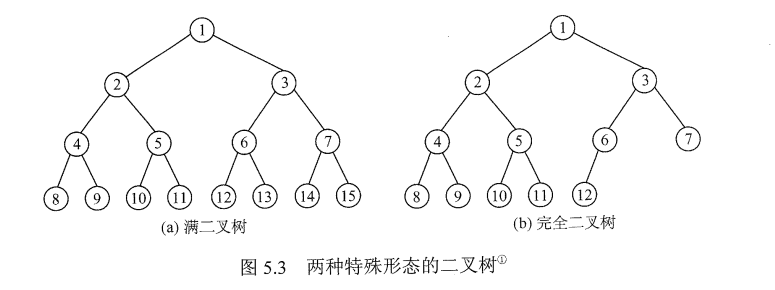

    + **完全二叉树**就是对应相同高度的**满二叉树**缺失**最下层、最右边**的一些连续叶子结点

  + `二叉排序树`

    + **左子树**上所有结点的关键字均小于**根结点**的关键字
    + **右子树**上所有结点的关键字均大于**根结点**的关键字
    + **左子树**和**右子树**又各是一棵二叉排序树

  + `平衡二叉树`

    + 树上**任一结点**的左子树和右子树的**深度之差**不超过**1**

+ 二叉树的性质

  1. **非空二叉树**上的**叶子结点数**等于**度为2**的结点数加**1**

     > 扩展到**任意一棵树**，若**结点**数量为**n**，则**边**的数量为**n - 1**

  2. **非空二叉树**上第**k**层上至多有**$2^k-1$**个结点（k >= 1)

  3. 高度为**h**的二叉树最多有**$2^h-1$**个结点（h >= 1）

  4. 对**完全二叉树**按**从上到下**、**从左到右**的顺序依次编号1，2，...，n，则有以下关系

     + 当**i > 1**时，结点**i**的双亲的编号为$\lfloor i/2 \rfloor$，即当i为**偶数**时，其双亲的编号为i/2，它是双亲的**左孩子**；当i为**奇数**时，其双亲的编号为（i-1）/2，它是双亲的**右孩子**
     + 当**2i <= n**时，结点i的左孩子编号为2i，否则无左孩子
     + 当**2i + 1 <= n**时，结点i的右孩子编号为2i+1，否则无右孩子
     + 结点i所在层次（深度）为$\lfloor log_2i \rfloor + 1$

  5. 具有**n**个（n > 0）结点的完全二叉树的高度为$\lceil log_2(n+1) \rceil$或$\lfloor log_2n \rfloor + 1$

### 二叉树的存储结构

+ 顺序存储结构

  + 二叉树的顺序存储是指用一组**地址连续**的存储单元依次自上而下、自左向右存储**完全二叉树**上的结点元素，即将**完全二叉树**上编号为**i**的结点元素存储在一维数组下标为**i-1**的分量中
  + 依据二叉树的性质，**完全二叉树**和**满二叉树**采用**顺序存储**比较合适，树中结点的序号可以唯一地反映结点之间的逻辑关系，这样既能最大可能地节省存储空间，又能利用数组元素的**下标值**确定结点在二叉树中的位置、以及结点之间的关系
    + 对于**一般的二叉树**，为了让数组下标能反映出二叉树中结点之间的逻辑关系，只能添加一些**并不存在**的空结点，让其每个结点与**完全二叉树**上的结点相对照，再存储到一维数组的相应分量中。然而，最坏情况下，一个高度为**h**且只有**h**个结点的单支树却需要占据近**$2^h-1$**个存储单元
    + 这种存储结构建议从**数组下标1**开始存储树中的结点，若从**数组下标0**开始储存，则不满足**性质4**的描述（当结点存储在**0**下标位置上时，无法计算出其孩子结点在数组中的位置）

+ 链式存储结构

  + 由于**顺式存储**空间利用率较低，因此二叉树一般采用**链式存储**结构。在二叉树中，结点结构至少包含**3**个域：**数据域data**、**左指针域lchild**、**右指针域rchild**

    ```c
    typedef struct BiTNode {
        ElemType data;
        struct BiTNode *lchild, *rchild;
    } BiTNode, *BiTree;
    ```

  + 容易验证，**在含有n个结点的二叉链表中，含有n+1个空链域**

## 二叉树的遍历和线索二叉树

### 二叉树的遍历

+ `先序遍历`

  + 访问**根结点**

  + 先序遍历访问**左子树**

  + 先序遍历访问**右子树**

    ```c
    void PreOrder(BiTree T) {
        if (T != NULL) {
            visit(T);
            PreOrder(T -> lchild);
            PreOrder(T -> rchild);
        }
    }
    ```

+ `中序遍历`

  + 中序遍历**左子树**

  + 访问**根结点**

  + 中序遍历**右子树**

    ```c
    void InOrder(BiTree T) {
        if (T != NULL) {
            InOrder(T -> lchild);
            visit(T);
            InOrder(T -> rchild):
        }
    }
    ```

    

+ `后序遍历`

  + 后序遍历**左子树**

  + 后序遍历**右子树**

  + 访问**根结点**

    ```c
    void PostOrder(BiTree T) {
        if (T != NULL) {
            PostOrder(T -> lchild);
            PostOrder(T -> rchild);
            visit(T);
        }
    }
    ```

+ 三种遍历算法中，递归**遍历左、右子树的顺序**都是固定的，只是访问根结点的顺序不同。**不管采用哪种遍历算法，每个结点都访问一次且仅访问一次**。故时间复杂度都是O(n)。

+ **递归算法**和**非递归算法**的转换

  + 分析**中序遍历**

    1. 沿着根的**左孩子**，依次入栈，直到**左孩子**为空，说明已找到可以输出的结点
    2. **栈顶元素**出栈并访问：若其**右孩子**为空，继续执行步骤**2**；若其**右孩子**不空，将右子树转执行步骤**1**

  + 写出算法

    ```c
    void InOrder2(BiTree T) {
    	// 初始化栈S
        InitStack(S);
        // p是遍历指针
        BiTree p = T;
        
        while (p || !IsEmpty(S)) {
            // 一路向左
            if (p) {
                // 当前结点入栈
                Push(S, p);
                // 左孩子不空，一直向左走
                p = p -> lchild;
            } else {
                // 出栈，并转向出栈结点的右子树
                Pop(S, p);
                // 栈顶元素出栈，访问出栈结点
                visit(p);
                // 向右子树走，p赋值为当前结点的右孩子
                p = p -> rchild;
            }
        }
    }
    ```

+ **先序遍历**非递归版本

  ```c
  void PreOrder2(BiTree T) {
      initStack(S);
      BiTree p = T;
      
      while (p || !IsEmpty(S)) {
          if (p) {
              visit(p);
              Push(s, p);
              p = p -> lchild;
          } else {
  		   Pop(S, p);
              p = p -> rchild;
          }
      }
  }
  ```

+ **后序遍历**非递归版本是三种遍历方法中**最难的**。因为在后序遍历中，需要保证**左孩子**和**右孩子**都已被访问并且**左孩子**在**右孩子**前访问才能访问**根结点**。**思路分析**如下

  + 从**根结点**开始，将其**入栈**，然后沿其**左子树**一直往下搜索，直到搜索到没有**左孩子**的结点，但是此时不能**出栈并访问**，因为如果有**右子树**，还需按相同的规则对其**右子树**进行处理
  + 直到上述操作进行不下去，若**栈顶元素**想要**出栈被访问**，要么**右子树**为空，要么**右子树**刚被访问完（此时**左子树**早已访问完），这就保证了正确的访问顺序

+ **层次遍历**

  + 要进行**层次遍历**，需要借助一个**队列**。先将二叉树**根结点**入队，然后出队，访问出队结点，若它有**左子树**，则将**左子树**根结点入队；若它有**右子树**，则将**右子树**根结点**入队**。然后出队，访问出队结点，如此往复

    ```c
    void LevelOrder(BiTree T) {
        InitQueue(Q);
        BiTree p;
        EnQueue(Q, T);
        
        while (!IsEmpty(Q)) {
            DeQueue(Q, p);
            visit(p);
            if (p -> lchild != NULL) {
                EnQueue(Q, p -> lchild);
            }
            if (p -> rchild != NULL) {
                EnQueue(Q, p -> rchild):
            }
        }
    }
    ```

  > **遍历**是二叉树各种操作的基础，可以在遍历的过程中对结点进行各种操作
  >
  > + 已知树，求**结点的双亲、结点的孩子结点、二叉树的深度、二叉树的叶子结点个数、判断两棵二叉树是否相等**

+ 由**遍历序列**构造二叉树

  + 由二叉树的**先序**序列和**中序**序列可以**唯一**地确定一棵二叉树
    + 由**后续**和**中序**也可以**唯一**确定一棵二叉树
  + **先序**遍历中，**第一个结点一定是二叉树的根结点**
  + **中序**遍历中，**根结点**必然将中序序列分割成两个子序列，前一个子序列是**根结点的左子树**的中序序列，后一个子序列是**根结点的右子树**的中序序列
  + 根据这两个子序列，在**先序序列**中找到对应的左子序列和右子序列

### 线索二叉树

+ 基本概念

  + 以一定的规则将二叉树中的结点排列成一个**线性序列**，从而得到几种遍历序列，使得该序列中的每个**结点**（第一个和最后一个结点除外）都有一个**直接前驱**和**直接后继**

  + 传统的二叉链表存储仅能体现一种父子关系，不能直接得到**结点在遍历中的前驱或后继**

  + 前面提到，在含**n**个结点的二叉树中，有**n+1**个空指针。这时因为每个**叶结点**有**2**个空指针，每个**度为1**的结点有**1**个空指针，所以空指针总数为**n+1**。由此设想能否利用这些空指针来存放指向其**前驱、后继**的指针，这样就可以像遍历**单链表**那样方便地遍历二叉树。引入**线索二叉树**正是为了**加快查找前驱、后继的速度**

  + **规定**：若无**左子树**，令lchild指向其前驱结点；若无**右子树**，令rchild指向其后继结点。还需增加两个**标志域**标识**指针域**是指向左右孩子或者前驱后继

    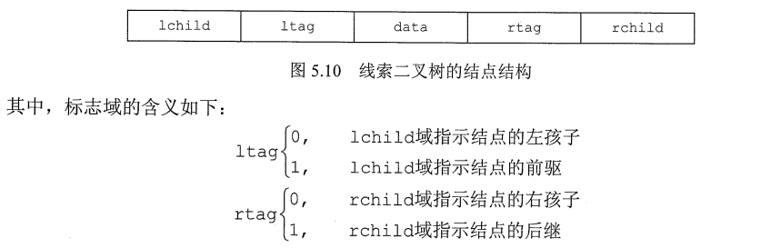

    ```c
    typedef struct ThreadNode {
        // 数据元素
        ElemType data;
        // 左右孩子指针
        struct ThreadNode *lchild, *rchild;
        // 左右线索标志
        int ltag, rtag;
    } ThreadNode, *ThreadTree;
    ```

+ 中序线索二叉树的构造

  + 二叉树的**线索化**是将二叉链表中的**空指针**改为指向前驱或后继的线索。而前驱或后继的信息只有在遍历时才能得到，因此**线索化**的实质就是**遍历一次二叉树**

    + 以**中序线索二叉树**的建立为例。附设指针**pre**指向**刚刚访问过**的结点，指针**p**指向**正在访问**的结点，即**pre**指向**p的前驱**。在中序遍历的过程中，检查p的左指针是否为空，若为空就将它指向pre；检查pre的右指针是否为空，若为空就将它指向p

      

    + 通过**中序遍历**对二叉树线索化的递归算法如下

      ```c
      void InThread(ThreadTree &p, ThreadTree &pre) {
          if (p != NULL) {
              // 递归，线索化左子树
              InThread(p -> lchild, pre);
              // 左子树为空，建立前驱线索
              if (p -> lchild == NULL) {
                  p -> lchild = pre;
                  p -> ltag = 1;
              }
              if (pre != NULL && pre -> rchild == NULL) {
                  // 建立前驱结点的后继线索
                  pre -> rchild = p;
                  pre -> rtag = 1;
              }
              // 标记当前结点成为刚刚访问过的结点
              pre = p;
              // 递归，线索化右子树
              InThread(p -> rchild, pre);
          }
      }
      ```

      通过**中序遍历**建立中序线索二叉树的主过程算法如下

      ```c
      void CreateInThread(ThreadTree T) {
          ThreadTree pre = NULL;
          if (T != NULL) {
              // 非空二叉树，线索化
              InThread(T, pre);
              // 线索化二叉树
              pre -> rchild = NULL;
              // 处理遍历的最后一个结点
              pre -> rtag = 1;
          }
      }
      ```

+ 中序线索二叉树的遍历

  + 中序线索二叉树的结点中隐含了线索二叉树的**前驱、后继信息**。在对其进行遍历时，只要先找到序列中的第一个结点，然后依次找结点的后继，直至其后继为空。在中序线索二叉树中找结点后继的规律是：**若其右标志为1，则右链为线索，指示其后继，否则遍历右子树中第一个访问的结点（右子树中最左下的结点）为其后继**。

## 树、森林

### 树的存储结构

+ `双亲表示法`

  + 采用一组连续空间来存储每个结点，同时在每个结点中**增设一个伪指针**，指示其双亲结点在数组中的位置。如下图，**根结点下标为0，伪指针域为-1**

    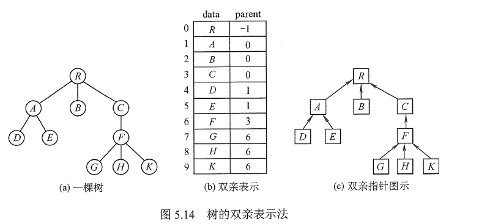

  + 双亲表示法的存储结构描述如下

    ```c
    // 树中最多结点数
    #define MAX_TREE_SIZE 100
    
    // 树的结点定义
    typedef struct {
        ElemType data;
        // 双亲位置域
        int parent;
    } PTNode;
    
    // 树的类型定义
    typedef struct {
        // 双亲表示
        PTNode nodes[MAX_TREE_SIZE];
        // 结点数
        int n;
    } PTree;
    ```

  + 该存储结构利用了每个结点（**根结点除外**）只有唯一双亲的性质，可以很快得到每个结点的双亲结点，但**求结点的孩子时，需要遍历整个结构**

    > 区别树的**顺序储存结构**与二叉树的**顺序存储结构**。在树的顺序存储结构中，**数组下标**代表结点的编号，下标中所存的内容指示了**结点之间的关系**。而在二叉树的顺序存储结构中，**数组下标**既代表了**结点的编号**，又指示了二叉树中**各结点之间的关系**。当然，二叉树属于树，因此二叉树都可以用树的存储结构来存储，但树却不都能用二叉树的存储结构来存储

+ `孩子表示法`

  + 将每个结点的孩子结点都用**单链表**链接起来形成一个**线性结构**，此时n个结点就有n个孩子链表（叶子结点的孩子链表为空）
  + 这种存储方式**寻找子女的操作非常直接**，而**寻找双亲的操作需要遍历n个结点中孩子链表指针域所指向的n个孩子链表**

+ `孩子兄弟表示法` （**二叉树表示法**）

  + 以**二叉链表**作为树的存储结构。孩子兄弟表示法使每个结点包括三部分内容：**结点值、指向结点第一个孩子结点的指针、指向结点下一个兄弟结点的指针（沿此域可以找到结点的所有兄弟结点）**

    ```c
    typedef struct CSNode {
        // 数据域
        ElemType data;
        // 第一个孩子和右兄弟指针
        struct CSNode *firstchild, *nextsibling;
    } CSNode, *CSTree;
    ```

  + 这种存储表示法比较灵活，其最大的优点是可以方便地实现**树**转换为**二叉树**的操作，易于查找结点的孩子，但缺点是**从当前的结点查找其双亲结点比较麻烦**。若为每个结点增设一个parent域指向其父结点，则查找结点的父结点也很方便

    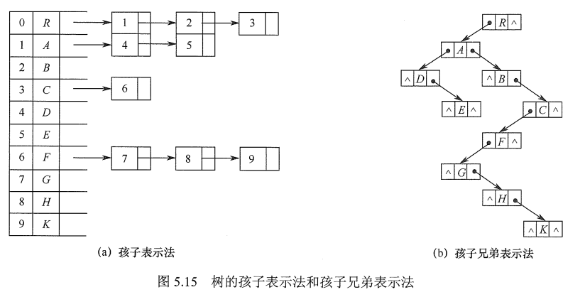

### 树、森林与二叉树的转换

+ **树**转换为**二叉树**的**规则**：每个结点**左指针**指向它的**第一个孩子**，**右指针**指向它在树中的**相邻右兄弟**，这个规则又称为**左孩子右兄弟**。由于**根结点**没有兄弟，所以对应的二叉树没有**右子树**

  

+ **树**转换为**二叉树**的画法

  + 在兄弟结点之间加一连线
  + 对每个结点，只保留它与第一个孩子的连线，而与其他孩子的连线全部抹掉
  + 以树根为轴心，顺时针旋转45度

+ 将**森林**转换为**二叉树**的规则与**树**类似

  + 将**森林**中的每棵**树**转换为**二叉树**，由于任何一棵和**树**对应的二叉树的**右子树**必空，若把**森林**中第二棵**树根**视为第一棵**树根**的**右兄弟**，即将第二棵树对应的二叉树当做第一棵二叉树根的右子树，将第三棵树对应的二叉树当做第二课树根的右子树...以此类推
  + **森林**转换**二叉树**画法
    + 将**森林**中的每棵树转换成相应的**二叉树**
    + 每棵树的**根**也可视为**兄弟关系**，在每棵树的**根**之间加一根连线
    + 以**第一棵**树的根为轴心**顺时针旋转45度**

+ **二叉树**转换为**森林**的规则

  + 若**二叉树**非空，则二叉树的**根**及其**左子树**为第一棵树的二叉树形式，故将**根的右链**断开
  + 二叉树根的**右子树**又可视为一个由**除第一棵树外**的森林转换后的二叉树，应用同样的方法，直到最后只剩一棵没有**右子树**的二叉树为止
  + 最后再将每棵二叉树依次转换成树，就得到了原森林

  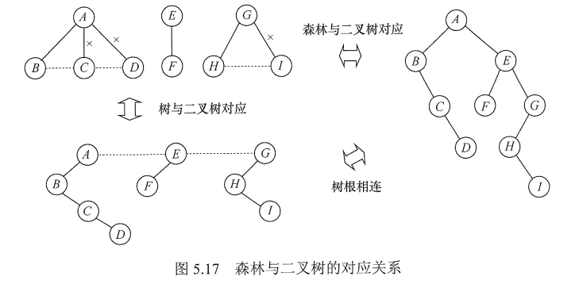

### 树和森林的遍历

+ **树**的遍历是指用某种方式访问树中的每个结点，且仅访问一次。主要有**两**种方式
  + `先根遍历`
    + 若树非空，先访问其**根结点**，再依次遍历根结点的**每棵子树**，遍历子树时仍遵循**先根后子书**的规则。其遍历序列与这棵树相应二叉树的**先序序列**相同
  + `后根遍历`
    + 若树非空，先依次遍历**根结点**的**每棵子树**，再访问**根结点**，遍历子树时仍遵循**先子树后根**的规则。其遍历序列与这棵树相应二叉树的**中序序列**相同
+ **森林**的遍历
  + `先序遍历森林`
    + 访问森林中第一棵树的根结点
    + **先序遍历**第一棵树中根结点的子树森林
    + **先序遍历**除去第一棵树之后剩余的树构成的森林
  + `中序遍历森林`
    + **中序遍历**森林中第一棵树的根结点的子树森林
    + 访问第一棵树的**根结点**
    + **中序遍历**除去第一棵树之后剩余的树构成的森林

## 树与二叉树的应用

### 二叉排序树（**BST**)

+ 二叉排序树的定义（**二叉查找树**）

  + 或者是一棵**空树**，或者是具有下列特性的**二叉树**
    + 若**左子树**非空，则左子树上所有结点的值均小于**根结点**的值
    + 若**右子树**非空，则右子树上所有结点的值均大于**根结点**的值
    + 左、右子树也分别是一棵**二叉排序树**
  + 根据二叉排序树的定义，**左子树结点值 < 根结点值 < 右子树结点值**，所以对二叉排序树进行**中序遍历**，可以得到一个**递增**的有序序列

+ 二叉排序树的查找

  + 从**根结点**开始，沿某个分支逐层向下比较的过程

  + **非递归**查找算法

    ```c
    BSTNode *BST_Search(BiTree T, ElemType key ) {
        while ( T != NULL && key != T -> data ) {
            if ( key < T -> data ) 
                T = T -> lchild;
            else
                T = T -> rchild;
        }
        return T;
    }
    ```

+ 二叉排序树的插入

  + 二叉排序树作为一种动态树表，其特点是**树的结构通常不是一次生产的，而是在查找过程中，当树中不存在关键字值等于给定值得结点时再进行插入的**

  + 插入结点的**过程**如下

    + 若原二叉排序树为空，则直接插入结点
    + 否则，若关键字k**小于**根结点值，则插入到**左**子树，若关键字k**大于**根结点值，则插入到**右**子树
    + 插入的结点一定是一个**新添加的叶结点**，且是查找失败时的查找路径上访问的**最后一个结点**的左孩子或右孩子

  + 插入操作的算法

    ```c
    int BST_Insert(BiTree &T, KeyType k) {
        // 原树为空，新插入的记录为根结点
        if ( T == NULL ) {
            T = (BiTree) malloc(sizeof(BSTNode));
            T -> key = k;
            T -> lchild = T -> rchild = NULL;
            // 返回1，插入成功
            return 1;
        } else if ( k == T -> key) {
            // 树中存在相同关键字的结点，插入失败
            return 0;
        } else if ( k < T -> key) {
            // 插入到T的左子树
            return BST_Insert(T -> lchild, k);
        } else {
            // 插入到T的右子树
            return BST_Insert(T -> rchild, k);
        }
    }
    ```

+ 二叉排序树的构造

  + 从一棵**空树**出发，依次输入元素，将它们插入二叉排序树中的合适位置

  + 构造二叉排序树的**算法**如下

    ```c
    void Create_BST(BiTree &T, KeyType str[], int n) {
        T = NULL;
        int i = 0;
        while ( i < n ) {
            BST_Insert(T, str[i]);
            i++;
        }
    }   
    ```

+ 二叉排序树的删除

  + 在二叉排序树删除一个结点时，不能把**以该结点为根**的子树上的结点都删除，必须先把被删除结点从存储二叉排序树的**链表**上摘下，将**因删除结点**而断开的二叉链表重新链接起来，同时**确保二叉排序树的性质不会丢失**。删除操作的实现过程按**3**种情况来处理

    + 若**被删除结点z**是叶结点，则直接删除，不会破坏二叉排序树的性质
    + 若结点z只有一棵左子树或右子树，则让**z的子树**成为**z父结点的子树**，替代z的位置
    + 若结点z有**左、右**两棵子树，则令z的直接后继（或直接前驱）替代z，然后从二叉排序树中删去这个直接后继（或直接前驱），这样就转换成了**第一、第二种情况**

    

+ 二叉排序树的查找效率分析

  + 主要取决于**树的高度**
    + 若二叉排序树的左、右子树的高度之差的绝对值不超过1，则这样的二叉排序树称为**平衡二叉树**，它的平均查找长度均为**$O(log_2n)$**。
    + 若二叉排序树是一个**只有左（右）孩子**的单支树（类似于有序的单链表），则其平均查找长度为O(n)

### 平衡二叉树

1. 平衡二叉树的定义

   + 为避免树的**高度增长过快**，**降低二叉排序树的性能**，规定在插入和删除二叉树结点时，要保证任意结点的**左、右**子树高度差的绝对值不超过**1**，将这样的二叉树称为**平衡二叉树（Balanced Binary Tree）**，简称**平衡树**。定义结点左子树与右子树的高度差为该结点的**平衡因子**，则平衡二叉树结点的平衡因子的值只可能是**-1、0、1**
   + 平衡二叉树可定义为**一棵空树**，或者是**具有下列性质的二叉树**
     + 它的**左子树**和**右子树**都是平衡二叉树，且**左子树和右子树的高度差的绝对值不超过1**

2. 平衡二叉树的插入

   + 保持**平衡**的基本思想如下

     + 每当在二叉排序树中**插入**或**删除**一个结点时，首先检查其插入路径上的结点是否因为此次操作而导致了不平衡。
       + 若导致了**不平衡**，则先找到插入路径上**离插入结点最近**的**平衡因子**的**绝对值大于1**的结点A，再对以A为根的子树，在保持二叉排序树特性的前提下，调整各结点的位置关系，使之重新达到平衡
       + 每次调整的对象都是**最小不平衡树**，即以插入路径上离插入结点最近的**平衡因子的绝对值大于1的结点**作为**根的子树**

   + 调整不平衡的规律如下

     + `LL平衡旋转（右单旋转）`

       + 由于在结点A的**左孩子（L）**的**左子树（L）**上插入了新结点，A的平衡因子由1增至2，导致以A为根的子树失去平衡，需要一次**向右**的旋转操作。将A的**左孩子B**向**右上**旋转代替A成为**根结点**，将A结点向**右下**旋转成为B的**右子树的根结点**，而B的**原右子树**则作为A结点的**左子树**

         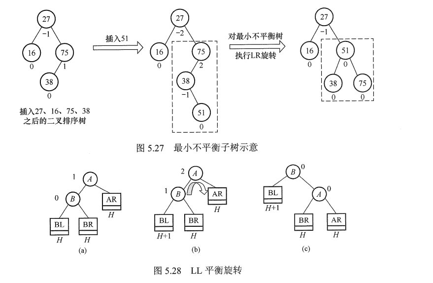

     + `RR平衡旋转（左单旋转）`

       + 由于在结点A的**右孩子（R）**的**右子树（R）**上插入了新结点，A的平衡因子由**-1**减至**-2**，导致以A为**根**的子树失去平衡，需要一次**向左**的旋转操作。将A的**右孩子**B向左上旋转代替A成为**根结点**，将A结点向左下旋转成为B的**左子树**的**根结点**，而B的**原左子树**则作为A结点的**右子树**，如下图

         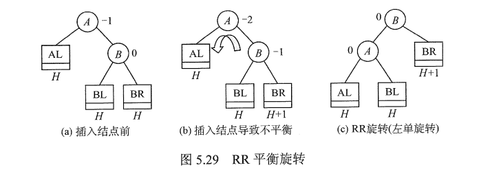

     + `LR平衡旋转（先左后右双旋转）`

       + 由于在A的**左孩子（L）**的**右子树（R）**上插入了新结点，A的平衡因子由1增至2，导致以A为根的子树失去平衡，需要进行**两次旋转操作**，先**左旋转**后**右旋转**。先将A结点的**左孩子B**的**右子树**的根结点C向左上旋转提升到B结点的位置，然后把该C结点向右上旋转提升到A结点的位置，如下图

         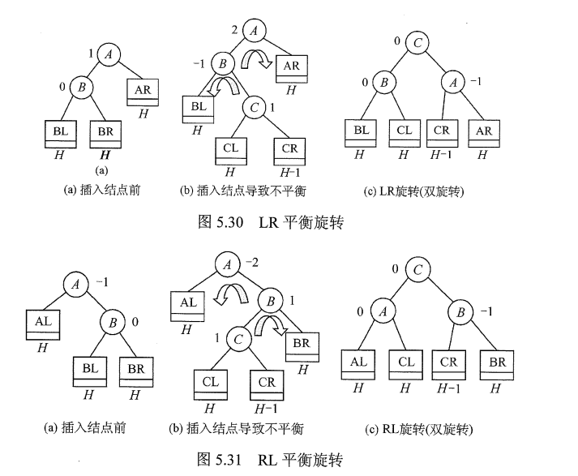

     + `RL平衡旋转（先右后左双旋转）`

       + 由于在A的**右孩子（R）**的**左子树（L）**上插入新结点，A的平衡因子由-1减至-2，导致以A为根的子树失去平衡，需要进行**两次**旋转操作，先**右旋转**后**左旋转**。先将A结点的**右孩子**B的**左子树**的根结点C向右上旋转提升到B结点的位置，然后把该C结点向左上旋转提升到A结点的位置

3. 平衡二叉树的查找

   1. 在平衡二叉树上进行查找的工作与**二叉排序树**的相同。因此，在查找过程中，与给定值进行比较的**关键字个数**不超过**树的深度**。假设以**$n_h$**表示深度为**h**的平衡树中含有的最少结点数。显然，有**$n_0=0, n_1=1, n_2=2$**，并且有**$n_h = n_{h-1} + n_{h-2} + 1$**。可以证明，含有n个结点的平衡二叉树的最大深度为**$O(log_2n)$**，因此平衡二叉树的平均查找长度为**$O(log_2n)$**，如下图

      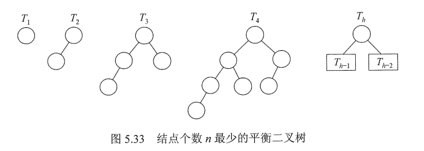

      > 该结论可用于求解**给定结点数**的平衡二叉树的查找所需的最多比较次数（或树的最大高度）

### 哈夫曼树和哈夫曼编码

1. 哈夫曼树的定义

   1. 在许多应用中，树中结点常常被赋予一个表示某种意义的数值，称为该结点的**权**。从树的**根**到任意结点的**路径长度**（经过的边数）与该结点上**权值**的**乘积**，称为该结点的**带权路径长度**。树中所有**叶结点**的带权路径长度之**和**称为该树的**带权路径长度**，记为
      $$
      WPL=\sum^n_{i=1}w_il_i
      $$

      1. 式子中，**$w_i$**是第i个叶结点所带的**权值**，**$l_i$**是该叶结点到根结点的**路径长度**

   2. 在含有n个带权叶结点的二叉树中，其中**带权路径长度（WPL）**最小的二叉树，称为**哈夫曼树**，也称**最优二叉树**。

      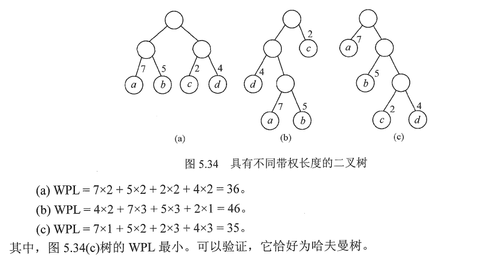

2. 哈夫曼树的构造

   1. 给定n个权值分别为$w_1, w_2, ..., w_n$的结点，构造哈夫曼树的算法描述如下
      1. 将这**n**个结点分别作为**n**棵**仅含一个结点的二叉树**，构成**森林F**
      2. 构造一个新结点，从F中选取**两**棵**根结点权值最小**的树作为新结点的左右子树，并且将新结点的权值置为左右子树上**根结点的权值之和**
      3. 从F中**删除**刚才选出的两棵树，同时将新得到的树**加入**F中
      4. 重复步骤2、3，直至F中只剩下一棵树为止
   2. 从上述构造过程中可看出哈夫曼树具有如下特点
      1. 每个初始结点最终都成了**叶结点**，且**权值越小**的结点到根结点的**路径长度**越大
      2. 构造过程中共新建了**n-1**个结点（双分支结点），因此哈夫曼树的结点总数为**2n-1**
      3. 每次构造都选择2棵树作为新结点的孩子，因此哈夫曼树中不存在**度为1**的结点

3. 哈夫曼编码

   1. 在数据通信中，若对每个字符用**相等长度**的二进制位表示，称这种编码方式为**固定长度编码**。若允许对不同字符用不等长的二进制位表示，则这种编码方式称为**可变长度编码**。

      1. **可变长度编码**比**固定长度编码**好得多，其特点是对**频率高**的字符赋以**短编码**，而对**频率较低**的字符则赋以**较长一些**的编码，从而可以使字符的平均编码长度减短，起到压缩数据的效果。
      2. **哈夫曼编码**是一种被广泛应用而且非常有效的数据压缩编码

   2. **若没有一个编码是另一个编码的前缀**，则称这样的编码为**前缀编码**

   3. 由**哈夫曼树**得到**哈夫曼编码**是很自然的过程。首先，将每个出现的字符当作一个独立的结点，其权值为它出现的**频度**（或次数），构造出对应的哈夫曼树。显然，所有字符结点都出现在叶结点中。我们可将字符的编码解释为从**根**至该字符的路径上边标记的序列，其中边标记为0表示**转向左孩子**，标记为1表示**转向右孩子**

      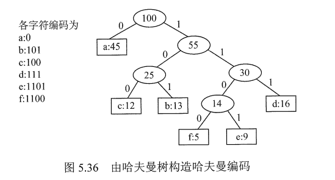

      > 0和1究竟是表示左子树还是右子树没有明确规定。左右孩子结点的**顺序是任意的**，所以构造出的**哈夫曼树并不唯一**，但各哈夫曼树的**带权路径长度WPL相同且为最优**。此外，如有若干权值相同的结点，则构造出的哈夫曼树更可能不同，但WPL必然相同且是最优的

# 图

## 图的基本概念

### 图的定义

1. 图G由**顶点集V**和**边集E**组成，记为**G=（V，E）**，其中**V（G）**表示图G中**顶点**的**有限非空集**；**E（G）**表示图G中**顶点之间的关系（边）集合**。若V={$v_1,v_2,...,v_n$}，则用**|V|**表示图G中**顶点的个数**，E={$(u,v)|u \in V, v \in V $}，用**|E|**表示图G中**边的条数**

   > 线性表可以是空表，树可以是空树，但**图不可以是空图**。就是说，图中不能一个顶点也没有，图的顶点集V一定非空，但边集E可以为空，此时图中只有顶点而没有边

2. 有向图

   1. 若E是**有向边**（也称**弧**）的有限集合时，则图G为**有向图**。**弧**是顶点的**有序对**，记为**<v, w>**，其中v，w是顶点，v称为弧尾，w称为弧头，<v, w>称为从v到w的弧，也称v邻接到w

3. 无向图

   1. 若E是**无向边**（简称**边**）的有限集合时，则图G为**无向图**。**边**是顶点的**无序对**，记为**(v, w)**或**(w, v)**。可以说v和w互为**邻接点**。边(v, w)依附于w和v，或称边(v, w)和v，w相关联

4. 简单图、多重图

   1. 一个图G如果满足以下条件，那么称图G为**简单图**
      1. 不存在**重复边**
      2. 不存在顶点到自身的边
   2. 若图G中**某两个**顶点之间的**边数大于1条**，又允许顶点通过一条边和自身关联，则称图G为**多重图**。多重图和简单图的定义是相对的。数据结构中仅讨论简单图

5. 完全图（**简单完全图**）

   1. 对于无向图，**|E|**的取值范围为0到**n(n-1)/2**，有**n(n-1)/2**条边的无向图称为**完全图**，在完全图中**任意两个顶点**之间都存在边。对于有向图，|E|的取值范围为0到n(n-1)，有n(n-1)条弧的有向图称为**有向完全图**，在有向完全图中，任意两个顶点之间都存在方向相反的两条弧

6. 子图

   1. 设有两个图G=（V, E）和G1=（V1, E1），若V1是V的**子集**，且E1是E的**子集**，则称G1是G的**子图**。若有满足**V（G1）=V（G）**的子图G1，则称其为G的**生成子图**
   2. 并非V和E的任何子集都能构成G的子图，因为这样的子集可能不是图，即**E的子集中的某些边关联的顶点可能不在这个V的子集中**

7. 连通、连通图和连通分量

   1. 在无向图中，若从顶点v到顶点w有路径存在，则称v和w是**连通**的。

   2. 若图G中任意两个顶点都是连通的，则称图G为**连通图**，否则称为**非连通图**。

   3. 无向图中的**极大连通子图**称为**连通分量**

   4. 假设一个图有**n**个顶点，如果边数小于**n-1**，那么此图必是**非连通图**

      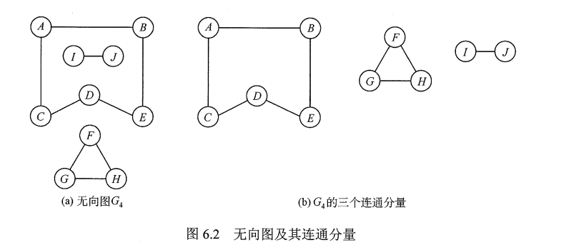

8. 强连通图、强连通分量

   1. 在**有向图**中，如果有一对顶点v和w，从v到w和从w到v之间都有路径，则称这两个顶点是**强连通的**。
   2. 若图中任何一对顶点都是**强连通**的，则称此图为**强连通图**
   3. 有向图中的**极大强连通子图**称为有向图的**强连通分量**

9. **无向图中讨论连通性，有向图中讨论强连通性**

10. 生成树、生成森林

    1. **连通图的生成树**是包含图中全部顶点的一个**极小连通子图**。若图中顶点数为**n**，则它的生成树含有**n-1**条边。包含图中全部顶点的**极小连通子图**，只有生成树满足这个极小条件，对生成树而言，若砍去它的一条边，则会变成非连通图，若加上一条边，则会形成一个回路

       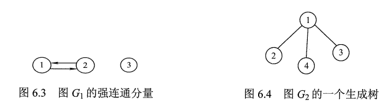

    2. 区分**极大连通子图**和**极小连通子图**

       1. **极大连通子图**是无向图的连通分量，极大即要求该连通子图包含其所有的边
       2. **极小连通子图**是既要保持图连通，又要使得边数保持最少的子图

11. 顶点的度、入度和出度

    1. 在**无向图**中，**顶点v的度**是指依附于顶点v的**边**的条数，记为**TD(v)**。无向图的全部顶点的**度**的**和**等于**边数**的**2倍**，因为每条边和两个顶点相关联

    2. 在**有向图**中，**顶点v的度**分为**入度、出度**，**入度**是以**顶点v为终点**的有向边的数目，记为**ID(v)**。而**出度**是以顶点v为起点的有向边的数目，记为**OD(v)**。

       1. 顶点v的**度**，等于其**入度 + 出度**，即**TD(v) = ID(v) + OD(v)**

       2. 对于具有**n**个顶点、**e**条边的有向图，其全部顶点的**入度之和**与**出度之和**相等，并且等于**边数**，这是因为每条有向边都有一个起点和终点
          $$
          \rm \sum^n_{i=1}ID(v_i) = \sum^n_{i=1}OD(v_i)=e
          $$

12. 边的权和网

    1. 在一个图中，每条边都可以标上具有某种含义的数值，该数值称为该边的**权值**
    2. 这种边上带有权值的图，称为**带权图**，也称**网**

13. 稠密图、稀疏图

    1. 边数很少的图称为**稀疏图**，反之称为**稠密图**。稀疏和稠密本身是模糊的概念，稀疏图和稠密图常常是相对而言的。
    2. 一般当图G满足**|E| < |V|log|V|**时，可以视G为**稀疏图**

14. 路径、路径长度和回路

    1. 顶点$v_p$到顶点$v_q$之间的一条路径是指顶点序列$v_p,v_{i_1},v_{i_2},...,v_{i_m}, v_q$ ，当然关联的边也可理解为路径的构成要素。路径上**边的数目**称为**路径长度**。第一个顶点和最后一个顶点相同的路径称为**回路**或**环**。若一个图有**n**个顶点，并且有大于**n-1**条边，则此图一定有环

15. 简单路径、简单回路

    1. 在路径序列中，顶点**不重复**出现的路径称为**简单路径**。除第一个顶点和最后一个顶点外，其余顶点不重复出现的回路称为**简单回路**

16. 距离

    1. 从顶点u出发到顶点v的**最短路径**若存在，则此路径的长度称为从u到v的**距离**。若从u到v根本不存在路径，则记该距离为**无穷**

17. 有向树

    1. 一个顶点的入度为0、其余顶点的入度均为1的有向图，称为**有向树**

## 图的存储及基本操作

### 邻接矩阵法

1. 所谓邻接矩阵存储，是指用一个**一维数组**存储图中**顶点**的信息，用一个**二维数组**存储图中**边**的信息（即各顶点之间的邻接关系），存储顶点之间邻接关系的二维数组称为**邻接矩阵**

2. 结点数为**n**的图G=（V，E）的邻接矩阵A是**n*n**的。将G的顶点编号为$v_1,v_2,...,v_n$。若$(v_i,v_j) \in E$，则A\[i]\[j] = 1，否则A\[i]\[j] = 0
   $$
   A[i][j] = \begin {cases}
   1，若(v_i,v_j)或<v_i,v_j>是E(G)中的边 \newline
   0，若(v_i,v_j)或<v_i,v_j>不是E(G)中的边
   \end{cases}
   $$

3. 对于**带权图**而言，若顶点$v_i$和$v_j$之间有边相连，则邻接矩阵中对应项存放着该边对应的**权值**，若顶点$V_i$和$V_j$不相连，则用$\infin$来代表两个顶点之间不存在边
   $$
   A[i][j] = \begin{cases}
   w_{ij}，若(v_i,v_j)或<v_i,v_j>是E(G)中的边 \newline
   0或\infin，若(v_i,v_j)或<v_i,v_j>不是E(G)中的边
   \end{cases}
   $$

4. 图的邻接矩阵存储结构定义如下

   ```c
   // 顶点数目的最大值
   #define MaxVertexNum 100
   // 顶点的数据类型
   typedef char VertextType;
   // 带权图中边上权值的数据类型
   typedef int EdgeType;
   
   typedef struct {
       // 顶点表
   	VertexType Vex[MaxVertexNum];
       // 邻接矩阵，边表
       EdgeType Edge[MaxVertexNum][MaxVertexNum];
       // 图的当前顶点数和弧数
       int vexnum, arcnum;
   } MGraph;
   ```

   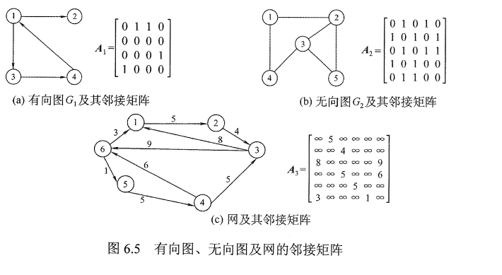

   1. 在简单应用中，可直接用**二维数组**作为图的邻接矩阵（顶点信息等均可省略）
   2. 当邻接矩阵的元素仅表示相应**边**是否**存在**时，EdgeType可采用值为**0和1**的枚举类型
   3. 无向图的邻接矩阵是对称矩阵，对规模特大的邻接矩阵可采用压缩存储
   4. 邻接矩阵表示法的空间复杂度为$O(n^2)$，其中**n**为图的顶点数**|V|**

5. 图的邻接矩阵存储表示法具有以下特点

   1. **无向图**的邻接矩阵一定是一个**对称矩阵**（并且唯一）。因此，在实际存储邻接矩阵时只需存储**上（或下）三角矩阵**的元素
   2. 对于**无向图**，邻接矩阵的第i行（或第i列）非零元素（或非$\infin$元素） 的**个数**正好是顶点i的**度$TD(v_i)$**
   3. 对于**有向图**，邻接矩阵的第i行非零元素（或非$\infin$元素）的个数正好是顶点i的**出度$OD(v_i)$**，第i列非零元素（或非$\infin$元素）的个数正好是顶点i的**入度$ID(v_i)$**
   4. 用邻接矩阵存储图，很容易确定图中任意两个顶点之间是否有边相连。但是，要确定图中有多少条边，则必须按行、按列对每个元素进行检测，所花费的时间代价很大
   5. **稠密图**适合用邻接矩阵的存储表示
   6. 设图G的邻接矩阵为A，**$A^n的元素A^n[i][j]等于由顶点i到顶点j的长度为n的路径的数目$**

### 邻接表法

1. 当一个图为**稀疏图**时，使用**邻接矩阵法**显然要浪费大量的存储空间，而图的邻接表法结合了顺序存储和链式存储方法，大大减少了这种不必要的浪费

2. 所谓**邻接表**，是指对图G中的每个顶点$v_i$建立一个**单链表**，第i个单链表中的结点表示依附于顶点$v_i$的边（对于有向图则是以顶点$v_i$为尾的弧），这个单链表就称为**顶点$v_i$的边表**（对于有向图，则称为**出边表**）。边表的头指针和顶点的数据信息采用**顺序存储**（称为**顶点表**），所以在邻接表中存在两种结点：**顶点表结点**和**边表结点**

   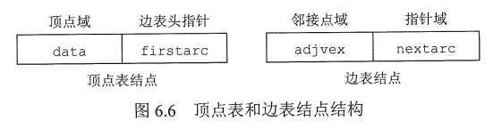

3. **顶点表结点**由**顶点域（data）**和指向**第一条邻接边**的指针（firstarc）构成，**边表（邻接表）结点**由**邻接点域（adjvex）**和指向**下一条邻接边**的指针域（nextarc）构成

4. **无向图**和**有向图**的邻接表的实例如下图

   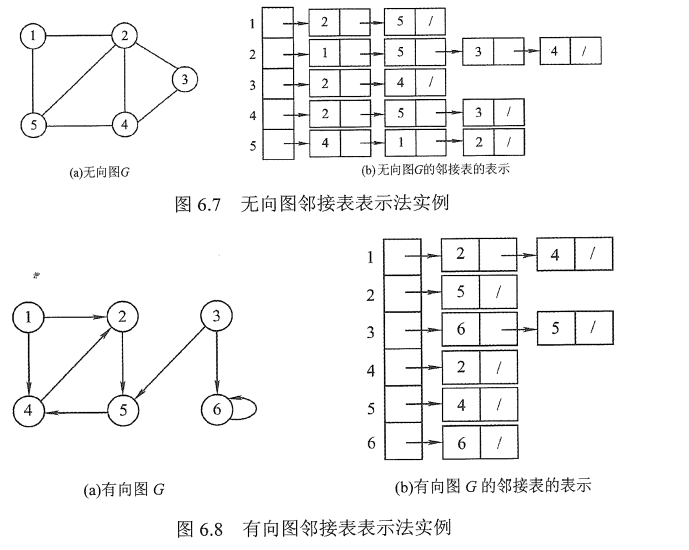

5. 图的邻接表存储结构定义如下

   ```c
   // 图中顶点数目的最大值
   #define MaxVertexNum 100
   // 边表结点
   typedef struct ArcNode {
       // 该弧所指向的顶点的位置
       int adjvex;
       // 指向下一条弧的指针
       struct ArcNode *next;
   } ArcNode;
   
   // 顶点表结点
   typedef struct VNode {
       // 顶点信息
       VertexType data;
       // 指向第一条依附该顶点的弧的指针
       ArcNode *first;
   } VNode, AdjList[MaxVertexNum];
   
   // 邻接表
   typedef struct {
       // 邻接表
       AdjList vertices;
       // 图的顶点数和弧数
       int vexnum, arcnum;
   } ALGraph;
   ```

6. 图的邻接表存储方法具有以下**特点**

   1. 若G为**无向图**，则所需的存储空间为**O(|V| + 2|E|)**，若G为**有向图**，则所需的存储空间为**O(|V| + |E|)**。前者的倍数2是由于无向图中，**每条边在邻接表中出现了两次**
   2. 对于**稀疏图**，采用邻接表表示将极大地节省存储空间
   3. 在**邻接表**中，给定一顶点，能很容易地找出它的所有邻边，因为只需要读取它的邻接表。在**邻接矩阵**中，相同的操作则需要扫描一行，花费的时间为O(n)。但是，若要确定给定的两个顶点间是否存在边，则在**邻接矩阵**中可以立刻查到，而在**邻接表**中则需要在相应结点对应的**边表**中查找另一结点，效率极低
   4. 在有向图的邻接表表示中，求一个给定顶点的**出度**只需计算其邻接表中的**结点个数**；但求其顶点的**入度**，则需要便利全部的邻接表。因此，也有人采用**逆邻接表**的存储方式来加速求解给定顶点的入度。
   5. 图的邻接表表示并不唯一，因为在每个顶点对应的**单链表**中，各边结点的链接次序可以是任意的，它取决于建立邻接表的算法及**边的输入次序**

### 十字链表

1. **有向图**的一种链式存储结构。在十字链表中，对应于有向图中的**每条弧**有一个**结点**，对应于每个**顶点**也有一个**结点**。这些结点的结构如下

   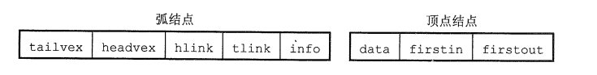

   1. **弧结点**中有5个域

      1. **尾域**（tailvex）、**头域**（headvex）分别指示**弧尾**和**弧头**这两个顶点在图中的位置；
      2. **链域（hlink）**指向弧头相同的下一条弧。**链域（tlink）**指向弧尾相同的下一条弧；
      3. **info域**指向该弧的相关信息。
      4. 这样，弧头相同的弧就在同一个链表上，弧尾相同的弧也在同一个链表上

   2. **顶点结点**中有3个域

      1. **data域**存放顶点相关的数据信息，如顶点名称
      2. **firstin**和**firstout**两个域分别指向以该结点为弧头或弧尾的第一个弧结点

   3. 下图为**有向图**的十字链表法。注意，顶点结点之间是**顺序储存**的

      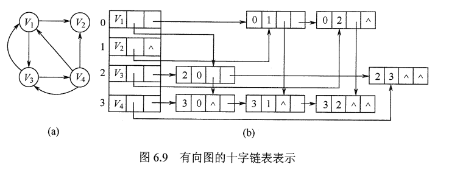

      1. 在十字链表中，既容易找到$V_i$为尾的弧，又容易找到$V_i$为头的弧，因而容易求得顶点的**出度、入度**。图的十字链表表示是不唯一的，但一个十字链表表示确定一个图

### 邻接多重表

1. 邻接多重表是**无向图**的另一种链式存储结构

2. 在邻接表中，容易求得顶点和边的各种信息，但在邻接表中求**两个顶点之间是否存在边**或**对边执行删除**等操作时，需要分别在两个顶点的边表中遍历，效率较低

3. 与十字链表法类似，在链接多重表中，每条**边**用一个结点表示，其结构如下

   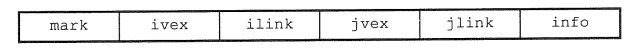

   1. **mark**为标志域，可用以标记该条边是否被搜索过
   2. **ivex**和**jvex**为该边依附的两个顶点在图中的位置
   3. **ilink**指向下一条依附于顶点**ivex**的边
   4. **jlink**指向下一条依附于顶点**jvex**的边
   5. **info**为指向和边相关的各种信息的指针域

4. 每个顶点也用一个结点表示，它由如下所示的两个域组成

   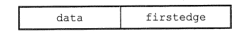

   1. **data**域存储该顶点的相关信息
   2. **firstedge**域指示第一条依附于该顶点的边

5. 在邻接多重表中，所有依附于**同一顶点**的边串联在同一链表中，由于每条边依附于两个顶点，因此每个边结点同时链接在两个链表中。对**无向图**而言，其**邻接多重表**和**邻接表**的差别仅在于

   1. 同一条边在**邻接表**中用两个结点表示，而在**邻接多重表**中只有一个结点

6. 下图为**无向图**的邻接多重表表示法。邻接多重表的各种基本操作的实现和邻接表类似

   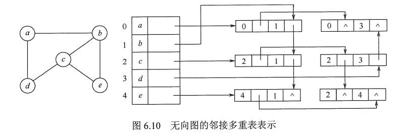

### 图的基本操作

1. 图的基本操作是独立于图的**存储结构**的，而对于不同的存储方式，操作算法的具体实现会有着不同的性能。在设计具体算法的实现时，应考虑采用何种存储方式的算法效率会更高
2. 图的**基本操作**主要包括
   1. `Adjacent(G, x, y)`
      1. 判断图G是否存在边<x, y>或(x, y)
   2. `Neighbors(G, x)`
      1. 列出图G中与结点x邻接的边
   3. `InsertVertex(G, x)`
      1. 在图G中插入顶点x
   4. `DeleteVertex(G, x)`
      1. 从图G中删除顶点x
   5. `AddEdge(G, x, y)`
      1. 若无向边(x, y)或有向边<x, y>不存在，则向图G中添加该边
   6. `RemoveEdge(G, x, y)`
      1. 若无向边(x, y)或有向边<x, y>存在，则从图G中删除该边
   7. `FirstNeighbor(G, x)`
      1. 求图G中顶点x的第一个邻接点，若有则返回顶点号。若x没有邻接点或图中不存在x，则返回-1
   8. `NextNeighbor(G, x, y)`
      1. 假设图G中顶点y时顶点x的一个邻接点，返回除y外顶点x的下一个邻接点的顶点号，若y是x的最后一个邻接点，则返回-1
   9. `Get_edge_value(G, x, y)`
      1. 获取图G中边(x, y)或<x, y>对应的权值
   10. `Set_edge_value(G, x, y, v)`
       1. 设置图G中边(x, y)或<x, y>对应的权值为v
   11. `图的遍历算法`
       1. **深度优先遍历**与**广度优先遍历**

## 图的遍历

### 广度优先搜索 （**Breadth-First-Search，BFS**）

1. **基本思想**

   1. 首先访问起始顶点v
   2. 接着由v出发，依次访问v的各个未访问过的邻接顶点$w_1,w_2,...,w_i$，然后依次访问$w_1,w_2,...,w_i$的所有未被访问过的邻接顶点
   3. 再从这些访问过的顶点出发，访问它们所有未被访问过的邻接顶点，直至图中所有顶点都被访问过为止
   4. 若此时图中尚有顶点未被访问，则另选图中一个未曾被访问的顶点作为始点，重复上述过程，直至图中所有顶点都被访问到为止

2. 是一种**分层**的查找过程，每向前走一步可能访问一批顶点，不像**深度优先搜索**那样有往回退的情况，因此它不是一个递归的算法。为了实现逐层的访问，必须借助一个**辅助队列**，以记忆正在访问的顶点的下一层顶点

3. 伪代码如下

   ```c
   // 访问标记数组
   bool visited[MAX_VERTEX_NUM];
   // 对图G进行广度优先遍历
   void BFSTraverse(Graph G) {
       // 访问标记数组初始化
       for( i = 0; i < G.vexnum; ++i ) {
           visited[i] = FALSE;
       }
       // 初始化辅助队列Q
       InitQueue(Q);
       // 从0号顶点开始遍历
       for( i = 0; i < G.vexnum; ++i ) {
           // 对每个连通分量调用一次BFS
           if ( !visited[i] ) {
           	// vi未访问过，从vi开始BFS
               BFS(G, i);
           }
       }
   }
       
   // 从顶点v出发，广度优先遍历图G
   void BFS(Graph G, int v) {
       // 访问初始顶点v
       visit(v);
       // 对v做已访问标记
       visited[v] = TRUE;
       // 顶点v入队列Q
       Enqueue(Q, v);
       
       while( !isEmpty(Q)) {
           // 顶点v出队列
           DeQueue(Q, v);
           // 检测v所有邻接点
           for ( w = FirstNeighbor(G, v); w >= 0; w = NextNeighbor(G, v, w) ) {
               // w为v的尚未访问的邻接顶点
               if ( !visited[w] ) {
                   // 访问顶点w
                   visit(w);
                   // 对w做已访问标记
                   visited[w] = TRUE;
                   // 顶点w入队列
                   EnQueue(Q, w);
               }
           }
       }
   }  
   ```

4. BFS算法的**性能分析**

   1. 无论是**邻接表**还是**邻接矩阵**的存储方式，BFS算法都需要借助一个**辅助队列Q**，n个顶点均需入队一次，在最坏的情况下，空间复杂度为O(|V|)
   2. 采用**邻接表**存储方式时，每个顶点均需搜索一次（或入队一次），故时间复杂度为O(|V|)，在搜索任一顶点的邻接点时，每条边至少访问一次，故时间复杂度为O(|E|)，算法总的时间复杂度为O(|V| + |E|)。采用**邻接矩阵**存储方式时，查找每个顶点的邻接点所需的时间为O(|V|)，故算法总的时间复杂度为O($|V|^2$)

5. BFS算法求解**单源最短路径**问题

   1. 若图G=（V，E）为非带权图，定义从顶点u到顶点v的**最短路径**d(u, v)为从u到v的任何路径中最少的边数；若从u到v没有通路，则d(u, v) = $\infin$ 

   2. 使用BFS，这是由广度优先搜索总是**按照距离由近到远来遍历图中每个顶点的性质决定的**

   3. **算法**如下

      ```c
      void BFS_MIN_Distance(Graph G, int u) {
          // d[i]表示从u到i结点的最短路径
          for (i =0; i < G.vexnum; ++i ) {
              // 初始化路径长度
              d[i] = -1;
          }
          
          visited[u] = TRUE;
          d[u] = 0;
          EnQueue(Q, u);
          while( !isEmpty(Q) ) {
      	    // 队头元素u出队
              DeQueue(Q, u);
              for ( w = FirstNeighbor(G, u); w >= 0; w = NextNeighbor(G, u, w) ) {
                  if (!visited[w]) {
                      // w为u的尚未访问的邻接顶点
                      // 设已访问标记
                      visited[w] = TRUE;
                      // 路径长度+1
                      d[w] = d[u] + 1;
                      // 顶点w入队
                      EnQueue(Q, w);
                  }
              }
          }
      }
      ```

6. 广度优先生成树

   1. 在**广度遍历**的过程中，我们可以得到一棵遍历树，称为**广度优先生成树**。主要注意的是，一给定图的**邻接矩阵**存储表示是唯一的，故其广度优先生成树也是**唯一**的，但由于**邻接表**存储表示不唯一，故其广度优先生成树也是**不唯一**的
   
      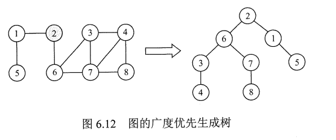

### 深度优先搜索 （**Depth-First-Search, DFS**）

1. 类似于树的**先序遍历**

2. **基本思想**

   1. 首先访问图中某一起始顶点v，然后由v出发，访问与v邻接且未被访问的任一顶点$w_1$
   2. 再访问与$w_1$邻接且未被访问的任一顶点$w_2$，重复上述过程
   3. 当不能再继续向下访问时，依次退回到最近被访问的顶点，若它还有邻接顶点未被访问过，则从该点继续开始上述搜索过程，直至图中所有顶点均被访问过为止

3. 算法过程如下

   ```c
   // 访问标记数组
   bool visited[MAX_VERTEX_NUM];
   // 对图G进行深度优先遍历
   void DFSTraverse(Graph G) {
       for ( v = 0; v < G.vexnum; ++v ) {
           // 初始化已访问标记数据
           visited[v] = FALSE;
       }
       // 本代码中是从v=0开始遍历
       for ( v = 0; v < G.vexnum; ++v ) {
           if ( !visited[v] ) 
               DFS(G, v);
       }
   }
   
   // 从顶点v出发，深度优先遍历图G
   void DFS(Graph G, int v) {
       // 访问顶点v
       visit(v);
       // 设已访问标记
       visited[v] = TRUE;
       
       for ( w = FirstNeighbor(G, v); w >= 0; w = NextNeighbor(G, v, w) ) {
           // w为v的尚未访问的邻接顶点
           if ( !visited[w] ) 
               DFS(G, w);
       }
   }   
   ```

4. 图的**邻接矩阵**表示是**唯一**的，但对于**邻接表**来说，若边的输入次序不同，生成的**邻接表**也不同。因此，对于同样一个图，基于**邻接矩阵**的遍历所得到的DFS序列和BFS序列是唯一的，基于**邻接表**的遍历所得到的DFS序列和BFS序列是**不唯一**的

5. DFS算法的**性能分析**

   1. 是一个**递归**算法，需要借助一个**递归工作栈**，故其空间复杂度为O(|V|)
   2. 遍历图的过程，实质上是对每个**顶点**查找其**邻接点**的过程，其耗费的时间取决于所用的存储结构。以**邻接矩阵**表示时，查找每个顶点的邻接点所需的时间为O(|V|)，故总的时间复杂度为O($|V|^2$)。以**邻接表**表示时，查找所有顶点的临界点所需的时间为O(|E|)，访问顶点所需的时间为O(|V|)，此时，总的时间复杂度为O(|V|+|E|)

6.  深度优先的生成树和生成森林


## 图的应用


# 查找


## 查找的基本概念


## 顺序查找和折半查找


## B树和B+树


## 散列表


# 排序


## 排序的基本概念


## 插入排序


## 交换排序


## 选择排序


## 归并排序和基数排序


## 各种内部排序算法的比较及应用


## 外部排序

