[TOC]
------

# 计算机系统概述

## 计算机发展历程

## 计算机系统层次结构

+ 输入设备
+ 输出设备
+ 存储器
	+ MAR (Memory Address Register) 地址寄存器 - **存放访存地址，经过地址译码后找到所选的存储单元，用于寻址**
	+ MDR (Memory Data Register) 数据寄存器
+ 运算器
	+ ALU (Arithmetic And Logical Unit) 算术逻辑单元 - **运算器的核心**
	+ ACC (Accumulator) 累加器
	+ MQ (Multiple-Quotient Register) 乘商寄存器
	+ X 操作数寄存器
	+ IX 变址寄存器
	+ BR 基址寄存器
	+ PSW 程序状态寄存器/标志寄存器
+ 控制器
	+ PC (Program Counter) 程序计数器 - **存放当前欲执行指令的地址，可以自动加1以形成下一条指令的地址**
	+ IR (Instruction Register) 指令寄存器 - **存放当前的指令，数据来自主存的MDR**
	+ CU (Control unit) 控制单元

## 计算机的性能指标

+ 运算速度
	+ 主频和CPU时钟周期
		+ CPU时钟周期。即**主频的倒数**，是**CPU中最小的时间单位**，执行指令的每个动作至少需要1个时钟周期
		+ CPU时钟周期 = 1 / CPU主频
		+ 主频通常以**Hz**为单位，1Hz表示每秒1次。
	+ CPI (Clock cycle Per Instruction)
		+ 执行一条指令所需的时钟周期数
		+ 不同指令的时钟周期数可能不同，对一个程序或机器来说，其CPI指该程序或该机器指令集中所有的指令执行所需的平均时钟周期数，此时**CPI是一个平均值**
	+ CPU执行时间
		+ `CPU执行时间 = CPU时钟周期数 * CPU时钟周期 = CPU时钟周期数 / 主频 = (指令条数 * CPI) / 主频 = (指令条数 * CPI) * CPU时钟周期`
	+ MIPS (Million Instructions Per Second)
		+ 每秒执行多少百万条指令
		+ MIPS = 指令条数 / (执行时间 * 10^6) = 主频 / (CPI * 10^6)
	+ MFLOPS (Mega Floating-point Operations Per Second)
	+ GFLOPS (Giga Floating-point Operations Per Second)
	+ TFLOPS (Tera Floating-point Operations Per Second)
+ 主存容量
	+ 以`字节`衡量，也可用`字数 * 字长`，如`512K * 16`来表示
	+ MAR的位数，表示 **存储单元的个数**，MDR的位数，表示 **可寻址范围的最大值**
	+ MAR为16位，表示 2^16 = 65536，即有65536个存储单元（可称为64K内存），若MDR为32位，表示存储容量为 **64K * 32位**

## 总结

+ MDR, MAR虽然是存储器的一部分，但在现代CPU中，却是存在于CPU中，与高速缓存(Cache)一样
+ 在描述存储容量、文件大小等时，K、M、G、T通常用2的幂次表示，如1Kb = 2^10b；在描述速率、频率等时，k、M、G、T通常用10的幂次表示，如 1kb/s = 10^3 b/s。通常前者用大写的K，后者用小写的k，但其他前缀均为大写，表示的含义取决于所用的场景。
+ 翻译程序：把高级语言源程序翻译成机器语言程序（目标代码）的软件。有两种
	+ 编译程序：将高级语言源程序一次全部翻译成目标程序，每次执行程序时，只需执行目标程序。
	+ 解释型程序：将源程序的一条语句翻译成对应的机器目标代码，并立即执行，然后翻译下一条源程序语句并执行，直至所有源程序语句全部被翻译并执行完。（不会生成目标程序）
+ 汇编程序也是一种语言翻译程序，把汇编语言源程序翻译为机器语言程序。
+ 编译程序与汇编程序的区别：若源程序是 **C，C++，Java** 等高级语言，而目标语言是 **汇编语言，或机器语言** 之类的低级语言，则称这样的翻译程序为编译程序。若源语言是 **汇编语言**，而目标语言是 **机器语言**，则这样的翻译程序称为 **汇编程序**。
+ 在计算机领域，站在某类用户的角度，若感觉不到某个事物或属性的存在，即“看”不到某个事物或属性，则称为“对该用户透明”。与日常生活中的“透明”概念正好相反。
+ 在CPU中，IR，MAR和MDR对各类程序员都是透明的
+ 机器字长 VS 指令字长 VS 存储字长
	+ 机器字长：计算机能直接处理的二进制数据的位数，机器字长一般等于内部寄存器的大小，它决定了计算机的运算精度。
	+ 指令字长：一个指令字中包含的二进制代码的位数。
	+ 存储字长：一个存储单元存储的二进制代码的长度。
	+ 指令字长一般取存储字长的整数倍，若指令字长等于存储字长的2倍，则需要2次访存来取出一条指令。

# 数据的表示和运算

## 数制与编码

+ 真值：带“+”或“-”符号的数称为真值
+ 机器数：把符号“数字化”的数称为机器数
+ 0 ~ 9 的ASCII码值为 **48 （011 0000） ~ 57 （011 1001）**，即去掉高3位，只保留低4位，正好是二进制形式的 0~9
+ BCD (Binary-Coded Decimal) 二进制编码的10进制数
+ 7E5H，H代表16进制
+ 进制转换
	+ 二进制转八进制、十六进制
		+ 以小数点为界，将一串二进制数分为3位一组或4位一组。整数部分，从左边开始补0，小数部分，从右边开始补0。
	+ 八进制、十六进制转二进制
		+ 只需将每位改为3位或4位二进制数即可
	+ 任意进制转十进制
		+ 保底法：如果存在小数部分，则根据二进制、八进制、十六进制，乘以对应的基数，每乘一次，就左移一位，直到全部是整数。这时候就通过位置法计算出十进制，然后再除以之前乘的数
		+ 将任意进制数的各位数码与它们的权值相乘，再把乘积相加，就得到了一个十进制数。这种方法称为按权展开相加法。
			+ (11011.1) = 1\*2^4 + 1\*2^3 + 0\*2^2 + 1\*2^1 + 1\*2^0 + 1\*2^-1 = 27.5
	+ 十进制转任意进制
		+ 整数部分用除基取余法，小数部分用乘基取整法，最后将整数部分和小数部分的转换结果拼接起来
		+ 除基取余法：**整数部分除基取余，最先取得的余数为数的最低位，最后取得的余数为数的最高位（即除基取余，先余为低，后余为高），`商为0` 时结束。
		+ 乘基取整法：**小数部分(乘基后如果出现整数部分，则整数部分不参与下一次乘基计算)乘基取整，最先取得的整数为数的最高位，最后取得的整数为数的最低位（即乘基取整，先整为高，后整为低），乘积为1.0（或满足精度要求）时结束。
		+ 
+ 校验码
	+ 奇偶校验码
		+ 实现方法：由若干位有效信息，再加上一个二进制位（校验位）组成校验码。校验码的取值（0或1）将使整个校验码中“1”的个数为奇数或偶数。
		+ 奇校验码：整个校验码（有效信息位和校验位）中“1”的个数为奇数
		+ 偶校验码：整个校验码（有效信息位和校验位）中“1”的个数为偶数
	+ 海明校验码 (Hamming Code，也称 **汉明码**，多重奇偶校验码，具有纠错能力)
		+ 实现方法：在有效信息位中加入几个校验位形成海明码，并把海明码的每个二进制位分配到几个奇偶校验组中。当某一位出错后，就会引起有关的几个校验位的值发生变化，这不但可以发现错位，还能指出错位的位置，为自动纠错提供依据。
		+ ** L(编码最小码距) - 1 = D(检测错误的位数) + C(纠正错误的位数) 且 D >= C **
		+ 编码最小码距L越大，其检测错误的位数D越大，纠正错误的位数C也越大，且纠错能力恒小于等于检错能力。

## 定点数的表示与运算
### 定点数的表示
+ 真值零的原码表示有 **正零** 和 **负零** 两种形式
+ 移位运算
	+ 有符号位的称 **算术移位**，**逻辑移位**的操作对象是逻辑代码，可视为无符号数。
	+ 算术移位的空位添补规则

	||码制|添补代码|
	|:---:|:---:|:--:|
	|正数|原码、补码、反码|0|
	|负数|原码|0|
	|负数|补码|左移添0，右移添1|
	|负数|反码|1|

	> 分析由原码得到补码的过程发现，当对其由低位向高位找到第一个“1”时，在此“1”左边的各位均与对应的反码相同，而在此“1”右边的各位（包括此“1”在内）均与对应的原码相同。因此负数的补码左移时，因空位出现在低位，则添补的代码与原码相同，即添0；右移时因空位出现在高位，则添补的代码应与反码相同，即添1。
	
	+ 逻辑移位
		左移，高位移丢，低位补0；右移，低位移丢，高位补0
	+ 循环移位
		循环移位操作特别适合将数据的低字节数据和高字节数据互换

+ 符号扩展
	+ 有时必须把采用给定位数表示的数转换成具有不同位数的某种表示形式。--如将一个8位数与一个32位数相加，要想得到正确的结果，必须先将8位数转换成32位数的形式
	+ 正数的符号扩展：原有形式的符号位移动到新形式的符号位上，新表示形式的所有附加位都用0进行填充。
	+ 负数的符号扩展
		+ 原码表示法：与正数相同，符号位为1
		+ 补码表示法：用1（对于整数）或0（对于小数）填充，符号位为1
		+ 反码表示法：用1填充，符号位为1
### 定点数的运算
+ 原码，反码，补码，移码
	+ 在计算机系统中，数值一律用补码来表示和存储。原因在于，使用补码，可以将符号位和数值域统一处理；同时，加法和减法也可以统一处理。
	
	+ 反码不能直接用来做运算，其结果要+1才能正常（结果是-0，也要+1，让其变为+0，这才是正确结果）
	
	+ 补码做运算时，正负符号参与运算
	
	+ 补码 = 反码 + 1，因此原码与反码均有两个0表示法，而补码只有一个，原先-0表示的，现在称为补码多出来的一个负数表示
	
	+ 移码 = 补码的符号位取反
	
	+ 移码常用来 **比较大小**，一般会把浮点数的阶码用移码表示，说的再通俗一点，把数值用移码表示出来可以一看看出他们的大小，这样很容易判断阶码的大小，移码可以 **简化浮点数的乘除法运算** 
	
	+ 原码一位乘法
		+ 由手写竖式乘法发展而来
		+ 被乘数和乘数均取绝对值参与运算，符号位为 X 异或 Y
		+ 部分积的长度同被乘数，取 **n + 1**位，以便存放乘法过程中绝对值大于等于1的值，初值为0.
		+ 从乘数的最低位y开始判断：若y=1，则部分积加上被乘数|x|，然后右移一位；若y=0，则部分积加上0，然后右移一位。
		+ 重复上一个步骤，判断n次
		+ 由于乘积的数值部分是两数绝对值相乘的结果，因此原码一位乘法运算过程中的右移操作均为逻辑右移
		+ 考虑到运算时可能出现绝对值大于1的情况（但此刻并非溢出），所以部分积和被乘数取双符号位
		
	+ 溢出概念和判别方法
		+ 溢出：运算结果超过了数的表示范围。大于机器所能表示的最大正数为上溢，小于机器所能表示的最小负数为下溢。
		+ 补码定点数加减运算溢出判断
			+ 一位符号位
				+ 参加操作的两个数符号相同，结果又与原操作数符号不同，则表示结果溢出
				+ 若符号位的进位Cs与最高数位的进位C1相同，则说明没有溢出，否则发生溢出。
			+ 双符号位 (**模4补码**)
				+ 运算结果的两个符号位S1，S2相同，表示未溢出；运算结果的两个符号位S1，S2不同，表示溢出，此时最高位符号位代表真正的符号。
				+ S1，S2 = 00：结果正数，无溢出
				+ S1，S2 = 01：结果正溢出
				+ S1，S2 = 10：结果负溢出
				+ S1，S2 = 11：结果负数，无溢出
### C语言中的整数类型及类型转换
	+ 整数类型及类型转换
		+ 不同字长整数之间的转换
			+ 当大字长变量向小字长变量强制类型转换时，系统把多余的高位字长部分直接截断，低位直接赋值，因此也是一种保持位值的处理方法。
			+ 短字长整数到长字长整数的转换，不仅要使相应的位值相等，高位部分还会扩展为原数字的符号位。
		+ 有符号数和无符号数的转换
			```c
			void	int main() {
					short x = -4321;
					unsigned short y = (unsigned short) x;
					printf("x = %d, y=%u\n", x, y);
				}
			```
			对比两者的二进制表示
	
			|变量|值|位|位|位|位|位|位|位|位|位|位|位|位|位|位|位|
			|:--:|:--:|:--:|:--:|:--:|:--:|:--:|:--:|:--:|:--:|:--:|:--:|:--:|:--:|:--:|:--:|:--:|
			|||15|14|13|12|11|10|9|8|7|6|5|4|3|2|1|
			|x|-4321|1|1|1|0|1|1|1|1|0|0|0|1|1|1|1|1|
			|y|61215|1|1|1|0|1|1|1|1|0|0|0|1|1|1|1|1|
	
			可知，将 **short int** 强制转换为 **unsigned short** 只改变数值，而两个变量对应的每位都是一样的。即强制类型转换的结果保持位值不变，仅改变了解释这些位的方式。
### 数据的存储和排列		
	+ 数据存储的 **大端方式** VS **小端方式**
		+ 大端方式：按从最高有效字节到最低有效字节的顺序存储数据，即最高有效字节存放在前面
		+ 小端方式：按从最低有效字节到最高有效字节的顺序存储数据，即最低有效字节存放在前面
		
	+ 数据按 **边界对齐** 方式存储
		+ 对于机器字长为32位的计算机，数据以边界对齐方式存放，半字地址一定是2的整数倍，字地址一定是4的整数倍。所存储的数据不满足上述要求时，通过填充空白字节使其符合要求。这样无论所取的数据是字节、半字还是字，均可一次访存取出，提高取指令和取数的速度。
		+ 边界对齐是一种空间换时间的思想。RISC如 **ARM** 采用边界对齐，而CISC如 **x86** 对齐和不对齐都支持，因为对齐方式取指令时间相同，因此能适应指令流水。

## 浮点数的表示与运算

+ **阶码** 控制 **小数点的位置**，**阶码每加一，整个数值增大到2倍，小数点向右移一位**，**阶码每减一，整个数值减少2倍，小数点向左移一位**

+ 15张图带你了解浮点数

  

  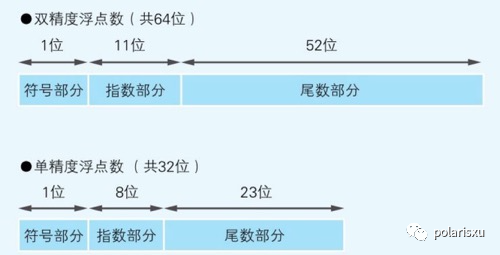

  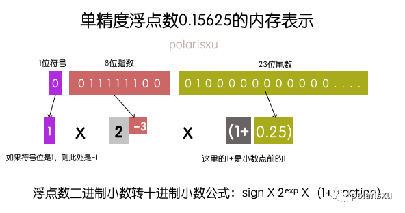

  **注意上图中，阶码应该是 01111100，图片有误，但结果无误，移码表示法的01111100，其真值为-4，但是IEEE754规定，阶码E采用 `指数e的移码-1`来表示，即01111011，其真值为-3**

  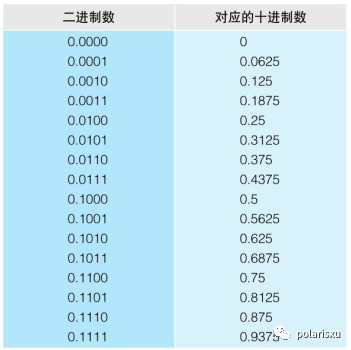

  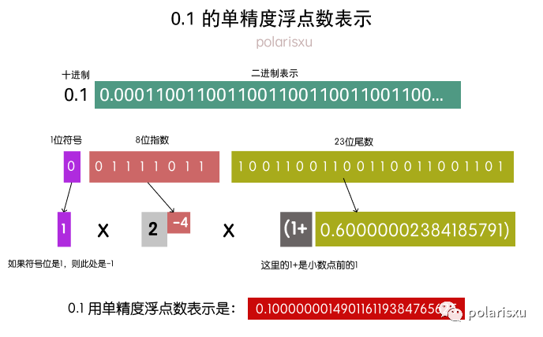

  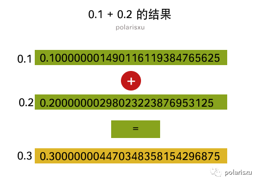

  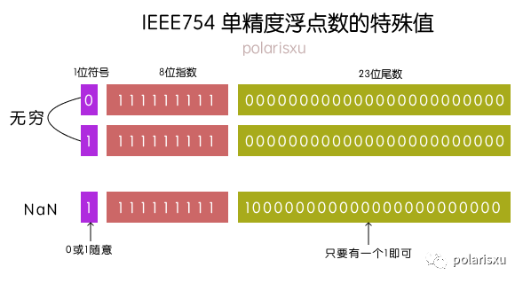

  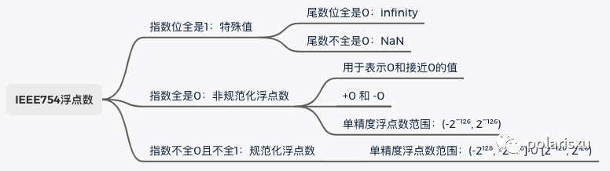

  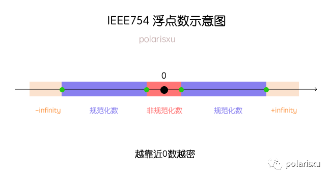

+ 浮点数的一般格式

  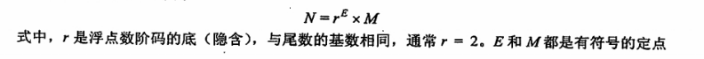

  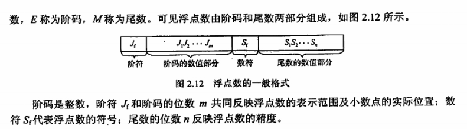

+ 规格化浮点数

  通过调整一个 **非规格化浮点数** 的 **尾数和阶码** 的大小，使非零的浮点数在 **尾数的最高数位上保证是一个有效值**。

  + **左规**：当浮点数运算的结果为非规格化时，要进行规格化处理，**将尾数算术左移一位、阶码减一（基数为2时）** 的方法。 **可能要进行多次**。
  + **右规**：当浮点数运算的结果 **尾数出现溢出（双符号位为01或10）时，将尾数算术右移一位、阶码加一（基数为2时）** 的方法。 **需要右规时，只需进行一次**。

+ IEEE 754 标准

  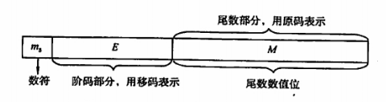

  

  > IEEE 754标准与普通浮点数格式要求要区分开。

  **IEEE 754标准的浮点数（除临时浮点数外），是尾数用采取隐藏位策略的原码表示，且阶码用移码表示的浮点数。**

  以短浮点数为例，最高位为 **数符位**；其后是 **8位阶码**，以 **2** 为底（**即基数为2**），用 **移码** 表示，阶码的 **偏置值** 为$2^{8-1} -1=127$；其后 **23** 位是原码表示的 **尾数数值位**。对于 **规格化** 的二进制浮点数，数值的最高位总是 **1**，为了能使 **尾数多表示一位有效位，将这个“1”隐含，因此尾数数值实际上是24位。隐含的“1”是一位整数。在浮点格式中表示的23位尾数是纯小数**。例如，（12）的十进制 = （1100）的二进制，将它规格化后结果为$1.1*2^3$，其中 **整数部分的“1”将不会存储在23位尾数内**。

  + IEEE 754 浮点数格式

    | 类型                           | 数符 | 阶码 | 尾数数值 | 总位数 | （16进制）偏置值 | （10进制）偏置值 |
    | ------------------------------ | :--: | :--: | :------: | :----: | :--------------: | ---------------- |
    | 短浮点数（**单精度，float**）  |  1   |  8   |    23    |   32   |       7FH        | 127              |
    | 长浮点数（**双精度，double**） |  1   |  11  |    52    |   64   |       3FFH       | 1023             |
    | 临时浮点数                     |  1   |  15  |    64    |   80   |      3FFFH       | 16383            |

  + IEEE 754 浮点数范围

    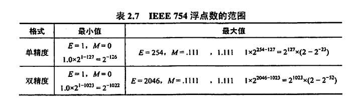

+ 定点 VS 浮点

  + 数值的表示范围

    字长相同，**浮点** 所能表示的数值范围将远远大于 **定点**

  + 精度

    一个数所含有效数值位的位数。对于字长相同的定点数和浮点数来说，浮点数 **扩大了数的表示范围，但降低了精度**

  + 数的运算

    浮点数包括 **阶码** 和 **尾数** 两部分，运算时要同时做两部分的运算，而且要求运算结果 **规格化**，所以浮点运算更复杂

  + 溢出问题

    定点运算，结果 **超出数的表示范围** 时，发生溢出；

    浮点运算，结果 **超出数的表示范围却不一定溢出，只有规格化阶码超出所能表示的范围** 时，才发生溢出。
  
+ 偏置值

  以单精度浮点型float为例，指数e由 **8位二进制原码（无符号）** 表示，但这样的小数不能表示 **（-1,1）** 中的数，因为阶码总是 **正数**。所以不如 **减去一个偏置量127**，这样就能表示负的 **E** （如果没有偏置，那么 **e=E**），此时 **E=e-127**，而e的范围是 **（1，254）**，最终 **阶码E的范围为 （-126,127）**。

## 算术逻辑单元（ALU）

### 串行加法器和并行加法器

+ **运算器** 由 **算术逻辑单元（Arithmetic Logic Unit， ALU）**、**累加器**、**状态寄存器** 和 **通用寄存器** 等组成。**ALU** 的基本功能包括 **加、减、乘、除** 四则运算，**与、或、非、异或** 等逻辑运算，以及 **移位、求补** 等操作。

+ **运算器** 的操作和操作种类由 **控制器** 决定。**运算器** 处理的数据来自 **存储器**；处理后的结果数据通常送回 存储器，或暂存在 **运算器** 中。

+ **ALU** 的核心部件是 **加法器**，**加法器** = **全加器** + **其他必要的逻辑电路**。全加器 **单个或多个**， 决定加法器的 **串行和并行**。（**并行加法器的最长运算时间主要是由进位信号的传递时间决定的，每个全加器本身的求和延迟只是次要因素**）

+ 并行加法器中的每个全加器都有一个从 **低位** 送来的**进位输入**和一个传送给**高位**的 **进位输出**。通常将**传递进位信号的逻辑线路**连接起来构成的进位网络称为 **进位链**。

+ 一位全加器

  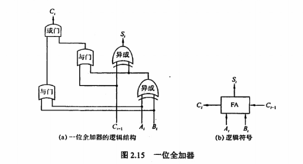

  + 输入
    $$
    加数 A_i、加数B_i、低位传来的进位C_{i-1}
    $$

  + 输出
    $$
    本位和S_i，向高位的进位C_i
    $$

  + 和表达式
    $$
    S_i = A_i \oplus B_i \oplus	C_{i-1}
    $$

  + 进位表达式
    $$
    C_i = A_iB_i +(A_i \oplus	B_i)C_{i-1}
    $$

    $$
    令 G_i=A_iB_i，P_i=A_i \oplus B_i，G_i是进位产生函数，P_i是进位传递函数。
    \\ G_i为1，说明有进位信号产生。
    \\ P_i为1，说明第i-1位的进位信号C_{i-1}可以通过本位向高位传送。
    $$

+ 串行加法器

  **一个全加器**，数据**逐位串行**送入加法器中进行运算，每次产生**一位和**，并且串行逐位地送回**寄存器**。**进位触发器**用来寄存**进位信号**，以便参与下一次运算。

  优点：**器件少，成本低**。缺点：**运算速度慢**

+ 并行加法器

  + 最低位产生的进位将逐位影响至最高位，因此并行加法器的最长运算时间主要是由**进位信号的传递时间决定的**

  + 提高并行加法器速度的关键是尽量**加快进位产生和传递的速度**

  + 串行进位 （**行波进位**）

    + 进位信号逐级形成
      $$
      \begin{align}
      &C_1 = A_1B_1+(A_1\oplus B_1)C_0，或C_1=G_1+P_1C_0
      \\ &C_2 = A_2B_2+(A_2 \oplus B_2)C_1，或C_2=G_2+P_2C_1
      \\ &C_n=A_nB_n+(A_n \oplus B_n)C_{n-1}，或C_n=G_n+P_nC_{n-1}
      \end{align}
      $$

  + 并行进位（**先行进位**、**同时进位**）

    + 同时形成进位信号
      $$
      \begin{align}
      & C_1=G_1+P_1C_0
      \\& C_2=G_2+P_2C_1=G_2+P_2G_1+P_2P_1C_0
      \\ &C_3=G_3+P_3C_2=G_3+P_3G_2+P_3P_2G_1+P_3P_2P_1C_0
      \end{align}
      $$

  + 分组并行进位方式

    + 把n位全加器分为若干小组，**小组内的各位之间实行并行快速进位**，**小组与小组之间可以采用串行进位方式**，也可以采用**并行快速进位**方式。

      + 单级先行进位方式（**组内并行、组间串行进位**）

        + 4位先行进位电路（**CLA**）

          以16位加法器为例，可分为4组，每组4位。第一小组组内的进位逻辑函数 $C_1、C_2、C_3、C_4$的表达式与前述相同，$C_1~C_4$信号是同时产生的

      + 多级先行进位方式（**组内并行、组间并行进位**）
      
        + 成组先行进位电路（**BCLA**）
      
          第1组内产生$G_1^*、P_1^*、C_3、C_2、C_1，不产生C_4$
      
          第2组内产生$G_2^*、P_2^*、C_7、C_6、C_5，不产生C_8$
      
          第3组内产生$G_3^*、P_3^*、C_{11}、C_{10}、C_9，不产生C_{12}$
      
          第4组内产生$G_4^*、P_4^*、C_{15}、C_{14}、C_{13}，不产生C_{16}$
      
          利用这种4位的**BCLA**电路及进位产生与传递电路和求和电路可以构成4位BCLA加法器。16位的**两级先行进位加法器**可由**4个BCLA加法器**和**1个CLA电路**构成。
      
        + 这种方法可以扩展到多于两级的先行进位加法器，如用三级先行进位结构设计64位加法器。优点是 **字长对加法时间影响甚小**，缺点是**造价较高**
  
### 算术逻辑单元的功能和结构

  + 带标志加法器

    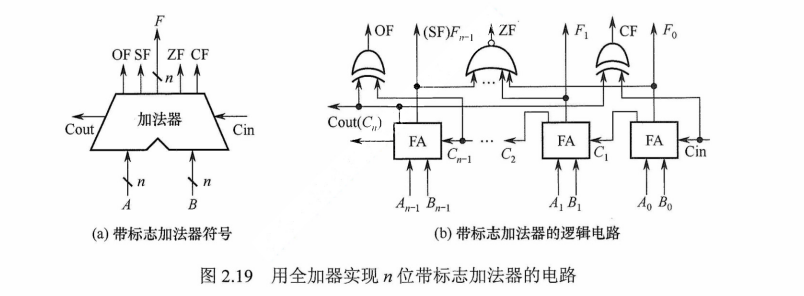

    **溢出标志**的逻辑表达式为 $OF=C_n \oplus C_{n-1}$

    **符号标志**就是**和的符号**，即$SF=F_{n-1}$

    **零标志** $ZF=1当且仅当F=0$

    **进位/借位标志** $CF=C_{out} \oplus C_{in}$，即当 $C_{in}=0$ 时，CF为进位$C_{out}$，当$C_{in}=1$时，CF为进位$C_{out}$取反。

    > 为了加快加法运算的速度，实际电路一定使用多级优先进位方式。图2.19(b)是为了说明如何从加法运算结果中获得标志信息，因而使用全加器简化了加法器电路。

  + 算术逻辑单元（**ALU**）

    核心是**带标志加法器**，同时也能执行 **与，或，非** 等逻辑运算，能实现 **左移或右移** 的移位操作。

    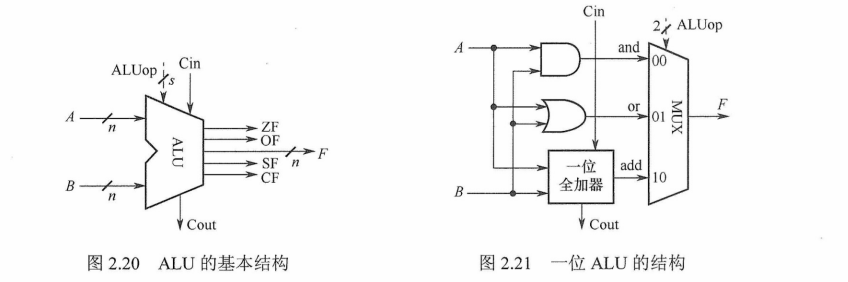

    + A，B是两个n位操作数输入端
    + $C_{in}$是进位输入端
    + ALUop是操作控制端，用来决定ALU所执行的处理功能。ALUop的**位数**决定了**操作的种类**。当位数为3时，ALU最多只有8种操作。

  + 补码加减运算部件

    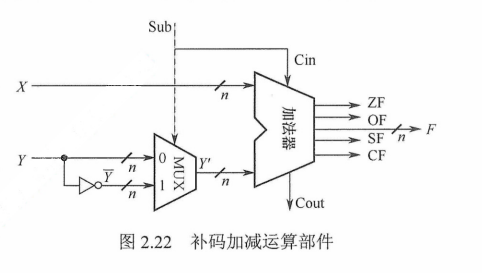

    $假设一个数的补码表示为Y，则这个数的负数的补码为\bar{Y}+1$

## 总结

+ 字 VS 字节 VS 位
  + 1位 = 1比特
  + 1字节 = 8位
  + **1字 = 2字节 （一般情况下）**
  + **1字 = 16位 （在1字 = 2字节的情况下，即常说的字长几位）**

+ 码距：同一编码中，任意两个合法编码之间不同二进制数位数的最小值 (**通过改变几位，使其变成另一个合法码字的最小改变量就是码距**)，码距**大于等于2**的数据校验码开始具有**检错**能力。**码距越大，检错、纠错能力越强**。奇偶校验码的码距等于2，可以检测出一位错误，但不能确定出错位置。海明码的码距大于2，因此不仅可以发现错误，还能指出错误的位置。

+ 常用二进制：
  $$
  2^4=16，
  2^6=64，
  2^{8}=256，
  2^{16}=65536，
  2^{32}=4294967296，
  $$

+ 校验位的计算公式，其中 **n是信息位的位数**，**k是校验位的位数**
  $$
  2^k - 1 \geq n + k
  $$

+ **奇偶校验码不能纠错**，**CRC码可以发现并纠正信息串行读/写、存储或传送中出现的一位或多位错（与多项式的选取有关）**，**海明码能发现两位错误并纠正1位错**。

+ CRC通常用于计算机网络的数据链路层，适合对大量数据的数据校验

+ 并不是每个十进制小数都可以准确的用二进制表示。例如0.3。但任意一个二进制小数都可以用十进制小数表示。

+ 关于十进制数转换为任意进制数为何采用除基取余法和乘基取整法，以及所取之数放置位置的原理，请结合R进制数的数值表示公式思考，而不应死记硬背。

+ 用移码表示浮点数的阶码有什么好处？

  + 浮点数进行加减运算时，时常要比较阶码的大小，相对于原码和补码，**移码比较大小更方便**

    > 移码是补码的符号位取反，通过取反这个动作，把负数符号位变成0，正数符号位变成1，相当于所有位都当做数值位直接进行比较即可，比原码补码用1表示负数符号位要方便很多

  + 校验移码的特殊值（**0和max**）时比较容易。阶码以移码编码时的特殊值如下。

    + 0：表示**指数为负无穷大**，相当于分数分母无穷大，整个数无穷接近0，在尾数也为0时可用来表示0；尾数不为零表示未正规化的数。
    + max：表示**指数正无穷大**，若尾数为0，则表示浮点数超出表示范围（正负无穷大）；尾数不为0，则表示浮点数运算错误。

+ 计算机中的数值数据都是二进制数吗？

  + 直接用**二进制**数表示。分为**无符号数**和**有符号数**，**有符号数**又分为**定点数**表示和**浮点数**表示
    + **无符号数**用来表示无符号整数，如**地址**
    + **定点数**用来表示**整数**
    + **浮点数**用来表示**实数**
  + 二进制编码的十进制数，一般采用**8421码**（亦称**NBCD**码），用来表示整数

+ C语言中的**int**型和**unsigned**型变量的**存储方式没有区别**，都按照**补码**的形式存储，在不溢出范围内的加减法运算也是相同的，只是**int型变量的最高位代表符号位**，而**unsigned型中的最高位表示数值位**，两者在C语言中的区别体现在输出时到底是采用**%d**还是**%u**。

+ 如何判断一个浮点数是否是规格化数？

  **为了使浮点数能尽量多地表示有效位数**，一般要求运算结果用规格化数形式表示。规格化浮点数的**尾数小数点后的第一位一定是个非零数**。

  **原码**编码的尾数，看**尾数的第一位是否为1**就行。

  **补码**表示的尾数，看**符号位和尾数最高位是否相反**。

  > IEEE 754标准的浮点数尾数用原码编码

+ 对于位数相同的定点数和浮点数，可表示的浮点数个数比定点数个数多吗？

  **不是**，可表示的数据个数取决于编码所采用的位数。编码位数一定，编码出来的数据个数就是一定的。n位编码只能表示$2^n$个数，所以对于相同位数的定点数和浮点数来说，可表示的数据个数应该一样多。（**有时可能由于一个值有两个或多个编码对应，编码个数会有少量差异**）

+ IEEE 754浮点数舍入方式

  + 就近舍入：舍入为最近可表示的数，若结果值正好落在两个可表示数的中间，则一般选择舍入结果为偶数
  + 正向舍入：朝**$+\infty$方向**舍入，即取**右边的数**
  + 负向舍入：朝**$-\infty$方向**舍入，即取**左边的数**
  + 截去：朝**0方向**舍入，即取**绝对值较小**的那个数

+ 现代计算机是否要考虑原码加减运算？

  现在计算机采用IEEE 754标准，两个浮点数加减运算时，尾数用原码的加减运算

  原码的加减运算实现方式如下两种：

  + **转换为补码**后，用**补码加减**实现，结果再**转换回原码**
  + 直接用原码进行加减运算，**符号**和**数值部分**分开进行

+ 各编码方式的数值范围（**长度为$n+1$的定点数**）

  用8421法来转二进制成十进制时，需注意 **整数部分从右边数，第n位表示为$2^{n-1}$；小数部分从左边往数，第n位表示为$2^{-n}$**
  
  | 编码方式       |     最小值编码      |   最小值    |     最大值编码      |   最大值    |            数值范围             |
  | :------------- | :-----------------: | :---------: | :-----------------: | :---------: | :-----------------------------: |
  | 无符号定点整数 | $0000 \cdots 0000$  |      0      | $1111 \cdots 1111$  | $2^{n+1}-1$ |     $0 \le x \le 2^{n+1}-1$     |
  | 无符号定点小数 | $0.000 \cdots 0000$ |      0      | $0.111 \cdots 1111$ | $1-2^{-n}$  |     $0 \le x \le 1-2^{-n}$      |
  | 原码定点整数   | $1111 \cdots 1111$  |   $1-2^n$   | $0111 \cdots 1111$  |   $2^n-1$   |     $1-2^n \le x \le 2^n-1$     |
  | 原码定点小数   | $1.111 \cdots 1111$ | $2^{1-n}-1$ | $0.111 \cdots 1111$ | $1-2^{n-1}$ | $2^{1-n}-1 \le x \le 1-2^{n-1}$ |
  | 补码定点整数   | $1000 \cdots 0000$  |   $-2^n$    | $0111 \cdots 1111$  |   $2^n-1$   |     $-2^n \le x \le 2^n-1$      |
  | 补码定点小数   | $1.000 \cdots 0001$ | $2^{1-n}-1$ | $0.111 \cdots 1111$ | $1-2^{n-1}$ | $2^{1-n}-1 \le x \le 1-2^{n-1}$ |
  | 反码定点整数   | $1000 \cdots 0000$  |   $1-2^n$   | $0111 \cdots 1111$  |   $2^n-1$   |     $1-2^n \le x \le 2^n-1$     |
  | 反码定点小数   | $1.000 \cdots 0000$ | $2^{1-n}-1$ | $0.000 \cdots 0000$ | $1-2^{n-1}$ | $2^{1-n}-1 \le x \le 1-2^{n-1}$ |
  | 移码定点整数   | $0000 \cdots 0000$  |   $-2^n$    | $1111 \cdots 1111$  |   $2^n-1$   |     $-2^n \le x \le 2^n-1$      |
  
  > 小数没有移码定义，所以上表没有移码定点小数

# 存储系统

## 存储器概述

### 存储器的分类

  + 按在计算机中的作用（层次）分类

    + 主存储器（`主存、内存`）
      + 存放**计算机运行期间所需的大量程序和数据**，CPU可以直接随机地对其进行访问，也可以和高速缓冲存储器（**Cache**）及**辅助存储器**交换数据。其特点是**容量较小、存取速度较快、每位价格较高**。

    + 辅助存储器（`辅存、外存`）
      + 主存储器的后援存储器，用来存放当前暂时不用的程序和数据，以及一些需要永久性保存的信息，它不能与CPU直接交换信息。其特点是**容量极大、存取速度较慢、单位成本低**

    + 高速缓冲存储器（`Cache`）
      + 位于主存和CPU之间，用来存放正在执行的程序段和数据，以便CPU能高速地使用它们。Cache的存取速度可与CPU的速度相匹配，但存储容量小、价格高。**现在计算机通常将它们制作在CPU中**。

  + 按存储介质分类

    + 磁表面存储器（`磁盘`、`磁带`）
    + 磁心存储器半导体存储器（`MOS型存储器`、`双级型存储器`）
    + 光存储器（`光盘`）

  + 按存取方式分类

    + 随机存储器（RAM）

      + 任何一个存储单元的内容都可以随机存取，而且存取时间与存储单元的物理位置无关。其优点是**读写方便、使用灵活**，主要用作主存或高速缓冲存储器。RAM又分为**静态RAM**和**动态RAM**

    + 只读存储器（ROM）

      + 内容只能**随机读出而不能写入**。信息一旦写入存储器就固定不变，即使断电，内容也不会丢失。因此，通常用它存放固定不变的**程序、常数和汉字字库**等。

      + 与随机存储器可共同作为主存的一部分，统一构成主存的地址域。

      + 由ROM派生出的存储器也包含可反复重写的类型，ROM和RAM的存取方式均为随机存取。

        > 注意广义上的只读存储器已可通过电擦除等方式进行写入，其“只读”的概念没有保留，但仍保留了断电内容保留、随机读取特性，但其写入速度比读取速度慢得多。

    + 串行访问存储器

      + 对存储单元进行读/写操作时，需按其物理位置的**先后顺序**寻址，包括**顺序存取**存储器（如磁带）与**直接存取**存储器（如磁盘、 光盘（**CD-ROM**））

  + 按信息的可保存性分类

    + 易失性存储器

      断电后，存储信息即消失的存储器，如**RAM**。

    + 非易失性存储器

      断电后信息仍保持的存储器，如**ROM、磁表面存储器和光存储器**。

    + 若某个存储单元所存储的信息被读出时，**原存储信息被破坏**，则称为**破坏性读出**；若读出时，被读单元原存储信息不被破坏，则称为**非破坏性读出**。具有破坏性读出性能的存储器，每次读出操作后，必须紧接一个**再生**的操作，以便恢复被破坏的信息。

### 存储器的性能指标（**存储容量、单位成本、存储速度**）

    + **存储容量 = 存储字数 * 字长**，如1M*8位。1B（Byte，字节） = 8b（bit，位）。**存储字数表示存储器的地址空间大小，字长表示一次存取操作的数据量**
    
    + 单位成本：每位价格 = 总成本 / 总容量
    
    + 存储速度：**数据传输率 = 数据的宽度 / 存储周期**
    
      + **存取时间**（$T_a$）：指从启动一次存储器操作到完成该操作所经历的时间，分为读出时间和写入时间。
      + **存取周期**（$T_m$，读写周期/访问周期）：指存储器进行一次完整的读写操作所需的全部时间，即连续两次独立访问存储器操作（**读或写操作**）之间所需的最小时间间隔。
      + **主存带宽**（$B_m$，数据传输率）：每秒从主存进出信息的最大数量，单位为**字/秒、字节/秒（B/s）或位/秒（b/s）**
    
    + **存取时间不等于存储周期，通常存储周期大于存取时间**。因为对任何一种存储器，在读写操作之后，总要有一段恢复内部状态的复原时间。对于**破坏性读出**的存储器，存取周期往往比存取时间大得多，甚至可达$T_m = 2T_a$，因此存储器中的信息读出后需要马上进行再生。
    
      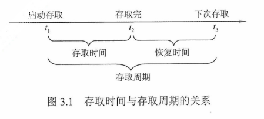

## 存储器的层次化结构

+ 为了解决**存储系统大容量、高速度、低成本**这3个相互制约的矛盾，在计算机系统中，通常采用了多级存储器结构。

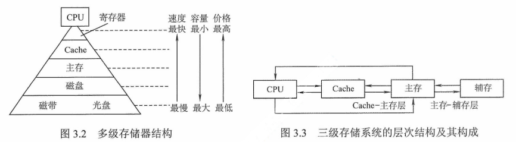

+ 实际上，存储系统层次结构主要体现在**Cache-主存**层次和**主存-辅存**层次。前者主要解决**CPU和主存速度不匹配的问题**，后者主要解决**存储系统的容量问题**。在存储体系中，**Cache、主存能与CPU**直接交换信息，**辅存则要通过主存与CPU交换信息**；**主存与CPU、Cache、辅存**都能交换信息。
+ 主要思想：**上一层的存储器作为低一层存储器的高速缓存。**在**Cache-主存**和**主存-辅存**层次中，上一层中的内容都只是下一层中的内容的副本，也即Cache（或主存）中的内容只是主存（或辅存）中的内容的一部分。
+ **主存和Cache**之间的数据调动是由**硬件**自动完成的，对所有程序员均是透明的；而**主存和辅存**之间的数据调动则是由**硬件和操作系统**共同完成的，对应用程序员是透明的。
+ 在**主存-辅存**这一层次的不断发展中，逐渐形成了**虚拟存储系统**，在这个系统中程序员编程的地址范围与虚拟存储器的地址空间相对应。对具有虚拟存储器的计算机系统而言，编程时可用的地址空间远大于主存空间。

## 半导体随机存储器

### SRAM和DRAM

+ 通常把存放一个二进制位的物理器件称为**存储元**，是存储器的**最基本的构件**。**地址码**相同的多个**存储元**构成一个存储单元。若干**存储单元**的集合构成存储体。

+ 主存储器由**DRAM（Dynamic Random Access Memory）**实现，靠处理器的那一层（**Cache**）则由**SRAM（Static Random Access Memory）**实现，它们都属于**易失性存储器**，主要电源被切断，原来保存的信息便会丢失。**DRAM**的每比特成本低于**SRAM**。

  + SRAM只要保持通电，里面存储的数据就可以恒常保持。DRAM每隔一段时间，要刷新充电一次，否则内部的数据即会消失。
  + SRAM主要用于**二级高速缓存（Level2 Cache）**。速度快，但是集成度较低，相同容量的DRAM内存可以设计为较小体积，而SRAM需要很大体积。因此SRAM很贵。

+ SRAM的工作原理

  + 静态随机存储器（SRAM）的**存储元**是用**双稳态触发器（六晶体管MOS）**来记忆信息的，因此信息被读出后，仍保持其原状态而不需要再生（**非破坏性读出**）
  + SRAM的存取速度快，但集成度低，功耗较大，所以一般用来组成高速缓冲存储器。

+ DRAM的工作原理

  + 动态随机存储器（DRAM）是利用**存储元电路中栅极电容上的电荷**来存储信息的，DRAM的基本储存元通常只使用**一个晶体管**。所以它比SRAM的密度要高很多。DRAM采用**地址复用技术**，地址线是原来的**1/2**，地址信号分行、列两次传送。

  + 相对于SRAM来说，DRAM具有容易集成、价位低、容量大和功耗低等优点，但DRAM的存取速度比SRAM慢，一般用来组成大容量主存系统。

  + DRAM电容上的电荷一般只能维持1~2ms，因此即使电源不断电，信息也会自动消失。为此，**每隔一定时间必须刷新**，通常取2ms，称为刷新周期。常用的刷新方式有3种：

    + 集中刷新

      指在一个刷新周期内，利用一段固定的时间，依次对存储器的所有行进行逐一再生，在此期间停止对存储器的读写操作，称为**死时间**，又称访存**死区**。

      **优点**：读写操作时，不受刷新工作的影响

      **缺点**：在集中刷新期间（死区）不能访问存储器

    + 分散刷新

      把对每行的刷新分散到各个工作周期中。这样，一个存储器的系统工作周期分为**两部分**：前半部分用于正常读、写或保持；后半部分用于刷新。

      **优点**：没有死区

      **缺点**：加长了系统的存取周期，降低了整机的速度

    + 异步刷新

      前两种方法的结合，**既可缩短“死时间”，又能充分利用最大刷新间隔为2ms的特点**。具体做法是：将刷新周期除以行数，得到两次刷新操作之间的时间间隔t，利用逻辑电路每隔时间t产生一次刷新请求。这样可以**避免使CPU连续等待过长的时间，而且减少了刷新次数，从根本上提高了整机的工作效率**

  + DRAM的刷新需注意以下问题：

    + 刷新对CPU是透明的，即刷新不依赖于外部的访问
    + 动态RAM的刷新单位是行，由芯片内部自行生成行地址
    + 刷新操作类似于读操作，但又有所不同
    + 刷新时不需要选片，即整个存储器中的所有芯片同时被刷新

+ 存储器芯片的内部结构

  + 存储器芯片由**存储体**、**I/O读写电路**、**地址译码**和**控制电路**等部分组成。

    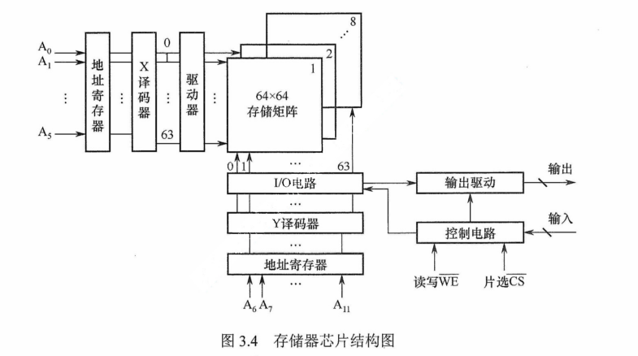

    + 存储体（存储矩阵）：存储单元的集合，由行选择线（X）和列选择线（Y）来选择所访问单元，存储体的相同行、列上的位同时被**读出**或**写入**
    + 地址译码器：用来将**地址**转换为**译码**输出线上的高电平，以便驱动相应的读写电路。
    + I/O控制电路：用以控制被选中的单元的**读出**或**写入**，具有放大信息的作用。
    + 片选控制信号：单个芯片容量太小，往往满足不了计算机对存储器容量的要求，因此需用**一定数量的芯片进行存储器的扩展**。在访问某个**字**时，必须**“选中”**该存储字所在的芯片，而其他芯片不被**“选中”**，因此需要有片选控制信号。
    + 读/写控制信号：根据CPU给出的是**读命令**还是**写命令**，控制被选中单元进行**读或写**。

+ 存储器的读、写周期

  + RAM的读周期

    + 读出时间（$t_A$）：从**给出有效地址**开始，到**读出所选中单元的内容并在外部数据总线上稳定地出现**所需的时间。

    + 地址片选信号$\rm \overline{CS}$必须保持到数据稳定输出，$t_{CO}$为片选的保持时间，在读周期中$\rm \overline{WE}$为高电平。

    + **读周期**与**读出时间**是两个不同的概念，**读周期时间**（$t_{RC}$）表示存储芯片进行两次连续读操作时所必须间隔的时间，它**总是大于等于读出时间**。

      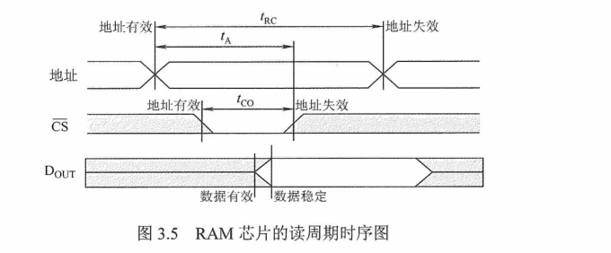

  + RAM的写周期

    + 要实现**写操作**，要求片选信号$\rm \overline{CS}$和写命令信号$\rm \overline{WE}$都必须为低电平。为使数据总线上的信息能够可靠地写入存储器，要求$\rm \overline{CS}$信号与$\rm \overline{WE}$信号相“与”的宽度至少为$t_W$。

    + 为了保证在地址变化期间，不会发生错误写入而破坏存储器的内容，$\rm \overline{WE}$信号在地址变化期间必须为**高电平**。为了保证有效数据的可靠写入，地址有效地时间至少应为**$t_{WC}=t_{AW}+t_W+t_{WR}$**。

    + 为了保证在$\rm \overline{WE}$和$\rm \overline{CS}$变为无效前能把数据可靠地写入，要求写入的数据必须在$t_{DW}$以前在数据总线上已经稳定。

      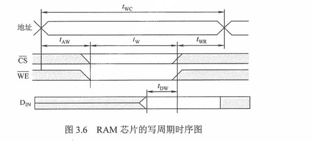

  + SRAM和DRAM的比较

    | 类型/特点      |   SRAM   |   DRAM   |
    | -------------- | :------: | :------: |
    | 存储信息       |  触发器  |   电容   |
    | 破坏性读出     |    非    |    是    |
    | 需要刷新       |   不要   |   需要   |
    | 送行列地址     |  同时送  | 分两次送 |
    | 运行速度       |    块    |    慢    |
    | 集成度         |    低    |    高    |
    | 发热量（功耗） |    大    |    小    |
    | 存储成本       |    高    |    低    |
    | 主要用途       | 高速缓存 | 主机内存 |

### 只读存储器（`ROM`）

  + 特点

    + ROM和RAM都是支持随机存取的存储器，其中SRAM和DRAM均为易失性半导体存储器。而ROM中一旦有了信息，就不能轻易改变，即使掉电也不会丢失，它在计算机系统中是只供读出的存储器。ROM器件有两个显著的优点。
      + **结构简单**，所以位密度比可读写存储器的高
      + **具有易失性**，所以可靠性高

  + 类型

    + 根据**制造工艺**不同，ROM可分为**掩模式只读存储器（MROM，Mask Read-Only Memory）**、**一次可编程只读存储器（PROM，Programmable Read-Only Memory）**、**可擦除可编程只读存储器（EPROM，Erasable Programmable Read-Only Memory）**、**闪速存储器（Flash Memory）**和**固态硬盘（Solid State Drives）**。

      + 掩模式只读存储器

        MROM的内容由半导体制造厂按用户提出的要求，在芯片的生产过程中直接写入，写入以后任何人都无法改变其内容。优点是**可靠性高，集成度高，价格便宜**；缺点是**灵活性差**

      + 一次可编程只读存储器

        PROM是可以实现一次性编程的只读存储器，允许用户利用专门的设备（编程器）写入自己的程序，一旦写入，内容就无法改变。

      + 可擦除可编程只读存储器

        EPROM不仅可以由用户利用编程器写入信息，而且可以对其内容进行多次改写。需要**修改**EPROM的内容时，先将其全部内容擦除，然后编程。EPROM又分为两种，即**紫外线擦除（UVEPROM）**和**电擦除（$\rm{E^2PROM}$）**。EPROM虽然既可读又可写，但它不能取代RAM，因为EPROM的编程次数有限，且写入时间过长。

      + 闪速存储器（Flash Memory）

        Flash Memory是在EPROM与$\rm{E^2PROM}$的基础上发展起来的，其主要特点是既可**在不加电的情况下长期保存信息**，又能**在线进行快速擦除与重写**。闪速存储器既有EPROM的价格便宜、集成度高的优点，又有$\rm{E^2PROM}$电可擦除重写的特点，且擦除重写的速度快。

      + 固态硬盘（Solid State Drives，SSD）

        基于闪存的固态硬盘是用**固态电子存储芯片阵列**制成的硬盘，由控制单元和存储单元（FLASH芯片）组成。保留了Flash Memory**长期保存信息、快速擦除与重写**的特性。对比传统硬盘也具有**读写速度快、低功耗**的特性，缺点是**价格较高**。

### 主存储器的基本组成

  + 如下为**主存储器（Main Memory，MM）**的基本组成框图，其中由一个个存储0或1的**记忆单元**（也称**存储元件**）构成的**存储矩阵**（也称**存储体**）是存储器的**核心部分**。

    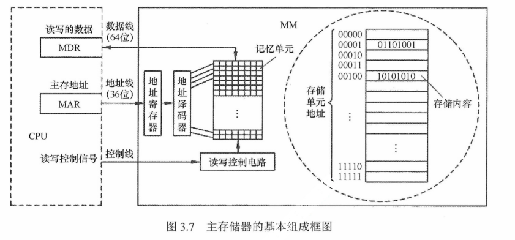

  + **记忆单元**是具有两种稳态的能表示二进制0和1的物理器件。为了存取存储体中的信息，必须对**存储单元**编号（也称**编址**）。**编址单位**是指具有相同地址的那些存储元件构成的一个单位，可以按字节编址，也可以按字编址。**现代计算机通常采用字节编址方式，此时存储体内的一个地址中有1字节**。

  + **指令执行过程**中需要访问**主存**时，CPU首先把**被访问单元的地址**送到**MAR**（Memory Address Register，地址寄存器）中，然后通过**地址线**将**主存地址**送到**主存中的地址寄存器**，以便**地址译码器**进行**译码**选中相应单元，同时CPU将**读写信号**通过**控制线**送到主存的**读写控制电路**。

  + 如果是**写操作**，那么CPU同时将要写的信息送到**MDR**（Memory Data Register，主存数据寄存器）中，在**读写控制电路**的控制下，经**数据线**将信号写入选中的单元；如果是**读操作**，那么主存读出选中单元的内容送到**数据线**，然后送到**MDR**中。

  + 如果是**读操作**，那么主存读出选中单元的内容送到**数据线**，然后送到**MDR**中。**数据线的宽度与MDR的宽度相同**，**地址线的宽度与MAR的宽度相同**。

  + 下图采用**64位**数据线，所以在按字节编址方式下，每次最多可以存取8个单元的内容。**地址线的位数决定了主存地址空间的最大可寻址范围**。例如，36位地址的最大寻址范围为$ 0\sim 2^{36}-1$，即地址从0开始编号。

    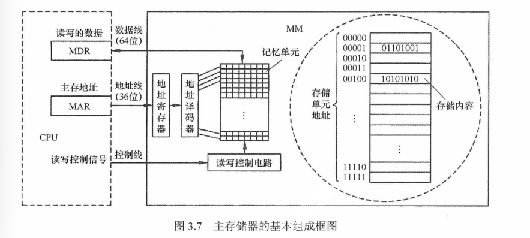

    **数据线数和地址线数共同反映存储体容量的大小**。上图芯片的容量=$2^{36}*64$位。

## 主存储器与CPU的连接

### 连接原理

+ 主存储器通过**数据总线**、**地址总线**和**控制总线**与CPU连接

+ **数据总线**的位数与**工作频率**的乘积正比于**数据传输率**

+ **地址总线**的位数决定了可寻址的最大内存空间

+ **控制总线（读/写）**指出总线周期的类型和本次输入/输出操作完成的时刻

  

### 主存容量的扩展

由于单个存储芯片的容量是有限的，它在字数或字长方面与实际存储器的要求都有差距，因此需要在**字**和**位**两方面进行扩充才能满足实际存储器的容量要求。通常采用**位扩展法**、**字扩展法**和**字位同时扩展法**来扩展主存容量。

+ `位扩展法`

  + CPU的**数据线数**与存储芯片的**数据位数**不一定相等，此时必须对存储芯片扩位（即进行**位扩展**，用多个存储器件对**字长**进行扩充，**增加存储字长**），使其**数据位数**与CPU的**数据线数**相等。

  + **位扩展**的连接方式是将多个存储芯片的**地址端**、**片选端**和**读写控制端**相应并联，**数据端**分别引出。

  + 如下所示，用8片 **8K*1位**的RAM芯片组成**8K*8位**的存储器。8片RAM芯片的地址线$A_{12} \sim A_0、\overline{CS}、\overline{WE}$都分别连在一起，每片的**数据线**依次作为**CPU数据线**的一位。

    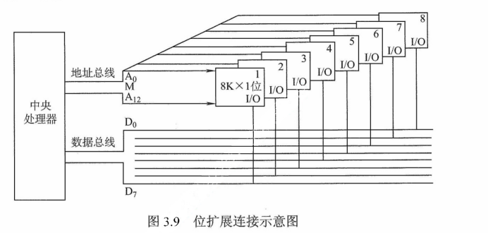

    > 仅采用位扩展时，各芯片连接**地址线**的方式**相同**，但连接**数据线**的方式**不同**，在某一个时刻选中所有的芯片，所以片选信号 $\rm \overline{CS}$要连接到所有芯片。

+ `字扩展法`

  + 增加存储器中的**字的数量**，而**位数不变**。字扩展将芯片的**地址线**、**数据线**、**读写控制线**相应并联，而由片选信号来区分各芯片的地址范围。

  + 如下所示，用4片**16K*8位**的RAM芯片组成**64K*8位**的存储器。4片RAM芯片的数据线$D_0 \sim D_7和\overline{WE}$都分别连在一起。将$A_{15}A_{14}$用作片选信号，$A_{15}A_{14}=00$时，译码器输出端0有效，选中最左边的1号芯片；$A_{15}A_{14}=01$时，译码器输出端1有效，选中2号芯片，以此类推（**在同一时间只能有一个芯片被选中**）。各芯片的地址分配如下

    + 第1片，最低地址：**00**00 0000 0000 0000；最高地址：**00**00 0000 0000 0000 0000 （**16位**）

    + 第2片，最低地址：**01**00 0000 0000 0000；最高地址：**01**00 0000 0000 0000

    + 第3片，最低地址：**10**00 0000 0000 0000；最高地址：**10**00 0000 0000 0000

    + 第4片，最低地址：**11**00 0000 0000 0000；最高地址：**11**11 1111 1111 1111

      > 仅采用**字扩展**时，各芯片连接**地址线**的方式**相同**，连接**数据线**的方式也**相同**，但在某一时刻只需选中部分芯片，所以通过**片选信号$\rm \overline{CS}$或**采用**译码器**设计连接到相应的芯片。

      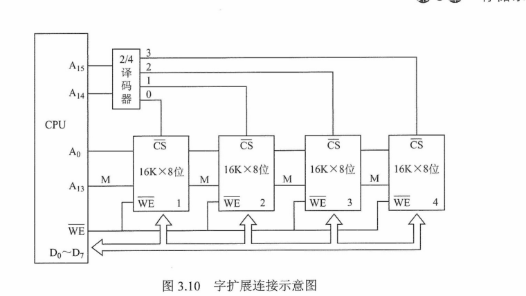

+ `字位同时扩展法`

  + 如下图所示，用8片**16K*4位**的RAM芯片组成**64K*8位**的存储器。每两片构成一组**16K*8位**的存储器（**位扩展**），4组便构成**64K*8位**的存储器（**字扩展**）。地址线$A_{15}A_{14}$经译码器得到4个片选信号，$A_{15}A_{14}=00$时，输出端0有效，选中第一组的芯片（**①和 ②**）；$A_{15}A_{14}=01$时，输出端1有效，选中第二组芯片（ **③ 和④**），以此类推。

    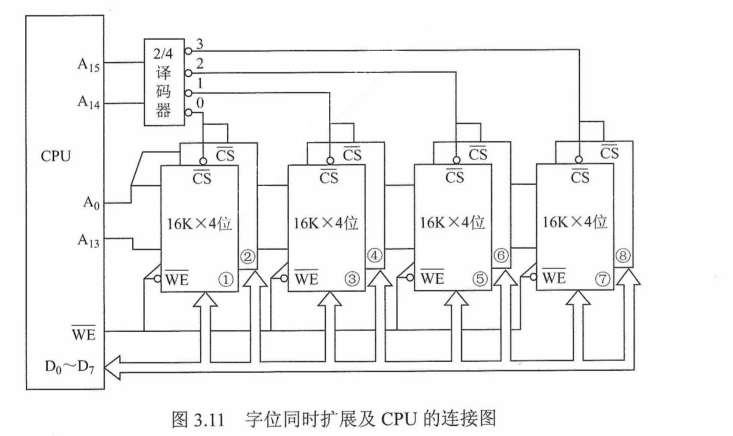

    > 采用**字位同时扩展**时，各芯片连接**地址线**的方式**相同**，但连接**数据线**的方式**不同**，而且需要通过**片选信号$\rm \overline{CS}$**或采用**译码器**设计连接到相应的芯片

### 存储芯片的地址分配和片选

+ CPU要实现对存储单元的访问，首先要选择存储芯片，即进行**片选**；然后为选中的芯片依**地址码**选择相应的存储单元，以进行数据的存取，即进行**字选**。片内的**字选**通常是由CPU送出的**N条低位地址线**完成的，地址线直接接到所有存储芯片的地址输入端（N由片内存储容量$2^N$决定）。**片选信号**的产生分为**线选法**和**译码片选法**

  + `线选法`

    + 用除**片内寻址**外的高位地址线直接（或经反相器）分别接到各个存储芯片的**片选端**，当某地址线信息为**“0”**时，就选中与之对应的存储芯片。这些片选地址线每次寻址时**只能有一位有效**，不允许同时有多位有效，这样才能保证**每次只选中一个芯片**（或芯片组）。

    + 假设4片**2K*8位**的存储芯片用线选法构成**8K*8位**存储器，各芯片的片选信号如下，其中低位地址线$A_{10} \sim A_0$作为字选线，用于片内寻址。

      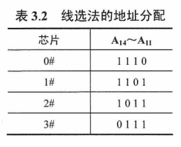

    + 优点是：**不需要地址译码器，线路简单**

    + 缺点是：**地址空间不连续，选片的地址线必须分时为低电平（否则不能工作），不能充分利用系统的存储器空间，造成地址资源的浪费**

  + `译码片选法`

    + 译码片选法用除**片内寻址**外的高位地址线通过**地址译码器**芯片产生片选信号。如用8片**8K*8位**的存储芯片组成**64K*8位**存储器（地址线16位，数据线8位），需要8个片选信号；若采用**线选法**，除去片内寻址的13位地址线，仅余高3位，不足以产生8个片选信号。因此，采用**译码片选法**，即用一片74LS38作为地址译码器，则$A_{15}A_{14}A_{13}=000$时选中第一片，$A_{15}A_{14}A_{13}=001$时选中第二片，以此类推（即3位二进制编码）

### 存储器与CPU的连接

+ **合理选择存储芯片**

  要组成一个主存系统，选择存储芯片是第一步，主要指存储芯片的类型（RAM或ROM）和数量的选择。通常选用**ROM**存放**系统程序**、**标准子程序**和**各类常数**，**RAM**则是为**用户编程**而设置的。此外，在考虑芯片数量时，要尽量使连线简单、方便

+ **地址线的连接**

  存储芯片的容量不同，地址线数也不同，而CPU的地址线数往往比存储芯片的地址线数要多。通常将**CPU地址线的低位与存储芯片的地址线**相连，以选择芯片中的某一单元（**字选**），这部分的译码是由芯片的片内逻辑完成的。而**CPU地址线的高位则在扩充存储芯片时使用**，用来选择存储芯片（**片选**），这部分译码由**外接译码器**逻辑完成。

+ **数据线的连接**

  **CPU**的数据线数与**存储芯片**的数据线数不一定相等，在相等时可直接相连；在不等时必须对**存储芯片扩位**，使其**数据位数**与CPU的**数据线数**相等。

+ **读/写命令线的连接**

  CPU读/写命令线一般可直接与存储芯片的读/写控制端相连，通常**高电平**为读，**低电平**为写。有些CPU的读/写命令线是分开的（读为$\rm \overline{RD}$，写为$\rm \overline{WE}$，均为**低电平有效**），此时CPU的**读命令线**应与存储芯片的允许读控制端相连，而CPU的**写命令线**则应与存储芯片的允许写控制端相连。

+ **片选线的连接**

  + 片选线的连接是CPU与存储芯片连接的关键。存储器由许多存储芯片叠加而成，哪一片被**选中**完全取决于该存储芯片的**片选控制端$\rm \overline{CS}$**是否能接受到来自CPU的**片选有效信号**。
  + 片选有效信号与CPU的访存控制信号**$\rm \overline{MREQ}$（低电平有效）**有关，因为只有当CPU要求访存时，才要求选中存储芯片。若CPU访问I/O，则$\rm \overline{MREQ}$为高，表示不要求存储器工作。

## 双端口RAM和多模块存储器

为了**提高CPU访问存储器的速度**，可以采用**双端口存储器**、**多模块存储器**等技术，它们同属**并行技术**，前者为**空间并行**，后者为**时间并行**。

### 双端口RAM

+ 指同一存储器有左、右两个独立的端口，分别具有两组相互独立的**地址线**、**数据线**和**读写控制线**，允许两个独立的**控制器**同时异步地访问存储单元。

+ 如下图，当两个端口的地址不相同时，在两个端口上进行读写操作一定不会发生冲突

  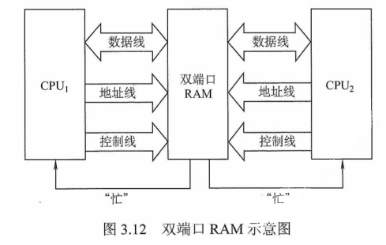

+ 两个端口**同时存取**存储器的**同一地址单元**时，会因数据冲突造成数据**存储或读取错误**。两个端口对同一主存操作有以下4种情况

  + 两个端口不同时对同一地址单元存取数据
  + 两个端口同时对同一地址单元读出数据
  + 两个端口同时对同一地址单元写入数据（**会出现写入错误**）
  + 两个端口同时对同一地址单元操作，一个写入数据，一个读出数据（**会出现读出错误**）

  解决方法：置**“忙”信号$\rm \overline{BUSY}$**为0，由判断逻辑决定**暂时关闭一个端口**（即被延时），未被关闭的端口正常访问，被关闭的端口延长一个很短的时间段后再访问。

### 多模块存储器

为**提高访存速度**，常采用**多模块存储器**，常用的有**单体多字存储器**和**多体低位交叉存储器**。

> CPU的速度比存储器的快，若同时从存储器中取出n条指令，就可充分利用CPU资源，提高运行速度。**多体交叉存储器**就是基于这种思想提出的。

+ `单体多字存储器`

  + 单体多字系统的特点是**存储器中只有一个存储体**，每个存储单元存储m个字，总线宽度也为m个字。一次并行读出m个字，**地址必须顺序排列**并**处于同一存储单元**。
  + 单体多字系统在一个存取周期内，从同一地址取出m条指令，然后将指令逐条送至CPU执行，即每隔1/m存取周期，CPU向主存取一条指令。显然，这**增大了存储器的带宽，提高了单体存储器的工作速度。**
  + 缺点是：**指令和数据在主存内必须是连续存放的，一旦遇到转移指令，或操作数不能连续存放，这种方法的效果就不明显**

+ `多体并行存储器`

  + 多体并行存储器由**多体模块**组成。每个模块都有相同的容量和存取速度，各模块都有独立的**读写控制电路**、**地址寄存器**和**数据寄存器**。它们既能并行工作，又能交叉工作。

  + 多体并存存储器分为**高位交叉编址（顺序方式）**和**低位交叉编址（交叉方式）**两种

    + `高位交叉编址`：**高位地址表示体号，低位地址为体内地址**。如下图，存储器共有4个模块$M_0 \sim M_3$，每个模块有n个单元，各模块的地址范围如下图。

      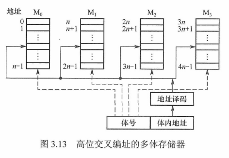

      高位交叉编址方式下，总是把**低位的体内地址**送到由**高位体号确定的模块**内进行译码。访问一个连续主存块时，总是先在一个模块内访问，等到该模块访问完才转到下一个模块访问，**CPU总是按顺序访问存储模块，存储模块不能被并行访问，因而不能提高存储器的吞吐率**。

      > 模块内的地址是连续的，存取方式仍是**串行存取**，因此这种存储器仍是顺序存储器。

    + `低位交叉编址`：**低位地址为体号，高位地址为体内地址**。如下图，每个模块按**“模m”**交叉编址，**模块号=单元地址%m**，假定有m个模块，每个模块有k个单元，则0，m，···，(k-1)m单元位于$M_0$；第1，m+1，···，(k-1)m+1单元位于$M_1$；以此类推。

      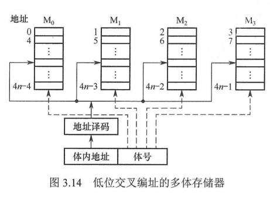

      低位交叉编址方式下，总是把**高位的体内地址**送到由**低位体号确定的模块**内进行译码。程序连续存放在相邻模块中，因此称采用此编址方式的存储器为交叉存储器。采用低位交叉编址后，可在不改变每个模块存取周期的前提下，采用**流水线的方式并行存取**，提高存储器的带宽。

      设**模块字长**等于**数据总线宽度**，模块**存取一个字的存取周期为T**，**总线传送周期为r**，为实现流水线方式存取，存储器**交叉模块数**应大于等于
      $$
      m=T/r
      $$
      式中，**m称为交叉存取度**。

      每经过r时间延迟后，启动下一个模块，交叉存储器要求其模块数必须大于等于m，以保证启动某模块后经过**m*r**的时间后再次启动该模块时，其**上次的存取操作已经完成**（即**流水线不间断**）。这样，**连续存取m个字所需的时间为**
      $$
      t_1=T+(m-1)r
      $$
      而顺序方式连续读取m个字所需时间为**$t_2=mT$**。可见低位交叉存储器的带宽大大提高。模块数为4的流水线方式存取示意图如下

      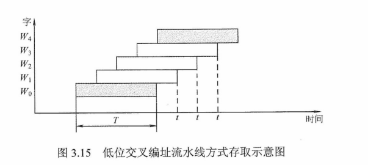

      

## 高速缓冲存储器

由于程序的转移概率不会很低，数据分布的离散性较大，所以单纯依靠**并行主存系统**提高主存系统的频宽是有限的。这就必须从系统结构上进行改进，即采用**存储体系**。通常将存储系统分为**“Cache-主存”层次**和**“主存-辅存”层次**。

### 程序访问的局部性原理

+ `时间局部性`
  + 在最近的未来要用到的信息，很可能是现在正在使用的信息，因为程序中存在循环。
+ `空间局部性`
  + 在最近的未来要用到的信息，很可能与现在正在使用的信息在存储空间上是邻近的，因为指令通常是顺序存放的、顺序执行的，数据一般也是以向量、数组等形式簇聚地存储在一起的。
+ **高速缓冲技术**就是利用**程序访问的局部性原理**，把程序中**正在使用的部分**存放在一个高速的、容量较小的Cache中，使CPU的访存操作**大多数针对Cache进行**，从而大大提高程序的执行速度。

### Cache的基本工作原理

+ Cache位于存储器层次结构的顶层，通常由SRAM构成，其基本结构如下

  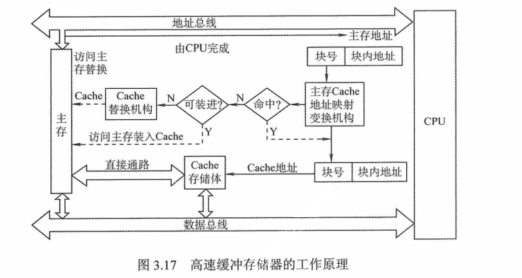

+ 为便于**Cache和主存之间交换信息**，Cache和主存都被划分为相等的块，**Cache块**又称为**Cache行**，每块由若干字节组成，块的长度称为块长（Cache行长）。由于Cache的容量远小于主存的容量，所以Cache中的块数要远少于主存中的块数，它仅保存主存中最活跃的若干块的副本。因此Cache按照某种策略，预测CPU在未来一段时间内欲访存的数据，将其装入Cache。

+ 当CPU发出**读**请求时，若访存地址在Cache中**命中**，就将此地址**转换**成Cache的地址，直接对Cache进行**读**操作，**与主存无关**；若Cache**不命中**，则仍需**访问主存**，并把此**字**所在的**块**一次性地从**主存**调入**Cache**。若此时**Cache已满**，则需根据某种**替换算法**，用这个**块**替换**Cache**中**原来的某块**信息。

  > **CPU**与**Cache**之间的数据交换以**字**为单位，而**Cache**与**主存**之间的数据交换则以**Cache块**为单位。

+ 当CPU发出**写**请求时，若Cache**命中**，有可能会遇到**Cache**与**主存**中的**内容不一致**的问题。所以若Cache**命中**，需要按照一定的**写策略**处理，常见的有**全写法**和**写回法**

+ **CPU欲访问的信息已在Cache中的比率**称为**Cache的命中率**。设一个程序执行期间，**Cache的总命中次数为$N_c$**，**访问主存的总次数为$N_m$**，则命中率H为
  $$
  H=N_c/(N_c+N_m)
  $$
  可见，为**提高访问效率**，命中率H越接近1越好。设**$t_c$为命中时的Cache访问时间**，**$t_m$为未命中时的访问时间**，**1-H表示未命中率**，则**Cache-主存系统的平均访问时间$T_a$**为
  $$
  T_a=Ht_c+(1-H)t_m
  $$

### Cache和主存的映射方式

+ Cache行中的信息是**主存**中某个块的副本，**地址映射**是指把**主存地址空间**映射到**Cache地址空间**，即把存放在主存中的信息按照某种规则装入**Cache**。

+ 由于**Cache行数**比**主存块数**少得多，因此主存中只有一部分块的信息可放在Cache中，因此在Cache中要为每**块**加一个标记，指明它是**主存**中哪一块的副本。该标记的内容相当于主存中块的编号。

+ 为了说明**Cache行**中的信息是否**有效**，每个Cache行需要一个**有效位**。

+ 地址映射的方法共**3**种

  + `直接映射`

    + 主存中的每一块只能装入Cache中的唯一位置。若这个位置已有内容，则产生**块冲突**，原来的块将无条件地被替换出去（**无须使用替换算法**）。直接映射实现简单，但不够灵活，即使Cache的其他许多地址空着也不能占用，这使得直接映射的**块冲突概率**最高，**空间利用率**最低。

    + 直接映射的关系可定义为
      $$
      j=i \mod 2^c
      $$

      + **j**是Cache的块号，即Cache行号
      + **i**是主存的块号
      + **$2^c$**是Cache中的总块数
      + 主存块号的**低c位**正好是它要装入的Cache行号。给每个Cache行设置一个长为**t=m-c**的标记（tag），当主存某块调入Cache后，就将其块号的**高t位**设置在对应Cache行的标记中

## 虚拟存储器

## 总结

+ **相联存储器**：基本原理是把存储单元所存内容的某一部分作为检索项（即**关键字项**）去检索该存储器，并将存储器中与该检索项符合的存储单元内容进行读出或写入。所以它是**按内容或地址**进行寻址的，价格较为昂贵，一般用来制作**TLB（Translation Lookaside Buffer，CPU的一种缓存，转译后备缓冲器/页表缓存/转址旁路缓存），相联Cache**等。

+ 易失性存储器和刷新的区别

  易失性存储器是指断电后数据丢失，SRAM和DRAM都满足断电内容消失，但需要刷新的只有DRAM，而SRAM不需要刷新。
  
+ $\rm \overline{CS}$是**片选信号**，$\rm \overline{WE}$是**读写控制信号**。

  + CPU要实现对存储单元的访问，首先要选择**存储芯片**，即进行**片选**；然后再从选中的芯片中依**地址码**选择出相应的存储单元，以进行数据的存取，这称为**字选**。片内的字段是由CPU送出的N条低位**地址线**完成的，地址线直接接到所有存储芯片的地址输入端，而存储芯片的**片选信号**则大多是通过**高位地址译码**后产生的。
  + 读写控制线可以由一根WE控制，**低电平写入，高电平读出**，也可以由OE和WE两线控制，**OE低电平读出，WE低电平写入**


// TODO

# 指令系统

## 指令格式

## 指令的寻址方式

## CISC和RISC的基本概念

## 总结

# 中央处理器

## CPU的功能和基本结构

## 指令执行过程

## 数据通路的功能和基本结构

## 控制器的功能和工作原理

## 指令流水线

## 总结

# 总线

## 总线概述

## 总线仲裁

## 总线操作和定时

## 总线标准

## 总结

# 输入/输出系统

## I/O系统基本概念

## 外部设备

## I/O接口

## I/O方式

## 总结


