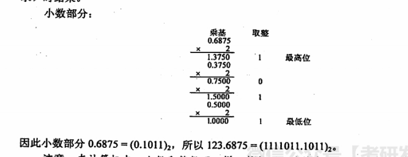

+ 计算机系统概述
	+ 计算机发展历程
	+ 计算机系统层次结构
		+ 计算机硬件的基本组成
			+ 输入设备
			+ 输出设备
			+ 存储器
				+ MAR (Memory Address Register) 地址寄存器 - **存放访存地址，经过地址译码后找到所选的存储单元，用于寻址**
				+ MDR (Memory Data Register) 数据寄存器
			+ 运算器
				+ ALU (Arithmetic And Logical Unit) 算术逻辑单元 - **运算器的核心**
				+ ACC (Accumulator) 累加器
				+ MQ (Multiple-Quotient Register) 乘商寄存器
				+ X 操作数寄存器
				+ IX 变址寄存器
				+ BR 基址寄存器
				+ PSW 程序状态寄存器/标志寄存器
			+ 控制器
				+ PC (Program Counter) 程序计数器 - **存放当前欲执行指令的地址，可以自动加1以形成下一条指令的地址**
				+ IR (Instruction Register) 指令寄存器 - **存放当前的指令，数据来自主存的MDR**
				+ CU (Control unit) 控制单元

	+ 计算机的性能指标
		+ 主要性能指标
			+ 运算速度
				+ 主频和CPU时钟周期
					+ CPU时钟周期。即**主频的倒数**，是**CPU中最小的时间单位**，执行指令的每个动作至少需要1个时钟周期
					+ CPU时钟周期 = 1 / CPU主频
					+ 主频通常以**Hz**为单位，1Hz表示每秒1次。
				+ CPI (Clock cycle Per Instruction)
					+ 执行一条指令所需的时钟周期数
					+ 不同指令的时钟周期数可能不同，对一个程序或机器来说，其CPI指该程序或该机器指令集中所有的指令执行所需的平均时钟周期数，此时**CPI是一个平均值**
				+ CPU执行时间
					+ `CPU执行时间 = CPU时钟周期数 * CPU时钟周期 = CPU时钟周期数 / 主频 = (指令条数 * CPI) / 主频 = (指令条数 * CPI) * CPU时钟周期`
				+ MIPS (Million Instructions Per Second)
					+ 每秒执行多少百万条指令
					+ MIPS = 指令条数 / (执行时间 * 10^6) = 主频 / (CPI * 10^6)
				+ MFLOPS (Mega Floating-point Operations Per Second)
				+ GFLOPS (Giga Floating-point Operations Per Second)
				+ TFLOPS (Tera Floating-point Operations Per Second)
			+ 主存容量
				+ 以`字节`衡量，也可用`字数 * 字长`，如`512K * 16`来表示
				+ MAR的位数，表示 **存储单元的个数**，MDR的位数，表示 **可寻址范围的最大值**
				+ MAR为16位，表示 2^16 = 65536，即有65536个存储单元（可称为64K内存），若MDR为32位，表示存储容量为 **64K * 32位**
	+ 总结
		+ MDR, MAR虽然是存储器的一部分，但在现代CPU中，却是存在于CPU中，与高速缓存(Cache)一样
		+ 在描述存储容量、文件大小等时，K、M、G、T通常用2的幂次表示，如1Kb = 2^10b；在描述速率、频率等时，k、M、G、T通常用10的幂次表示，如 1kb/s = 10^3 b/s。通常前者用大写的K，后者用小写的k，但其他前缀均为大写，表示的含义取决于所用的场景。
		+ 翻译程序：把高级语言源程序翻译成机器语言程序（目标代码）的软件。有两种
			+ 编译程序：将高级语言源程序一次全部翻译成目标程序，每次执行程序时，只需执行目标程序。
			+ 解释型程序：将源程序的一条语句翻译成对应的机器目标代码，并立即执行，然后翻译下一条源程序语句并执行，直至所有源程序语句全部被翻译并执行完。（不会生成目标程序）
		+ 汇编程序也是一种语言翻译程序，把汇编语言源程序翻译为机器语言程序。
		+ 编译程序与汇编程序的区别：若源程序是 **C，C++，Java** 等高级语言，而目标语言是 **汇编语言，或机器语言** 之类的低级语言，则称这样的翻译程序为编译程序。若源语言是 **汇编语言**，而目标语言是 **机器语言**，则这样的翻译程序称为 **汇编程序**。
		+ 在计算机领域，站在某类用户的角度，若感觉不到某个事物或属性的存在，即“看”不到某个事物或属性，则称为“对该用户透明”。与日常生活中的“透明”概念正好相反。
		+ 在CPU中，IR，MAR和MDR对各类程序员都是透明的
		+ 机器字长 VS 指令字长 VS 存储字长
			+ 机器字长：计算机能直接处理的二进制数据的位数，机器字长一般等于内部寄存器的大小，它决定了计算机的运算精度。
			+ 指令字长：一个指令字中包含的二进制代码的位数。
			+ 存储字长：一个存储单元存储的二进制代码的长度。
			+ 指令字长一般取存储字长的整数倍，若指令字长等于存储字长的2倍，则需要2次访存来取出一条指令。

+ 数据的表示和运算
	+ 数制与编码
		+ 真值：带“+”或“-”符号的数称为真值
		+ 机器数：把符号“数字化”的数称为机器数
		+ 0 ~ 9 的ASCII码值为 **48 （011 0000） ~ 57 （011 1001）**，即去掉高3位，只保留低4位，正好是二进制形式的 0~9
		+ BCD (Binary-Coded Decimal) 二进制编码的10进制数
		+ 7E5H，H代表16进制
		+ 进制转换
			+ 二进制转八进制、十六进制
				+ 以小数点为界，将一串二进制数分为3位一组或4位一组。整数部分，从左边开始补0，小数部分，从右边开始补0。
			+ 八进制、十六进制转二进制
				+ 只需将每位改为3位或4位二进制数即可
			+ 任意进制转十进制
				+ 保底法：如果存在小数部分，则根据二进制、八进制、十六进制，乘以对应的基数，每乘一次，就左移一位，直到全部是整数。这时候就通过位置法计算出十进制，然后再除以之前乘的数
				+ 将任意进制数的各位数码与它们的权值相乘，再把乘积相加，就得到了一个十进制数。这种方法称为按权展开相加法。
					+ (11011.1) = 1*2^4 + 1*2^3 + 0*2^2 + 1*2^1 + 1*2^0 + 1*2^-1 = 27.5
			+ 十进制转任意进制
				+ 整数部分用除基取余法，小数部分用乘基取整法，最后将整数部分和小数部分的转换结果拼接起来
				+ 除基取余法：**整数部分除基取余，最先取得的余数为数的最低位，最后取得的余数为数的最高位（即除基取余，先余为低，后余为高），`商为0` 时结束。
				+ 乘基取整法：**小数部分(乘基后如果出现整数部分，则整数部分不参与下一次乘基计算)乘基取整，最先取得的整数为数的最高位，最后取得的整数为数的最低位（即乘基取整，先整为高，后整为低），乘积为1.0（或满足精度要求）时结束。
				+ 
		+ 校验码
			+ 奇偶校验码
				+ 实现方法：由若干位有效信息，再加上一个二进制位（校验位）组成校验码。校验码的取值（0或1）将使整个校验码中“1”的个数为奇数或偶数。
				+ 奇校验码：整个校验码（有效信息位和校验位）中“1”的个数为奇数
				+ 偶校验码：整个校验码（有效信息位和校验位）中“1”的个数为偶数
			+ 海明校验码 (Hamming Code，也称 **汉明码**，多重奇偶校验码，具有纠错能力)
				+ 实现方法：在有效信息位中加入几个校验位形成海明码，并把海明码的每个二进制位分配到几个奇偶校验组中。当某一位出错后，就会引起有关的几个校验位的值发生变化，这不但可以发现错位，还能指出错位的位置，为自动纠错提供依据。
				+ ** L(编码最小码距) - 1 = D(检测错误的位数) + C(纠正错误的位数) 且 D >= C **
				+ 编码最小码距L越大，其检测错误的位数D越大，纠正错误的位数C也越大，且纠错能力恒小于等于检错能力。
	+ 定点数的表示与运算
	+ 浮点数的表示与运算
	+ 算术逻辑单元（ALU）
	+ 总结
		+ 码距：同一编码中，任意两个合法编码之间不同二进制数位数的最小值 (通过改变几位，使其变成另一个合法码字的最小改变量就是码距)，码距大于等于2的数据校验码开始具有检错能力。码距越大，检错、纠错能力越强。奇偶校验码的码距等于2，可以检测出一位错误，但不能确定出错位置。海明码的码距大于2，因此不仅可以发现错误，还能指出错误的位置。
		+ 常用二进制：2^4 = 16, 2^8 = 256, 2^16 = 65,536, 2^32 = 4,294,967,296
		+ 校验位的计算公式， 2^k - 1>= n + k，其中n是信息位的位数，k是校验位的位数
		+ 奇偶校验码不能纠错，CRC码可以发现并纠正信息串行读/写、存储或传送中出现的一位或多位错（与多项式的选取有关），海明码能发现两位错误并纠正1位错。
		+ CRC通常用于计算机网络的数据链路层，适合对大量数据的数据校验
		+ 并不是每个十进制小数都可以准确的用二进制表示。例如0.3。但任意一个二进制小数都可以用十进制小数表示。
		+ 关于十进制数转换为任意进制数为何采用除基取余法和乘基取整法，以及所取之数放置位置的原理，请结合R进制数的数值表示公式思考，而不应死记硬背。
+ 存储系统
	+ 存储器概述
	+ 存储器的层次化结构
	+ 半导体随机存储器
	+ 主存储器与CPU的连接
	+ 双端口RAM和多模块存储器
	+ 高速缓冲存储器
	+ 虚拟存储器
	+ 总结
+ 指令系统
	+ 指令格式
	+ 指令的寻址方式
	+ CISC和RISC的基本概念
	+ 总结
+ 中央处理器
	+ CPU的功能和基本结构
	+ 指令执行过程
	+ 数据通路的功能和基本结构
	+ 控制器的功能和工作原理
	+ 指令流水线
	+ 总结
+ 总线
	+ 总线概述
	+ 总线仲裁
	+ 总线操作和定时
	+ 总线标准
	+ 总结
+ 输入/输出系统
	+ I/O系统基本概念
	+ 外部设备
	+ I/O接口
	+ I/O方式
	+ 总结

​	

