[TOC]

# 计算机网络体系结构

## 计算机网络概述

## 计算机网络体系结构与参考模型

# 物理层
## 通信基础
## 传输介质
## 物理层设备

# 数据链路层

## 数据链路层的功能

+ 主要作用是**加强物理层传输原始比特流**的功能，将物理层提供的**可能出错的物理连接改造为逻辑上无差错的数据链路**，使之对网络层表现为一条无差错的链路。
	
+ 为网络层提供的服务
	**将源机器中来自网络层的数据传输到目标机器的网络层。**
	+ **无确认的无连接服务**
	
	源机器**发送**数据帧时，不需先建立**链路连接**，目的机器**收到**数据帧时，**不需发回确认**。对丢失的帧，数据链路层**不负责重发**而**交给上层处理**。适用于**实时通信**或**误码率较低**的通信信道，如**以太网**。
	
	+ **有确认的无连接服务**
	
	源机器**发送**数据帧时，不需先建立**链路连接**，但目的机器收到数据帧时，**必须发回确认**。源机器在所规定的时间内未收到确定信号时，就**重传丢失的帧**，以提高传输的可靠性。该服务适用于**误码率较高**的通信信道，如**无线通信**。
	
	+ **有确认的面向连接服务**
	
	帧传输过程分为三个阶段：**建立数据链路**、**传输帧**、**释放数据链路**。目的机器对收到的每一帧都要**给出确认**，源机器**收到确认后**才能发送下一帧，因而该服务的可靠性最高。该服务适用于通信要求（可靠性、实时性）较高的场合。
	
> 有连接就一定要有确认，即不存在无确认的面向连接的服务

+ 链路管理
	
	数据链路层连接的 **建立、维持和释放过程** 称为 **链路管理**，主要用于 **面向连接** 的服务。链路两端的结点要进行通信，必须首先确认对方已处于 **就绪状态**，并交换一些必要的信息以 **对帧序号** 初始化，然后才能 **建立连接**，在传输过程中则要能 **维持连接**，而在传输完毕后要 **释放该连接**。在多个站点共享同一物理信道的情况下（**如在局域网**）如何在要求通信的站点间**分配和管理信道** 也属于数据链路层管理。
	
	+ **帧定界**、**帧同步**与**透明传输**
	
	+ 两台主机之间传输信息时，必须将**网络层**的 **分组封装成帧**，以 **帧** 的格式进行传送。将一段数据的前后分别添加 **首部** 和 **尾部**，就构成了 **帧**。（$帧长 = 数据部分的长度 + 首部长度 + 尾部长度$）。**首部** 和 **尾部** 含有很多**控制信息**，一个重要作用是 **确定帧的界限，即帧定界**。
		+ **帧同步** 指的是 **接收方应能从接受到的二进制比特流中区分出帧的起始与终止**。
		+ 为了**提高帧的传输速率，应当使帧的数据部分的长度尽可能地大于首部和尾部的长度，但每种数据链路层协议都规定了帧的数据部分的长度上限**，即 **最大传输单元（MTU，Maximum Transmission Unit）**
		+ 如果在数据中恰好出现 **与帧定界符相同的比特组合** （会误以为“传输结束”而丢弃后面的数据），那么就要采取有效的措施解决这个问题，即 **透明传输**。更确切地说，**透明传输就是不管所传数据是什么样的比特组合，都应当能在链路上传送。**
	
+ 流量控制
	
	+ **限制发送方的数据流量**，使其**发送速率**不超过接收方的**接收能力**
	+ 不是数据链路层特有的功能，许多高层协议中也提供此功能，只不过控制对象不同而已。
	+ 对于 **数据链路层**，控制的是 **相邻两结点之间的数据链路上的流量**
	+ 对于 **运输层** 来说，控制的是从 **源端到目的端之间的流量**
	
+ 差错控制
	用以**使发送方确定接收方是否正确收到由其发送的数据**的方法
	
	+ 位错
		+ 帧中某些位出现了差错。通常采用 **循环冗余校验（CRC）方式**发现位错，通过自动重传请求（**Automatic Repeat Request，ARQ**）方式来重传出错的帧。
		+ ARQ法：让发送方将**要发送的数据帧**附加一定的**CRC冗余检错码**一并发送，接收方则根据**检错码**对数据帧进行**错误检测**，若发现错误则**丢弃**，发送方**超时重传**该数据帧。
		+ ARQ法只需返回很少的**控制信息**就可有效地确认所发送数据帧是否**被正确接收**。
	+ 帧错
		+ 指帧的**丢失**、**重复**、或**失序**等错误
		+ 在**数据链路层**引入**定时器**和**编号机制**，能保证**每一帧最终都能有且仅有一次正确地交付给目的结点**
	
## 组帧

把比特组合成 **帧**为单位传输，是为了在出错时**只重发出错的帧**，而不必重发全部数据，从而提高效率。 **为了使接收方能正确地接收并检查所传输的帧，发送方必须依据一定的规则把网络层递交的分组封装成帧（称为组帧）**。**组帧** 主要解决 **帧定界、帧同步、透明传输** 等问题。
	
> 组帧时，要同时加首部和尾部，这是因为在网络中信息是以帧为最小单位进行传输的，所以接收端要正确地接收帧，必须要清楚该帧在一串比特流中从哪里开始到哪里结束（因为接收端收到的是一串比特流，没有首部和尾部是不能正确区分帧的）。而分组（即IP数据报）仅是包含在帧中的数据部分，所以不需要加尾部来界定

+ 字符计数法
	

字符计数法，在 **帧头部** 使用一个计数字段来 **标明帧内字符数**。目的结点的数据链路层收到字节计数值时，就知道 **后面跟随的字节数**，从而可以确定 **帧结束的位置**。（计数字段提供的字节数包含自身所占用的一个字节）。
	

	
> 最大的问题是，如果计数字段出错，即失去帧边界划分的依据，那么接收方就无法判断帧的结束位和下一帧的开始位，收发双方失去同步

+ 字符填充的首尾定界符法
	

使用特定字符来定界 **一帧的开始与结束**。如图，**控制字符 SOH** 放在 **帧的最前面**，表示 **帧的首部开始**。**控制字符EOT** 表示 **帧的结束**。
	
> 为了使信息位中出现的特殊字符不被误判为帧的首尾定界符，可在特殊字符前面填充一个转义字符(ESC)来加以区分。以实现 数据的透明传输。接收方收到转义字符后，就知道其后面紧跟的是数据信息，而不是控制信息。

	
+ 零比特填充的首尾标志法
	

允许数据帧包含任意个数的比特，也允许每个字符的编码包含任意个数的比特。使用一个特定的 **比特模式**，即 **01111110** 来标志一帧的开始和结束。
	
为了不使信息位中出现的比特流 **01111110** 被误判为帧的首尾标志，**发送方**的数据链路层在信息位中遇到**5个连续的“1”**时，将自动在其后面插入一个**“0”**；而**接收方**每收到**5个连续的“1”时**，自动删除后面紧跟的**“0”**，以恢复原信息。

	
> 零比特填充法很容易由硬件来实现，性能优于字符填充法

+ 违规编码法
	

在物理层进行比特编码时，通常采用 **违规编码法**。例如，曼侧斯特编码方法将 **数据比特“1”编码成“高-低”电平对**，将 **数据比特“0”编码成“低-高”电平对**，而 **“高-高”电平对** 和 **“低-低”电平对**在数据比特中是 **违规的（即没有采用）**。可以借用这些违规编码序列来 **定界帧的起始和终止**。

> 局域网 IEEE 802标准就采用了这种方法

违规编码法不需要采用任何填充技术，便能实现数据传输的 **透明性**，但它只适用于 **采用冗余编码** 的特殊编码环境。
	
由于 **字节计数法** 中计数字段的脆弱性和**字符填充法** 实现上的复杂性与不兼容性，目前较常用的组帧方法是 **比特填充法** 和 **违规编码法**。
	
## 差错控制

+ 数据的传输差错是由 **噪声** 引起的。通信信道的噪声可以分为两类：**热噪声** 和 **冲击噪声**。**热噪声** 一般是信道固有的，引起的差错是 **随机差错**，可以通过**提高信噪比**来降低。 **冲击噪声** 一般由外界电磁干扰引起的，引起的差错就是 **突发差错**，无法通过 **提高信噪比** 来避免。
	
+ 比特差错：实际通信链路都不是理想的，比特在传输过程中可能会产生差错，**1可能会变成0,0也可能会变成1**。
	
> 比特差错是传输差错的一种，本节只讨论比特差错

+ 利用编码技术进行差错控制
	
	+ 自动重传请求（**ARQ，Automatic Repeat Request**）
	
	接收端**检测出差错**时，**设法通知发送端重发**，直到接收到**正确的码字为止**
	
	+ 前向纠错（**FEC，Forward Error Correction**）
	
	接收端不但能**发现差错**，而且能 **确定比特串的错误位置**，从而 **加以纠正**。
	
	> 因此，差错控制又可分为 `检错编码` 和 `纠错编码`
	
### 检错编码

采用**冗余编码技术**。核心思想是：**有效数据（信息位）被发送前，先按某种关系附加一定的冗余位，构成一个符合某一规则的码字后再发送。当要发送的有效数据变化时，相应的冗余位也随之变化，使得码字遵从不变的规则。接收端根据收到的码字是否仍符合原规则来判断是否出错。**
	
常见的检错编码有 **奇偶校验码** 和 **循环冗余码**
	
+ 奇偶校验码
	

**最基本的检错码**，分为**奇校验码** 和 **偶校验码**。由 **n-1位信息元和1位校验元组成**
	
> 只能检测奇数位的出错情况，但并不知道哪些位出错，也不能发现偶数位的出错情况。意思是，当有1个，3个，5个等奇数个位置上的码出错，这样能被检测到。这是因为，`奇数+奇数=偶数，偶数+奇数=奇数`，即奇数是扭转奇偶类型的数。

+ 循环冗余码（**Cyclic Redundancy Code**）（**多项式码**）
	

	
任何一个由二进制数位串组成的代码都可以与一个只含有0和1两个系数的多项式建立一一对应关系。一个k位帧可以视为从**$X^{k-1}到X^0$**的k次多项式的系数序列，这个多项式的阶数为**k-1**，**高位是$X^{k-1}$项的系数**，**下一位是$X^{k-2}$的系数**，以此类推。例如，1110011有7位，表示成多项式是$X^6+X^5+X^4+X+1$，而多项式$X^5+X^4+X^2+X$对应的位串是110110。
	
给定一个**m bit**的帧或报文，发送器生成一个**r bit**的序列，称为 **帧检验序列（FCS）**。这样形成的帧将由 **m+r** 比特组成。发送方和接收方事先商定一个多项式**G(x)【最高位和最低位必须是1】**，使这个带检验码的帧刚好能被预先确定的多项式**G(x)**整除。**接收方用相同的多项式去除收到的帧，如果无余数，那么认为无差错**。
	
通过 **循环冗余码（CRC）**的检错技术，数据链路层做到了对帧的 **无差错接收**。也就是说，凡是接收端数据链路层**接收的帧**，我们都认为这些帧在传输过程中**没有产生差错**；而接收端丢弃的帧虽然也收到了，但最终因为**有差错而被丢弃**，即**未被接受**。
	
> 循环冗余码（CRC）是具有纠错功能的，只是数据链路层仅使用了它的检错功能，检测到帧出错则直接丢弃

+ CRC计算步骤
	+ 展开多项式得到CRC除数 （**为避免出错，从右往左写**）
	+ 原数据末端加0 （**多项式最高是几次就加几个0**）
	+ 从左往右，按位异或 （**所得结果位数如果不够长，前面的0不要漏了**）
	+ **CRC校验和的长度**，等于**除数的长度-1**
	
### 纠错编码

在数据通信的过程中，解决差错问题的一种方法是 **在每个要发送的数据块上附加足够的冗余信息，使接收方能够推导出发送方实际送出的应该是什么样的比特串**。最常见的纠错编码是 **海明码**，其实现原理是 **在有效信息位中加入几个校验位形成海明码，并把海明码的每个二进制位分配到几个奇偶校验组中。当某一位出错后，就会引起有关的几个校验位的值发生变化，这不但可以发现错位，而且能指出错位的位置，为自动纠错提供依据。**
	
+ 海明码的编码原理和过程（**举例以数据码1010**）
	
	+ 确定海明码的位数
	
		设 **n为有效信息的位数**，**k为校验位的位数**，则信息位n和校验位k应满足
	        $$
	        n+k \le 2^k-1
	        $$
		若要**检测两位错**，则需再增加1位校验位，即**$k+1$**位。
	
		海明码位数为 $n+k=7 \le 2^3-1$成立，则n，k有效。设信息位为$D_4D_3D_2D_1 (1010)$，共4位，校验位为 $P_3P_2P_1$，共3位。对应的海明码为 $H_7H_6H_5H_4H_3H_2H_1$。
	
	+ 确定校验位的分布
	
		规定 **校验位$P_i$在海明位号为$2^{i-1}$的位置上，其余各位为信息位**，因此有
	
		$P_1$的海明位号为$2^{i-1}=2^0=1$，即$H_1为P_1$
	
		$P_2$的海明位号为$2^{i-1}=2^1=2$，即$H_2为P_2$
	
		$P_3$的海明位号为$2^{i-1}=2^2=4$，即$H_4为P_3$
	
		将信息位按原来的顺序插入，则海明码各位的分布如下
	
		$H_7$	$H_6$	$H_5$	$H_4$	$H_3$	$H_2$	$H_1$	
	
		$D_4$	$D_3$	$D_2$	$P_3$	 $D_1$	$P_2$	$P_1$	
	
	+ 分组以形成校验关系
	
		每个数据位用 **多个校验位** 进行校验，但要满足条件： **被校验数据位的海明位号等于校验该数据位的各校验位海明位号之和**（即$H_i$）。 另外，**校验位不需要再被校验**。分组校验形成的校验关系如下：
	
		
	
	+ 校验位取值
	
		**校验位$P_i$**的值为第i组（由该校验位校验的数据位）所有位求**异或**。
	
		根据（3）中的分组有
		$$
	        P_1=D_1 \oplus D_2 \oplus D_4=0 \oplus 1 \oplus 1 = 0 \\
	        P_2=D_1 \oplus D_3 \oplus D_4=0 \oplus 0 \oplus 1 =1  \\
	        P_3=D_2 \oplus D_3 \oplus D_4 = 1 \oplus 0 \oplus 1 = 0
		$$
		所以，**1010**对应的海明码为 101 **`0`**0**`10`** （方框内为校验位，其它为信息位）
	
	+ 海明码的校验原理
	
		每个**校验组**分别利用**校验位**和参与**形成该校验位的信息位**进行**奇偶校验检查**，构成 **k个校验方程**：
		$$
		S_1=P_1 \oplus D_1 \oplus D_2 \oplus D_4 \\
		S_2=p_2 \oplus D_1 \oplus D_3 \oplus D_4 \\
		S_3 = p_3 \oplus D_2 \oplus D_3 \oplus D_4
		$$
		若$S_3S_2S_1$的值为 **000**，则说明 **无错**；否则说明 **出错**，且这个数就是 **错误位的位号**，如$S_3S_2S_1$=001，说明第1位出错，即$H_1$出错，直接将该位取反就达到了纠错的目的。
	
		**$P_i$**在发送前就算好了，一并发送过去，所以如果跟接收方收到的$D_3、D_2、D_1$再计算出来的$P_i$对不上的话，就说明是 **数据发生变化**。
	
	+ **海明码纠错d位，需要码距为$2d+1$的编码方案；检错d位，需要码距$d+1$**
	
## 流量控制与可靠传输机制

### 流量控制、可靠传输与滑动窗口机制

流量控制涉及对链路上的帧的**发送速率**的控制，以使接收方有足够的缓冲空间来接收每个帧。基本方法是由**接收方**控制**发送方**发送数据的速率，常见的方式有两种：**停止-等待协议**和**滑动窗口协议**。

+ `停止-等待流量控制基本原理`

  发送方每**发送**一帧，都要**等待**接收方的应答信号，之后才能发送下一帧；接收方每**接收**一帧，都要反馈一个**应答**信号，表示可接收下一帧，如果接收方不反馈应答信号，那么发送方必须一直等待。每次只允许发送一帧，然后就陷入等待接收方确认信息的过程中，因而传输效率很低。

+ `滑动窗口流量控制基本原理`

  在任意时刻，**发送方**都维持**一组**连续的**允许发送**的帧的序号，称为**发送窗口**；同时**接收方**也维持**一组**连续的**允许接收**帧的序号，称为**接收窗口**。发送窗口用来对发送方进行流量控制，而**发送窗口的大小$W_T$**代表还未收到对方确认信息的情况下，发送方最多还可以发送多少个数据帧。同理，在接收端设置接收窗口是为了控制**可以接收哪些数据帧**和**不可以接收哪些帧**。在接收方，只有收到的数据帧的序号落入接收窗口内时，才允许将该数据帧收下。若接收到的数据帧落在接收窗口之外，则一律丢弃。

  

  

  **发送端**每收到一个**确认帧**，发送窗口就向前**滑动**一个帧的位置，当发送窗口内没有可以发送的帧（即窗口内的帧全部是**已发送**但**未收到确认的帧**）时，发送方就会停止发送，直到收到接收方发送的确认帧使窗口移动，窗口内有可以发送的帧后，才开始继续发送。

  **接收端**收到**数据帧**后，将窗口向前**移一个位置**，并**发回确认帧**，若收到的数据帧落在接收窗口之外，则一律丢弃。

  滑动窗口有以下重要特性：

  + 只有接收窗口向前滑动（同时接收方发送了确认帧）时，发送窗口才有可能（只有发送方收到确认帧后才一定）向前滑动。
  + 从滑动窗口的概念看，**停止-等待协议**、**后退N帧协议**和**选择重传协议**只在发送窗口大小与接收窗口大小上有所差别。
    + `停止-等待协议`：**发送窗口大小=1，接收窗口大小=1**
    + `后退N帧协议`：**发送窗口大小>1，接收窗口大小=1**
    + `选择重传协议`：**发送窗口大小>1，接收窗口大小>1**
  + 接收窗口的大小为1时，可保证帧的有序接收
  + 数据链路层的滑动窗口协议中，**窗口的大小在传输过程中是固定的**。（与传输层的滑动窗口协议不同）

+ `可靠传输机制`

  + 数据链路层的可靠传输通常使用**确认**和**超时重传**两种机制来完成。**确认**是一种**无数据的控制帧**，这种控制帧使得接收方可以让发送方知道哪些内容被正确接收。
  + 有些情况下为了提高传输效率，将**确认**捎带在一个回复帧中，称为**捎带确认**。
  + **超时重传**是指发送方在**发送**某个数据帧后就**开启**一个计时器，在一定时间内如果没有得到发送的数据帧的**确认帧**，那么就**重新发送**该数据帧，直到发送成功为止。
  + **自动重传请求（Auto Repeat Request，ARQ）**通过接收方请求发送方重传出错的数据帧来恢复出错的帧，是通信中用于处理信道所带来差错的方法之一。
  + 传统自动重传请求分为**三**种，即
    + **停止-等待（Stop-and-Wait）ARQ**、
    + **后退N帧（Go-Back-N）ARQ**
    + **选择性重传（Selective Repeat）ARQ**。
    + 后两种协议是**滑动窗口技术**与**请求重发技术**的结合，由于窗口尺寸开到足够大时，帧在线路上可以连续的流动，因此又称其为**连续ARQ协议**。
  
  + 在**数据链路层**中，**流量控制机制**和**可靠传输机制**是交织在一起的
  + 现有的实际有线网络的**数据链路层**很少采用**可靠传输**（不同于OSI参考模型的思路）
  

### **单帧滑动窗口**与**停止-等待协议**

+ 在停止-等待协议中，源站发送单个帧后必须等待确认，在目的站的回答到达源站之前，源站不能发送其他的数据帧。从**滑动窗口机制**的角度看，**停止-等待协议**相当于**发送窗口**和**接收窗口**大小均为**1**的**滑动窗口协议**。

+ 在停止-等待协议中，除数据帧丢失外，还可能出现以下两种差错

  + **到达目的站**的帧可能已遭破坏，**接收站**利用**差错检测技术**检出后，简单地将该帧**丢弃**。为了对付这种可能发生的情况，源站装备了**计时器**。在一个帧**发送**之后，源站**等待确认**，如果在计时器计满时仍**未收到确认**，那么再次**发送相同的帧**。如此**重复**，直到该数据帧无错误地到达为止。

  + **数据帧正确**而**确认帧被破坏**。此时**接收方**已经收到正确的**数据帧**，但**发送方**收不到**确认帧**，因此**发送方**会**重传**已被接收的**数据帧**，**接收方**收到**同样的数据帧**时会**丢弃**该帧，并**重传**一个该帧对应的**确认帧**。发送的帧交替地用**0**和**1**来标识，肯定确认分别用**ACK0**和**ACK1**来表示，收到的**确认有误**时，**重传**已发送的帧。

    对于**停止-等待**协议，由于每发送一个数据帧就停止并等待，因此用1bit来编号就已经足够。在**停止-等待**协议中，若连续出现相同发送序号的数据帧，表明发送端进行了超时重传。连续出现**相同序号的确认帧**时，表明**接收端**收到了**重复帧**。

  + 为了**超时重发**和**判定重复帧**的需要，**发送方**和接收方都须设置一个**帧缓冲区**。发送端在发送完数据帧时，必须在其发送缓冲中保留此数据帧的副本，这样才能在出差错时进行重传。只有在收到对方发来的确认帧ACK时，方可清除此副本。

  + 由下图可知，**停止-等待**协议通信信道的**利用率很低**。为了克服这一缺点，就产生了另外两种协议，即**后退N帧**协议和**选择重传**协议。

    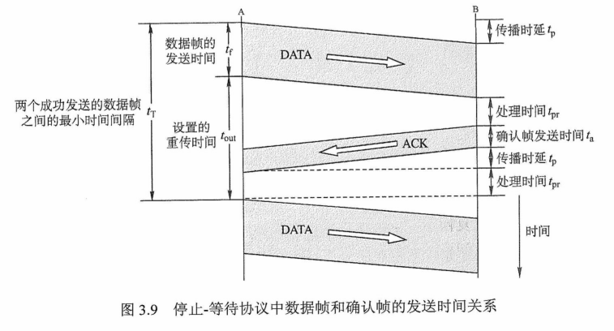

### 多帧滑动窗口与后退N帧协议（GBN）

+ 在后退N帧式ARQ中，发送方无须在收到上一个帧的ACK后才能开始发送下一帧，而是**可以连续发送帧**。当接收方检测出失序的信息帧后，要求发送方重发**最后一个正确接收的信息帧之后的所有未被确认的帧**；或者当发送方发送了N个帧后，若发现该N个帧的前一个帧在计时器超时后仍未返回其确认信息，则该帧被判为出错或丢失，此时发送方就不得不重传该出错帧及随后的N个帧。换句话说，**接收方只允许按顺序接收帧**(所以接收窗口大小为**1**)。

+ 如下图，源站向目的站发送数据帧。当源站发完0号帧后，可以继续发送后续的1号帧，2号帧等。源站每发送完一帧就要为该帧设置超时计时器。由于连续发送了许多帧，所以确认帧必须要指明是对哪一帧进行确认。为了减少开销，**GBN协议还规定接收端不一定每收到一个正确的数据帧就必须立即发回一个确认帧，而可以在连续收到好几个正确的数据帧后，才对最后一个数据帧发确认信息**，或者**可在自己有数据要发送时才将对以前正确收到的帧加以捎带确认**。这就是说，**对某一数据帧的确认就表明该数据帧和此前所有的数据帧均已正确无误地收到**

  >这就是**累计确认**，即收到了**0、5、6**的确认帧，则说明**1~5**号帧都已经收到了，不需要重传

+ 如下图，ACKn表示对第n号帧的确认，表示接收方已正确收到第n号帧及以前的所有帧，下一次期望收到第n+1号帧（也可能是第0号帧）。接收端值按序接收数据帧。虽然在有差错的2号帧之后接着又收到了正确的6个数据帧，但接收端都必须将这些帧丢弃。接收端虽然丢弃了这些不按序的无差错帧，但应重复发送已发送的最后一个确认帧ACK1（这是为了防止已发送的确认帧ACK1丢失）。

  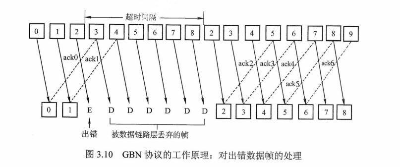

+ **后退N帧协议的接收窗口为1，可以保证按序接收数据帧**。若采用**n比特**对帧编号，则其发送窗口的尺寸$W_T$应满足**$1 \le W_T \le 2^n-1$**。若发送窗口的尺寸大于**$2^n-1$**，则会造成**接收方无法分辨新帧和旧帧**。

+ 由上图可看出，**后退N帧**协议一方面因连续发送数据帧而**提高了信道的利用率**，另一方面**在重传时又必须把原来已传送正确的数据帧进行重传（仅因这些数据帧的前面有一个数据帧出了错）**，这种做法又使**传送效率降低**。由此可见，**若信道的传输质量很差导致误码率较大时，后退N帧协议不一定优于停止-等待协议**。

### 多帧滑动窗口与选择重传协议（SR）

+ 为进一步提高信道的利用率，可设法只重传**出现差错**的数据帧或**计时器超时**的数据帧，但此时必须加大接收窗口，以便先收下发送序号不连续但仍处在接收窗口中的那些数据帧。等到所缺序号的数据帧收到后再一并送交主机。这就是**选择重传ARQ协议**。

+ 在选择重传协议中，每个**发送缓冲区**对应一个**计时器**，当计时器超时时，缓冲区的帧就会重传。另外，该协议使用了比上述其他协议更有效的差错处理策略，即一旦接收方怀疑帧出错，就会发一个否定帧**NAK**给发送方，要求发送方对**NAK**中指定的帧进行重传，如下图

  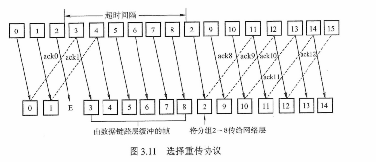

+ 选择重传协议的**接收窗口尺寸$W_R$**和**发送窗口尺寸$W_T$**都**大于1**，一次可以发送或接收多个帧。若采用**n比特**对帧编号，为了保证接收方向前移动窗口后，新窗口序号与旧窗口序号没有重叠部分，需要满足条件：**接收窗口$W_R$+发送窗口$W_T \le 2^n$**。假定仍然采用**累计确认**的方法，并且**接收窗口$W_R$**显然不应超过**发送窗口$W_T$**（否则无意义），那么**接收窗口尺寸不应超过序号范围的一半**，即**$W_R \le 2^{n-1}$**。接收窗为最大值时，**$\rm W_{Tmax}=W_{Rmax}=2^{n-1}$**。

  > 一般情况下，在SR协议中，**接收窗口**的大小和**发送窗口**的大小是相同的。

+ 选择重传协议可以**避免重复传送那些本已正确到达接收端的数据帧**，但**在接收端要设置具有相当容量的缓冲区来暂存那些未按序正确收到的帧**。接收端不能接收窗口下界以下或窗口上界以上的序号的帧，因此所需缓冲区的数目等于窗口的大小，而不是序号数目。

## 介质访问控制

+ `任务`
  + 为使用**介质**的每个结点隔离来自**同一信道**上其他结点所传送的信号，以协调活动结点的传输。
+ `内容`
  + 采取一定的措施，使得**两对结点之间**的通信不会发生**互相干扰**的情况。
+ 控制方法
  + `信道划分介质访问控制` （**静态划分信道**）
  + `随机访问介质访问控制` （**动态分配信道**）
  + `轮询访问介质访问控制` （**动态分配信道**）

### 信道划分介质访问控制

+ 将使用介质的每个设备与来自**同一通信信道**上的其他设备的通信隔离开来，把**时域**和**频域**资源合理地分配给网络上的设备。

+ 多路复用技术（**实现信道划分介质访问控制**）

  + 当传输介质的**带宽**超过传输**单个**信号所需的带宽时，人们就通过在一条介质上同时携带**多个**传输信号的方法来**提高传输系统的利用率**
  + 把**多个**信号组合在**一条**物理信道上进行传输，使多个计算机或终端设备**共享**信道资源，提高了信道的利用率
  + 可把**多个**输入通道的信息整合到一个**复用**通道中，在接收端把收到的信息**分离**出来并传送到对应的输出通道

+ 信道划分的实质，就是通过**分时、分频、分码**等方法，把原来的一条**广播**信道，逻辑上分为**几条**用于两个结点之间通信的互不干扰的**子信道**，实际上就是把**广播**信道转变为**点对点**信道。

  + `频分多路复用（FDM，Frequency-division multiplexing）`

    + 将**多路基带信号**调制到**不同频率**载波上，再叠加形成一个**复合信号**的多路复用技术。在物理信道的可用带宽超过单个原始信号所需带宽的情况下，可将该物理信道的**总带宽**分割成**若干**与传输单个信号带宽相同（或略宽）的子信道，每个子信道传输一种信号

    + 每个子信道分配的带宽**可不相同**，但它们的总和必须**不超过**信道的总带宽。在实际应用中，为了防止子信道之间的干扰，相邻信道之间需要加入**“保护频带”**

    + 频分多路复用的优点在于**充分利用了传输介质的带宽，系统效率较高**，由于技术比较成熟，实现也较容易

      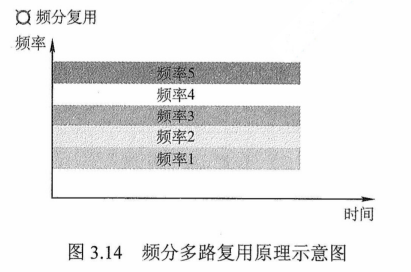

  + `时分多路复用（TDM，Time-division multiplexing）`

    + 将一条物理信道按**时间**分成若干**时间片**，**轮流**地分配给多个信号使用。每个时间片由复用的一个信号**占用**，不像**FDM**那样，同一时间同时发送多路信号。这样，利用每个信号在时间上的交叉，就可以在一条物理信道上传输多个信号。

    + 由于计算机数据的突发性，一个用户对已经分配到子信道的利用率一般不高。**统计时分多路复用（STDM，异步时分多路复用，Statistical-Time-division multiplexing）**是TDM的一种改进，它采用**STDM帧**，STDM帧并**不固定分配时隙**，而**按需动态**地分配时隙，当终端有数据要传送时，才会分配到时间片，因此可以提高线路的利用率。

      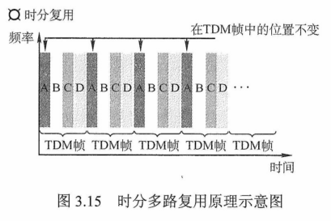

  + `波分多路复用（WDM，Wavelength-division multiplexing）`

    + 即**光的频分多路复用**，在一根光纤中传输多种**不同波长**（频率）的光信号，由于波长（频率）不同，各路光信号**互不干扰**，最后再用**波长分解复用器**将各路波长分解出来。

    + 由于光波处于频谱的高频段，有很高的带宽，因而可以实现多路的波分复用

      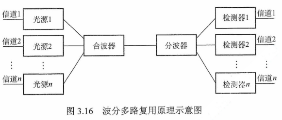

  + `码分多路复用（CDM，Code-division multiplexing）`

    + 采用不同的**编码**来区分各路原始信号的一种复用方式。与**FDM**和**TDM**不同，它既共享信道的**频率**，又共享**时间**

    + 更常用的名词是**码分多址（Code Division Multiple Access，CDMA）**，其原理是每个比特时间再划分成m个短的时间槽，称为**码片（Chip）**，通常m的值是**64或128**。

    + 设m为8。每个站点被指派一个唯一的m位码片序列。发送**1**时，站点发送它的**码片序列**；发送**0**时，站点发送该码片序列的**反码**。当两个或多个站点同时发送时，各路数据在信道中**线性相加**。为从信道中分离出各路信号，要求各个站点的码片序列相互**正交**。

      + CDMA的原理

        + 假如站点A的码片序列被指派为**00011011**，则A站发送**00011011**就表示发送比特**1**，发送**11100100**就表示发送比特**0**。

          > 为了方便，按惯例将码片中的**0**写作**-1**，将**1**写作**+1**

          因此，A站的码片序列是**-1-1-1+1+1-1+1+1**

        + 令向量**S**表示A站的码片向量，令**T**表示B站的码片向量。两个不同站的码片序列正交，即向量**S**和**T**的规格化内积为**0**
          $$
          S·T \equiv \frac{1}{m} \sum_{i=0}^{m}S_iT_i=0
          $$

        + 任何一个码片向量和该码片向量自身的规格化内积都是**1**，任何一个码片向量和该码片**反码**的向量的规格化内积都是**-1**
          $$
          S·S=\frac{1}{m} \sum_{i=1}^{m}S_iS_i=\frac{1}{m} \sum_{i=1}^mS_i^2=\frac1m\sum_{i=1}^m(\pm1)^2=1
          $$

        + 令向量T为（-1 -1 +1 -1 +1 +1 +1 -1），当A站向C站发送数据1时，就发送了向量（-1 -1 +1 -1 +1 +1 +1 -1）。当B站向C站发送数据0时，就发送了向量（+1 +1 -1 +1 -1 -1 -1 +1）。两个向量到了公共信道上就进行叠加，实际上就是线性相加，得到
          $$
          S-T=(0 \quad 0 \quad -2 \quad 2 \quad 0 \quad -2 \quad 0 \quad 2)
          $$

        + 到达C站后，进行数据分离，如果要得到来自A站的数据，C站就必须知道A站的码片序列，让S与S-T进行规格化内积。根据叠加原理，其他站点的信号都在内积的结果中被过滤掉了，内积的相关项都是0，而只剩下A站发送的信号。得到
          $$
          S·(S-T)=1
          $$

        + 所以A站发出的数据是1。同理，如果要得到来自B站的数据，那么
          $$
          T·(S-T)=-1
          $$

        + 因此从B站发送过来的信号向量是一个反码向量，代表0

    + 码分多址复用技术具有**频谱利用率高、抗干扰能力强、保密性强、语音质量好**等优点，还可以减少投资和降低运行成本，主要用于无线通信系统，特别是移动通信系统。

### 随机访问介质访问控制

+ `随机访问协议`

  + 在**随机访问协议**中，不采用集中控制方式解决发送信息的**次序问题**，所有用户能根据自己的意愿随机地发送信息，占用信道全部速率。

  + 在**总线形**网络中，当有两个或多个用户同时发送信息时，就会产生**帧的冲突**（碰撞，即前面所说的相互干扰），导致所有冲突用户的发送均已失败告终。

  + 为了解决随机接入发生的碰撞，每个用户需要按照一定的规则**反复地重复传它的帧**，直到该帧**无碰撞**地通过。

  + 常用的协议有**ALOHA**协议，**CSMA**协议，**CSMA/CD**协议和**CSMA/CA**协议等，它们的核心思想是：**胜利者通过争用获得信道，从而获得信息的发送权**。因此，随机访问介质控制协议又称为**争用型协议**。

  + 如果**介质访问控制**采用**信道划分机制**，那么结点之间的通信要么**共享空间**，要么**共享时间**，要么**两者都共享**；而如果采用**随机访问控制机制**，那么各结点之间的通信就可既不**共享时间**，也不**共享空间**。所以**随机介质访问控制**实质上是一种**将广播信道**转为**点到点信道**的行为。

    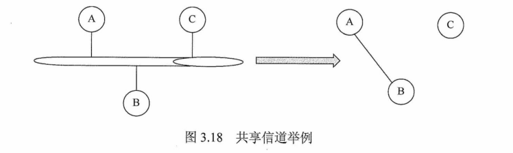

+ `ALOHA协议`（**Additive Link On-line HAwaii system**）

  + `纯ALOHA协议`

    + 当网络中的任何一个站点需要发送数据时，可以**不进行任何检测**就发送数据。如果在一段时间内**未收到确认**，那么该站点就认为传输过程中发生了**冲突**。

    + **发送站点**需要**等待**一段时间后，再**发送**数据，**直至**发送成功。

      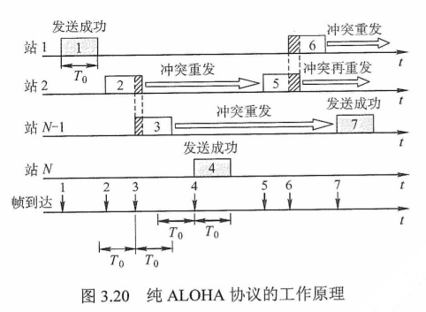

    + 假设**网络负载**（$T_0$时间内所有站点**发送成功**的和**未成功而重传**的帧数）为G，则纯ALOHA网络的**吞吐量**（$T_0$时间内成功发送的平均帧数）为**$S=Ge^{-2G}$**。当**G=0.5**时，S=**$0.5e^-1 \approx 0.184 $**，这是**吞吐量S**可能达到的**极大值**。可见，纯ALOHA网络的吞吐量很低。为了克服这一缺点，人们在原始的**纯ALOHA协议**的基础上改进成**时隙ALOHA协议**。

  + `时隙ALOHA协议`

    + 把所有各站在**时间**上**同步**起来，并将时间**划分**为一段段等长的**时隙（Slot）**，规定只能在每个时隙开始时才能**发送一个帧**。从而避免了用户发送数据的随意性，减少了数据产生冲突的可能性，提高了信道的利用率。

    + 时隙的长度$T_0$使得**每个帧**正好在**一个时隙内**发送完毕。每个帧在到达后，一般都要在缓存中**等待**一段**小于$T_0$**的时间，然后才能**发送**出去。在一个时隙内有两个或两个以上的帧到达时，在下一个时隙将产生碰撞。碰撞后重传的策略与纯ALOHA的情况是相似的。

      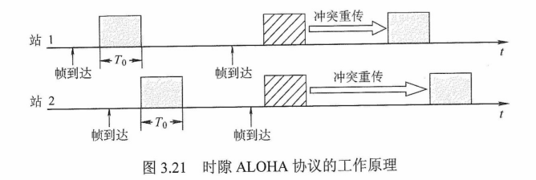

    + 时隙ALOHA网络的**吞吐量S**与**网络负载G**的关系是**$S=Ge^{-G}$**。当**G=1**时，**$S=e^{-1} \approx 0.368$**。这是吞吐量S可能达到的极大值。可见，时隙ALOHA的网络比纯ALOHA网络的吞吐量大了**1倍**。

    + **时隙ALOHA**系统的效率虽然是**纯ALOHA系统**的**两倍**，但每个站点都是**随心所欲**地发送数据的，即使其他站点正在发送也照发不误，因此发送**碰撞的概率很大**。

+ `CSMA协议`（**Carrier Sense Multiple Access**）

  + 每个站点在发送前都先**侦听**一下**共用信道**，发现信道空闲后再发送，就会大大降低冲突的可能，从而提高信道的利用率。

  + **CSMA协议**是在**ALOHA协议**基础上提出的一种**改进**协议，它与ALOHA协议的主要区别是**多了一个载波侦听装置**

  + 根据**侦听方式**和**侦听到信道忙后的处理方式**不同，CSMA分为三种

    + `1-坚持CSMA`（**1-persistent CSMA**）

      + 一个结点要发送数据时，首先**侦听**信道；如果信道**空闲**，那么**立即发送**数据；如果信道**忙**，那么**等待**，同时继续侦听**直至信道空闲**；如果发生**冲突**，那么**随机等待**一段时间后，再重新开始**侦听**信道

        > 1-坚持的含义是：侦听到信道忙后，继续坚持侦听信道；侦听到信道空闲后，发送帧的概率为1，即立刻发送数据。

      + **传播延迟**对**1-坚持CSMA协议**的性能影响较大。结点A开始发送数据时，结点B也正好有数据要发送，但这时结点A发出数据的信号还未到达结点B，结点B侦听到信道空闲，于是立即发送数据，结果必然导致冲突。即使**不考虑延迟**，**1-坚持CSMA协议**也可能产生冲突。

        + 结点A正在发送数据时，结点B和C也准备发送数据，侦听到信道忙，于是坚持侦听，结果当结点A一发送完毕，结点B和C就会立即发送数据，同样导致冲突。

    + `非坚持CSMA`（**Non-persistent CSMA**）

      + 一个结点要发送数据时，首先**侦听信道**；如果**空闲**，立即**发送**数据；如果**忙**，**放弃侦听**，**等待一个随机的时间**后再重复上述过程。
      + 侦听到信道忙后就放弃了侦听，因此**降低了多个结点等待信道空闲后同时发送数据导致冲突的概率，但也会增加数据在网络中的平均延迟**，可见，信道利用率的提高是以**增加数据在网络中的延迟时间为代价的**

    + `p-坚持CSMA`（**P-persistent CSMA**）

      + 用于**时分信道**
      + 一个结点要发送数据时
        + 首先**侦听**信道
        + **忙**，持续**侦听**，直到信道空闲
        + **空闲**，以**概览p**发送数据，以**概览1-p推迟**到下一个时隙
        + 如果在下一个时隙信道仍然空闲，那么仍以**概率p发送**数据，以**概率1-p推迟**到下一个时隙
        + 这个过程一直**持续**到**数据发送成功**或**因其他结点发送数据而检测到信道忙**为止，若是**后者**，则等待下一个时隙再重新开始**侦听**
      + **p-坚持CSMA**目的是**降低1-坚持 CSMA协议中多个结点检测到信道空闲后同时发送数据的冲突概览**。采用**坚持侦听**的目的是，试图克服**非坚持CSMA协议**中由于随即等待而造成的延迟时间较长的缺点。
      + **p-坚持CSMA协议**是**非坚持CSMA协议**和**1-坚持CSMA协议**的**折中**方案。

    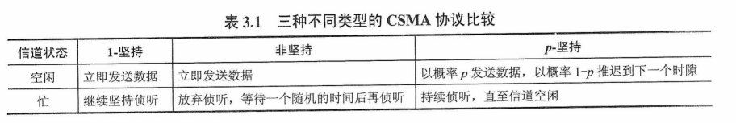

  + `CSMA/CD协议`（**Carrier Sense Multiple Access with Collision Detection，载波侦听多路访问/碰撞检测**）

    + 是CSMA协议的**改进方案**，适用于**总线形网络**或**半双工网络**环境

    + 发送前先**侦听**，每个站在发送前先要检测一个总线上是否有其他站点正在发送数据，若有则暂时不发送数据，等待信道变为**空闲**时再**发送**。**“碰撞检测”**就是**边发送边侦听**，即适配器边发送数据边检测信道上信号电压的变化情况，以便**判断自己在发送数据时其他站点是否也在发送数据**

    + CSMA/CD的工作流程可简单概括为**先听后发，边听边发，冲突停发，随机重发**

      +  **适配器**从**网络层**获得一个**分组**，封装成**以太网帧**，放入**适配器**的缓存，准备发送
      + 如果**适配器**侦听到信道**空闲**，那么它开始**发送**该帧。如果适配器侦听到信道**忙**，那么它**持续侦听**直至信道上没有信号能量，然后开始**发送**该帧。
      + 在发送过程中，适配器持续**检测**信道。若一直**未检测**到碰撞，则顺利地把这个帧**发送**完毕。若**检测到**碰撞，则**中止**数据的发送，并**发送一个拥塞信号**，以让所有用户知道。
      + 在**中止**发送后，**适配器**就执行**指数退避算法**，等待一段随机时间后返回到**步骤2**

    + **电磁波在总线上的传播速率总是有限的**，因此，当某个时刻发送站检测到信道空闲时，此时信道不一定是空闲的。如下图，可知**CSMA/CD中的站不可能同时进行发送和接收，因此采用CSMA/CD的协议的以太网只能进行半双工通信**

      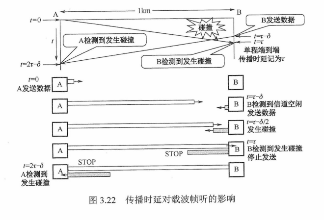

    + 由上图可知，站A在发送帧后至多经过时间**$2\tau$ （端到端传播时延的2倍）**就能知道所发送的帧有没有发生碰撞（当$\delta \rightarrow 0$时）。因此把**以太网端到端往返时间$2 \tau$称为争用期（又称冲突窗口或碰撞窗口）**。每个站在自己发送数据之后的一小段时间内，存在发生碰撞的可能性，只有**经过争用期**这段时间还**未检测**到碰撞时，才能**确定**这次发送不会发生碰撞。

    + 为了确保发送站在**发送**数据的**同时**能**检测**到可能存在的碰撞，需要在**发送完**帧**之前**就能**收到**自己发送出去的数据，即**帧的传输时延至少要两倍于信号在总线中的传播时延**，所以CSMA/CD总线网中的所有数据帧都必须要**大于一个最小帧长**。

    + 任何站点收到帧长小于**最小帧长**的帧时，就把它当作**无效帧**立即丢弃。
      $$
      最小帧长=总线传播时延 \times 数据传输速率 \times 2
      $$
  
    + 除检测冲突外, CSMA/CD还能从冲突中恢复, 一旦发生了冲突, 参与冲突的两个站点紧接着再次发送是没有意义的, 如果它们这样做, 那么将会导致无休止的冲突, CSMA/CD采用二进制指数退避算法来解决碰撞问题, 算法精髓如下
  
      + 确定基本**退避时间**, 一般取两倍的总线端到端传播时延**$2 \tau$** (即争用期)
      + 定义参数**k**, 它等于重传次数, 但**k**不超过10, 即**k**=min[重传次数, 10]
      + 从离散的整数集合[0, 1, ..., $2^k-1$]中随机取出一个数**r**,重传所需要退避的时间就是**r**倍的基本退避时间, 即**$2r\tau$**
      + 当重传达16次仍不能成功时, 说明网络太拥挤, 认为此帧永远无法正确发出, 抛弃此帧并向高层报告出错
  
    + 使用**二进制指数退避算法**可使重传需要推迟的平均时间随重传次数的增大而增大, (也称**动态退避**), 因而能降低发生碰撞的概率, 有利于整个系统的稳定
  
  + `CSMA/CA协议`
  
    + **CSMA/CD**协议已成功应用于使用有线连接的局域网, 但在无线局域网环境下, 却不能简单地搬用CSMA/CD协议, 特别是**碰撞检测**部分, 主要原因有二
  
      + 接收信号的强度往往会远小于发送信号的强度, 且在无限介质上信号强度的动态变化范围很大, 因此若要实现碰撞检测, 则在硬件上的花费就会过大
      + 在无线通信中, 并非所有的站点都能够听见对方, 即存在**隐蔽站**问题
  
    +  为此, **802.11**标准定义了广泛应用于无线局域网的**CSMA/CA**协议, 它对CSMA/CD协议进行修改, 把**碰撞检测**改为**碰撞避免 (Collision Avoidance, CA)**, **碰撞避免**并不是指协议可以完全避免碰撞, 而是指协议的设计要尽量降低碰撞发生的概率. 由于**802.11**无线局域网不使用碰撞检测, 一旦站点开始发送一个帧, 就会完全地发送该帧, 但碰撞存在时仍然发送整个数据帧(尤其是**长数据帧**)会严重降低网络的效率, 因此要采用**碰撞避免**技术降低碰撞的可能性
  
    + 由于无线信道的通信质量远不如有线信道, **802.11**使用链路层**确认/重传 (ARQ)**方案, 即站点每通过无线局域网发送完一帧, 就要在收到对方的确认帧后才能继续发送下一帧
  
    + 为了尽量避免碰撞, **802.11**规定, 所有的站完成发送后, 必须再等待一段很短的时间( 继续监听) 才能发送下一帧. 这段时间称为**帧间间隔(InterFrame Space, IFS)**. 帧间间隔的长短取决于该站要发送的帧的类型, **802.11**使用了3种IFS
  
      + `SIFS (短IFS)`
        + 最短的IFS, 用来分隔属于一次对话的各帧, 使用SIFS的帧类型有ACK帧, CTS帧, 分片后的数据帧, 以及所有回答AP探询的帧等
      + `PIFS (点协调IFS)`
        + 中等长度的IFS, 在PCF操作中使用
      + `DIFS (分布式协调IFS)`
        + 最长的IFS, 用于异步帧竞争访问的时延
  
    + CSMA/CA的**退避算法**和CSMA/CD稍有不同, 信道从**忙态**变为**空闲态**时, 任何一个站要发送数据帧, 不仅都要等待一个时间间隔, 而且要进入争用窗口, 计算随机退避时间以便再次试图接入信道, 因此降低了碰撞发生的概率. 当且仅当检测到信道空闲且这个数据帧是要发送的第一个数据帧时, 才不使用退避算法, 其他所有情况都必须使用**退避算法**, 具体为
  
      + 在发送第一个帧前检测到信道忙
      + 每次重传
      + 每次成功发送后要发送下一帧
  
    + CSMA/CA算法归纳如下
  
      1. 若站点最初有数据要发送 (而不是发送不成功再进行重传), 且检测到**信道空闲**, 在等待时间**DIFS**后, 就发送整个数据帧
      2. 否则, 站点执行CSMA/CA**退避算法**, 选取一个随机回退值. 一旦检测到**信道忙**, 退避计时器就保持不变. 只要信道**空闲**, 退避计时器就进行倒计时
      3. 当**退避计时器**减到0时 (这时信道只可能是空闲的) , 站点就发送整个帧并等待确认
      4. 发送站若收到确认, 就知道已发送的帧被目的站正确接收, 这时如果要发送第二帧, 就要从步骤**2**开始
  
    + 若发送站在规定时间内没有收到确认帧ACK (由重传计时器控制), 就必须重传该帧, 再次使用CSMA/CA协议争用该信道, 直到收到确认, 或经过若干次重传失败后放弃发送
  
    + 处理**隐蔽站**问题, **RTS 和 CTS**
  
      + 如下图, 站A和B都在AP的覆盖范围内, 但A和B相距较远, 彼此都听不见对方. 当A和B检测到信道空闲时, 都向AP发送数据, 导致碰撞的发生, 这就是**隐蔽站**问题
  
        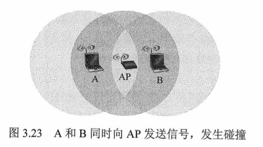
  
      + 为了避免该问题, **802.11**允许发送站对信道进行预约, 源站要发送数据帧之前先广播一个短请求发送**RTS**控制帧, 它包括**源地址, 目的地址, 这次通信(含相应的确认帧) 所持续的时间**, 该帧能被其范围内包括AP在内的所有站点听到. 若信道空闲, 则AP广播一个允许发送**CTS**控制帧, 它包括这次通信所需的持续时间(从RTS帧复制), 该帧也能被其范围内包括A和B在内的所有站点听到. B和其他站听到CTS后, 在CTS帧中指明的时间内将抑制发送
  
        + CTS帧有两个目的
          + **给源站明确的发送许可**
          + **指示其他站点在预约期内不要发送**
  
        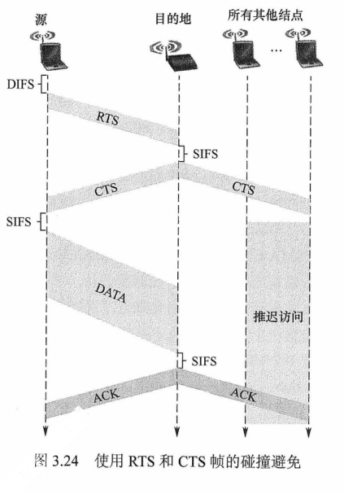
  
+ CSMA/CD与CSMA/CA主要有如下区别

  + `CSMA/CD可以检测冲突, 但无法避免`,  CSMA/CA发送数据的同时不能检测信道上有无冲突, 本结点处没有冲突并不意味着在接收结点处就没有冲突, 只能尽量避免
+ `传输介质不同`
    + CSMA/CD用于**总线形**以太网, CSMA/CA用于无线局域网**802.11a/b/g/n**等

  + `检测方式不同`
  + CSMA/CD通过电缆中的**电压变化**来检测
    + 而CSMA/CA采用**能见检测**, **载波检测**和**能量载波混合检测**三种检测信道空闲的方式

+ 

### 轮询访问介质访问控制: **令牌传递协议**

+ 用户不能随机地发送信息, 而是要通过一个集中控制地监控站, 以循环方式轮询每个结点, 再决定信道的分配. 当某结点使用信道时, 其他结点都不能使用信道. 典型的轮询访问介质访问控制协议是**令牌传递协议**, 主要用在令牌局域网中
+ 一个令牌在各结点间以某个固定的次序交换. 令牌是由一组特殊的比特组合而成的帧. 当环上的一个站希望传送帧时, 必须等待令牌. 一旦收到令牌, 站点便可启动发送帧.
  + 帧中包括目的站的地址, 以标识哪个站应接收此帧
  + 帧在环上传送时, 不管该帧是否是发给本站点的, 所有站点都进行转发, 直到该帧回到它的始发站, 并由该始发站撤销该帧
  + 帧的目的站除转发帧外, 应针对该帧维持一个副本, 并通过在帧的尾部设置**响应比特**来指示已收到此副本
  + 站点在发送完一帧后, 应释放令牌, 以便让其他站使用

+ 当计算机都不需要发送数据时, 令牌就在环形网上游荡, 而需要发送数据的计算机只有在拿到该令牌后才能发送数据帧, 因此不会发生冲突 (**因为令牌只有一个**)
+ 在令牌传递网络中, 传输介质的物理拓扑不必是一个环, 但是为了把对介质访问的许可从一个设备传递到另一个设备, 令牌在设备间的传递通路逻辑上必须是一个**环**
+ **轮询介质访问控制**非常适合负载很高的广播信道(**指多个结点在同一时刻发送数据概率很大的信道**), 可以想象, 如果这样的广播信道采用**随机介质访问控制**, 那么发生冲突的概率很大, 而采用**轮询介质访问控制**则可以很好地满足各结点间的通信需求
+ **轮询介质访问控制**既不共享时间, 也不共享空间, 它实际上是在**随机介质访问控制**的基础上, 限定了有权力发送数据的结点只能有一个
+ 即使是**广播信道**也可通过介质访问控制机制使广播信道逻辑上变为**点对点**的信道, 所以说数据链路层研究的是**点到点**之间的通信

## 局域网

### 局域网的基本概念和体系结构

+ 主要**特点**

  + 为一个单位所拥有, 且地理范围和站点数目均有限
  + 所有站点共享较高的总带宽(即较高的数据传输速率)
  + 较低的**时延**和较低的**误码率**
  + 各站为**平等**关系而非**主从**关系
  + 能进行**广播**和**组播**

+ 局域网的特性主要由**三**个要素决定, `拓扑结构`, `传输介质`, `介质访问控制方式`, 其中最重要的是`介质访问控制方式`, 它决定着局域网的技术特性

+ 常见的局域网拓扑结构主要有以下**4**大类

  + `星形结构`
  + `环形结构`
  + `总线形结构`
  + `星形和总线形结合的复合型结构`

+ 局域网可以使用**双绞线, 铜缆, 光纤**等多种传输介质, 其中**双绞线**为主流传输介质

+ 局域网的**介质访问控制方式**主要有**CSMA/CD, 令牌总线, 令牌环**

  + 前两种方法主要用于**总线形局域网**
  + 令牌环主要用于**环形局域网**

+ 三种特殊的局域网拓扑实现如下

  + `以太网`
    + 目前使用范围最广的局域网, 逻辑拓扑是**总线形结构**, 物理拓扑是**星形**或**拓展星形**结构
  + `令牌环` (**Token Ring, IEEE 802.5**)
    + 逻辑拓扑是**环形结构**, 物理拓扑是**星形结构**
  + `FDDI` (**光纤分布数字接口, IEEE 802.8**)
    + 逻辑拓扑是**环形结构**, 物理拓扑是**双环结构**

+ IEEE802标准定义的局域网参考模型只对应于**OSI参考模型**的`数据链路层`和`物理层`, 并将`数据链路层`拆分为两个子层: `逻辑链路控制(LLC)子层`和`媒体接入控制(MAC)子层`, 与接入传输媒体有关的内容都放在**MAC子层**, 它向上层屏蔽对物理层访问的各种差异, 提供对物理层的统一访问接口, 主要功能包括: **组帧**和**拆卸帧, 比特传输差错检测, 透明传输**. **LLC子层**与传输媒体无关, 它向网络层提供**无确认无连接, 面向连接, 带确认无连接, 高速传送**共4种不同的连接服务类型

  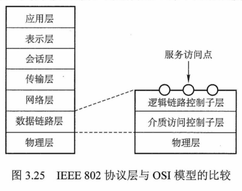

  > 由于以太网在局域网市场中取得垄断地位, 几乎成为局域网的代名词, 而802委员会制定的LLC子层作用已经不大, 因此现在很多网卡仅装有**MAC**协议而没有**LLC**协议

### 以太网与IEEE802.3

+ 该标准是一种**基带总线形**的局域网标准, 它描述`物理层`和`数据链路层`的MAC子层的实现方法

+ 以太网逻辑上采用总线形拓扑结构, 以太网中所有计算机共享同一条总线, 信息以广播方式发送. 为了保证数据通信的方便性和可靠性, 以太网简化了通信流程并使用了**CSMA/CD**方式对**总线**进行访问控制

+ 严格来说, 以太网应当是指**符合DIX Ethernet V2**标准的局域网, 但DIX Ethernet V2标准与IEEE 802.3标准只有很小的差别, 因此通常将**802.3**局域网简称为**以太网**

+ 以太网采用两项措施以**简化通信**

  + 采用**无连接**的工作方式, 不对发送的数据帧编号, 也不要求**接收方**发送确认,  即以太网尽最大努力交付数据,  提供的是**不可靠服务**,  对于差错的纠正则由高层完成
  + 发送的数据都使用**曼彻斯特**编码的信号,  每个码元的中间出现一次电压转换,  接收端利用这种电压转换方便地把**位同步信号**提取出来

+ 以太网的传输介质与网卡

  + 常用的传输介质有**4**种,  **粗缆,  细缆,  双绞线,  光纤**,  各种传输介质的适用情况如下

    |     **参数**     |   **10 BASE 5**    |   **10 BASE 2**    | **10 BASE-T** | **10 BASE-FL** |
    | :--------------: | :----------------: | :----------------: | :-----------: | :------------: |
    |   **传输媒体**   | 基带同轴电缆(粗缆) | 基带同轴电缆(细缆) | 非屏蔽双绞线  | 光纤对(850nm)  |
    |     **编码**     |    曼彻斯特编码    |    曼彻斯特编码    | 曼彻斯特编码  |  曼彻斯特编码  |
    |   **拓扑结构**   |       总线形       |       总线形       |     星形      |     点对点     |
    |   **最大段长**   |        500m        |        185m        |     100m      |     2000m      |
    | **最多结点数目** |        100         |         30         |       2       |       2        |

    > 10 BASE-T 非屏蔽双绞线以太网拓扑结构为**星形网**, 星形网中心为集线器, 但使用集线器的以太网在逻辑上仍然是一个总线网, 属于一个冲突域

  + 计算机与外界局域网的连接时通过网络接口板(**网络适配器 Adapter**)或(**网络接口卡 Network Interface Card, NIC**)实现的. 网卡上装有**处理器,  存储器**, 是工作在`数据链路层`的网络组件.  **网卡**和**局域网**的通信是通过**电缆**或**双绞线**以串行方式进行的,  而**网卡**和**计算机**的通信则是通过计算机主板上的**I/O总线**以并行方式进行的.  因此,  网卡的重要功能就是进行**数据的串并转换**.  网卡不仅实现与局域网传输介质之间的**物理连接**和**电信号匹配**，还涉及**帧的发送与接收、帧的封装与拆封、介质访问控制、数据的编码与解码、数据缓存功能**。

  + 全世界的每块网卡在出厂时都有一个唯一的代码，称为**介质访问控制地址（MAC）**，这个地址用于控制主机在网络上的数据通信。**数据链路层**设备（网桥，交换机等）都使用各个网卡的MAC地址。另外，网卡控制着主机对介质的访问，因此网卡也工作在物理层，因为它只关注比特，而不关注任何地址信息和高层协议信息。

+ 以太网的MAC帧

  + 每块网卡中的MAC地址也称为**物理地址**；MAC地址长**6字节**，一般用**连字符（或冒号）分隔的12个十六进制数**表示，如**02-60-8c-e4-b1-21**。高24位为**厂商代码**，低24位为**厂商自行分配的网卡序列号**，严格来讲，局域网的**地址**应是每个站的名字或标识符

  + 由于总线上使用的是**广播通信**，因此网卡从网络上每收到一个MAC帧，首先要用硬件检查MAC帧中的MAC地址。如果是发往本站的帧，那么就收下，否则丢弃

  + 以太网MAC帧格式有两种标准：**DIX Ethernet V2**标准（即以太网V2标准）和**IEEE 802.3**标准

    + `以太网V2标准`

      + **前导码**

        + 使接收端与发送端时钟同步。在帧前面插入的8字节可再分为两个字段
          + 第一个字段共**7**字节，是**前同步码**，用来快速实现MAC帧的比特同步
          + 第二个字段是**帧开始定界符**，表示后面的信息就是MAC帧

        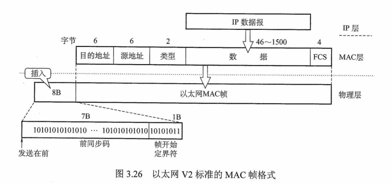
    
        > MAC帧并不需要**帧结束符**，因为以太网在传送帧时，各帧之间必须有一定的间隙。因此，接收端只要找到帧开始定界符，其后面连续到达的比特流就属于同一个MAC帧，所以上图只有**帧开始定界符**，但不要误以为以太网MAC帧不需要尾部，在`数据链路层`上，帧即要加首部，也要加尾部
    
      + **地址**
    
        + 通常使用6字节（48bit）地址（MAC地址）
    
      + **类型**
    
        + 2字节，指出数据域中携带的数据应交给哪个协议实体处理
    
      + **数据**
    
        + 46~1500字节，包含高层的协议消息。由于CSMA/CD算法的限制，以太网帧必须满足最小长度要求64字节，数据较少时必须加以填充（0~46字节）
    
        > 46和1500是怎么来的？首先，由CSMA/CD算法可知以太网帧的**最短帧长**为64B，而MAC帧的首部和尾部的长度为**18字节**，所以数据字段最短为64 - 18 = 46字节。其次，最大的1500字节是规定的，没有为什么。
    
      + **填充**
    
        + 0~46字节，当帧长太短时填充帧，使之达到64字节的最小长度
    
      + **校验码（FCS）**
    
        + 4字节，校验范围从目的地址段到数据段的末尾，算法采用32位循环冗余码（CRC），不但需要校验MAC帧的数据部分，还要检验目的地址、源地址、类型字段，但不校验**前导码**
        + 802.3帧格式与DIX以太帧格式的不同之处在于用**长度域**替代了**DIX**帧中的**类型域**，指出数据域的长度。在实践中，前述长度/类型两种机制可以并存，由于IEEE 802.3数据段的最大字节数是1500，所以长度段的最大值是1500，因此从1501到65535的值可用于**类型段标识符**

+ 高速以太网

  + 速率达到或超过**100Mb/s**的以太网称为**高速以太网**
  + `100BASE-T`以太网
    + 在双绞线上传送**100Mb/s**基带信号的星形拓扑结构以太网，它使用CSMA/CD协议
    + 这种以太网支持**全双工方式、半双工方式**，可在**全双工方式**下工作而无冲突发生
      + 因此，在全双工方式下，不使用CSMA/CD协议
    + MAC帧格式仍然是802.3标准规定的。保持最短帧长不变，但将一个网段的最大电缆长度减小到100m。帧间时间间隔从原来的**9.6us**改为现在的**0.96us**
  + `吉比特以太网` （**千兆以太网**）
    + 允许在**1Gb/s**下用**全双工、半双工**两种方式工作。使用802.3协议规定的帧格式。在**半双工方式**下使用CSMA/CD协议，**全双工方式**不需要使用CSMA/CD协议。与10BASE-T和100BASE-T技术向后兼容
  + `10吉比特以太网`
    + 与**10Mb/s、100Mb/s、1Gb/s**以太网的帧格式完全相同，还保留了802.3标准规定的以太网最小和最大帧长，便于升级。
    + 不再使用**铜线**而只使用**光纤**作为传输媒体，只工作在**全双工方式**，因此没有争用问题，也不使用CSMA/CD协议

### IEEE 802.11

+ `有固定基础设施无线局域网`

  + IEEE制定了无线局域网的802.11系列协议标准，包括802.11 a/b/g/n 等。802.11使用星形拓扑，其中心称为**接入点**（Access Point，AP），在MAC层使用CSMA/CA协议，使用802.11系列协议的局域网又称**WIFI**

  + 802.11标准规定无线局域网的最小构件是**基本服务集BSS（Basic Service Set，BSS）**，一个基本服务集包括**一个基站、若干移动站**。所有的站在本BSS内都可以直接通信，但在和本BSS外的站通信时，都必须通过本BSS的基站。

  + **AP**就是基本服务集中的基站（base station）。安装AP时，必须为该AP分配一个不超过32字节的**服务集标识符（Service Set IDentifier，SSID）**和一个信道。一个基本服务集覆盖的地理范围称为一个**基本服务区（Basic Service Area，BSA）**，无线局域网的基本服务区的直径一般不超过100m

  + 一个基本服务集可以是孤立的，也可通过AP连接到一个**分配系统（Distribution System，DS）**，然后连接到另一个基本服务集，构成一个**扩展的服务集（Extended Service Set，ESS）**，ESS还可以通过一种**Portal（门桥）**的设备为无线用户提供到有线连接的以太网的接入。门桥的作用相当于一个**网桥**。

    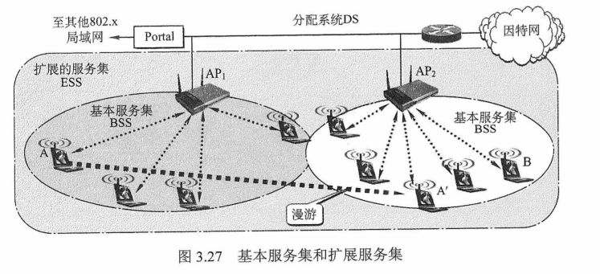

+ `无固定基础设施移动自组织网络`（**自组网络，ad hoc network**）

  + 没有**基本服务集**中的AP，而是由一些平等状态的移动站相互通信组成的临时网络。各结点之间地位平等，中间结点都为转发结点，因此都具有**路由器**功能

  + 自组网络通常这样组成

    + 一些可移动设备发现在它们附近还有其他可移动设备，并且要求和其他移动设备进行通信。自组网络中的每个移动站都要参与网络中**其他移动站**的路由的发现和维护，同时由移动站构成的**网络拓扑**可能随时间变化得很快，因此在固定网络中行之有效的一些**路由选择协议**对移动自组网络已不适用，需引起特别关注

      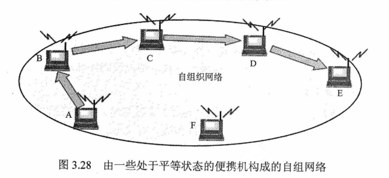

    + **自组网络**和**移动IP**并不相同

      + **移动IP技术**使漫游的主机可以用多种方法连接到因特网，其核心网络功能仍然是基于固定网络中一直使用的各种**路由选择协议**
      + **自组网络**是把移动性扩展到无线领域中的自治系统，具有自己特定的路由选择协议，并且可以不和因特网相连。

### 令牌环网的基本原理

+ 令牌环网的每一站通过电缆与**环接口干线耦合器（TCU）**相连。TCU的主要作用是，传递所有经过的帧，为接入站发送和接收数据提供接口。与此对应，TCU的状态也有两个：**收听状态、发送状态**。数据总是在某个特定的方向上从一个TCU到下一个TCU逐比特地依次传送，每个TCU重新产生并重新传输每一比特。

  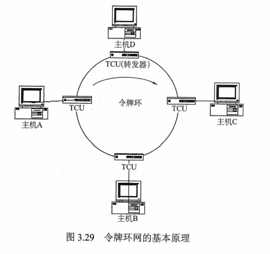

+ 令牌环网地媒体接入控制机制采用的是**分布式控制模式**的循环方法。在令牌环网中有一个令牌（Token）沿着环形总线在入网结点计算机间依次传递，令牌实际上是一个特殊格式的**MAC控制帧**，它本身并不包含信息，仅控制信道的使用，确保在同一时刻只有一个结点能够独占信道

+ 站点只有取得令牌后才能发送数据帧，因此令牌环网不会发生碰撞。由于令牌在环网上是按顺序依次传递的，因此对所有入网计算机而言，访问权是公平的

+ 令牌环网中**令牌、数据**的传递过程如下

  + 网络空闲时，环路中只有**令牌帧**在循环传递
  + 令牌传递到有数据要发送的站点时，该站点就修改令牌中的一个**标志位**，并在令牌中附加自己需要传输的数据，将令牌变成一个**数据帧**，然后将这个数据帧发送出去
  + **数据帧**沿着环路传输，接收到的站点一边转发数据，一边查看帧的目的地址。如果**目的地址**和**自己的地址**相同，那么接收站就复制该数据帧以便进一步处理
  + **数据帧**沿着环路传输，直到到达该帧的**源站点**，源站点接收到自己发出去的数据帧后便不再进行转发。同时，发送方可以通过检验返回的数据帧来查看数据传输过程中是否有错，若有错则重传该帧
  + 源站点传送完数据后，重新产生一个令牌，并将令牌传递给下一个站点，以交出对媒体的访问权限

+ 令牌环网在物理上采用**星形拓扑结构**，但逻辑上仍是**环形拓扑结构**，其标准由IEEE 802.5定义

## 广域网

### 广域网的基本概念

+ 指覆盖范围很广（**远超一个城市的范围**）的长距离网络。是因特网的核心部分，其任务是长距离运送主机所发送的数据。连接广域网各结点交换机的链路都是**高速链路**，它可以长达几千千米的**光缆线路**，也可以是几万千米的**点对点卫星链路**

  + 因此，广域网首要考虑**通信容量必须足够大**

+ 不等于**互联网**，互联网可以连接不同类型的网络（局域网或广域网），通常使用**路由器**来连接

  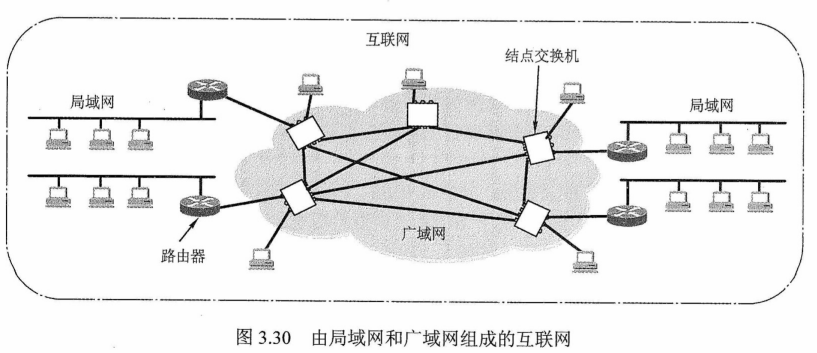

+ 由一些**结点交换机**及连接这些交换机的链路组成。结点交换机的功能是将分组存储并转发。结点之间都是**点到点连接**，但为了提高网络的可靠性，通常一个结点交换机往往与多个结点交换机相连。

  + **结点交换机**不是路由器，它和路由器都用来转发分组，他们的工作原理也类似。**结点交换机**在**单个网络**中转发分组，而**路由器**在**多个网络**构成的互联网中转发分组

+ 从层次上考虑，广域网和局域网的区别很大，因为局域网使用的协议主要在`数据链路层`（还有少量在`物理层`），而广域网使用的协议主要在`网络层`

  + 如果网络中的两个结点要进行数据交换，那么结点除要给出的数据外，还要给数据包装上一层**控制信息**，用于实现**检错纠错**等功能。如果这层控制信息是`数据链路层`协议的控制信息，那么就称使用了`数据链路层`协议，如果这层控制信息是`网络层`的控制信息，那么就称使用了`网络层`协议

+ 广域网和局域网的区别联系

  |                 | **广域网**                                                   | **局域网**                   |
  | --------------- | :----------------------------------------------------------- | :--------------------------- |
  | 覆盖范围        | 很广，通常跨区域                                             | 较小，通常在一个区域内       |
  | 连接方式        | 结点之间都是**点到点连接**，但为了提高网络的可靠性，一个节点交换机往往与多个结点交换机相连 | 普通采用**多点接入技术**     |
  | OSI参考模型层次 | 三层：**物理层，数据链路层，网络层**                         | 两层：**物理层，数据链路层** |
  | 联系与相似点    | 1，广域网和局域网都是互联网的重要组成构件，从互联网角度上看，二者**平等**（不是**包含**关系） 2，连接到一个广域网或一个局域网上的主机在该网内进行通信时，只需要使用其网络的物理地址 | 同左                         |
  | 着重点          | 强调资源共享                                                 | 强调数据传输                 |

+ 广域网中一个重要问题是**路由选择**和**分组转发**。路由选择协议负责搜索分组从某个结点到目的结点的最佳传输路由，以便构造**路由表**，然后从路由表再构造出转发分组的**转发表**。分组是通过转发表进行转发的

+ **PPP、HDLC**协议是目前最常用的两种**广域网**数据链路层控制协议

### PPP协议 (**Point-to-Point Protocol**)

+ 使用串行线路通信的面向字节的协议，该协议应用在直接连接两个结点的链路上．设计的目的主要是用来通过**拨号**或**专线**方式建立**点对点连接**发送数据，使其成为各种主机、网桥和路由器之间简单连接的一种共同的解决方案。

+ PPP协议是在**SLIP**协议的基础上发展而来的，可以在**异步线路、同步线路**上使用，不仅用于**Modem**链路，也用于租用的**路由器到路由器**的线路

  + SLIP主要完成**数据报**的传送，但没有**寻址、数据校验、分组类型识别、数据压缩**等功能，只能传送IP分组。如果上层不是**IP协议**，那么无法传输，并且此协议对一些高层应用也不支持，但实现比较简单。为了改进SLIP的缺点，于是制定了点对点协议（PPP）

+ PPP协议有三个组成部分

  + `链路控制协议（LCP）`
    + 一种扩展链路控制协议，用于建立、配置、测试和管理数据链路

  + `网络控制协议（NCP）`
    + PPP协议允许同时采用多种网络层协议，每个不同的网络层要用一个相应的NCP来配置，为**网络层**协议建立和配置逻辑连接

  + `一个将IP数据报封装到串行链路的方法`
    + IP数据报在PPP帧中就是其信息部分，这个信息部分的长度受**最大传送单元（MTU）**的限制

+ 如下图，PPP帧的**前3个字段**和**最后2个字段**与HDLC帧是一样的，**标志字段（F）**仍为7E（**01111110**），前后各占**1**字节，若它出现在信息字段中，就必须做**字节填充**，使用的控制转义字节是7D（**01111101**）。但在PPP中，**地址字段（A）**占**1**字节，规定为0xFF，**控制字段（C）**占**1**字节，规定为0x03，两者的内容始终是固定不变的。PPP是面向字节的，因而所有PPP帧的长度都是整数个字节

  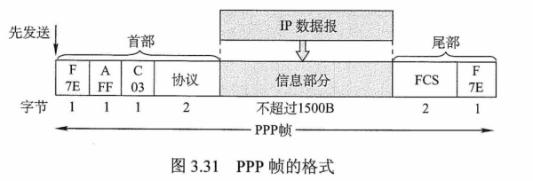

  + 第4个字段是**协议段**，占**2**字节，在HDLC中没有该字段，它是说明信息段中运载的是什么种类的分组。以比特**0**开始的是诸如IP、IPX、AppleTalk这样的网络层协议；以比特**1**开始的被用来协商其他协议，包括LCP及每个支持的网络层协议的一个不同的NCP

  + 第5段**信息段**的长度是可变的，大于等于0且小于等于1500B。为了实现**透明传输**，当信息段中出现和标识字段一样的比特组合时，必须采用一些措施来改进

    + 因为PPP是**点对点**的，并不是总线形，所以无需采用CSMA/CD协议，自然就没有最短帧，所以信息段占0~1500字节，而不是46~1500字节。另外，当**数据**部分出现和**标志位**一样的比特组合时，就需要采用一些措施来实现透明传输。

  + 第6个字段是**帧校验序列（FCS）**，占**2**字节，即循环冗余码校验中的冗余码。校验区包括**地址字段、控制字段、协议字段、信息字段**

  + 下图为***PPP***链路建立、使用、撤销所经历的状态图

    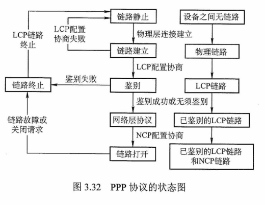

    + 当线路处于静止状态时，不存在`物理层`连接

    + 当线路检测到载波信号时，建立物理连接，线路变为建立状态

    + LCP开始选项商定，商定成功后就进入身份验证状态

    + 双发身份验证通过后，进入**网络状态**。这时，采用NCP配置网络层，配置成功后，进入**打开状态**，然后就可进行数据传输。当数据传输完成后，线路转为**终止状态**。载波停止后则回到**静止状态**

      > + PPP提供**差错检测**但不提供**纠错**功能，只保证无差错接收（通过硬件进行CRC检验）。它是不可靠的传输协议，因此也不使用**序号、确认机制**
      > + 它仅支持**点对点**的链路通信，不支持多点线路
      > + PPP只支持**全双工**链路
      > + PPP的两端可以运行不同的网络层协议，但仍然可以使用同一个PPP进行通信
      > + PPP是**面向字节**的，当信息字段出现和标识字段一致的比特组合时，PPP有两种不同的处理方法
      >   + 若PPP用在异步线路（默认），则采用**字节填充法**
      >   + 若PPP用在SONET/SDH等同步线路，则协议规定采用**硬件**来完成比特填充（和HDLC的做法一样）

### HDLC协议 （**高级数据链路控制，High-level Data Link Control，HDLC**）

+ 是ISO制定的面向**比特**（**PPP协议面向字节**）的`数据链路层`协议。该协议不依赖于任何一种字符编码集

+ 数据报文可**透明传输**，用于实现透明传输的**0比特插入法**易于硬件实现

+ 全双工通信，有较高的数据链路传输效率

+ 所有帧采用CRC检验，对信息帧进行顺序编号，可防止漏收或重发，传输可靠性高

+ 传输控制功能与处理功能分离，具有较大的灵活性

+ 适用于链路的两种基本配置
  + `非平衡配置`
    + 由一个主站控制整个链路的工作
  + `平衡配置`
    + 链路两端的两个站都是**复合站**，每个复合站都可以平等地发起数据传输，而不需要得到对方复合站的允许
  
+ `站`
  + `主站`
    + 负责控制链路的操作，主站发出的帧称为**命令帧**
  + `从站`
    + 受控于主站，按主站的命令进行操作，发出的帧称为**响应帧**
  + `复合站`
    + 同时拥有**主站、从站**功能，可以发出**命令帧、响应帧**
  
+ `数据操作方式`
  
  + `正常响应方式`
    + **非平衡**结构操作方式，即主站向从站传输数据，从站响应传输，但从站只有在收到主站的许可后，才可进行响应
  + `异步平衡方式`
    + **平衡**结构操作方式，每个复合站都可以进行对另一站的数据传输
  + `异步响应方式`
    + **非平衡**结构操作方式，从站即使未受到主站的允许，也可进行传输
  
+ `HDLC帧`
  + 帧格式如下所示，由**标志、地址、控制、信息、帧校验序列（FCS）**等字段构成
  
    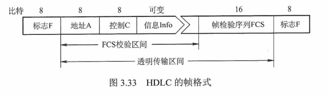
  
    + 标志字段F，为**01111110**
      + 在接收端只要找到**标志字段**就可确定一个帧的位置。HDLC协议采用比特填充的**首尾标志法**实现透明传输
      + 在发送端，当一串比特流数据中有5个连续的**1**时，就立即在其后填入一个0
      + 接收帧时，先找到F字段以确定帧的边界，接着对比特流进行扫描
      + 每当发现5个连续的**1**时，就将其后的一个0删除，以还原成原来的比特流
    + 地址字段A，共8位
      + 使用**非平衡**方式传送数据时，站地址字段总是写入**从站**的地址
      + 使用**平衡**方式传送数据时，站地址字段填入的是**应答站**的地址
    + 控制字段C，共8位
      + 最复杂的字段，HDLC的许多重要功能都靠控制字段来实现
      + 根据其**第1位或第1、2位**的取值，可将HDLC帧划分**三**类
        + `信息帧（I）`
          + 第1位为0，用来传输数据信息，或使用**捎带技术**对数据进行确认
        + `监督帧（S）`
          + 第1、2位分别为1、0，用于**流量控制**和**差错控制**，执行对信息帧的确认、请求重发和请求暂停发送等功能
        + `无编号帧（U）`
          + 第1、2位均为1，用于提供对链路的建立、拆除等多种控制功能
  
+ **PPP帧**和**HDLC帧**的格式很相似，区别如下

  + PPP协议面向**字节**，HDLC协议面向**比特**
  + PPP帧比HDLC帧多一个**2**字节的协议字段。当协议字段值为**0x0021**时，表示信息字段是**IP数据报**
  + PPP协议不使用**序号和确认机制**，只保证无差错接收（通过硬件进行CRC检验），而端到端差错检测由高层协议负责。HDLC协议的**信息帧**使用了**编号和确认机制**，能够提供可靠传输

## 数据链路层设备

### 网桥的概念及其基本原理

+ 两个或多个以太网通过**网桥**连接后，就成为一个覆盖范围更大的以太网，而原来的每个以太网就称为一个**网段**。网桥工作在**链路层**的**MAC子层**，可以使以太网各网段成为隔离开的**碰撞域**。如果把网桥换成工作在**物理层**的**转发器**，那么就没有这种过滤通信量的功能。由于各网段相对独立，因此一个网段的故障不会影响到另一个网段的运行

  > 网桥处理数据的对象是**帧**，所以它是工作在**数据链路层**的设备，中继器、放大器处理数据的对象是信号，所以它是工作在**物理层**的设备

+ 如下图，设每个网段的数据率都是10Mb/s，那么三个网段合起来的最大吞吐量就变成30Mb/s。如果把两个**网桥**换成**集线器或转发器**，那么整个网络仍然是一个**碰撞域（即冲突域）**，当A和B通信时，所有其他站点都不能通信，整个碰撞域的最大吞吐量仍然是10Mb/s

  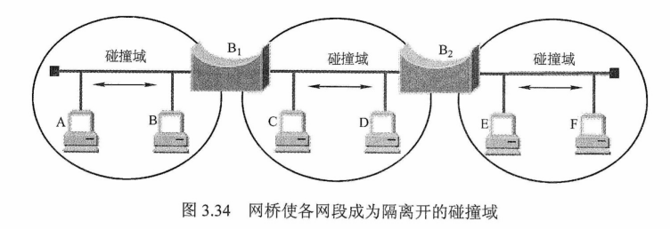

+ **网桥的优点**

  + 能过滤通信量
  + 扩大了物理范围
  + 可使用不同的**物理层**
  + 可互联不同类型的局域网
  + 提高了可靠性
  + 性能得到改善

+ **网桥的缺点**

  + 增大了时延
  + MAC子层没有流量控制功能（流量控制需要用到**编号机制**，编号机制的实现在LLC子层）
  + 不同MAC子层的网段桥接在一起时，需要进行**帧格式**的转换
  + 网桥只适合于**用户数不多**和**通信量不大**的局域网，否则有时还会因传播过多的广播信息而产生网络拥塞（**即广播风暴**）

+ 网桥必须具有**路径选择**的功能，接收到帧后，要决定正确的路径，将该帧转送到相应的目的局域网站点。根据路径选择算法的不同，可将网桥分为**透明网桥**和**源路由网桥**

+ `透明网桥（选择的不是最佳路由）`

  + 以混杂方式工作，接收与之连接的所有LAN传送的每一帧。到达帧的路由选择过程取决于源LAN和目的LAN
    + 如果源LAN和目的LAN相同，那么丢弃该帧
    + 如果源LAN和目的LAN不同，那么转发该帧
    + 如果目的LAN未知，那么扩散该帧
  + 当网桥刚连接到以太网时，其**转发表**是空的，网桥按照自学习算法处理收到的帧。该算法的基本思想是
    + 若从站A发出的帧，从某端口进入网桥，那么从这个端口出发沿相反方向一定可把一个帧传送到站A
    + 所以网桥每收到一个帧，就记下其**源地址**和**进入网桥的端口**，作为转发表中的一个项目（**源地址、进入的接口、时间**）
    + 建立**转发表**时，把帧首部中的源地址写在**地址**一栏下面
    + 转发帧时，根据收到的帧首部中的目的地址来转发
      + 这时就把在**地址**栏下面已经记下的源地址当作目的地址，而把记下的进入端口当作转发端口
    + 网桥就是在这样的转发过程中逐渐将其转发表建立起来
  + 为了避免转发的帧在网络中不断地**兜圈子**，透明网桥使用了一种**生成树算法（五环）**，以确保每个源到每个目的地只有**唯一的路径**。生成树使得整个扩展局域网在逻辑上形成树形结构，所以工作时，逻辑上没有环路，但**生成树一般不是最佳路由**

+ `源路由网桥` （**选择的是最佳路由**）

  + 在源路由网桥中，**路由选择**由发送数据帧的**源站**负责，网桥只根据数据真正的路由信息对帧进行接收和转发
  + 源路由网桥对主机是不透明的，主机必须直到网桥的标识及连接到哪个网段上。路由选择由发送帧的源站负责
    + 为了找到最佳的路由，源站以广播方式向目的站发送一个**发现帧（Discovery Frame）**作为探测之用
    + 源路由的生成过程是
      + 在未知路径前，源站要先发送一个**发现帧**
      + 途中的每个网桥都转发此帧，最终该发现帧可能从多个途径到达目的站
      + 目的站也将一一发送应答帧
      + 每个应答帧将通过原路径返回，途径的网桥把自己的标志记录在应答帧中
      + 源站选出一个最佳路由
    + 以后，凡是从这个源站向该目的站发送的帧的首部，都必须携带这一路由信息
  + **发送帧**还可以帮助源站确定整个网络可以通过的帧的最大长度，由于发现帧的数量指数式增加，可能会使网络严重拥塞

+ `两种网桥的比较`

  + 使用**源路由网桥**可以利用最佳路由。若在两个以太网之间使用并联的源路由网桥，则还可使通信量较平均地分配给每个网桥

  + 采用**透明网桥**时，只能使用生成树，而使用生成树一般并不能保证所用的路由是最佳的，也不能在不同的链路中进行负载均衡

    > 透明网桥和源路由网桥中提到的**最佳路由**并不是经过路由器最少的路由，而可以是**发送帧**往返时间最短的路由，这样才能真正地进行负载平衡，因为往返时间长说明中间某个路由器可能超载了，所以不走这条路，换个往返时间短的路走

### 局域网交换机及其工作原理

+ `局域网交换机`
  + 桥接器的主要限制是**在任一时刻通常只能执行一个帧的转发操作**，于是出现了局域网交换机，又称**以太网交换机**。从本质上说，以太网交换机是一个多端口的网桥，它工作在**数据链路层**。交换机能经济地将网络分成小的**冲突域**，为每个工作站提供更高的带宽
  + 以太网交换机对工作站是透明的，因此管理开销低廉，简化了网络结点的增加、移动和网络变化的操作
  + 利用以太网交换机还可以方便地实现**虚拟局域网（Virtual LAN，VLAN）**，VLAN可以隔离**冲突域，广播域**
+ `原理`
  + 它检测从以太端口来的数据帧的源和目的地的MAC（介质访问层）地址，然后与系统内部的动态查找表进行比较，若数据帧的MAC地址不在查找表中，则将该地址加入查找表，并将数据帧发送给相应的目的端口
+ `特点`
  + 每个端口都直接与单台主机相连（普通网桥的端口往往连接到以太网的一个网段），并且一般都工作在**全双工**方式
  + 能同时连通许多对端口，使每对相互通信的主机都能像独占通信媒体那样，无碰撞地传输数据
  + 也是一种**即插即用**设备（和透明网桥一样），其内部的帧的**转发表**也是通过自学习算法自动地逐渐建立起来的
  + 由于使用了专用的交换结构芯片，因此交换速率较高
  + 独占传输媒体的**带宽**
+ `两种交换模式`
  + `直通式`
    + 只检查帧的**目的地址**，这使得帧在接收后几乎能马上被传出去
    + **优点**是速度快，**缺点**是缺乏智能性和安全性，也无法支持具有不同速率的端口的交换
  + `存储转发式`
    + 先将接收到的帧缓存到**高速缓存器**中，并检查数据是否正确，确认无误后通过**查找表**转换成输出端口将该帧发送出去。如果发现帧有错，那么就将其丢弃。
    + **优点**是可靠性高，并能支持不同速率端口间的转换，**缺点**是延迟较大

## 总结

+ 冗余编码
	
	所用**符号数**或**信号码元数**比表示信息所必需的数目多的代码，应用了**冗余加密**技术，即利用了**纠错码**的编码原理
	
+ `信道的效率`

  + 也称**信道利用率**，从时间角度定义：**信道效率是对发送方而言的，指发送方在一个发送周期的时间内，有效地发送数据所需要的时间占整个发送周期的比率**

  + 发送方从**开始发送数据**到**收到第一个确认帧**为止，称为**一个发送周期**，设为**T**，发送方在这个周期内共发送**L比特**的数据，发送方的数据**传输速率为C**，则发送方用于发送有效数据的时间为**L/C**，在这种情况下，**信道的利用率**为**(L/C)/T**。

    > 简单理解，信道利用率，就是**实际发送的数据速度**，跟**信道速度**之比。但是**实际发送的数据速度**，是**发送的数据量（不包括确认帧）**对**整个发送周期（包括发送和接收确认帧）**的比值。
  
  + **信道吞吐率 = 信道利用率 * 发送方的发送效率**
  + 由其注意题目中说的**忽略确认帧的传输时延**，**传输时延**和**传播时延**有所区别，**传输时延**也叫**发送时延**，跟**传播时延**不同。
  
+ **连续ARQ（后退N帧 ARQ，选择性重传ARQ）**协议中，**接收方**一般采用**累计确认**的方式，即**接收方对按序到达的最后一个分组发送确认**。

+ `规格化内积`

  + 向量的**内积**结果再**除以**向量的**维数**

# 网络层

## 网络层的功能

### 异构网络互联

+ 指将两个以上的计算机网络，通过一定的方法，用一种或多种通信处理设备（即中间设备）相互连接起来，以构成更大的网络系统。中间设备又称为**中间系统**或**中继系统**。根据所在的层次，中继系统分为以下**4**种

  + `物理层中继系统`
    + 中继器，集线器（Hub）
  + `数据链路层中继系统`
    + 网桥或交换机
  + `网络层中继系统`
    + 路由器
  + `网络层以上的中继系统`
    + 网关

+ 使用**物理层**或**数据链路层**的中继系统时，只是把一个网络扩大了，而从**网络层**的角度看，它仍然是同一个网络，一般并不称为**网络互联**。因此网络互联通常是指**用路由器进行网络互联和路由选择**。路由器是一台专用计算机，用于在互联网中进行路由选择

  > 由于历史原因，许多有关TCP/IP的文献也把**网络层**的路由器称为**网关**

+ TCP/IP体系在网络互联上采用的做法是在**网络层（即IP层）**采用标准化协议，但相互连接的网络可以是异构的。下图a表示用许多计算机网络通过一些路由器进行互联。由于参加互联的计算机网络都使用相同的网际协议（Internet Protocol，IP），因此可以把互联后的计算机网络视为图b的一个虚拟IP网络

  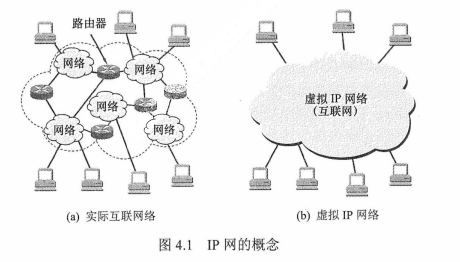

+ 虚拟互联网络，即**逻辑互联网络**，即互联起来的各种物理网络的异构性本来是客观存在的，但是通过IP就可以使这些性能各异的网络在网络层上看起来好像是一个统一的网络。这种使用IP的虚拟互联网络简称**IP网络**

+ 使用**虚拟互联网络**的好处是，当互联网上的主机进行通信时，就好像在一个网络上通信一样，而看不见互联网的具体的网络异构细节

  + 如具体的**编址方案、路由选择协议**等

### 路由与转发

+ 路由器主要完成两个功能：**路由选择（确定哪一条路径）**和**分组转发（当一个分组到达时所采取的动作）**。前者是根据特定的**路由选择协议**构造出路由表，同时经常或定期地和相邻路由器交换路由信息而不断地更新和维护路由表。后者处理通过路由器的数据流，关键操作是转发表查询、转发及相关的队列管理和任务调度等
  + `路由选择`
    + 按照复杂的分布式算法，根据从各相邻路由器所得到的关于整个网络拓扑的变化情况，动态地改变所选择的路由
  + `分组转发`
    + 指路由器根据**转发表**将用户的IP数据报从合适的端口转发出去。
+ **路由表**是根据路由选择算法得出的，**转发表**是从路由表得出的。**转发表**的结构应当使查找过程最优化，**路由表**则需要对网络拓扑变化的计算最优化。
  + 在讨论路由选择的原理时，往往不去区分**转发表**和**路由表**，而是笼统地使用**路由表**一词

### 拥塞控制

+ 在通信子网中，因出现过量的分组而引起网络性能下降的现象，称为**拥塞**

+ 如下图，当分组到达路由器的速率接近于R时，平均时延急剧增加，并且会有大量的分组被丢弃（路由器端口的缓冲区是有限的），整个网络的吞吐量会骤降，源与目的地之间的平均时延也会变得近乎无穷大

  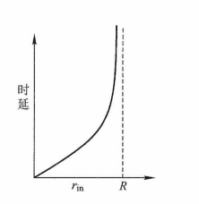

+ 判断网络是否进入**拥塞**状态的方法是

  + 观察网络的吞吐量与网络负载的关系
    + 如果随着网络负载的增加，网络的吞吐量明显小于正常的吞吐量，那么网络就可能已进入**轻度拥塞**状态
    + 如果网络的吞吐量随着网络负载的增大而下降，那么网络就可能已进入**拥塞**状态
    + 如果网络的负载继续增大，而网络的吞吐量下降到**零**，那么网络就可能已进入**死锁**状态

+ 为避免拥塞现象的出现，要采用能防止拥塞的一系列方法对子网进行拥塞控制。拥塞控制主要解决的问题是**如何获取网络中发生拥塞的信息**，从而利用这些信息进行控制，以避免由于拥塞而出现分组丢失，以及严重拥塞而产生网络死锁的现象

  + 拥塞控制的作用是**确保子网能够承载所达到的流量**，这是一个全局性的过程
    + 主机、路由器、路由器内部的转发处理等
    + 单一地增加资源并不能解决拥塞

+ **流量控制**VS**拥塞控制**

  + **流量控制**往往是指在发送端和接收端之间的点对点通信量的控制
  + **流量控制**所要做的是抑制发送端发送数据的速率，以便使接收端来得及接收
  + **拥塞控制**必须确保通信子网络能够传送待传送的数据，是一个全局性的问题，涉及网络中所有的主机、路由器、网络传输能力下降的所有因素

+ **拥塞控制**的方法

  + `开环控制`
    + 设计网络时事先将有关发生拥塞的**因素**考虑周到，力求网络在工作时不产生拥塞
    + 这是一种**静态**的预防方法，一旦整个系统启动运行，中途就不再需要修改
    + 开环控制手段如下
      + 确定何时可接收新流量
      + 确定何时可丢弃分组及丢弃哪些分组
      + 确定何种调度策略
      + 这些手段的共性是，**在做决定时，不考虑当前网络状态**
  + `闭环控制`
    + 事先不考虑有关发生拥塞的各种因素，采用**检测网络系统**去监视，及时检测哪里发生了拥塞，然后将拥塞信息传到合适的地方，以便调整网络系统的运行，并解决出现的问题
    + 闭环控制是基于**反馈环路**的概念，是一种**动态**的方法

## 路由算法

### 静态路由与动态路由

+ 路由器转发分组是通过**路由表**转发的，而路由表是通过各种算法得到的，从能否随网络的**通信量**或**拓扑**自适应地进行调整变化来划分
  + `静态路由算法（非自适应路由算法）`
    + 由网络管理员**手工配置**的路由信息
    + 当网络的**拓扑结构**或**链路的状态**发生变化时，网络管理员需要手工去修改路由表中相关的静态路由信息
    + 不能及时适应网络状态的变化，对于简单的小型网络，可以采用静态路由
  + `动态路由算法（自适应路由算法）`
    + 路由器上的**路由表项**是通过相互连接的**路由器**之间彼此交换信息，然后按照一定的算法优化出来的，而这些路由信息会在一定时间间隙里不断更新，以适应不断变化的网络，随时获得最优的寻路效果
  + **静态路由**算法的特点是**简便、开销较小**，在拓扑变化不大的小网络中运行效果很好
  + **动态路由**算法能改善网络的性能并有助于**流量控制**，但**算法复杂**，会**增加网络负担**，有时因对动态变化的反应太快而引起振荡，或反应太慢而影响网络路由的一致性
    + `距离-向量路由算法`
    + `链路状态路由算法`

### 距离-向量路由算法

+ 所有结点都定期地将它们的整个**路由选择表**传送给所有与之直接相邻的结点，这种路由表包含

  + `每条路径的目的地` **另一结点**

  + `路径的代价` **距离**

    > 这里的距离是一个抽象概念，如RIP将距离定义为**跳数**，跳数指从源端口到达目的端口所经过的路由器个数，每经过一个路由器，跳数加**1**

+ 这种算法中，所有结点都必须参与**距离向量交换**，以保证路由的有效性和一致性，也就是说，所有的结点都监听从其他结点传来的路由选择更新信息，并在下列情况下更新它们的路由选择表

  + 被通告一条新的路由，该路由在本结点的路由表中**不存在**，此时本地系统加入这条**新的路由**
  + 发来的路由信息中有一条到达某个目的地的路由，该路由与当前使用的路由相比，有较短的距离（**较小的代价**）。此种情况下，就用经过发送路由信息的结点的新路由替换路由表中到达那个目的地的现有路由

+ 距离-向量路由算法的实质是，**迭代计算**一条路由中的**站段数**或**延迟时间**，从而得到到达一个目标的**最短（最小代价）通路**。

  + 它要求每个结点在每次更新时，都将它的**全部路由表**发送给所有相邻的结点
  + 显然，**更新报文的大小**与**通信子网的结点个数**成正比，大的通信子网将导致很大的更新报文
  + 由于更新报文发给**直接邻接**的结点，所以所有结点都将参加路由选择信息交换
  + 基于这些原因，在通信子网上传送的**路由选择信息**的数量很容易变得非常大

+ 最常见的距离-向量路由算法是**RIP**算法，它采用**跳数**作为距离的度量

### 链路状态路由算法

+ 要求每个参与该算法的结点都具有完全的网络拓扑信息，它们执行以下两项任务
  + **主动测试所有邻接结点的状态**。两个共享一条链接的结点是**相邻结点**，它们连接到同一条链路，或者连接到同一广播型物理网络
  + **定期地将链路状态传播给所有其他结点（或称路由结点）**，典型的链路状态算法是**OSPF**算法
+ 在一个链路状态路由选择中，一个结点检查**所有直接链路**的状态，并将所得的状态信息发送给网上的所有其他结点，而不是仅送给那些**直接相连**的结点。每个结点都用这种方式从网上所有其他的结点接收包含直接链路状态的路由选择信息
+ 每当链路状态报文到达时，路由结点便使用这些**状态信息**去更新自己的网络拓扑和状态视野图，一旦链路状态发生变化，结点就对更新的网络图利用**Dijkstra最短路径算法**重新计算路由，从单一的源出发计算到达所有目的结点的最短路径
+ **链路状态路由算法**主要有三个特征
  + **向本自治系统中的所有路由器**发送信息，这里使用的方法是**泛洪法**，即路由器通过所有端口向所有相邻的路由器发送信息。而每个相邻路由器又将此信息发往其所有相邻路由器
    + **不再发送给刚刚发来信息的那个路由器**

  + 发送的信息是与**路由器相邻**的所有路由器的链路状态，但这只是路由器所知道的部分信息。所谓**链路状态**，是指说明本路由器与哪些路由器相邻及该链路的**度量**。对于OSPF算法，链路状态的**度量**主要用来表示**费用、距离、时延、带宽**等
  + 只有当链路状态发生变化时，路由器才向所有路由器发送此信息

+ 由于一个路由器的链路状态只涉及**相邻路由器**的连通状态，而与整个互联网的规模并无直接关系，因此链路状态路由算法可以用于大型的或路由信息变化聚敛的互联网环境
+ 链路状态路由算法的主要**优点**是
  + 每个路由结点都使用同样的**原始状态数据**独立地计算路径，而不依赖中间结点的计算
  + 链路状态报文**不加改变**地传播，因此采用该算法易于**查找故障**
  + 当一个结点从所有其他结点接收到报文时，它可以在本地立即算计正确的通路，保证一步汇聚
  + 最后，由于链路状态报文仅运载来自单个结点关于直接链路的信息，其大小与网络中的路由结点数目无关，因此**链路状态算法**比**距离-向量算法**有更好的规模可伸展性

+ **距离-向量路由算法**VS**链路状态路由算法**
  + **距离-向量路由算法**中，每个结点仅与它的直接邻居交谈，它为它的邻居提供从**自己**到**网络中所有其他结点**的最低费用估计
  + **链路状态路由算法**中，每个结点通过广播的方式与其他结点交谈，但它仅告诉它们与它直接相连的链路的费用
  + 相较之下，**距离-向量路由算法**有可能遇到**路由环路**等问题

### 层次路由

+ 当网络规模扩大时，路由器的路由表成比例的增大。这不仅会消耗越来越多的**路由器缓冲区空间**，而且需要用更多的CPU时间来扫描路由表，用更多的带宽来交换路由状态信息。因此路由选择必须按照**层次**的方式进行
+ 因特网将整个互联网划分为许多较小的**自治系统**（**一个自治系统包含很多局域网**），每个自治系统有权自主地决定本系统内应采用何种**路由选择协议**。如果两个自治系统需要通信，那么就需要一种在两个自治系统之间的协议来屏蔽这些差异。因此，因特网把**路由选择协议**划分两大类
  + 一个自治系统内部所使用的路由选择协议称为**内部网关协议（IGP）**，也称**域内路由选择**，具体的协议有**RIP、OSPF**等
  + 自治系统之间所使用的路由选择协议称为**外部网关协议（EGP）**，也称**域间路由选择**，用在不同自治系统的路由器之间交换路由信息，并负责为分组在不同自治系统之间选择最优的路径。具体的协议有**BGP**
+ 使用**层次路由**时，OSPF将一个自治系统再划分为若干区域（Area)，每个路由器都知道在本区域内如何把**分组**路由到目的地的细节，但不用知道其他区域的内部结构
+ 采用**分层次**划分区域的方法虽然会使交换信息的种类增多，但也会使OSPF协议更加**复杂**，但这样做却能使每个区域内部交换路由信息的**通信量**大大减小，因而使OSPF协议能够用于规模很大的自治系统中

## IPv4

### IPv4分组

+ IPv4即现在普遍使用的IP（版本4）。IP定义数据传送的基本单元——**IP分组**及其确切的数据格式。IP也包括一套规则，指明分组如何处理、错误怎样控制。特别是IP还包含非可靠投递的思想，以及与此关联的分组路由选择的思想。

+ `IPv4分组的格式`

  + 一个IP分组由**首部**和**数据部分**组成。首部前一部分的**长度固定**，共**20B**，是所有IP分组必须具有的。在首部固定部分的后面是一些**可选字段**，其长度可变，用来提供**错误检测**及**安全**等机制

  + IP数据包的格式如下

    + 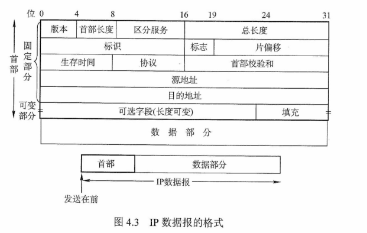

    + IP首部的部分重要字段含义如下

      + `版本`

        + IP的版本，目前广泛使用的是**4**

      + `首部长度`

        + 占**4**位，可以表示的最大十进制数是**15**，以32位为单位，最大值为60B（15*4B）。
        + 最常用的首部长度是**20B**，此时不使用任何选项（即可选字段）

      + `总长度`

        + 占**16**位，指首部和数据之和的长度，单位为**字节**，因此数据报的最大长度为**$2{16}-1=65535B$**
        + 以太网帧的最大传送单元（**MTU**）为**1500B**，因此当一个IP数据报封装成帧时，数据报的总长度（首部加数据）一定不能超过下面的`数据链路层`的MTU值

      + `标识`

        + 占**16**位
        + 是一个计数器，每产生一个数据报就加**1**，并赋值给**标识字段**
        + 不是**序号**，因为IP是无连接服务
        + 当一个数据报的长度**超过**网络的**MTU**时，必须**分片**，此时每个数据报片都复制一次**标识号**，以便能正确重装成原来的数据报

      + `标志`

        + 占**3**位
        + 标志字段的最低位为**MF**，**MF=1**表示后面还有分片，**MF=0**表示最后一个分片。标志字段中间的一位是**DF**，只有当**DF=0**时才允许分片

      + `片偏移`

        + 占**13**位，它指出较长的分组在分片后，某片在原分组中的相对位置
        + 片偏移以**8个字节**为偏移单位，即每个分片的长度一定是**8B（64位）**的整数倍

      + `生存时间`（**TTL**）

        + 占**8**位
        + 数据报在网络中可通过的**路由器数的最大值**，标识分组在网络中的寿命，以确保分组不会永远在网络中循环
        + 路由器在转发分组前，先把**TTL**减少**1**
        + 若TTL被减为**0**，则该分组必须丢弃

      + `协议`

        + 占**8**位
        + 指出此分组携带的数据使用何种协议，即分组的数据部分应交给哪个**传输层**协议
          + 如TCP、UDP等
          + 值为6表示TCP，为17表示UDP

      + `首部校验和`

        + 占**16**位
        + IP数据报的**首部**校验和只校验**分组的首部**，而**不**校验**数据部分**

      + `源地址字段`

        + 占**4B**，标识发送方的IP地址

      + `目的地址字段`

        + 占**4B**，标识接收方的IP地址

        > 在IP数据报首部中有三个关于**长度**的标记
        >
        > + 首部长度，基本单位为**4B**
        > + 总长度，基本单位为**1B**
        > + 片偏移，基本单位为**8B**

+ `IP数据报分片`

  + 一个**数据链路层**数据报能承载的最大数据量称为**最大传送单元（MTU）**。因为**IP数据报**被封装在**数据链路层**数据报中，因此**数据链路层**的MTU严格地限制着**IP数据报的长度**，而且在IP数据报的源与目的地路径上的各段链路可能使用不同的**数据链路层**协议，有不同的MTU

  + 当**IP数据报的总长度**大于**链路MTU**时，就需要将IP数据报中的数据分装在两个或多个较小的IP数据报中，这些较小的数据报称为**片**

  + **片**在目的地的**网络层**被重新组装。目的主机使用**IP首部**中的**标识**、**标志**和**片偏移**字段来完成对片的重组

  + 创建一个IP数据报时，源主机为该**数据报**加上一个**标识号**

    + 当一个路由器需要将一个数据报分片时，形成的每个数据报（即**片**）都具有**原始数据报**的标识号
    + 当目的主机收到来自**同一发送主机**的一批数据报时，它可以通过检查数据报的标识号来确定哪些数据报属于同一个原始数据报的**片**

  + IP首部中的标志位有**3**比特，但只有后**2**比特有意义，分别是**MF位（More Fragment）**和**DF位（Don't Fragment）**

    + 只有当**DF=0**时，该IP数据报才可以被**分片**
    + **MF**则用来告知目的主机该IP数据报是否为原始数据报的最后一个片
      + 当**MF=1**时，表示相应的原始数据报还有后续的片
      + 当**MF=0**时，表示该数据报是相应原始数据报的最后一个片

  + 目的主机在对片进行重组时，使用**片偏移字段**来确定片应放在原始IP数据报的**哪个位置**

  + **IP分片**涉及一定的计算

    + 一个长4000B的IP数据报（首部20B，数据部分3980B）到达一个路由器，需要转发到一条MTU为1500B的链路上。这意味着原始数据报中的3980B数据必须被分配到3个独立的**片**中（每片也是一个IP数据报）。假定原始数据报的标识号为777，那么分成的**3**片如下图

      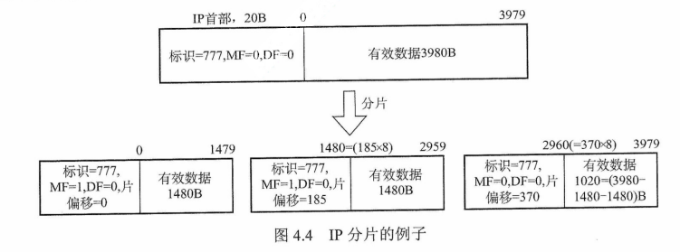

    + 可以看出，由于偏移值的单位是8B，所以除了最后一个片外，其他的所有片中的有效数据载荷都是8的倍数

+ `网络层转发分组的流程`

  + 网络层的路由器执行的分组转发算法如下

    1. 从数据报的首部提取**目的主机**的**IP地址D**，得出**目的网络地址N**
    2. 若**网络N**与此**路由器**直接相连，则把数据报直接交付给**目的主机D**，这称为路由器的**直接交付**，否则是**间接交付**，执行步骤3
    3. 若路由表中有**目的地址**为**D**的特定主机路由（对特定的目的主机指明一个特定的路由，通常是为了控制或测试网络，或出于安全考虑才采用的），则把数据报传送给路由表中所指明的下一跳路由器，否则，执行步骤4
    4. 若路由表中有到达**网络N**的路由，则把**数据报**传送给路由表指明的**下一跳**路由器；否则，执行步骤5
    5. 若路由表中有一个默认路由，则把数据报传送给路由表中所指明的默认路由器；否则，执行步骤6
    6. 报告转发分组出错

    > 得到下一跳路由器的IP地址后并不是直接将该地址填入待发送的**数据报**，而是将该**IP地址**转换成**MAC地址**（通过ARP），将其放到**MAC帧**首部中，然后根据这个**MAC地址**找到下一跳路由器。在不同网络中传送时，MAC帧中的**源地址**和**目的地址**要发送变化，但是网桥在转发帧时，不改变帧的**源地址**，请注意区分

### IPv4地址与NAT

+ IPv4地址

  + 连接到因特网上的每台主机（或路由器）都分配一个**32**比特的全球唯一标识符，即**IP地址**。传统的IP地址是分类的地址，分为**A、B、C、D、E**五类

  + 无论哪类IP地址，都由**网络号**和**主机号**两部分组成。即**IP地址::={<网络号>, <主机号>}**。其中**网络号**标志主机（或路由器）所连接到的网络。一个网络号在整个因特网范围内必须是唯一的。**主机号**标志该主机（或路由器）。一台主机号在它前面的**网络号**所指明的网络范围必须是唯一的。由此可见，一个IP地址在整个因特网范围内是唯一的。

  + 分类的IP地址如下

    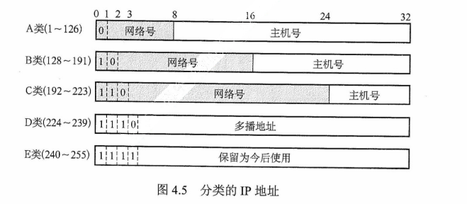

    + 在各类IP地址中，有些IP地址具有特殊用途，不用做主机的IP地址

      + **主机号全为0**表示本网络本身，如 202.98.174.0
      + **主机号全为1**表示本网络的广播地址，又称**直接广播地址**，如 202.98.174.255
      + **127.0.0.0**保留为**环回自检（Loopback Test）**地址，此地址表示任意主机本身，目的地址为环回地址的IP数据报永远不会出现在任何网络上
      + **32位全为0**，即**0.0.0.0**表示本网络上的本主机
      + **32位全为1**，即**255.255.255.255**表示整个TCP/IP网络的广播地址，又称**受限广播地址**。实际使用时，由于路由器对广播域的隔离，**255.255.255.255**等效为**本网络的广播地址**

    + 常用的三种类别IP地址的使用范围如下

      | 网络类别 | 最大可用网络数 | 第一个可用的网络号 | 最后一个可用的网络号 | 每个网络中的最大主机数 |
      | :------: | :------------: | :----------------: | :------------------: | :--------------------: |
      |    A     |    2^7 - 2     |         1          |         126          |        2^24 - 2        |
      |    B     |    2^14 - 2    |       128.1        |       191.255        |        2^16 - 2        |
      |    C     |    2^21 - 1    |      192.0.1       |     223.255.255      |        2^8 - 2         |

      + A类地址可用的网络数，减2的原因
        + 网络号字段全为**0**的IP地址是**保留地址**，意思是本网络
        + 网络号为**127**的IP地址是**环回自检地址**
      + B类地址可用的网络数，减1的原因
        + **128.0**这个网络号是不可指派的
      + C类地址可用的网络数，减1的原因
        + 网络号为**192.0.0**的网络是不可指派的

  + IP地址有以下重要特点

    + 每个IP地址都由**网络号**和**主机号**两部分组成，因此IP地址是一种**分等级**的地址结构
      + 分等级的好处是
        + IP地址管理机构在分配IP地址时，只分配了**网络号**（第一级），而**主机号**（第二级）则由得到该网络的单位自行分配，方便了IP地址的管理
        + 路由器仅根据**目的主机**所连接的**网络号**来转发分组（而不考虑目标主机号），从而减少了路由表所占的存储空间
    + IP地址是标志一台主机（或路由器）和一条链路的接口。当一台主机同时连接到两个网络时，该主机就必须同时具有两个相应的IP地址，每个IP地址的**网络号**必须与所在网络的**网络号**相同，且这两个IP地址的**网络号**是不同的。因此，IP网络上的一个路由器必然至少应具有两个**IP地址**（**路由器每个端口必须至少分配一个IP地址**）
    + 用**转发器**或**桥接器（网桥等）**连接的若干LAN仍然是同一个网络（同一个广播域），因此该LAN中所有主机的IP地址的**网络号**必须相同，但**主机号**必须不同
    + 在IP地址中，所有分配到**网络号**的网络（无论是LAN还是WAN）都是平等的
    + 在同一个局域网上的主机或路由器的IP地址中的**网络号**必须是一样的。路由器总是具有**两个或两个以上**的IP地址，路由器的每个端口都有一个**不同网络号**的IP地址

+ 网络地址转换（**NAT**）

  + 指通过将**专用网络地址**（如Intranet）转换为**公用地址**（如Internet），从而对外隐藏内部管理的IP地址。它使得整个**专用网**只需要一个**全球IP地址**就可以与因特网连通，由于专用网本地IP地址是可重用的，所以NAT大大节省了IP地址的消耗。同时，它隐藏了内部网络结构，从而降低了内部网络受到攻击的风险。

  + 此外，为了网络安全，划出了部分IP地址为**私有IP地址**。私有IP地址只用于**LAN**，不用于**WAN**连接（因此**私有IP地址**不能直接用于Internet，必须通过**网关**利用**NAT**把**私有IP地址**转换为Internet中合法的**全球IP地址**后才能用于Internet），并且允许私有IP地址被LAN重复使用。这有效地解决了IP地址不足的问题。

  + 私有IP地址网段如下

    + A类：1个A类网段，即 **10.0.0.0 ~ 10.255.255.255**
    + B类：16个B类网段，即**172.16.0.0 ~ 172.31.255.255**
    + C类：256个C类网段，即**192.168.0 ~ 192.168.255.255**

  + 在因特网中的所有路由器，对**目的地址**是私有地址的数据报一律不进行转发。这种采用私有IP地址的互联网络称为**专用互联网**或**本地互联网**。私有IP地址也称**可重用地址**

  + 使用NAT时，需要在专用网连接到因特网的路由器上安装**NAT软件**，NAT路由器至少有一个有效的外部全球地址。使用本地地址的主机和外界通信时，**NAT路由器**使用**NAT转换表**将**本地地址**转换成**全球地址**，或将**全球地址**转换成**本地地址**。**NAT转换表**中存放着**{本地IP地址：端口}到{全球IP地址：端口}**的映射。通过**{IP地址：端口}**这样的映射方式，可让多个**私有IP地址**映射到同一个**全球IP地址**

    > **普通路由器**在转发**IP数据报**时，不改变其**源IP地址**和**目的IP地址**。而**NAT路由器**在转发IP数据报时，一定要更换其**IP地址**（转换源IP地址或目的IP地址）。普通路由器仅工作在**网络层**，而NAT路由器转发数据报时，需要查看和转换**传输层**的端口号

### 子网划分与子网掩码、CIDR

+ 子网划分

  + 两级IP地址的**缺点**

    + IP地址空间的**利用率**有时很低
    + 给每个物理网络分配一个**网络号**会使路由表变得太大而使网络性能变坏
    + 两级的IP地址**不够灵活**

  + 1985年起，IP地址中增加一个**子网号字段**，使**两级IP地址**变成了**三级IP地址**。这种做法称为**子网划分**。子网划分已经成为**因特网的正式标准协议**

  + 子网划分的**基本思路**如下

    + 子网划分纯属一个单位内部的事情。单位对外仍然表现为**没有划分子网的网络**
    + 从**主机号**借用若干比特作为**子网号**，当然主机号也就相应减少了相同的比特。三级IP地址的结构如下
      + **IP地址={<网络号>, <子网号>, <主机号>}**
    + 凡是从其他网络发送给本单位某台主机的IP数据报，仍然是根据IP数据报的**目的网络号**，先找到连接到本单位网络上的路由器。然后该路由器在收到IP数据报后，按**目的网络号**和**子网号**找到目的子网。最后把IP数据报直接交付给**目的主机**

    > + 划分子网只是把IP地址的**主机号**这部分进行再划分，而不改变IP地址原来的**网络号**。因此，从一个IP地址本身或IP数据报的首部，无法判断源主机或目的主机所连接的网络是否进行了子网划分
    > + RFC 950规定，对分类的IPv4地址进行**子网划分**时，**子网号**不能**全为1或全为0**。但随着CIDR的广泛使用，现在**全1和全0**的**子网号**也可使用，但一定要谨慎使用，要弄清你的路由器所用的路由选择软件是否支持**全1或全0**的子网号
    > + 不论是分类的IPv4地址还是CIDR，其子网中的**主机号**为**全0或全1**的地址都不能被指派。子网中主机号全0的地址为子网的**网络号**，主机号全1的地址为子网的**广播地址**

+ 子网掩码

  + 为了告诉主机或路由器对一个A类、B类、C类网络进行了**子网划分**，使用子网掩码来表达对原网络中主机号的借位
  + 子网掩码是一个与IP地址相对应的、长32bit的二进制串，它由一串1和跟随的一串0组成。其中，**1**对应于IP地址中的**网络号及子网号**，而**0**对应于**主机号**。计算机只需将**IP地址**和其对应的**子网掩码**逐位**与**，就可得出相应子网的网络地址
  + 现在的因特网标准规定：所有的网络都必须使用**子网掩码**，如果一个网络未划分子网，那么就采用默认子网掩码。A、B、C类地址的默认子网掩码分别为**255.0.0.0**、**255.255.0.0**、**255.255.255.0**
  + 由于子网掩码是一个网络或一个子网的重要属性，所以路由器在相互之间**交换路由信息**时，必须把自己所在**网络（或子网）**的子网掩码告诉对方。**路由表**中的每个条目，除要给出目的网络地址和下一跳地址外，还要同时给出该目的网络的**子网掩码**
  + 使用**子网掩码**的情况下
    + 一台主机在设置IP地址信息的同时，必须设置**子网掩码**
    + 同属于一个子网的所有主机及路由器的相应端口，必须设置相同的子网掩码
    + 路由器的路由表中，所包含信息的主要内容必须有**目的网络地址、子网掩码、下一跳地址**
  + 使用子网掩码时路由器的分组转发算法如下
    1. 从收到的分组的首部提取目的IP地址，记为**D**
    2. 先判断是否为**直接交付**。对路由器直接相连的网络逐个进行检查
       + 用各网络的子网掩码和**D**逐位相**与**，看结果是否和相应的网络地址匹配
       + 若匹配，则将分组**直接交付**，否则**间接交付**，执行步骤3
    3. 若路由表中有**目的地址**为D的**特定主机路由**，则将分组传送给路由表中所指明的**下一跳路由器**，否则，执行4
    4. 对路由器中的每一行（**目的网络地址、子网掩码、下一跳地址**）中的**子网掩码**和**D**逐位相**与**，其结果为**N**。若**N**与该行的**目的网络**地址匹配，则将分组传送给该行指明的下一跳路由器；否则，执行步骤5
    5. 若路由表中有一个**默认路由**，则将分组传送给路由表中所指明的默认路由器；否则，执行步骤6
    6. 报告转发分组出错

+ 无分类域间路由选择（CIDR）

  + 是在变长子网掩码的基础上提出的一种消除传统（A、B、C类网络划分），并且可以在软件的支持下实现**超网构造**的一种IP地址的划分方法
  + CIDR的主要特点如下
    + 消除了传统A、B、C类地址及划分子网的概念，因而可以更有效地分配IPv4的地址空间
    + CIDR使用**网络前缀**的概念代替了子网络的概念
      + 因此，IP地址的无分类两级编址为**IP::={<网络前缀>, <主机号>}**
    + CIDR使用**斜线记法**（或称**CIDR记法**），即**IP地址/网络前缀所占比特数**
      + 网络前缀所占比特数对应于网络号的部分，等效于**子网掩码**中连续1的部分
    + CIDR虽然不使用**子网**，但仍然使用**掩码**一词
      + CIDR并没有在32位地址中指明若干位作为子网字段。但分配到一个CIDR地址块的组织，仍可以在本组织内根据需要划分出一些子网
        + 某组织分配到**地址块/20**，就可以再继续划分为8个子网（从主机号中借用3位来划分子网），这时候每个子网的网络前缀就变成了23位。**全0和全1的主机号地址一般不用**
    + 将网络前缀都相同的连续IP地址组成**CIDR地址块**。一个CIDR地址块可以表示很多地址，这种地址的聚合称为**路由聚合**，或称**构成超网**。路由聚合使得路由表的一个项目可以表示多个原来传统分类地址的路由，有利于减少路由器之间的路由选择信息的交换，从而提高网络性能
  + CIDR地址块中的地址数一定是**2的整数次幂**，实际可指派的地址数通常为**$2^N-2$**，**N**表示**主机号的位数**，主机号全0代表**网络号**，主机号全1为**广播地址**。网络前缀越短，其地址块所包含的地址数就越多。而在三级结构的IP地址中，划分子网使**网络前缀**变长
  + CIDR的优点在于**网络前缀长度的灵活性**。由于上层网络的前缀长度较短，因此相应的路由表的项目较少。而内部又可采用**延长网络前缀**的方法来灵活地划分子网
  + **最长前缀匹配**（最佳匹配）：
    + 使用CIDR时，路由表中的每个项目由**网络前缀**和**下一跳地址**组成。在查找路由表时可能会得到不止一个匹配结果。此时，应当从匹配结果中选择具有最长网络前缀的路由，因为网络前缀越长，其地址块就越小，因而路由就越具体
  + CIDR查找路由表的方法
    + 为了更加有效地查找**最长前缀匹配**，通常将无分类编址的路由表存在放一种**层次式数据结构**中，然后自上而下地按层次进行查找。
      + 这里最常用的数据结构就是**二叉线索**

### ARP、DHCP、ICMP

+ IP地址与硬件地址

  + **IP地址**是**网络层**使用的地址，它是**分层次等级**的。

  + **硬件地址**是**数据链路层**使用的地址，它是**平面式**的

  + 在**网络层**及**网络层之上**使用IP地址，IP地址放在IP数据报的首部，而MAC地址放在MAC帧的首部。通过数据封装，把IP数据报分组封装为MAC帧后，**数据链路层**看不见数据报分组中的IP地址

  + 由于路由器的隔离，IP网络中无法通过**广播方式**依靠**MAC地址**来完成跨网络的寻址，因此在IP网络的**网络层**只使用IP地址来完成寻址。

  + 寻址时，每个路由器依据其**路由表**（依靠静态路由或动态路由协议生成）选择到**目标网络**（即主机号全为0的网络地址）需要转发到的**下一跳**（路由器的物理端口号或下一网络地址），而IP分组通过多次路由转发到达目标网络后，改为在目标LAN中通过**数据链路层**的MAC地址以**广播方式**寻址，这样可以提高路由选择的效率。

    + 在IP层抽象的互联网上只能看到IP数据报
    + 虽然在IP数据报首部中有完整的**源IP地址**和**目的IP地址**，但路由器只根据**目的IP地址**的**网络号**进行路由选择
    + 在局域网的**数据链路层**，只能看见MAC帧。而通过**路由器**转发IP分组时，此IP分组在每个网络中都被路由器**解封装**和**重新封装**。因此IP数据报在被路由器转发时，其**数据链路层**封装所使用的MAC地址是不断改变的。这也决定了无法使用MAC地址跨网络通信。
    + 尽管互联在一起的网络的硬件地址体系各不相同，但IP层抽象的互联网却屏蔽了下层这些复杂的细节。只要我们在网络层上讨论问题，就能够使用统一的、抽象的IP地址研究主机与主机或路由器之间的通信

    > 路由器由于互联多个网络，因此它不仅有多个IP地址，也有多个硬件地址

+ 地址解析协议（**ARP**）
  + 无论**网络层**使用什么协议，在实际网络的链路上传送数据帧时，最终必须使用**硬件地址**。所以需要一种方法来完成IP地址到MAC地址的映射，这就是**地址解析协议（Address Resolution Protocol, ARP）**。每台主机都设有一个ARP高速缓存，用来存放本局域网上各主机和路由器的IP地址到MAC地址的映射表，称ARP表。使用ARP来动态维护此ARP表。
  
  + ARP工作在**网络层**，其工作原理如下
    + 主机A欲向本局域网上的某台主机B发送IP数据报时，先在其**ARP高速缓存**中查看有无主机B的IP地址
      + **有**，就可查出其对应的硬件地址，再将此硬件地址写入**MAC**帧，然后通过局域网将该MAC帧发往此硬件地址
      + **没有**，就通过使用目的**MAC**地址为**FF-FF-FF-FF-FF-FF**的帧来封装并广播ARP请求分组，使同一个局域网里的所有主机收到**ARP请求**
        + 主机B收到该ARP请求后，向主机A发出响应ARP分组，分组中包含主机B的**IP**与**MAC地址**的映射关系，主机A在收到后将此映射写入**ARP缓存**，然后按查询到的硬件地址**发送MAC帧**
        + ARP由于**看到了**IP地址，所以它工作在**网络层**，而NAT路由器由于**看到了**端口，所以它工作在传输层。
        + **对于某个协议工作在哪个层次，读者应该能通过协议的工作原理进行猜测**
      
      > ARP用于解决同一个局域网上的主机或路由器的**IP地址**和**硬件地址**的映射问题。如果所要找的主机和源主机**不在同一个局域网**上，那么就要通过ARP找到一个位于本局域网上的某个路由器的硬件地址，然后把分组发送给这个路由器，让这个路由器把分组转发给下一个网络。剩下的工作就由下一个网络来做，尽管ARP请求分组是**广播**发送的，但ARP相应分组是普通的**单播**，即从一个源地址发送到一个目的地址
    
  + ARP的4种典型情况如下
  
    + 发送方是**主机**时，要把IP数据报发送到本网络上的另一台主机。这时用ARP找到**目的主机**的硬件地址
    + 发送方是**主机**时，要把IP数据报发送到另一个网络上的一台主机。这时用ARP找到本网络上的一个**路由器**的硬件地址，剩下的工作由这个路由器来完成
    + 发送方是**路由器**时，要把IP数据报转发到本网络上的一台主机。这时用ARP找到**目的主机**的硬件地址
    + 发送方是**路由器**时，要把IP数据报转发到另一个网络上的一台主机。这时用ARP找到本网络上的一个路由器的硬件地址，剩下的工作由找到这个路由器完成
  
  + 从**IP地址**到**硬件地址**的解析是自动进行的，主机的用户并不知道这种地址解析过程。只要主机或路由器和本网络上的另一个已知IP地址的主机或路由器进行通信，ARP就会自动将这个IP地址解析为**数据链路层**所需要的硬件地址
  
+ 动态主机配置协议（**Dynamic Host Configuration Protocol，DHCP**）

  + 常用于给主机动态地分配IP地址，它提供了**即插即用**的联网机制，这种机制允许一台计算机加入新的网络和获取IP地址而不用手工参与

  + 是**应用层**协议，基于UDP

  + **工作原理**如下

    + 使用**客户/服务器**方式
    + 需要IP地址的主机在启动时就向**DHCP服务器**广播发送发现报文，这时该主机就成为**DHCP**客户
    + 本地网络上所有主机都能收到此广播报文，但只有DHCP服务器才回答此广播报文
    + DHCP服务器先在其数据库中查找该计算机的配置信息
      + 若**找到**，则返回找到的信息
      + 若**找不到**，则从服务器的IP地址池中取一个地址分配给该计算机

    + DHCP服务器的回答报文称为**提供报文**

  + DHCP服务器聚合DHCP客户端的**交换过程**如下

    + DHCP客户机广播**DHCP发现**消息，试图找到网络中的DHCP服务器，以便从DHCP服务器获得一个IP地址
    + DHCP服务器收到**DHCP发现**消息后，向网络中广播**DHCP提供**消息，其中包括提供**DHCP**客户机的IP地址和相关配置信息
    + DHCP客户机收到**DHCP提供**消息，如果接收DHCP服务器所提供的相关参数，那么通过广播**DHCP请求**消息向DHCP服务器请求提供IP地址
    + DHCP服务器广播**DHCP确认**消息，将IP地址分配给DHCP客户机

  + DHCP允许网络上配置多台**DHCP服务器**，当DHCP客户机发出**DHCP请求**时，有可能收到多个应答消息。这时，DHCP客户机只会挑选其中的一个，通常挑选**最先到达的**

  + DHCP服务器分配给DHCP客户的**IP地址**是临时的，因此DHCP客户只能在一段有限的时间内使用这个分配到的IP地址。DHCP称这段时间为**租用期**。租用期的数值应由**DHCP服务器**自己决定，DHCP客户也可在自己发送的报文中提出对**租用期**的要求

  + DHCP是**应用层**协议，因为它是通过**客户/服务器**方式工作的，DHCP客户端向DHCP服务器请求服务。

    > **应用层**协议有两种工作方式
    >
    > + **客户/服务器**方式
    > + **P2P**方式
    >
    > 其他层次的协议是没有这两种工作方式的

  + DHCP的客户端和服务器端需要通过**广播**方式来进行交互，原因是在DHCP执行初期，客户端不知道服务器端的IP地址，而在执行中间，客户端并未被分配IP地址，从而导致两者之间的通信必须采用**广播**的方式。采用**UDP**而不采用**TCP**的原因也很明显：**TCP**需要建立连接，如果连对方的IP地址都不知道，那么更不可能通过双方的**套接字**建立连接

+ 网际控制报文协议（**Internet Control Message Protocol，ICMP**）

  + 为了提高IP数据报交付成功的机会，在网络层使用了ICMP来让主机或路由器报告差错和异常情况。ICMP报文作为IP层数据报的数据，加上数据报的**首部**，组成**IP数据报**发送出去。
  + ICMP是**IP层**协议
  + ICMP报文的种类有两种
    + **ICMP**差错报告报文
      + 用于目标主机或到目标主机路径上的**路由器**向**源主机**报告差错和异常情况，共有**5**种类型
        + `终点不可达`
          + 当路由器或主机不能交付**数据报**时，就向源点发送终点不可达报文

        + `源点抑制`
          + 当路由器或主机由于**拥塞**而丢弃数据报时，就向源点发送源点抑制报文，使源点知道应当把数据报的发送速率放慢

        + `时间超过`
          + 当路由器收到**生存时间（TTL）**为零的数据报时，除丢弃该数据报外，还要向源点发送**时间超过报文**。当终点在预先规定的时间内不能收到一个数据报的全部数据报片时，就把已收到的数据报片都丢弃，并向源点发送**时间超过报文**

        + `参数问题`
          + 当路由器或目的主机收到的数据报的首部中有的字段的**值不正确**时，就丢弃该数据报，并向源点发送参数问题报文

        + `改变路由（重定向）`
          + 路由器把**改变路由报文**发送给主机，让主机知道下次应将数据报发送给另外的路由器（可通过更好的路由）

      + **不应发送**ICMP差错报告报文的几种情况如下
        + 对ICMP差错报告报文不再发送ICMP差错报告报文
        + 对第一个分片的数据报片的所有后续数据报片都不发送ICMP差错报告报文
        + 对具有**组播**地址的数据报都不发送ICMP差错报告报文
        + 对具有**特殊地址（如127.0.0.1或0.0.0.0）**的数据报不发送ICMP差错报告报文

    + **ICMP**询问报文
      + `回送请求和回答报文`
      + `时间戳请求和回答报文`
      + `掩码地址请求和回答报文`
      + `路由器询问和通告报文`
      + 前两类最常用

  + ICMP的两个常见应用是**分组网间探测PING**（用来测试两台主机之间的连通性）和**Traceroute**（UNIX中的名字，在Windows中是**Tracert**，可以用来跟踪分组经过的路由）
    + **PING**使用了**ICMP回送请求和回答报文**，工作在**应用层**，直接使用**网络层**的ICMP，而未使用**传输层**的TCP或UDP
    + **Traceroute**使用了**ICMP时间超过报文**，工作在**网络层**

## IPv6

+ 解决**IP地址耗尽**的措施有以下三种
  + 采用无类别编址CIDR，使IP地址的分配更加合理
  + 采用网络地址转换（NAT）方法以节省全球IP地址
  + 采用具有更大地址空间的新版本IPv6
+ IPv6的**主要特点**
  + 更大的地址空间，IPv6将地址从IPv4的**32**位增大到了**128**位，IPv6的字节数（16B）是IPv4字节数（4B）的平方
  + 扩展的地址层次结构
  + 灵活的首部格式
  + 改进的选项
  + 允许协议继续扩充
  + 支持即插即用（即自动配置）
  + 支持资源的预分配
  + IPv6只有在包的源结点才能分片，是**端到端**的，传输路径中的路由器不能分片，所以从一般意义上说，**IPv6不允许分片**（不允许类似IPv4的路由分片）
  + IPv6的首部长度必须是**8B**的整数倍，而IPv4的首部是**4B**的整数倍
  + 增大了安全性。**身份验证**和**保密功能**是IPv6的关键特征
+ 虽然IPv6与IPv4不兼容，但总体而言它与所有其他的因特网协议兼容，包括**TCP、UDP、ICMP、IGMP、OSPF、BGP、DNS**，只是在少数地方做了必要的修改（大部分是为了处理长的地址）。IPv6相当好地满足了预定的目标，主要体现在
  + **IPv6有比IPv4长得多的地址**
  + **简化了IP分组头**，包含8个域（IPv4是12个域）。这一改变使得路由器能够更快地处理分组，从而可以改善**吞吐率**
  + **更好地支持选项**。这一改变对新的分组首部很重要，因为一些从前必要的段现在变成了**可选段**。此外，表示选项的方式的改变还能加快分组的处理速度

### IPv6地址

+ IPv6数据报的目的地址可以是以下三种基本类型地址之一
  + `单播`
    + 传统的**点对点**通信
  + `多播`
    + **一对多**的通信，分组被交付到一组计算机的每台计算机
  + `任播`
    + IPv6新增的一种类型，任播的目的站是一组计算机，但数据报在交付时只交付其中的一台计算机，通常是距离最近的一台计算机
+ IPv4地址通常使用**点分十进制**表示法。如果IPv6也采用这种表示法，那么地址写起来将会想当长。在IPv6标准中指定了一种比较紧凑的表示法，**把地址中的每4位用一个十六进制数表示，并用冒号分割每16位**。
  + 如4BF5:AA12:0216:FEBC:BA5F:039A:BE9A:2170
+ 通常可以把IPv6地址缩写成更紧凑的形式。当16位域的开头有一些0时，可以采用一种**缩写表示法**，但在域中必须至少有一个数字
  + 例如，可以把地址 **4BF5:0000:0000:BA5F...**缩写为**4BF5:0:0:BA5F**
+ 当有相继的0值域时，还可以进一步缩写。这些域可以用**双冒号**缩写。双冒号表示法在一个地址中**仅能出现一次**，因为0值域的个数没有编码，需要从指定的总的域的个数来推算，这样一来，前述地址可以缩写成**4BF5::BA5F...**
+ IPv6扩展了IPv4地址的分级概念，它使用以下**3**个等级。主要是为了使**路由器能够更快地查找路由**
  + 第一级，**顶级**，指明全球都知道的公共拓扑
  + 第二级，**场点级**，指明单个场点
  + 第三级，指明单个网络接口
+ IPv4向IPv6过渡可以采用**双协议栈**和**隧道技术**两种策略
  + **双协议栈**技术是指在一台设备上同时装有IPv4和IPv6协议栈，那么这台设备能与IPv4和IPv6网络通信
    + 如果这台设备是**路由器**，那么在路由器的不同接口上分别配置了IPv4和IPv6地址，并很可能分别连接了IPv4和IPv6网络
    + 如果这台设备是**计算机**，那么它将同时拥有IPv4和IPv6地址，并具备同时处理这两个协议地址的功能
  + **隧道技术**是将整个IPv6数据报封装到IPv4数据报的数据部分，使得IPv6数据报可以在IPv4网络的隧道中传输

## 路由协议

### 自治系统 （**Autonomous System，AS**）

+ 单一技术管理下的**一组路由器**，这些路由器使用一种**AS内部**的**路由选择协议**和共同的度量来确定分组在该AS内的路由，同时还使用一种**AS之间**的路由选择协议来确定分组在AS之间的路由
+ 一个自治系统内的所有网络都由一个**行政单位**管辖，一个自治系统的所有路由器在本自治系统内都必须是连通的

### 域内路由与域间路由

+ 自治系统内部的路由选择称为**域内路由选择**，自治系统之间的路由选择称为**域间路由选择**
+ 因特网有两大类路由选择协议
  + `内部网关协议`（**Interior Gateway Protocol，IGP**）
    + 在一个自治系统内部使用的**路由选择协议**，它与互联网中其他自治系统选用什么路由选择协议无关
    + 目前这类路由选择协议使用得最多
      + 如**RIP、OSPF**
  + `外部网关协议`（**External Gateway Protocol，EGP**）
    + 若源点和目的站处在不同的自治系统中，当数据报传到一个自治系统的**边界**时（两个自治系统可能使用不同的IGP），就需要使用一种协议将路由选择信息传递到另一个自治系统中
    + 目前使用最多的外部网关协议是**BGP-4**

### 路由信息协议（**Routing Information Protocol，RIP**）

+ 是内部网关协议（IGP）中最先得到广泛应用的协议。RIP是一种分布式的基于**距离向量**的路由选择协议，其最大优点是**简单**
+ **RIP规定**
  + 网络中的每个路由器都要维护从它自身到其他每个目的网络的**距离记录**（因此这是一组距离，称为**距离向量**）
  + 距离也称**跳数**（Hop Count），规定从一个路由器到直接连接网络的距离（跳数）为1。而每经过一个路由器，距离（跳数）加1
  + RIP认为好的路由就是它**通过的路由器的数目最少**，即优先选择跳数少的路径
  + RIP允许一条路径最多只能包含15个路由器（即最多允许15跳）。因此距离等于16时，它表示网络不可达。可见RIP只适用于小型互联网。**距离向量路由**可能会出现环路的情况，规定路径上的最高跳数的目的是为了**防止数据报不断循环在环路上**，减少网络拥塞的可能性
  + RIP默认在任意两个使用RIP的路由器之间每30秒广播一次**RIP路由更新信息**，以便自动建立并维护路由表（动态维护）
  + 在RIP中不支持子网掩码的RIP广播，所以RIP中每个网络的子网掩码必须相同。但在新的**RIP2**中，支持变长子网掩码和CIDR
+ **RIP的特点**（注意对比**OSPF**的特点）
  + 仅和**相邻路由器**交换信息
  + 路由器交换的信息是当前路由器所知道的**全部信息**，即自己的路由表
  + 按固定的**时间间隔**交换路由信息，如每隔30秒
+ RIP通过**距离向量**算法来完成路由表的更新。最初，每个路由器只知道与自己直接相连的网络。通过每30秒的RIP广播，相邻两个路由器相互将自己的路由表发给对方。
  + 于是经过第一次RIP广播，每个路由器就知道了与自己相邻的路由器的路由表（即知道了距离自己跳数为1的网络的路由）
  + 同理，经过第二次RIP广播，每个路由器就知道了距离自己跳数为2的网络的路由
  + 因此，经过若干RIP广播后，所有路由器都最终知道了整个IP网络的路由表，成为RIP最终是收敛的
  + 通过RIP收敛后，每个路由器到每个目标网络的路由都是距离最短的（即**跳数最少，最短路由**），哪怕还存在另一条高速（低时延）但路由器较多的路由
+ **距离向量算法**
  + 每个路由表项目都有三个关键数据：**<目的网络N，距离d，下一跳路由器地址X>**。对于每个相邻路由器发送过来的RIP报文，执行如下步骤
    + 对地址为X的相邻路由器发来的RIP报文，先修改此报文中的所有项目
      + 把**下一跳**字段中的地址都改为X，并把所有**距离**字段的值加1
    + 对修改后的RIP报文中的每个项目，执行如下步骤
      + 当原来的路由表中**没有**目的网络N时，把该项目添加到路由表中
      + 当原来的路由表中**有**目的网络N，且下一跳路由器的地址是X时，用收到的项目替换原路由表中的项目
      + 当原来的路由表中**有**目的网络N，且下一跳路由器的地址不是X时
        + 如果收到的项目中的**距离d**小于路由表中的距离，那么就用收到的项目替换原路由表中的项目
        + 否则什么也不做
    + 如果180秒（RIP默认超过时间为**180**秒）还没有收到相邻路由器的更新路由表，那么把此相邻路由器记为**不可达路由器**，即把距离设置为16（**距离为16表示不可达**）
    + 返回
  + RIP最大的**优点**是**实现简单、开销小、收敛过程较快**，RIP的**缺点**如下
    + RIP限制了网络的规模，它能使用的最大距离为15（16表示不可达）
    + 路由器之间交换的是路由器中的**完整路由表**，因此网络规模越大，开销也越大
    + 网络出现故障时，会出现慢收敛现象（即需要较长时间才能将此信息传送到所有路由器），俗称**坏消息传得慢**，使更新过程的收敛时间长
  + RIP是应用层协议，它使用UDP传送数据（端口520），RIP选择的路由不一定是时间最短的，但一定是具有最少路由器的路径，因为它是根据**最少跳数**进行路径选择的

### 开放最短路径优先（OSPF）协议

+ OSPF协议的基本特点（**对比RIP**）

  + OSPF向本自治系统中的所有路由器发送信息，这里使用的方法是**洪泛法**。而RIP仅向自己相邻的几个路由器发送信息
  + 发送的信息是与本路由器相邻的所有路由器的链路状态，但这只是路由器所知道的部分信息
    + **链路状态**说明本路由器和哪些路由器相邻及该链路的**度量**，而在RIP中，发送的信息是本路由器所知道的全部信息，即**整个路由表**
  + 只有当链路状态发生变化时，路由器才用**洪泛法**向所有路由器发送此信息，并且更新过程收敛得快，不会出现RIP**坏消息传得慢**的问题。而在RIP中，不管网络拓扑是否发生变化，路由器之间都会定期交换路由表的信息
  + OSPF是**网络层**协议，它不使用UDP或TCP，而直接用IP数据报传送（其IP数据报首部的协议字段为89）。而RIP是**应用层**协议，它在**传输层**使用UDP。

+ OSPF的其他特点

  + OSPF对不同的链路可根据IP分组的不同服务类型（TOS）而设置成不同的代价，因此，OSPF对于不同类型的业务可计算出**不同的路由**，十分灵活
  + 如果到同一个目的网络有多条相同代价的路径，那么可以将**通信量**分配给这几条路径。这称为**多路径间的负载平衡**
  + 所有在OSPF路由器之间交换的分组都具有鉴别功能，因而保证了仅在可信赖的路由器之间交换链路状态信息
  + 支持可变长度的**子网划分**和**无分类编址CIDR**
  + 每个链路状态都带上一个32位的序号，序号越大，状态就越新

+ OSPF的基本工作原理

  + 由于各路由器之间频繁地交换链路状态信息，因此所有路由器最终都能建立一个**链路状态数据库**。这个数据库实际上就是全网的拓扑结构图，它在全网范围内是一致的（称为**链路状态数据库的同步**）。

    + 然后，每个路由器根据这个全网拓扑结构图，使用Dijkstra最短路径算法计算从自己到各目的网络的最优路径，以此构造自己的路由表。
    + 此后，当链路状态发生变化时，每个路由器重新计算到各目的网络的最优路径，构造新的路由表

    > 虽然使用了Dijkstra算法能计算出完整的最优路径，但路由表中不会存储完整路径，而只存储**下一跳**（只有到了下一跳路由器，才能知道再下一跳应当怎样走）

  + 为使OSPF能够用于规模很大的网络，OSPF将一个自治系统再划分为若干更小的范围，称为**区域**。划分区域的好处是，将利用**洪泛法**交换链路状态信息的范围局限于每个区域而非整个自治系统，减少了整个网络上的通信量。在一个区域内部的路由器只知道本区域的完整网络拓扑，而不知道其他区域的网络拓扑情况。这些情况也有层次之分。处在上层的域称为**主干区域**，负责连通其他下层的区域，并且还连接其他自治域。

+ OSPF的五种分组类型

  + `问候分组`
    + 用来发现和维持邻站的可达性
  + `数据库描述分组`
    + 向邻站给出自己的链路状态数据库中的所有链路状态项目的摘要信息
  + `链路状态请求分组`
    + 向对方请求发送某些链路状态项目的详细信息
  + `链路状态更新分组`
    + 用**洪泛法**对全网更新链路状态
  + `链路状态确认分组`
    + 对链路更新分组的确认

+ 通常每隔10秒，每两个相邻路由器要交换一次问候分组，以便知道哪些站可达

  + 在路由器刚开始工作时，OSPF让每个路由器使用**数据库描述分组**和**相邻路由器**交换本数据库中已有的**链路状态摘要信息**

  + 然后，路由器使用链路状态请求分组，向对方请求发送自己所**缺少**的某些链路状态项目的详细信息

  + 经过一系列的这种分组**交换**，就建立了全网同步的链路数据库

  + 如下图所示

    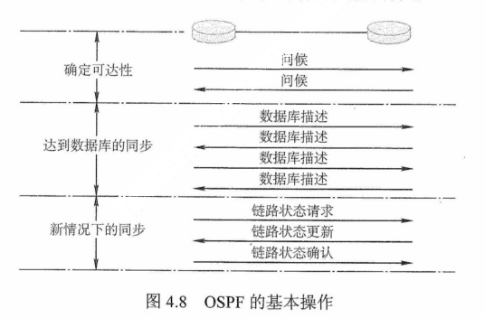

+ 在网络运行中，只要一个路由器的链路状态发生变化，该路由器就要使用**链路状态更新分组**，用**洪泛法**向全网更新链路状态。其他路由器在更新后，发送**链路状态确认分组**对更新分组进行确认

+ 为了确保链路状态数据库与全网的状态保持一致，OSPF还规定**每隔一段时间**（如30分钟）就刷新一次数据库中的链路状态。由于一个路由器的链路状态只涉及与**相邻路由器**的连通状态，因而与整个互联网的规模并无直接关系。因此，当互联网规模很大时，OSPF要比RIP好得多，而且OSPF协议没有**坏消息传播得慢**的问题

  > 教材上说OSPF协议不使用UDP数据报传送，而是直接使用IP数据报传送
  >
  > + 用**UDP**传送是指将该信息作为UDP报文的数据部分，**RIP**报文是作为UDP数据报的数据部分
  > + 直接使用**IP**数据报传送是指将该信息直接作为IP数据报的数据部分

### 边界网关协议 （**Border Gateway Protocol，BGP**）

+ 不同自治系统的路由器之间交换路由信息的协议，是一种外部网关协议。**边界网关协议**常用于互联网的网关之间。路由表包含**已知路由器的列表**、**路由器能够到达的地址**及**到达每个路由器的路径的跳数**

+ 内部网关协议主要设法使数据报在一个AS中尽可能有效地从**源站**传送到**目的站**。在一个AS内部不需要考虑其他方面的策略。然而BGP使用的环境却不同，主要原因如下

  + 因特网的规模太大，使得**自治系统之间**路由选择非常困难
  + 对于自治系统之间的路由选择，要寻找最佳路由是很不现实的
  + 自治系统之间的路由选择必须考虑有关策略

+ BGP只能力求寻找一条**能够到达目的网络且比较好的路由**（不能兜圈子），而并非寻找一条**最佳路由**。BGP采用的是**路径向量路由选择协议**，它与**距离向量协议**和**链路状态协议**有很大的区别。BGP是应用层协议，它是基于TCP的。

+ BGP的**工作原理**如下

  + 每个自治系统的管理员要选择至少一个路由器（可以有多个）作为该自治系统的**BGP发言人**
  + 一个BGP发言人与其他自治系统中的BGP发言人要交换路由信息，就要先建立TCP连接
    + BGP报文是通过TCP传送的，也就是说BGP报文是TCP报文的**数据部分**
  + 然后在此连接上**交换BGP报文**以建立BGP会话，再利用BGP会话交换路由信息
  + 当所有BGP发言人都相互交换网络可达性的信息后，各BGP发言人就可找出到达各个自治系统的较好路由

+ 每个BGP发言人除必须运行BGP外，还必须运行该AS所用的**内部网关协议**，如OSPF或RIP。BGP所交换的网络可达性信息就是要到达某个网络（用**网络前缀**）表示所要经过的一系列AS

  + 下图是BGP发言人交换路径向量的例子

    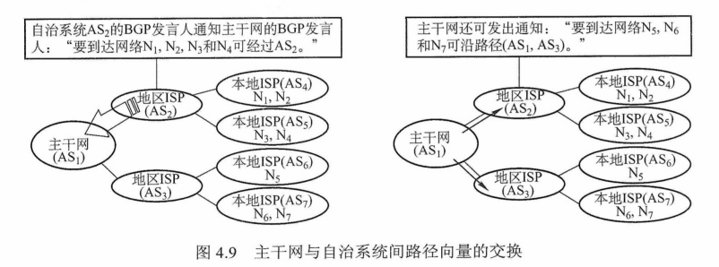

+ BGP的**特点**如下

  + BGP交换路由信息的**结点数量级**是**自治系统的数量级**，要比这些自治系统中的网络数少很多
  + 每个自治系统中BGP发言人（或边界路由器）的数目是很少的，这样就使得自治系统之间的路由选择不致过分复杂
  + BGP支持CIDR，因此BGP的路由表也就应当包括**目的网络前缀、下一跳路由器**，以及到达该目的网络所要经过的各个**自治系统序列**
  + 在BGP刚运行时，BGP的邻站交换整个BGP路由表，但以后只需在发生变化时更新有变化的部分。这样做对节省网络带宽和减少路由器的处理开销都有好处

+ BGP共使用**4**种报文

  + `打开报文 Open`
    + 用来与相邻的另一个BGP发言人建立关系
  + `更新报文 Update`
    + 用来发送某一路由的信息，以及列出要撤销点多条路由
  + `保活报文 Keepalive`
    + 用来确认打开报文并周期性地证实**邻站关系**
  + `通知报文 Notification`
    + 用来发送检测到的差错

+ RIP、OSPF与BGP的比较如下

  | **协议** |                  **RIP**                   |               **OSPF**               |                     **BGP**                      |
  | :------: | :----------------------------------------: | :----------------------------------: | :----------------------------------------------: |
  |   类型   |                    内部                    |                 内部                 |                       外部                       |
  | 路由算法 |                 距离-向量                  |               链路状态               |                    路径-向量                     |
  | 传递协议 |                    UDP                     |                  IP                  |                       TCP                        |
  | 路径选择 |                  跳数最少                  |               代价最低               |                   较好，非最佳                   |
  | 交换结点 |            和本结点相邻的路由器            |          网络中的所有路由器          |               和本结点相邻的路由器               |
  | 交换内容 | 当前本路由器知道的全部信息，即自己的路由表 | 与本路由器相邻的所有路由器的链路状态 | **首次**是整个路由表，**非首次**则是有变化的部分 |

## IP组播

### 组播的概念

+ 为了能够支持像**视频点播、视频会议**这样的多媒体应用，网络必须实施某种有效的组播机制。使用多个单播传送来仿真组播总是可能的，但这会引起主机上大量的处理开销、网络上太多的交通量。人们所需要的组播机制是让源计算机一次发送的单个分组可以抵达用一个组地址标识的若干目标主机，并被它们正确接收

+ 组播一定仅应用于**UDP**，它对将报文同时送往多个接受者的应用来说非常重要。而**TCP**是一个面向连接的协议，它意味着分别运行于两台主机（由IP地址来确定）内的两个进程（由端口号来确定）之间存在一条连接，因此会一对一地发送

+ 使用组播的缘由是，有的应用程序要把一个分组发送给多个目的地主机。不是让源主机给每个目的地主机都发送一个单独的分组，而是让源主机把单个分组发送给一个组播地址，该**组播地址标识一组地址**。网络（如因特网）把这个分组的副本投递给该组中的每台主机。主机可以选择加入或离开一个组，因此一台主机可以同时属于多个组

+ 因特网中的IP组播也使用**组播组**的概念，每个组都由一个特别分配的地址，要给该组发送的计算机将使用这个地址作为分组的目标地址。在IPv4中，这些地址在D类地址空间中分配，而IPv6也有一部分地址空间保留给**组播组**

+ 主机使用一个称为**IGMP（因特网组管理协议）**的协议加入组播组。它们使用该协议通知本地网络上的路由器关于要接收发送给某个组播组的分组的愿望。通过扩展路由器的路由选择和转发功能，可以在许多路由器互联的支持硬件组播的网络上实现**因特网组播**

  > 需要注意的是，主机组播时仅发送一份数据，只有数据在传送路径出现分岔时才将分组复制后继续转发。因此，对发送者而言，数据只需发送一次就可发送到所有接收者，大大减轻了网络的负载和发送者的负担。**组播**需要路由器的支持才能实现，能够运行组播协议的路由称为**组播路由器**

+ **单播**与**组播**的对比如下图

  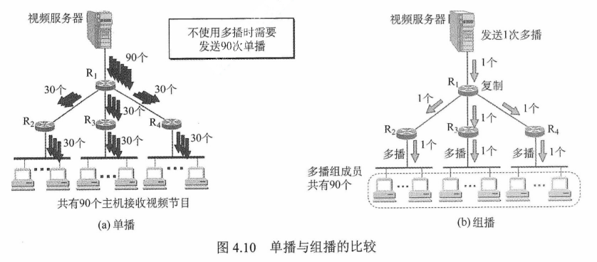

### IP组播地址

## 移动IP

## 网络层设备

# 传输层

## 传输层提供的服务

## UDP协议

## TCP协议

# 应用层
## 网络应用模型

## 域名系统（DNS）

## 文件传输协议（FTP）

## 电子邮件

## 万维网（WWW）

