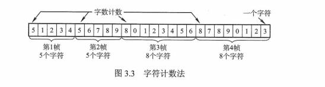
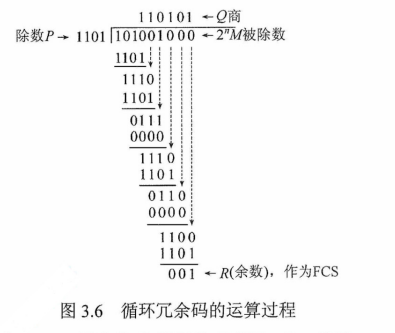
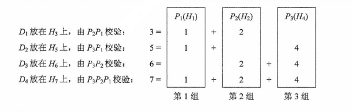

# 计算机网络体系结构
## 计算机网络概述
## 计算机网络体系结构与参考模型
	
# 物理层
## 通信基础
## 传输介质
## 物理层设备
	
# 数据链路层
	
## 数据链路层的功能
	
	  + 主要作用是**加强物理层传输原始比特流**的功能，将物理层提供的**可能出错的物理连接改造为逻辑上无差错的数据链路**，使之对网络层表现为一条无差错的链路。
	
	  + 为网络层提供的服务
	
	    **将源机器中来自网络层的数据传输到目标机器的网络层。**

	    + **无确认的无连接服务**
	
	      源机器**发送**数据帧时，不需先建立**链路连接**，目的机器**收到**数据帧时，**不需发回确认**。对丢失的帧，数据链路层**不负责重发**而**交给上层处理**。适用于**实时通信**或**误码率较低**的通信信道，如**以太网**。
	
	    + **有确认的无连接服务**
	
	      源机器**发送**数据帧时，不需先建立**链路连接**，但目的机器收到数据帧时，**必须发回确认**。源机器在所规定的时间内未收到确定信号时，就**重传丢失的帧**，以提高传输的可靠性。该服务适用于**误码率较高**的通信信道，如**无线通信**。
	
	    + **有确认的面向连接服务**
	
	      帧传输过程分为三个阶段：**建立数据链路**、**传输帧**、**释放数据链路**。目的机器对收到的每一帧都要**给出确认**，源机器**收到确认后**才能发送下一帧，因而该服务的可靠性最高。该服务适用于通信要求（可靠性、实时性）较高的场合。
	
	    > 有连接就一定要有确认，即不存在无确认的面向连接的服务
	
	  + 链路管理
	
	    数据链路层连接的 **建立、维持和释放过程** 称为 **链路管理**，主要用于 **面向连接** 的服务。链路两端的结点要进行通信，必须首先确认对方已处于 **就绪状态**，并交换一些必要的信息以 **对帧序号** 初始化，然后才能 **建立连接**，在传输过程中则要能 **维持连接**，而在传输完毕后要 **释放该连接**。在多个站点共享同一物理信道的情况下（**如在局域网**）如何在要求通信的站点间**分配和管理信道** 也属于数据链路层管理。
	
	    + **帧定界**、**帧同步**与**透明传输**
	
	      + 两台主机之间传输信息时，必须将**网络层**的 **分组封装成帧**，以 **帧** 的格式进行传送。将一段数据的前后分别添加 **首部** 和 **尾部**，就构成了 **帧**。（$帧长 = 数据部分的长度 + 首部长度 + 尾部长度$）。**首部** 和 **尾部** 含有很多**控制信息**，一个重要作用是 **确定帧的界限，即帧定界**。
	      + **帧同步** 指的是 **接收方应能从接受到的二进制比特流中区分出帧的起始与终止**。
	      + 为了**提高帧的传输速率，应当使帧的数据部分的长度尽可能地大于首部和尾部的长度，但每种数据链路层协议都规定了帧的数据部分的长度上限**，即 **最大传输单元（MTU，Maximum Transmission Unit）**
	      + 如果在数据中恰好出现 **与帧定界符相同的比特组合** （会误以为“传输结束”而丢弃后面的数据），那么就要采取有效的措施解决这个问题，即 **透明传输**。更确切地说，**透明传输就是不管所传数据是什么样的比特组合，都应当能在链路上传送。**
	
	    + 流量控制
	
	      + **限制发送方的数据流量**，使其**发送速率**不超过接收方的**接收能力**
	      + 不是数据链路层特有的功能，许多高层协议中也提供此功能，只不过控制对象不同而已。
	        + 对于 **数据链路层**，控制的是 **相邻两结点之间的数据链路上的流量**
	        + 对于 **运输层** 来说，控制的是从 **源端到目的端之间的流量**
	
	    + 差错控制
	
	      用以**使发送方确定接收方是否正确收到由其发送的数据**的方法
	
	      + 位错
	        + 帧中某些位出现了差错。通常采用 **循环冗余校验（CRC）方式**发现位错，通过自动重传请求（**Automatic Repeat Request，ARQ**）方式来重传出错的帧。
	        + ARQ法：让发送方将**要发送的数据帧**附加一定的**CRC冗余检错码**一并发送，接收方则根据**检错码**对数据帧进行**错误检测**，若发现错误则**丢弃**，发送方**超时重传**该数据帧。
	        + ARQ法只需返回很少的**控制信息**就可有效地确认所发送数据帧是否**被正确接收**。
	      + 帧错
	        + 指帧的**丢失**、**重复**、或**失序**等错误
	        + 在**数据链路层**引入**定时器**和**编号机制**，能保证**每一帧最终都能有且仅有一次正确地交付给目的结点**
	
## 组帧
	
	  把比特组合成 **帧**为单位传输，是为了在出错时**只重发出错的帧**，而不必重发全部数据，从而提高效率。 **为了使接收方能正确地接收并检查所传输的帧，发送方必须依据一定的规则把网络层递交的分组封装成帧（称为组帧）**。**组帧** 主要解决 **帧定界、帧同步、透明传输** 等问题。
	
	  > 组帧时，要同时加首部和尾部，这是因为在网络中信息是以帧为最小单位进行传输的，所以接收端要正确地接收帧，必须要清楚该帧在一串比特流中从哪里开始到哪里结束（因为接收端收到的是一串比特流，没有首部和尾部是不能正确区分帧的）。而分组（即IP数据报）仅是包含在帧中的数据部分，所以不需要加尾部来界定
	
	  + 字符计数法
	
	    字符计数法，在 **帧头部** 使用一个计数字段来 **标明帧内字符数**。目的结点的数据链路层收到字节计数值时，就知道 **后面跟随的字节数**，从而可以确定 **帧结束的位置**。（计数字段提供的字节数包含自身所占用的一个字节）。
	
	    
	
	    > 最大的问题是，如果计数字段出错，即失去帧边界划分的依据，那么接收方就无法判断帧的结束位和下一帧的开始位，收发双方失去同步
	
	  + 字符填充的首尾定界符法
	
	    使用特定字符来定界 **一帧的开始与结束**。如图，**控制字符 SOH** 放在 **帧的最前面**，表示 **帧的首部开始**。**控制字符EOT** 表示 **帧的结束**。
	
	    > 为了使信息位中出现的特殊字符不被误判为帧的首尾定界符，可在特殊字符前面填充一个转义字符(ESC)来加以区分。以实现 数据的透明传输。接收方收到转义字符后，就知道其后面紧跟的是数据信息，而不是控制信息。
	
	    
	
	  + 零比特填充的首尾标志法
	
	    允许数据帧包含任意个数的比特，也允许每个字符的编码包含任意个数的比特。使用一个特定的 **比特模式**，即 **01111110** 来标志一帧的开始和结束。
	
	    为了不使信息位中出现的比特流 **01111110** 被误判为帧的首尾标志，**发送方**的数据链路层在信息位中遇到**5个连续的“1”**时，将自动在其后面插入一个**“0”**；而**接收方**每收到**5个连续的“1”时**，自动删除后面紧跟的**“0”**，以恢复原信息。
	
	    
	
	    > 零比特填充法很容易由硬件来实现，性能优于字符填充法
	
	  + 违规编码法
	
	    在物理层进行比特编码时，通常采用 **违规编码法**。例如，曼侧斯特编码方法将 **数据比特“1”编码成“高-低”电平对**，将 **数据比特“0”编码成“低-高”电平对**，而 **“高-高”电平对** 和 **“低-低”电平对**在数据比特中是 **违规的（即没有采用）**。可以借用这些违规编码序列来 **定界帧的起始和终止**。
	
	    > 局域网 IEEE 802标准就采用了这种方法
	
	    违规编码法不需要采用任何填充技术，便能实现数据传输的 **透明性**，但它只适用于 **采用冗余编码** 的特殊编码环境。
	
	    由于 **字节计数法** 中计数字段的脆弱性和**字符填充法** 实现上的复杂性与不兼容性，目前较常用的组帧方法是 **比特填充法** 和 **违规编码法**。
	
## 差错控制
	
	  + 数据的传输差错是由 **噪声** 引起的。通信信道的噪声可以分为两类：**热噪声** 和 **冲击噪声**。**热噪声** 一般是信道固有的，引起的差错是 **随机差错**，可以通过**提高信噪比**来降低。 **冲击噪声** 一般由外界电磁干扰引起的，引起的差错就是 **突发差错**，无法通过 **提高信噪比** 来避免。
	
	  + 比特差错：实际通信链路都不是理想的，比特在传输过程中可能会产生差错，**1可能会变成0,0也可能会变成1**。
	
	    > 比特差错是传输差错的一种，本节只讨论比特差错
	
	  + 利用编码技术进行差错控制
	
	    + 自动重传请求（**ARQ，Automatic Repeat Request**）
	
	      接收端**检测出差错**时，**设法通知发送端重发**，直到接收到**正确的码字为止**
	
	    + 前向纠错（**FEC，Forward Error Correction**）
	
	      接收端不但能**发现差错**，而且能 **确定比特串的错误位置**，从而 **加以纠正**。
	
	      > 因此，差错控制又可分为 检错编码 和 纠错编码
	
### 检错编码
	
	    采用**冗余编码技术**。核心思想是：**有效数据（信息位）被发送前，先按某种关系附加一定的冗余位，构成一个符合某一规则的码字后再发送。当要发送的有效数据变化时，相应的冗余位也随之变化，使得码字遵从不变的规则。接收端根据收到的码字是否仍符合原规则来判断是否出错。**
	
	    常见的检错编码有 **奇偶校验码** 和 **循环冗余码**
	
	    + 奇偶校验码
	
	      **最基本的检错码**，分为**奇校验码** 和 **偶校验码**。由 **n-1位信息元和1位校验元组成**
	
	      > 只能检测奇数位的出错情况，但并不知道哪些位出错，也不能发现偶数位的出错情况。意思是，当有1个，3个，5个等奇数个位置上的码出错，这样能被检测到。这是因为，$奇数+奇数=偶数，偶数+奇数=奇数$，即奇数是扭转奇偶类型的数。
	
	    + 循环冗余码（**Cyclic Redundancy Code**）（**多项式码**）
	
	      
	
	      任何一个由二进制数位串组成的代码都可以与一个只含有0和1两个系数的多项式建立一一对应关系。一个k位帧可以视为从**$X^{k-1}到X^0$**的k次多项式的系数序列，这个多项式的阶数为**k-1**，**高位是$X^{k-1}$项的系数**，**下一位是$X^{k-2}$的系数**，以此类推。例如，1110011有7位，表示成多项式是$X^6+X^5+X^4+X+1$，而多项式$X^5+X^4+X^2+X$对应的位串是110110。
	
	      给定一个**m bit**的帧或报文，发送器生成一个**r bit**的序列，称为 **帧检验序列（FCS）**。这样形成的帧将由 **m+r** 比特组成。发送方和接收方事先商定一个多项式**G(x)【最高位和最低位必须是1】**，使这个带检验码的帧刚好能被预先确定的多项式**G(x)**整除。**接收方用相同的多项式去除收到的帧，如果无余数，那么认为无差错**。
	
	      通过 **循环冗余码（CRC）**的检错技术，数据链路层做到了对帧的 **无差错接收**。也就是说，凡是接收端数据链路层**接收的帧**，我们都认为这些帧在传输过程中**没有产生差错**；而接收端丢弃的帧虽然也收到了，但最终因为**有差错而被丢弃**，即**未被接受**。
	
	      > 循环冗余码（CRC）是具有纠错功能的，只是数据链路层仅使用了它的检错功能，检测到帧出错则直接丢弃
	
	    + CRC计算步骤
	
	      + 展开多项式得到CRC除数 （**为避免出错，从右往左写**）
	      + 原数据末端加0 （**多项式最高是几次就加几个0**）
	      + 从左往右，按位异或 （**所得结果位数如果不够长，前面的0不要漏了**）
	      + **CRC校验和的长度**，等于**除数的长度-1**
	
### 纠错编码
	
	    在数据通信的过程中，解决差错问题的一种方法是 **在每个要发送的数据块上附加足够的冗余信息，使接收方能够推导出发送方实际送出的应该是什么样的比特串**。最常见的纠错编码是 **海明码**，其实现原理是 **在有效信息位中加入几个校验位形成海明码，并把海明码的每个二进制位分配到几个奇偶校验组中。当某一位出错后，就会引起有关的几个校验位的值发生变化，这不但可以发现错位，而且能指出错位的位置，为自动纠错提供依据。**
	
	    + 海明码的编码原理和过程（**举例以数据码1010**）
	
	      + 确定海明码的位数
	
	        设 **n为有效信息的位数**，**k为校验位的位数**，则信息位n和校验位k应满足
	        $$
	        n+k \le 2^k-1
	        $$
	        若要**检测两位错**，则需再增加1位校验位，即**$k+1$**位。
	
	        海明码位数为 $n+k=7 \le 2^3-1$成立，则n，k有效。设信息位为$D_4D_3D_2D_1 (1010)$，共4位，校验位为 $P_3P_2P_1$，共3位。对应的海明码为 $H_7H_6H_5H_4H_3H_2H_1$。
	
	      + 确定校验位的分布
	
	        规定 **校验位$P_i$在海明位号为$2^{i-1}$的位置上，其余各位为信息位**，因此有
	
	        $P_1$的海明位号为$2^{i-1}=2^0=1$，即$H_1为P_1$
	
	        $P_2$的海明位号为$2^{i-1}=2^1=2$，即$H_2为P_2$
	
	        $P_3$的海明位号为$2^{i-1}=2^2=4$，即$H_4为P_3$
	
	        将信息位按原来的顺序插入，则海明码各位的分布如下
	
	        $H_7$	$H_6$	$H_5$	$H_4$	$H_3$	$H_2$	$H_1$	
	
	        $D_4$	$D_3$	$D_2$	$P_3$	 $D_1$	$P_2$	$P_1$	
	
	      + 分组以形成校验关系
	
	        每个数据位用 **多个校验位** 进行校验，但要满足条件： **被校验数据位的海明位号等于校验该数据位的各校验位海明位号之和**（即$H_i$）。 另外，**校验位不需要再被校验**。分组校验形成的校验关系如下：
	
	        
	
	      + 校验位取值
	
	        **校验位$P_i$**的值为第i组（由该校验位校验的数据位）所有位求**异或**。
	
	        根据（3）中的分组有
	        $$
	        P_1=D_1 \oplus D_2 \oplus D_4=0 \oplus 1 \oplus 1 = 0 \\
	        P_2=D_1 \oplus D_3 \oplus D_4=0 \oplus 0 \oplus 1 =1  \\
	        P_3=D_2 \oplus D_3 \oplus D_4 = 1 \oplus 0 \oplus 1 = 0
	        $$
	        所以，**1010**对应的海明码为 101 **`0`**0**`10`** （方框内为校验位，其它为信息位）
	
	      + 海明码的校验原理
	
	        每个**校验组**分别利用**校验位**和参与**形成该校验位的信息位**进行**奇偶校验检查**，构成 **k个校验方程**：
	        $$
	        S_1=P_1 \oplus D_1 \oplus D_2 \oplus D_4 \\
	        S_2=p_2 \oplus D_1 \oplus D_3 \oplus D_4 \\
	        S_3 = p_3 \oplus D_2 \oplus D_3 \oplus D_4
	        $$
	        若$S_3S_2S_1$的值为 **000**，则说明 **无错**；否则说明 **出错**，且这个数就是 **错误位的位号**，如$S_3S_2S_1$=001，说明第1位出错，即$H_1$出错，直接将该位取反就达到了纠错的目的。
	
	        **$P_i$**在发送前就算好了，一并发送过去，所以如果跟接收方收到的$D_3、D_2、D_1$再计算出来的$P_i$对不上的话，就说明是 **数据发生变化**。
	
	    + **海明码纠错d位，需要码距为$2d+1$的编码方案；检错d位，需要码距$d+1$**
	
## 流量控制与可靠传输机制
	
## 介质访问控制
	
## 局域网
	
## 广域网
	
## 数据链路层设备
	
## 总结
	
	  + 冗余编码
	
	    所用**符号数**或**信号码元数**比表示信息所必需的数目多的代码，应用了**冗余加密**技术，即利用了**纠错码**的编码原理
	
	// TODO
	
# 网络层
## 网络层的功能
## 路由算法
## IPv4
## IPv6
## 路由协议
## IP组播
## 移动IP
## 网络层设备

# 传输层
## 传输层提供的服务
## UDP协议
## TCP协议

# 应用层
## 网络应用模型
## 域名系统（DNS）
## 文件传输协议（FTP）
## 电子邮件
## 万维网（WWW）
