[TOC]


------


# 计算机系统概述


## 操作系统的基本概念

### 操作系统的概念和特征

**操作系统** 是指 **控制和管理**整个计算机系统的硬件与软件资源，合理地**组织、调度**计算机的工作与资源的分配，进而为用户和其他软件**提供方便接口与环境**的**程序集合**。**操作系统是计算机系统中最基本的系统软件**
	
+ 计算机系统**自下而上**分为4部分：**硬件、操作系统、应用程序、用户** （划分与计算机组成原理不同）
	
+ 操作系统的特征 （**并发、共享、虚拟、异步**）
	
	+ 并发（**Concurrence**）
		+ 操作系统的并发性是通过 **分时** 得以实现的
	      + 并发：**同一时间间隔**
	        
		      > 9:00到9:30 吃饭，9:30到10:00 学习，则在 9:00到10:00这段间隔里面，吃饭与学习并发
	        
		    + 并行：**同一时刻**，并行性需要有相关硬件的支持，如**多流水线**、或 **多处理机硬件环境**
		
	+ 共享（**Sharing**）（**互斥共享方式** 与 **同时访问方式**）
		+ 指系统中的资源，可供内存中多个 **并发执行 **的进程共同使用
	      + 互斥共享方式
	        仅当进程访问完并释放该资源后，才允许另一个进程对该资源进行访问。
	        一段时间内，只允许一个进程访问的资源，称为 **临界资源** 或 **独占资源**。计算机系统中的**大多数物理设备** 及某些软件中所用的 **栈、变量和表格**，都属于 **临界资源**。
	      + 同时访问方式
	        允许在一段时间内由多个进程**“同时”访问**，“同时”是宏观概念，微观上，这些进程是 **交替地对该资源进行访问，即“分时共享”**。典型资源是 **磁盘设备**。
	
	        > 互斥共享 要求一种资源在一段时间内（哪怕是一段很小的时间）只能满足一个请求，否则就会出现严重问题。而 同时访问共享 通常要求一个请求分几个时间片段间隔地完成，其效果与连续完成的效果相同。
	
	   + **并发** 和 **共享** 是操作系统两个最基本的特征，两者之间互为存在的条件
	
	        + **资源共享**是以程序的并发为条件的，若系统不允许程序**并发执行**，则自然 **不存在资源共享问题**
	        + 若系统不能对**资源共享**实施有效的管理，则必将影响到程序的**并发执行**，甚至根本无法**并发执行**
	
	+ 虚拟（**Virtual**）
	   把一个物理上的实体，变为若干逻辑上的对应物。实现虚拟的技术，称为 **虚拟技术**，虚拟技术可归纳为 **时分复用技术** （处理器的分时共享） 和 **空分复用技术** （虚拟存储器）
	
	   + 虚拟处理器技术
	
	   	通过多道程序设计技术，让多道程序并发执行，来分时使用一个处理器
	
	   + 虚拟存储器技术
	
	   	将一台机器的物理存储器变为虚拟存储器，以便从逻辑上扩充存储器的容量
	
	   + 虚拟设备技术
	
		将一台物理I/O设备虚拟为多台逻辑上的I/O设备
	
	+ 异步（**Asynchronism**）
	   多道程序环境允许多个程序并发执行，但由于资源有限，进程的执行并不是一贯到底的，而是走走停停，它以不可预知的速度向前推进
	   
### 操作系统的目标和功能（**处理器管理、存储器管理、设备管理、文件管理、向用户提供接口、扩充机器**）

+ 操作系统作为计算机系统资源的管理者
	
	+ 处理器管理
		+ 多道程序环境下，处理机的分配和运行都以进程（**或线程**）为基本单位，因而对处理机的管理可归结为对进程的管理。
		+ 并发是指在计算机内**同时运行多个进程**，因而进程的**创建、撤销、管理、避免冲突、合理共享**就是 **进程管理** 的最主要任务。**进程管理**的主要功能包括 **进程控制、进程同步、进程通信、死锁处理、处理机调度** 等
	
	+ 存储器管理
		包括 **内存分配与回收、地址映射、内存保护与共享、内存扩充** 等功能
	+ 文件管理
		包括 **文件存储空间的管理、目录管理、文件读写管理和保护**
	+ 设备管理
		主要任务是 **完成用户的I/O请求，方便用户使用各种设备，提高设备的利用率**， 包括 **缓冲管理、设备分配、设备处理、虚拟设备** 等功能
	+ 操作系统作为用户与计算机硬件系统之间的接口（**命令接口、程序接口**）
		+ 命令接口
			+ 联机命令接口（**交互式命令接口**）
				适用于 **分时或实时系统** 的接口
	        + 脱机命令接口（**批处理命令接口**）
				适用于 **批处理系统**，脱机用户不能直接干预作业的运行。
		+ 程序接口
	        	由一组**系统调用（也称广义指令）**组成

## 操作系统的发展与分类

## 操作系统的运行环境

### 操作系统的运行机制

+ CPU通常执行两种不同性质的程序

  + `操作系统内核程序`
  + `用户自编程序`（即**系统外层的应用程序**，或简称**应用程序**）

+ **操作系统内核程序**是**用户自编程序**的管理者，因此内核程序要执行一些**特权指令**，而**用户自编程序**出于安全考虑不能执行这些指令。

+ `特权指令`：**计算机中不允许用户直接使用的指令**，如**I/O**指令、**置中断**指令，存取用于内存保护的寄存器、送**程序状态字**到**程序状态字寄存器**等的指令。具体实现上，将CPU的状态划分为**用户态**（目态）和**核心态**（**管态、内核态**）。**用户自编程序**运行在**用户态**，**操作系统内核程序**运行在**核心态**。

+ 一些与硬件关联较紧密的模块，如**时钟管理**、**中断处理**、**设备驱动**等处于最低层。其次是运行频率较高的程序，如**进程管理**、**存储器管理**和**设备管理**等。这两部分内容构成了操作系统的内核。这部分内容的指令操作工作在**核心态**。

+ **内核**是计算机上配置的底层软件，是计算机功能的延伸，内核包含以下4方面内容

  + `时钟管理`

    + 在计算机的各种部件中，**时钟**是最关键的设备。
    + 时钟的第一功能是**计时**，操作系统需要通过时钟管理，向用户提供标准的系统时间。
    + 通过**时钟中断**的管理，可以实现进程的切换。
      + 在**分时操作系统**中采用时间片轮转调度
      + 在**实时系统**中按截止时间控制运行
      + 在**批处理系统**中通过时钟管理来衡量一个作业的运行程度

  + `中断机制`

    + 引入中断技术的初衷是**提高多道程序运行环境中CPU的利用率**，而且主要是针对外部设备。例如，键盘或鼠标信息的输入、进程的管理和调度、系统功能的调用、设备驱动、文件访问等。现在操作系统是靠**中断**驱动的软件。
    + 中断机制中，只有一小部分功能属于内核，它们负责**保护**和**恢复中断现场的信息**，**转移控制权**到相关的处理程序。这样可以**减少中断的处理时间**，提高系统的并行处理能力。

  + `原语`

    + 把具有以下特点的程序称为**原语**
      + 处于操作系统的**最低层**，是最接近硬件的部分
      + 这些程序的运行具有**原子性**，其操作只能一气呵成（主要从系统安全性和便于管理考虑）
      + 这些程序的**运行时间都较短**，而且调用频繁
    + 定义原语的直接方法是**关闭中断**，让其所有动作不可分割地完成后再打开中断。
    + 系统中的**设备驱动、CPU切换、进程通信**等功能中的部分操作都可定义为**原语**，使它们成为内核的组成部分。

  + `系统控制的数据结构及处理`

    + 系统中用来登记状态信息的数据结构很多，如**作业控制块、进程控制块（PCB）、设备控制块、各类链表、消息队列、缓冲区、空闲区登记表、内存分配表**

    + 为了实现**有效的管理**，系统需要一些基本的操作，常见的如下3种

      + `进程管理`

        **进程状态管理**、**进程调度和分派**、**创建与撤销进程控制块**等。

      + `存储器管理`

        **存储器的空间分配和回收**、**内存信息保护程序**、**代码对换程序**等。

      + `设备管理`

        **缓冲区管理**、**设备分配和回收**等

+ **中断**和**异常**的概念

  + 系统不允许用户程序实现核心态的功能，而它们又必须使用这些功能。因此，需要在核心态建立一些“门”，以便实现**从用户态进入核心态**。在实际操作系统中，CPU运行上层程序时唯一能进入这些“门”的途径就是通过**中断**或**异常**。

  + 发生**中断**或**异常**时，运行**用户态**的CPU会立即进入**核心态**，这是通过**硬件**实现的。

  + 操作系统的发展过程大体上就是一个想方设法不断**提高资源利用率**的过程，而提高资源利用率就需要在程序并**未使用**某种资源时，把它对那种资源的占有权**释放**，而这一行为就需要通过**中断**实现。

  + **中断（Interruption）**也称外中断，指**来自CPU执行指令以外的事件的发生**

    + 如设备发出的I/O结束中断，表示设备输入/输出处理已经完成，希望处理机能够向设备发下一个输入/输出请求，同时让完成输入/输出后的程序继续运行。
    + **时钟中断**，表示一个固定的时间片已到，让处理机处理计时、启动定时运行的任务等。这一类中断通常是与**当前指令执行无关**的事件，即它们与当前处理机运行的程序无关。

  + **异常（Exception）**也称**内中断、例外、或陷入（trap）**，指**源自CPU执行指令内部的事件**，如程序的非法操作码、地址越界、算术溢出、虚存系统的缺页及专门的陷入指令等引起的事件。对异常的处理一般要**依赖于当前程序的运行现场**，而且异常不能被屏蔽，一旦出现应立即处理。

    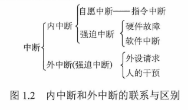

  + 中断处理的**过程**

    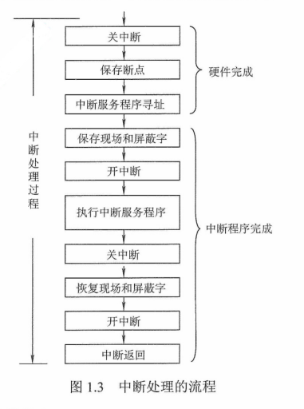

    + `关中断`

      CPU响应中断后，首先要保护程序的现场状态，在保护现场的过程中，**CPU不应响应更高级中断源的中断请求**。否则，若现场保存不完整，在中断服务程序结束后，也就不能正确恢复并继续执行现行程序。

    + `保存断点`

      为保证中断服务执行完毕后能正确地返回到原来的程序，必须将原来的程序的**断点（即程序计数器PC）**保存起来。

    + `中断服务程序寻址`

      实质是**取出中断服务程序的入口地址**送入程序计数器PC。

    + `保存现场和屏蔽字`

      进入中断服务程序后，首先要保存现场，现场信息一般是指**程序状态字寄存器PSWR（Program Status Word Register）**和某些通用寄存器的内容。

    + `开中断`

      允许更高级中断请求得到响应

    + `执行中断服务程序`

      这是中断请求的目的。

    + `关中断`

      保证在恢复现场和屏蔽字时不被中断

    + `恢复现场和屏蔽字`

      将现场和屏蔽字恢复到原来的状态

    + `开中断、中断返回`

      中断服务程序的最后一条指令通常是一条中断返回指令，使其返回到原程序的断点处，以便继续执行原程序。

+ 系统调用

  + 指用户在程序中调用操作系统所提供的一些子功能，系统调用可视为特殊的**公共子程序**。系统中的各种共享资源都由操作系统统一掌管，因此在此用户程序中，凡是与**资源**有关的操作（**存储分配、进行I/O传输及管理文件等**），都必须通过系统调用方式向操作系统提出服务请求，并由操作系统代为完成。通常，一个操作系统提供的系统调用命令由几十条乃至上百条之多。这些系统调用按功能可分为如下几类
    + `设备管理`
      + 完成设备的**请求或释放**，以及**设备启动**等功能

    + `文件管理`
      + 完成文件的**读、写、创建、删除**等功能

    + `进程控制`
      + 完成进程的**创建、撤销、阻塞、唤醒**等功能

    + `进程通信`
      + 完成进程之间的**消息传递**或**信号传递**等功能

    + `内存管理`
      + 完成内存的**分配、回收、获取作用占用内存区大小、始址**等功能

  + 系统调用相关功能设计**系统资源管理、进程管理**之类的操作，必须需要使用某些**特权指令**才能完成，所以系统调用的处理需要由**操作系统内核程序**负责完成，要运行在**核心态**。用户程序可以执行**陷入指令（又称防管指令或trap指令）**来发起系统调用，请求操作系统提供服务。可以这么理解，用户程序执行**陷入指令**，相当于把CPU的使用权主动交给**操作系统内核程序**（CPU状态会从**用户态**进入**核心态**），之后操作系统内核程序再对系统调用请求作出相应处理。处理完成后，**操作系统内核程序**又会把CPU的使用权还给**用户程序**（即CPU状态会从**核心态**回到**用户态**）。这么设计的目的是，用户程序不能直接执行对系统影响非常大的操作，必须通过系统调用方式请求操作系统代为执行，以便保证系统的稳定性和安全性，防止用户程序**随意更改**或**访问重要的系统资源**，影响其他程序的运行
  
  + 用户通过**操作系统**运行上层程序（如系统提供的**命令解释程序**或**用户自编程序**），而这个上层 程序的运行依赖于**操作系统**底层管理程序提供服务支持，当需要管理程序服务时，系统通过**硬件中断机制**进入**核心态**，运行管理程序；也可能是程序运行出现异常情况，被动地需要管理程序的服务，这时就通过异常处理来进入**核心态**。管理程序运行结束时，用户程序需要继续运行，此时通过相应的保存的程序现场退出**中断处理程序**或**异常处理程序**，返回断点处继续执行。如下图
  
    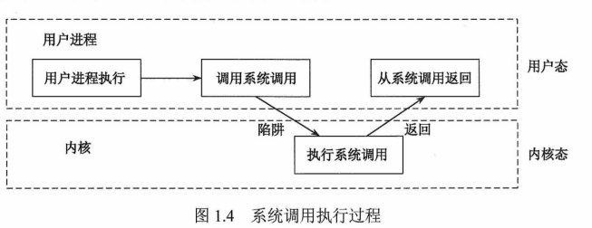
  
  + 列举一些**用户态**转**核心态**的例子
  
    + 用户程序要求操作系统的服务，即**系统调用**
    + 发生一次**中断**
    + 用户程序中产生了一个**错误状态**
    + 用户程序中企图执行一条**特权指令**
    + 从**核心态**转**用户态**由一条指令实现，这条指令也是**特权指令**，一般是**中断返回**指令
  
    > 由**用户态**进入**核心态**，不仅状态需要切换，而且所用的堆栈也可能需要**用户堆栈**切换为**系统堆栈**，但这个**系统堆栈**也是属于该进程的。
  
  + **用户态**转**核心态**，会用到**访管指令**，**访管指令**是在用户态使用的，所以它**不可能是特权指令**

## 操作系统的体系结构

### 大内核和微内核

+ **大内核系统**将操作系统的主要功能模块都作为一个紧密联系的整体运行在**核心态**，从而为应用提供性能的系统服务。
+ 为解决操作系统的内核代码**难以维护**的问题，提出了**微内核**的体系结构。它将内核中最基本的功能保留在内核，将不需要在**核心态**执行的功能移到**用户态**执行，从而降低了内核的设计复杂性。移出内核的操作系统代码根据分层的原则被划分成若干服务程序，它们的执行相互独立，交互则都借助于**微内核**进行通信。
+ **微内核**结构有效地分离了**内核与服务、服务与服务**，使得它们之间的接口更加清晰，维护的代价大大降低，各部分可以独立地优化和演进，从而保证了操作系统的可靠性
+ 最大的问题是**性能**问题，因为需要频繁地在**核心态**和**用户态**之间切换，操作系统的执行开销偏大。因此有的操作系统把频繁使用的**系统服务**移回**内核**，但**体系结构**不是引起**性能下降**的主要因素，为减少**切换开销**，也可以将**系统服务**作为**运行库**链接到**用户程序**，这种体系结构称为**库操作系统**

## 总结

+ **并行性**和**并发性**的区别和联系
  + `并行性`
    + 两个或多个事件在**同一时刻**发生
  + `并发性`
    + 两个或多个事件在**同一时间间隔**发生
  + **多道程序**环境下，**并发性**指一段时间内，宏观上有多个程序同时运行，但在**单处理器**系统中，每个时刻仅能有一道程序执行，因此，**微观**上这些程序只能**分时**交替运行。但在**多处理器**系统中，**并发执行**的程序被分配到多个处理器上，实现**并行执行**
+ **特权指令**和**非特权指令**
  + **特权指令**必须在**核心态**执行，CPU在**核心态**下可以执行指令系统的全集
  + **用户态**下只能使用**非特权指令**，使用**特权指令**时，将产生**中断**以阻止用户使用
  + 从**用户态**转换为**核心态**的唯一途径是**中断**或**异常**
+ **访管指令**和**访管中断**
  + **访管指令**是一条可以在**用户态**下执行的指令，在用户程序中，因要求操作系统提供服务而有意识的使用**访管指令**，从而产生一个**中断事件（自愿中断）**，将操作系统转换为**核心态**，称为**访管中断**。**访管中断**由**访管指令**产生，程序员使用**访管指令**向操作系统请求服务
  + **访管指令**本身不是**特权指令**，基本功能是让程序拥有**自愿进管**的手段，从而引起**访管中断**
  + 处于**用户态**的用户程序使用**访管指令**时，系统根据**访管指令**的操作数执行**访管中断处理程序**，**访管中断管理程序**将按系统调用的**操作数**和**参数**转到相应的例行子程序。完成服务功能后，退出**中断**，返回到用户程序断电继续执行。

# 进程管理

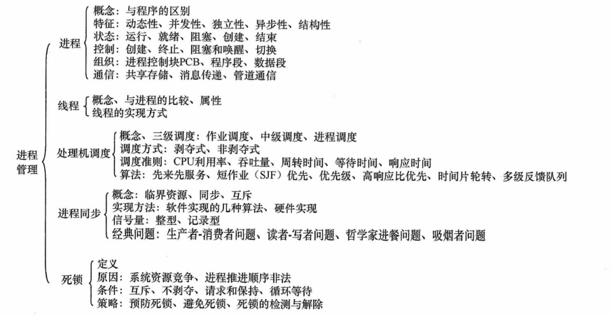

## 进程与线程

### 进程的概念和特征

+ 进程的概念

  + **多道程序**环境下，允许多个程序**并发执行**，此时它们将失去**封闭性**，并具有**间断性**和**不可再现性**的特征。为此引入了**进程**的概念，用来**描述、控制**程序的**并发执行**，实现操作系统的**并发性、共享性**。

  + 为了使参与并发执行的程序（含数据）能**独立**地运行，必须配置一个专门的数据结构，称为**进城控制块（Process Control Block，PCB）**，由**程序段、相关数据段、PCB**三部分组成了**进程映像（进程实体）**

  + **创建**进程，实质上就是创建进程映像中的**PCB**。**撤销**进程，实质上是撤销进程的**PCB**。**进程映像**是静态的，**进程**是动态的

    > **PCB**是进程存在的唯一标志

  + `进程`：进程实体的运行过程，是系统进行**资源分配、调度**的一个独立单位

+ 进程的特征
  + `动态性` **最基本的特性**
    + 进程是程序的一次执行，有着**创建、活动、暂停、终止**等过程，具有一定的**生命周期**，是动态地**产生、变化、消亡**的
  + `并发性` **重要特征**
    + 多个进程实体同时存在于**内存**中，能在**一段**时间内**同时运行**，提高**资源利用率**
  + `独立性`
    + **进程实体**是一个能**独立运行、独立获得资源、独立接受调度**的基本单位，凡未建立**PCB**的程序，都不能作为一个独立的单位参与运行
  + `异步性`
    + 由于进程的相互制约，使得进程具有执行的**间断性**，即进程按各自独立的、不可预知的速度向前推进。**异步性**会导致执行结果的**不可再现性**，为此在操作系统中必须配置相应的**进程同步机制**
  + `结构性`
    + 每个进程都配置一个**PCB**对其进行描述。从结构上看，**进程实体**是由**程序段、数据段、进程控制块**三部分组成的

### 进程的状态与转换

+ 进程通常有以下**5**种状态，前**3**种是**基本**状态
  + `运行态`
    + 进程正在处理机上运行。在**单处理机**环境下，每个时刻最多**只有一个**进程处于运行态
  + `就绪态`
    + 进程获得了除**处理机**外的一切所需资源，一旦得到处理机，便可**立即运行**。将多个处理就绪状态的进程排成一个队列，称为**就绪队列**
  + `阻塞态` **等待态**
    + 进程正在等待某一事件而**暂停运行**，如等待某资源为**可用**（不包括**处理机**）或等待输入输出完成，即使**处理机**空闲，该进程也**不能运行**
  + `创建态`
    + 进程正在被创建，尚未转到**就绪态**。创建进程通常需要多个步骤
      + 申请一个**空白PCB**，向**PCB**填写一些**控制、管理**进程的信息
      + 由系统为该进程**分配**运行时所需资源
      + 把该进程转入**就绪态**
  + `结束态`
    + 进程正在从系统中消失，可能是**进程正常结束**或其他原因中断**退出运行**，进程需要结束运行时，系统首先将该进程置为**结束态**，然后处理**资源释放、回收**
  
+ 注意区分**就绪态**与**等待态**
  + 之所以把**处理机**和**其他资源**划分开，是因为在**分时**系统的时间片轮转机制中，每个进程分到的时间片是**若干毫秒**。也就是说，**进程**得到处理机的时间**很短**且**频繁**，进程在运行过程中是**频繁**转到**就绪态**的。而**其他资源（如外设）**的**使用、分配**或某一事件的发生（如I/O操作的完成）对应的时间相对来说**很长**，转到**等待态**的次数也**相对较少**
  
+ 进程状态的**转换**
  + **就绪态** -> **运行态**
  
    + 获得**处理机**资源
  
  + **运行态** -> **就绪态**
  
    + **时间片**用完后，让出**处理机**
    + **可剥夺**的操作系统中，**更高**优先级的进程就绪时，调度程序将**正在执行**的进程转换为**就绪态**，让**更高**优先级的进程执行
  
  + **运行态** -> **阻塞态**
  
    + 进程请求**某一资源**（如外设）的**使用、分配**或**等待某一事件**的发生，如（IO操作的完成）时
    + 进程以**系统调用**的形式请求操作系统提供服务，这是一种特殊的、由运行**用户态**程序调用操作系统**内核**过程的形式
  
  + **阻塞态** -> **就绪态**
  
    + 进程等待的事件到来时，如**IO操作结束、中断结束**
  
    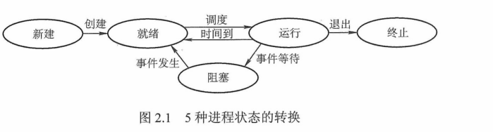
  
    > 一个进程从**运行态**变成**阻塞态**是**主动**行为，从**阻塞态**变成**就绪态**是**被动**行为，需要其他进程的协助

### 进程控制

+ 一般把**进程控制**用的程序段称为**原语**，原语的特点是执行期间**不允许中断**，是一个不可分割的基本单位

+ `进程的创建`

  + 子进程可以**继承**父进程所拥有的**资源**，子进程被撤销时，应将其从父进程获得的资源**归还**给父进程
  + 操作系统创建一个新进程的过程如下（**创建原语**）
    + 为新进程分配一个唯一的**进程标识号**，申请一个空白的**PCB**（PCB是**有限**的），PCB申请失败，则创建失败
    + 为进程分配资源，为**程序、数据、用户栈**分配必要的内存空间（在**PCB**体现）
      + 若**资源不足（如内存空间）**，并不是**创建失败**，而是处于**阻塞态**，等待内存资源
    + 初始化**PCB**，主要包括初始化**标志信息、处理机状态信息、处理机控制信息**以及设置进程的**优先级**等
    + 若进程**就绪队列**能够接纳新进程，则将新进程插入就绪队列，等待被调度运行

+ `进程的终止`

  + 引起进程终止的事件主要有

    + `正常结束`
      + 表示进程的任务已完成并准备退出运行
    + `异常结束`
      + 表示进程在运行时，发生了某种**异常**事件，使程序无法继续运行
        + 如**存储区越界、保护错、非法指令、特权指令错、运行超时、算术运算错、IO故障**等

    + `外界干预`
      + 进程应外界的请求而终止运行
        + 如**操作员/操作系统干预、父进程请求、父进程终止**

  + 操作系统终止进程的过程（**撤销原语**）

    + 根据被终止进程的**标识符**，检索**PCB**，从中读出该进程的状态
    + 若被终止进程处于**执行状态**，立即**终止**该进程的执行，将处理机资源**分配给其他进程**
    + 若该进程还有子孙进程，则将所有子孙进程终止
    + 将该进程拥有的**所有资源**，或归还给**父进程**，或归还给**操作系统**
    + 将**PCB**从所在队列（链表）中**删除**

+ `进程的阻塞和唤醒`

  + 正在执行的进程，由于期待的事件**未发生**（请求系统资源失败、等待某种操作完成、新数据尚未到达、无新工作可做），由系统**自动执行阻塞原语（Block）**，使自己由**运行态**变为**阻塞态**

  + 可见，进程的**阻塞**是进程自身的一种主动行为，也因此只有处于**运行态**的进程（获得CPU），才可能将其转为**阻塞态**。**阻塞原语**的执行过程如下

    + 找到将要阻塞进程的标识号对应的**PCB**
    + 若该进程为**运行态**，则保护其现场，将其状态转为**阻塞态**，停止运行
    + 把该**PCB**插入相应事件的等待队列，将处理机资源调度给**其他**就绪进程

  + 当**被阻塞**进程所期待的事件出现时（启动的IO操作已完成、期待的数据已到达），由有关进程（释放该IO设备的进程、或提供数据的进程）调用**唤醒原语（Wakeup）**，将等待该事件的进程唤醒，**唤醒原语**执行过程如下

    + 在该事件的**等待队列**中找到相应进程的**PCB**
    + 将其从**等待队列**中移出，并置其状态为**就绪态**
    + 把该**PCB**插入就绪队列，等待**调度程序**调度

    > **Block原语**与**Wakeup原语**是一对作用相反的原语，必须**成对使用**。**Block原语**是由被阻塞进程自我调用实现的，**Wakeup原语**是由一个与被唤醒进程合作**或**被其他相关的进程调用实现的

+ `进程切换`

  + **处理机**从一个进程的运行转到另一个进程上运行，在这个过程中，进程的运行环境产生了实质性的变化。进程切换的过程如下

    + 保存处理机**上下文**，包括**程序计数器、其他寄存器**
    + 更新**PCB**信息
    + 把进程的**PCB**移入相应的队列
      + 如就绪、在某事件阻塞等队列
    + 选择另一个进程执行，并更新其**PCB**
    + 更新内存管理的**数据结构**
    + **恢复**处理机上下文

  + **进程切换**与**处理机模式切换**是不同的，**模式切换**时，处理机逻辑上可能还在同一进程中运行。若进程因**中断、异常**进入**核心态**运行，执行完后又回到**用户态**刚被中断的程序运行，则操作系统只需恢复进程进入内核时所保存的**CPU现场**，而无需改变当前**进程**的环境信息。而**切换进程**，则当前进程的环境信息需要改变。

    > **调度**和**切换**的区别，**调度**是决定资源分配给哪个进程的行为，是一种决策行为。**切换**是实际分配的行为，是执行行为。一般来说，先资源**调度**，后进程**切换**

### 进程的组织

+ `进程控制块` **最核心**

  + 进程执行时，系统通过其**PCB**了解进程的现行状态信息，以便对其进行**控制、管理**，管理结束时，系统收回其**PCB**，该进程随之消亡。

  + **PCB**主要包括**进程描述信息、进程控制、管理信息、资源分配清单、处理机相关信息**等，详细如下

    |     进程描述信息      | 进程控制和管理信息 | 资源分配清单 | 处理及相关信息 |
    | :-------------------: | :----------------: | :----------: | :------------: |
    | 进程标识符（**PID**)  |    进程当前状态    |  代码段指针  |  通用寄存器值  |
    | 用户标识符（**UID**） |     进程优先级     |  数据段指针  |  地址寄存器值  |
    |                       |  代码运行入口地址  |  堆栈段指针  |  控制寄存器值  |
    |                       |   程序的外存地址   |  文件描述符  |  标志寄存器值  |
    |                       |    进入内存时间    |     键盘     |     状态字     |
    |                       |   处理机占用时间   |     鼠标     |                |
    |                       |     信号量使用     |              |                |

    + **进程标识符**：标志各个进程，每个进程都有唯一的标识号
    + **用户标识符**：进程归属的用户，主要为**共享、保护**服务
    + **进程当前状态**：作为**处理机**分配调度的依据
    + **资源分配清单**：说明有关内存地址空间、虚拟地址空间的状况，所打开文件的列表、使用的输入输出设备信息
    + **处理机相关信息**：处理机中各**寄存器**的值，当进程被切换时，处理机状态信息都必须保存在相应的**PCB**中，以便在进程重新执行时，能从断点继续执行

  + 组织**PCB**的常用方式有**链接方式**和**索引方式**两种

    + `链接方式`
      + 将**同一状态**的PCB链接成一个**队列**，不同状态对应不同的队列，也可把处于**阻塞态**的进程的PCB，根据**阻塞原因**的不同，排成多个阻塞队列
    + `索引方式`
      + 将**同一状态**的进程组织在一个**索引表**中，索引表的表项指向相应的**PCB**，不同状态对应不同的索引表
        + 如**就绪索引表、阻塞索引表**

+ `程序段`

  + 能被**进程调度程序**调度到CPU执行的程序代码段。注意，程序可被多个进程共享，即多个进程可以运行同一程序

+ `数据段`

  + 可以是进程对应的程序加工处理的**原始数据**，也可以是程序执行时产生的**中间、最终结果**

### 进程的通信

+ **PV**操作是低级通信方式，高级通信方式是以**较高的效率传输大量数据**的通信方式，主要有3种

  + `共享存储`

    + 通信的进程之间存在一块可直接访问的共享空间，通过对这片共享空间进行读写操作实现**进程**之间的信息交换
    + 共享存储分**两**种
      + `低级方式`：基于数据结构的共享
      + `高级方式`：基于存储区的共享
    + **操作系统**只负责为通信进程提供可共享使用的**存储空间、同步互斥工具**，**用户**需自己安排读写指令完成**数据交换**
    + **用户程序空间**一般都是独立的，进程运行期间一般不能访问**其他进程**的空间，而进程内的**线程**是自然共享进程空间的

  + `消息传递`

    + 进程间的**数据交换**是以格式化的**消息**为单位的，若通信的进程之间不存在可以直接访问的共享空间，则必须利用**操作系统**提供的消息传递方法实现**进程通信**。进程通过系统提供的**发送消息、接收消息**两个原语进行数据交换。
      + `直接通信方式`
        + 发送进程直接把**消息**发送给接收进程，并将它挂在接收进程的**消息缓冲队列**上，接收进程从**消息缓冲队列**中取得消息
      + `间接通信方式` **信箱通信方式**
        + 发送进程把**消息**发送到某个**中间实体（或信箱）**，接收进程从中间实体取得消息。该通信方式广泛应用于**计算机网络**中，相应的通信系统称为**电子邮件系统**

  + `管道通信`

    + 消息传递的一种特殊方式，所谓**管道**，是用于连接一个**读进程**和一个**写进程**以实现它们之间的通信的一个共享文件，又名**pipe**文件。

    + 为了协调双方的通信，管道机制必须提供三方面的能力：**互斥、同步、确定对方的存在**

    + **管道**也是一种文件，但是管道可以克服使用文件进行通信的**两个**问题

      + `限制管道的大小`
        + 管道是一个固定大小的缓冲区，在Linux中固定大小为**4KB**
      + `读进程也可能工作的比写进程快`
        + 当这种情况发生时，一个随后的**read()**调用将被**阻塞**，等待某些数据被写入，解决了**read()**调用返回文件结束的问题

      > 从管道**读数据**是一次性操作，数据一旦被读取，它就从管道中被抛弃，释放空间以便写更多的数据。管道只能采用**半双工通信**，即某一时刻只能单向传输。要实现父子进程双方互动通信，需要定义两个管道。

    + 管道可以理解为**共享存储**的优化和发展，因为在共享存储中，若某进程要访问共享存储空间，则必须没有**其他进程**在该共享存储空间进行**写操作**

    > PV操作是一种实现进程**互斥、同步**的有效方式，与**信号量**的处理相关，**P**表示通过的意思，**V**表示释放的意思

### **线程概念**和**多线程模型**

+ 线程的基本概念

  + 引入**进程**的目的是更好地使多道程序**并发执行**，提高**资源利用率、系统吞吐量**。引入**线程**的目的是减小程序在并发执行时所付出的**时空开销**，提高操作系统的**并发性能**
  + **线程**是进程中的一个实体，是被系统**独立调度、分派**的基本单位，自己不拥有系统资源，只拥有一点儿在运行时必不可少的资源
  + 引入**线程**后，进程的内涵发生改变，进程只作为除CPU外的**系统资源**的分配单元，而**线程**作为处理机的分配单元。

+ **线程**与**进程**的比较

  + `调度`
    + 同一进程中，**线程**的切换不会引起**进程**切换。在不同**进程**中进行**线程**切换（如从一个进程内的线程切换到另一个进程中的线程时），会引起**进程**切换
  + `拥有资源`
    + **进程**拥有资源，**线程**不拥有系统资源，有一点儿必不可少的资源，**线程**可以访问其隶属进程的系统资源
  + `并发性`
    + **进程**和**线程**都可以并发执行
  + `系统开销`
    + 创建、撤销**进程**，系统要为之**分配、回收**资源，如内存空间、IO设备。因此开销比**线程**大
    + 切换**进程**，涉及当前执行进程**CPU环境**的保存、新调度到进程**CPU环境**的设置。而切换**线程**，只需保存、设置少量**寄存器内容**，开销很小
  + `地址空间和其他资源`
    + **进程**的地址空间之间互相独立，同一**进程**的各**线程**间共享进程的资源，某**进程**内的**线程**对于其他**进程**不可见
  + `通信方面`
    + **进程**间通信（IPC）需要进程**同步、互斥**手段的辅助，以保证数据的一致性，而**线程**间可以直接读写**进程**数据段（如全局变量）来进行通信

+ **线程**的属性

  + 是一个**轻型实体**，不拥有**系统资源**，但有一个唯一的**标识符**和一个**线程控制块**，线程控制块记录了线程执行的**寄存器、栈**等现场状态
  + 不同的**线程**可以执行相同的**程序**，即同一个服务程序被不同用户调用时，操作系统把它们创建成不同的线程
  + 同一**进程**中的各个**线程**共享该**进程**所拥有的资源
  + **线程**是处理机的独立调度单位，多个线程是可以**并发**执行的。在单CPU的计算机系统中，各线程可以交替地占用CPU，若各个CPU同时为一个**进程**内的线程服务，则可缩短进程的处理时间
  + **线程**在生命周期内会经历**阻塞态、就绪态、运行态**等各种状态变化

+ **线程**的实现方式

  + `用户级线程` **（User-Level Thread， ULT）**

    + **内核**意识不到该种线程的创建、撤销、切换等
    + 通常，应用程序从**单线程**开始，在其运行的任何时刻，可以通过调用线程库中的派生例程创建新线程

  + `内核级线程` **（Kernel-Level Thread， KLT）、内核支持的线程**

    + 线程管理的所有工作由**内核**完成，应用程序没有进行线程管理的代码，只有一个到**内核级线程**的编程接口
    + **内核**为进程机器内部的每个线程维护上下文信息，调度也在**内核** 基于线程架构的基础上完成
    + 有些系统中使用**组合**方式的多线程实现。线程创建完全在用户空间中完成，线程的**调度、同步**也在应用程序中进行。一个应用程序中的多个**用户级线程**被映射到一些（小于等于用户级线程的数目）内核级线程上

    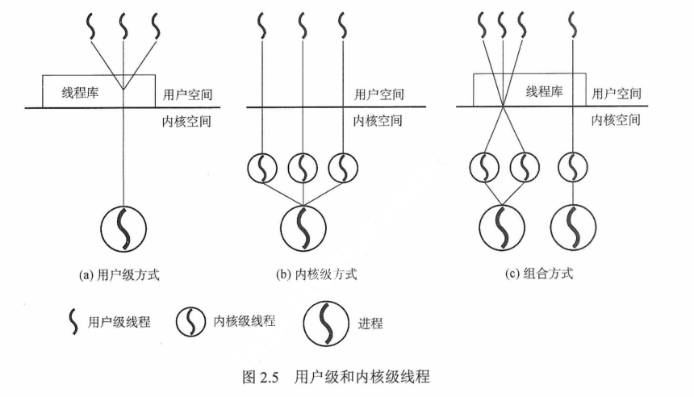

+ **多线程**模型

  + `多对一模型`
    + 将多个**用户级线程**映射到一个**内核级线程**，线程管理在**用户空间**完成。此模式中，**用户级线程**对操作系统不可见（即**透明**）
    + **优点**：线程管理是在**用户空间**进行的，效率比较高
    + **缺点**：一个线程在使用**内核**服务时被阻塞，整个**进程**都会被阻塞；多个线程不能**并行**地运行在**多处理机**上
  + `一对一模型`
    + 将每个**用户级线程**映射到一个**内核级线程**
    + **优点**：一个线程被阻塞后，允许另一个线程继续执行，所以并发能力强
    + **缺点**：每创建一个**用户级线程**都需要创建一个**内核级线程**与其对应，这样创建线程的开销比较大，会影响到应用程序的性能
  + `多对多模型`
    + 将n个**用户级线程**映射到m个**内核级线程**上，要求**$m \le n$**
    + **特点**：克服了**多对一**模型的**并发度不高**的缺点，克服了**一对一**模型的一个用户进程占用太多内核级线程而**开销太大**的缺点

## 处理机调度

### 调度的概念

+ 调度的基本概念

  + 对**处理机**进行分配，即从**就绪队列**中按照一定的算法公平、高效地选择一个**进程**并将处理机分配给它运行，以实现进程**并发**地执行

+ 调度的层次

  + `作业调度` **高级调度**

    + **内存、辅存**之间的调度，对于每个作业只调入一次、调出一次
    + 多道批处理系统中大多配有**作业调度**，其他系统通常不需要配置。作业调度的执行频率较**低**，通常为几分钟一次

  + `中级调度` **内存调度**

    + 提高**内存利用率、系统吞吐量**，将暂时不能运行的进程调至**外存**等待，此时的进程状态称为**挂起态**。当**具备运行条件、内存有空闲**时，由**中级调度**来决定把外存上的**就绪进程**重新调入内存，修改器状态为**就绪态**，挂在就绪队列上等待

  + `进程调度` **低级调度**

    + 按照某种方法、策略从**就绪队列**选取一个进程，将处理机分配给它。**进程调度**是最**基本**的一种调度，一般的操作系统都必须配置。**进程调度**频率很高，一般几十毫秒一次。

    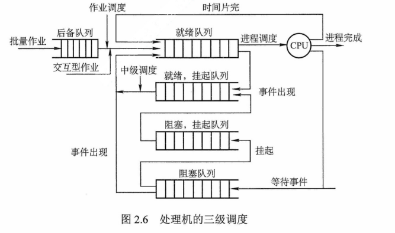

+ 三级调度的联系

  + **作业调度**从外存的后备队列中选择一批**作业**进入内存，为它们建立**进程**，这些进程被送入**就绪队列**，**进程调度**从就绪队列中选出一个进程，把其状态改为**运行态**，把CPU分配给它。**中级调度**是为了提高内存的利用率，系统将那些暂时不能运行的进程挂起来。当内存空间宽松时，通过**中级调度**选择具备运行条件的进程，将其唤醒。
  + **作业调度**为进程活动做准备，**进程调度**使进程正常活动起来，**中级调度**将暂时不能运行的进程挂起，**中级调度**处于**作业调度、进程调度**之间
  + **作业调度**次数少，**中级调度**次数略多，**进程调度**频率最高
  + **进程调度**是最基本的，不可或缺

### 调度的时机、切换、过程

+ 进程**调度、切换**程序是操作系统**内核程序**。

+ 现代操作系统中，不能进行进程的**调度、切换**的情况有以下几种

  + `处理中断的过程中`

    + 中断处理过程复杂，实现上很难做到**进程切换**，而且**中断处理**是系统工作的一部分，逻辑上不属于某一进程，不应被剥夺处理机资源

  + `进程在操作系统内核程序临界区中`

    + 进入临界区后，需要**独占式**地访问共享数据，理论上必须加锁，以防止其他并行程序进入，在解锁前**不应**切换到其他进程运行，以加快该共享数据的**释放**

  + `其他需要完全屏蔽中断的原子操作过程中`

    + 如**加锁、解锁、中断现场保护、恢复**等原子操作。在原子过程中，连中断都要屏蔽，更不应该进行进程**调度、切换**

    > 若在上述过程中发生了引起**调度**的条件，则不能马上进行**调度、切换**，应置系统的**请求调度标志**，直到上述过程结束后才进行相应的**调度、切换**

+ 应该进行进程**调度、切换**的情况如下

  + 发生**引起调度条件、当前进程无法继续运行下去**时，可以马上调度切换。若操作系统只在这种情况下进行**进程调度**，则是**非剥夺调度**

  + **中断处理结束、自陷处理结束**后，返回被中断进程的**用户态**程序执行现场前，若置上**请求调度标志**，即可马上进行进程**调度、切换**。若操作系统支持这种情况下的运行调度程序，则实现了**剥夺**方式调度

    > **进程切换**往往在调度完成后立刻发生，它要求保存原进程当前切换点的**现场信息**，恢复被调度进程的**现场信息**。现场切换时，操作系统内核将原进程的**现场信息**推入当前进程的**内核堆栈**来保存它们，并更新堆栈指针。内核完成从**新进程**的内核栈中装入新进程的**现场信息**、更新当前运行进程空间指针、重设PC寄存器等相关工作之后，开始运行新的进程

### 进程调度方式

+ `非剥夺调度方式` **非抢占方式**
  + 当一个进程正在处理机上执行时，即使有某个更为重要的进程进入**就绪队列**，仍然让正在执行的进程继续执行，直到该进程**完成**或**发生某种事件**而进入**阻塞态**时，才把处理机分配给更为重要或紧迫的进程
  + 一旦把CPU分配给一个进程，该进程就会保持CPU直到**终止**或转换到**等待态**。**优点**是实现简单、系统开销小，适用于大多数的批处理系统，但不能用于**分时系统、大多数的实时系统**
+ `剥夺调度方式` **抢占方式**
  + 当一个进程正在处理机上执行时，若有某个更为重要的进程需要使用处理机，则立即**停止**正在执行的进程，将处理机分配给这个更重要的进程
  + 提高**系统吞吐率、响应效率**，但**剥夺**不是一种任意性行为，必须遵循一定的原则，主要有**优先权、短进程优先、时间片原则**等

### 调度的基本准则

+ `CPU利用率`
  + 尽可能使CPU保持**忙**状态
+ `系统吞吐量`
  + **单位时间**内CPU完成作业的数量。
+ `周转时间`
  + 从**作业提交**到**作业完成**所经历的时间，是**作业等待、就绪队列排队、处理机运行、进行输入输出操作**所花费时间的总和
  + **周转时间 = 作业完成时间 - 作业提交时间**
  + **带权**周转时间是**作业周转时间**与**作业实际运行时间**的比值
    + **带权周转时间 = 作业周转时间 / 作业实际运行时间**
+ `等待时间`
  + 进程处于**等处理机状态**的时间之和
    + **处理机调度算法**实际上不影响**作业执行、输入输出操作时间**，只影响作业在**就绪队列**中等待所花的时间。因此，衡量一个调度算法的优劣，只需简单考查**等待时间**
+ `响应时间`
  + 从**用户提交请求**到**系统首次产生响应**所用的时间。在交互式系统中，一般采用**响应时间**而不是**周转时间**作为衡量调度算法的重要准则。
  + 从用户角度看，调度策略应尽量**降低响应时间**

### 典型的调度算法

+ `先来先服务（FCFS）`调度算法

  + **最简单**的调度算法，可用于**作业调度、进程调度**

    + **作业调度**中，从**后备作业队列**中选**最先**进入该队列的一个或几个作业，调入内存，分配资源，创建进程，放入就绪队列
    + **进程调度**中，从**就绪队列**选择**最先**进入该队列的进程，分配处理机

    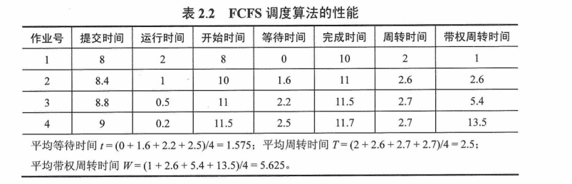

  + 属于**不可剥夺**算法，对所有作业都公平，长作业先到达，会使后面许多短作业等待长时间，因此不能作为**分时系统、实时系统**的主要调度策略

  + 被**结合**在其他调度策略中使用

    + 在使用**优先级**作为调度策略的系统中，对多个具有**相同优先级**的进程按FCFS原则处理

  + **特点**是算法简单、但效率低。对**长作业**有利，不利于**短作业**（相对于**SJF、高响应比**），有利于**CPU**繁忙型作业，不利于**IO**繁忙型作业。

+ `短作业优先（SJF）`调度算法

  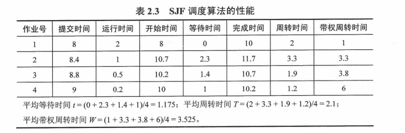

  + **缺点**

    + 对**长作业**不利，长作业**周转时间**会增加。可能导致长期不被调度（**饥饿**现象，区分**死锁**，前者是调度策略问题，后者是**系统环形等待**）
    + 未考虑作业的**紧迫程度**
    + 作业的长短只是根据**用户所提供的估计执行时间**而定，不一定能真正做到短作业优先调度

    > **SJF**调度算法的**平均等待时间、平均周转时间**最少

+ `优先级`调度算法

  + 可用于**作业调度、进程调度**
  + 根据新的更高优先级进程能否**抢占**正在执行的进程，该调度算法可分如下**两**种
    + `非剥夺式优先级`调度算法
      + 让正在运行的进程**继续**执行，直到由于自身的原因而主动让出处理机（**任务完成、或等待事件**）
    + `剥夺式优先级`调度算法
      + 立即暂停正在执行的进程
  + 根据进程创建后其**优先级**是否可以改变，可分为**两**种
    + `静态优先级`
      + **优先级**在**创建进程**时确定，在运行期间不变。确定优先级的主要依据有**进程类型、进程对资源的要求、用户要求**
    + `动态优先级`
      + 进程运行时动态调整优先级，调整优先级的依据有**进程占有CPU时间的长短、就绪进程等待CPU时间长短**
    + 一般来说，**进程优先级**的设置可以参照以下原则
      + **系统进程 > 用户进程**
      + **交互型进程 > 非交互型进程，前台进程 > 后台进程**
      + **IO型进程 > 计算型进程**
        + IO设备的处理速度比CPU慢得多，因此将IO型进程的优先级设置得更高，更有可能让IO设备尽早开始工作，进而提升系统的整体效率

+ `高响应比优先`调度算法

  + 用于**作业调度**，对**FCFS、SJF**的一种综合平衡。在每次进行作业调度时，先计算后备作业队列中每个作业的**响应比**，选出最高的作业运行
    $$
    响应比R_p = \frac{等待时间+要求服务时间}{要求服务时间}
    $$

    + 作业的等待时间相同时，要求服务时间**越短**，响应比**越高**，利于**短作业**
    + 要求服务时间相同时，等待时间**越长**，响应比**越高**，因此实现的是**先来先服务**，对于长作业也是，因此克服了**饥饿状态**

+ `时间片轮转`调度算法

  + 适用于**分时系统**
  + **时间片**的大小对系统性能影响很大，若时间片足够大，以至于所有进程都能在一个时间片内执行完毕，则算法退化成**先来先服务**调度算法。若时间片很小，则处理机将频繁地在进程间切换，使处理机开销增大
  + **时间片**的长短通常由以下因素确定：**系统的响应时间、就绪队列中的进程数目、系统的处理能力**

+ `多级反馈队列`调度算法

  + 是**时间片轮转**调度算法和**优先级**调度算法的综合发展，通过动态调整进程**优先级、时间片大小**，该算法可以兼顾多方面的系统目标

    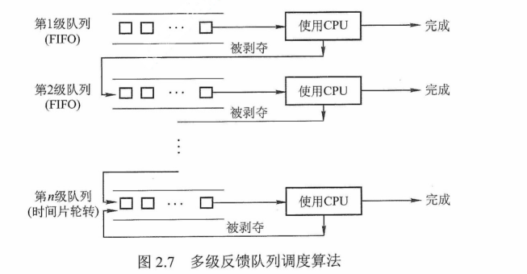

  + **实现思想**

    + 设置多个**就绪队列**，赋予不同的**优先级**，第**1**级队列优先级**最高**
    + 赋予各个队列中进程执行**时间片**的大小各不相同。优先级**越高**的队列，每个进程的运行时间片**越小**
    + 一个新进程进入内存后，放入**第1级队列末尾**，按**FCFS**原则排队等待调度。当轮到该进程执行时，如能在该时间片内完成，便可准备撤离系统；若未完成，该**进程**进入**第2级队列末尾**，再同样按照**FCFS**等待调度执行，以此轮转
    + 仅当**第1级队列**为空，调度程序才调度**第2级队列**中的进程，以此类推。若处理机正在执行**第i级队列**中的某进程时，有新进程进入**优先级较高**的队列，则新进程将**抢占**正在运行进程的处理机，即由调度程序把正在运行的进程放回**第i级队列**的末尾，把处理机分配给新进程

  + **优点**

    + `终端型作业用户`
      + **短作业**优先
    + `短批处理作业用户`
      + **周转时间**较短
    + `长批处理作业用户`
      + 经过前面几个队列得到部分执行，不会长期得不到处理

## 进程同步

### 进程同步的基本概念

+ `临界资源`

  + **一次**仅允许**一个进程**使用的资源

    + 许多**物理设备**都属于临界资源。许多**变量、数据**等都可以被若干进程共享，也属于临界资源

  + 对**临界资源**的访问，必须互斥地进行，在每个进程中，访问临界资源的那段代码称为**临界区**，为了保证**临界资源**的正确使用，可把访问临界资源的过程分为**4**部分

    + `进入区`

      + 先检查可否进入临界区，能进，则设置**正在访问临界区**的标志，以阻止其他进程同时进入临界区

    + `临界区`

      + 进程中访问**临界资源**的那段代码，称**临界段**

    + `退出区`

      + 将**正在访问临界区**的标志清除

    + `剩余区`

      + 代码中的其余部分

      ```c
      do {
          entry section;
          critical section;
          exit section;
          remainder section;
      } while (true)
      ```

+ `同步` **制约关系**
  + 为完成某种任务而建立**两个或多个**进程，因为需要协调这些进程的**工作次序**而**等待、传递信息**所产生的制约关系
+ `互斥` **间接制约关系**
  + 当一个进程进入**临界区**使用**临界资源**时，另一个进程必须等待，直到该进程退出临界区
  + 为禁止两个进程同时进入**临界区**，同步机制应遵循以下准则
    + `空闲让进`
      + **临界区**空闲时，可以允许一个请求进入临界区的**进程**立即进入临界区
    + `忙则等待`
      + 已有进程进入**临界区**时，其他试图进入**临界区**的进程必须等待
    + `有限等待`
      + 对请求访问的进程，应保证能在有限时间内进入**临界区**
    + `让权等待`
      + 当进程不能进入**临界区**时，应立即释放处理器，防止进程**忙等待**

### 实现**临界区**互斥的基本方法

+ 软件实现方法

  + `单标志法`

    + 设置一个公用整型变量turn，用于指示被允许进入**临界区**的**进程编号**，若turn=0，允许$P_0$进程进入临界区。但两个进程必须**交替**进入临界区，若某个进程不再进入临界区，则另一个进程也将无法进入临界区。（违背**空闲让进**）
      + 只有一个公用变量，且某个进程出来时并不**重置**该公用变量，需要依赖其他进程改变该公用变量，以让该进程能重新进入

  + `双标志法先检查`

    + 每个进程访问临界区资源之前，先查看临界资源是否**正被访问**，若正被访问，该进程需等待；否则，进程才进入自己的临界区。为此，设置一个数据**flag[i]**，如第**i**个元素值为**FALSE**，表示**$P_i$**进程未进入临界区，值为**TRUE**，表示进入临界区。

    + **优点**是不用交替进入，可连续使用。**缺点**是两个进程可能同时进入临界区。

      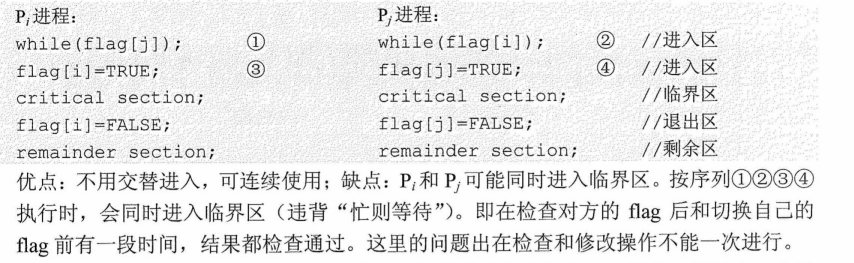

  + `双标志法后检查`

    + 算法二先检测**对方**的进程状态标志，再置自己的标志，由于在**检测、放置**中可插入另一个进程到达时的检测操作，会造成两个进程在分别检测后**同时**进入临界区。为此，该算法先将自己的标志设置为**TRUE**，再检测对方的状态标志，若对方标志为**TRUE**，则进程等待；否则进入**临界区**

      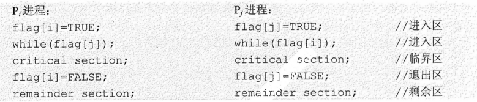

    + 两个进程几乎同时都想进入**临界区**时，分别将自己的标志值flag设置**TRUE**，并同时检测对方的状态（执行while语句），发现对方也要进入**临界区**时，双方互相谦让，导致都无法进入，形成**饥饿**现象

  + `Peterson's Alogrithm`

    + 为了防止两个进程为进入**临界区**而无限期等待，又设置了变量turn，每个进程在先设置自己的标志后，再设置turn标志。

      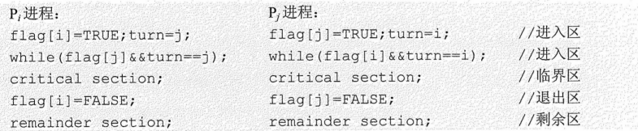

    + 利用flag解决**临界资源**的互斥访问，利用turn解决**饥饿**现象

+ 硬件实现方法

  + `中断屏蔽方法`

    + 禁止一切中断发生，或称之为**屏蔽中断、关中断**。因为CPU只在发生中断时引起**进程切换**，因此**屏蔽中断**能够保证当前运行的进程让**临界区**代码顺利地执行完，进而保证互斥的正确实现，然后执行**开中断**，即**关中断 -> 临界区 -> 开中断**
    + 这种方法限制了处理机**交替**执行程序的能力，因此执行效率明显**降低**。对内核来说，在它执行更新变量或列表的几条指令期间，**关中断**是很方便的，但将**关中断**的权利交给用户则很不明智，若一个进程**关中断**后不再**开中断**，则系统可能会因此终止

  + `硬件指令方法`

    + **TestAndSet**指令：这条指令是**原子操作**，即执行该代码时不允许被中断。其功能是读出指定标志后把该标志设置为**真**。

    + 可以为每个**临界资源**设置一个共享布尔变量**lock**，表示资源的两种状态：**true**表示正被占用，初值为**false**。在进程访问临界资源之前，利用**TestAndSet**检查和修改标志**lock**；若有进程在临界区，则重复检查，直到进程退出。

    + **Swap**指令：该指令的功能是交换两个字（字节）的内容

      > 以上对**TestAndSet**和**Swap**指令的描述仅是功能实现，而非软件实现的定义。事实上，它们是由硬件逻辑直接实现的，不会被中断

    + 应为每个**临界资源**设置一个共享布尔变量**lock**，初值为false；在每个进程中再设置一个局部布尔变量**key**，用于与**lock**交换信息。在进入**临界区**前，先利用**Swap**指令交换**lock**与**key**的内容，然后检查**key**的状态；有进程在**临界区**时，重复交换和检查过程，直到进程退出。

    + **优点**是适用于**任意数目**的进程，不管是**单处理机、多处理机**；简单、容易验证其正确性；支持进程内有多个临界区，只需为每个临界区设置一个布尔变量

    + **缺点**是进程等待进入**临界区**时要耗费处理时间，不能实现**让权等待**。从等待进程中随机选择一个进入临界区，有的进程可能一直选不上，从而导致**饥饿**现象

### 信号量

+ 信号量机制是一种功能较强的机制，可用来解决**互斥与同步**问题，只能被两个标准原语**wait（S）、signal（S）**访问，也可记为**P操作**和**V操作**

+ **原语**指完成某种功能且不被分割、不被中断执行的操作序列，通常可由**硬件**实现。原语功能不被中断执行的特性在**单处理机**上可由软件通过**屏蔽中断**方法实现

+ **整型信号量**

  + 一个用于表示**资源数目**的整型量S，该机制并未遵循**让权等待**准则，而是使进程处于**忙等**状态

+ **记录型信号量**

  + 不存在**忙等**现象的进程同步机制。除需要一个用于代表资源数目的整型变量value外，再增加一个**进程链表L**，用于链接所有等待该资源的进程。当资源已分配完毕，进程应调用**block**原语，进行自我阻塞，放弃处理机，并插入资源的等待队列，即该机制遵循了**让权等待**准则
  + 当进程释放一个资源，是系统中可供分配的资源数**增1**，但是资源数value依然**value <= 0**，表示在队列中仍有等待该资源的进程被阻塞，因此还应调用**wakeup**原语，将队列中的第一个等待进程唤醒

+ 利用信号量实现**同步**

  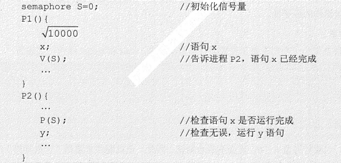

+ 利用信号量实现**进程互斥**

  

  

+ 利用信号量实现**前驱**关系

  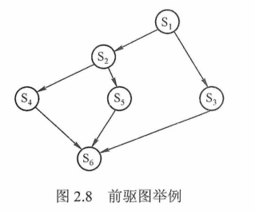

  + 为使各程序段能正确执行，应设置若干初始值为**0**的信号量。例如，为保证**$S_1 \rightarrow S_2，S_1 \rightarrow S_3$**的前驱关系，应分别设置信号量a1，a2。同样，其他程序段类似

    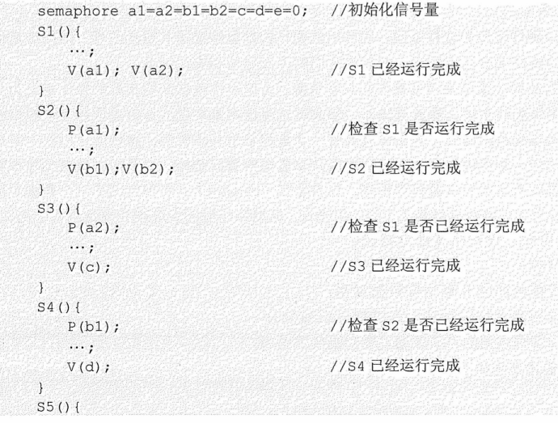

    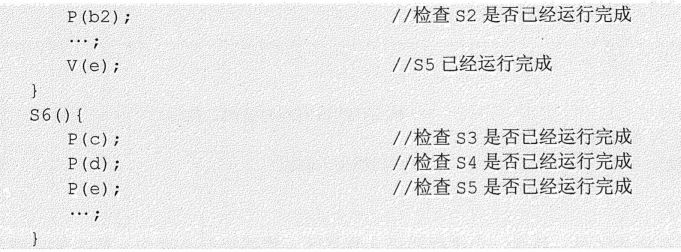

+ 分析进程**同步**和**互斥**问题的方法步骤

  + **关系分析**
    + 找出问题中的进程数，分析它们之间的**同步、互斥**关系。
  + **整理思路**
    + 找出解决问题的关键点，并根据做过的题目找出求解的思路。根据进程的操作流程确定**P操作、V操作**的大致顺序
  + **设置信号量**
    + 根据前面两步，设置需要的**信号量**，确定**初值**，完善整理

### 管程

+ 管程的定义
  + 代表共享资源的**数据结构**，以及由对该**共享数据结构**实施操作的一组**过程**所组成的**资源管理程序**，这组操作能**同步进程、改变管程中的数据**
  + 管程由**4**部分组成
    + 管程的**名称**
    + 局部于管程内部的**共享结构数据**说明
    + 对该数据结构进行操作的一组**过程**（或**函数**）
    + 对局部于管程内部的**共享数据**设置初始值的语句
  + 类比**面向对象**开发，管程很像一个**类**
    + **管程把对共享资源的操作封装起来**
      + 管程内的**共享数据结构**只能被**管程**内的过程所访问
      + 一个进程只有通过调用**管程**内的过程才能进入管程访问**共享资源**
    + **每次仅允许一个进程进入管程，从而实现进程互斥**
+ 条件变量
  + 当一个进程进入**管程**后被阻塞，直到阻塞的原因解除时，在此期间，如果该进程不释放**管程**，那么其他进程无法进入**管程**。为此，将**阻塞原因**定义为**条件变量condition**。
  + 通常，一个进程被阻塞的原因可以有多个，因此在管程中设置了多个**条件变量**。每个条件变量保存了一个**等待队列**，用于记录因该**条件变量**而阻塞的所有进程，对**条件变量**只能进行两种操作，即**wait、signal**
    + **x.wait**
      + 当**x**对应的条件不满足时，正在调用管程的进程调用**x.wait**将自己插入**x**条件的等待队列，并释放**管程**。此时**其他**进程可以使用该管程。
    + **x.signal**
      + **x**对应的条件发生了变化，则调用**x.signal**，唤醒一个因**x**条件而阻塞的进程
  + **条件变量** VS **信号量**
    + **相似点**：条件变量的**wait/signal**操作类似于信号量的**P/V**操作，可以实现进程的**阻塞/唤醒**
    + **不同点**：条件变量是**没有值**的，仅实现了**排队等待**功能；而信号量是**有值**的，反映了**剩余资源数**，而在管程中，**剩余资源数**用**共享数据结构**记录

### 经典同步问题

+ 生产者-消费者问题
+ 哲学家进餐问题

## 死锁

### 死锁的概念

+ 定义

  + 多个进程因**竞争资源**而造成的一种僵局（互相等待），若无外力作用，这些进程将无法向前推进

+ 产生原因

  + `系统资源的竞争`

    + 只有对**不可剥夺资源**的竞争才可能产生死锁，对**可剥夺资源**的竞争不会引起死锁

  + `进程推进顺序非法`

    + 进程运行过程中，**请求、释放**资源的顺序不当，同样会导致死锁。
    + **信号量**使用不当也会造成死锁

  + `死锁产生的必要条件`

    + **互斥条件**

      + 进程要求对所分配的资源进行**排他性控制**，即一段时间内某资源仅为一个进程所占有

    + **不剥夺条件**

      + 进程所获得的资源在**未使用完**之前，不能被其他进程强行夺走，只能主动释放

    + **请求并保持条件**

      + 进程已经保持了**至少一个**资源，但是又提出了**新**的资源请求，而该资源已被**其他**进程占用，此时请求进程被阻塞，但对自己获得的资源保持不放

    + **循环等待条件**

      + 存在一种进程资源的**循环等待链**，链中每个进程已获得的**资源**同时被链中下一个进程所请求。

      > 直观上看，**循环等待条件**似乎和**死锁**的定义一样，其实不然，按**死锁**定义构成**等待环**所要求的条件更严，它要求$P_i$等待的资源必须由$P_{i+1}$来满足，而**循环等待条件**无此限制。

  + 如下所示，资源分配图**含圈**而不一定造成**死锁**的原因是，**同类资源数大于1**，但若系统中每类资源都只有一个资源，则**含圈**就变成了系统出现**死锁**的充要条件

    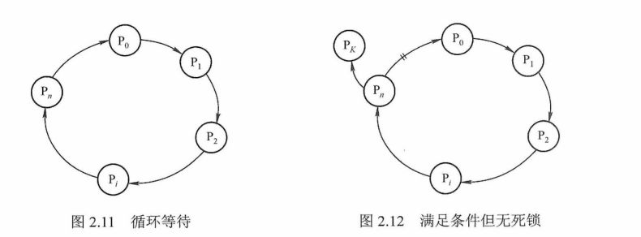

    > 注意区分**不剥夺条件**和**请求并保持条件**

### 死锁的处理策略

+ 为使系统不发生**死锁**，必须破环死锁的**4**个必要条件之一；或允许死锁产生，但当死锁发生时，能检测出死锁，并有能力实现恢复
+ `死锁预防`
  + 
+ ``
+ ``
+ ``

## 总结

+ 为什么要引入**进程**
  + 为了深刻描述程序**动态执行过程的性质**以更好地支持和管理**多道程序的并发执行**
+ 什么是**进程**？由什么组成
  + **进程**是一个具有独立功能的**程序**关于某个数据集合的一次运行活动。可以**申请、拥有**系统资源，是一个动态的概念，是一个活动实体。通过**程序计数器的值、处理寄存器的内容**来表示
  + 进程实体由**程序段、数据段、PCB**三部分构成
+ 为什么要进行**处理机调度**？
  + 可在运行进程等待外部设备时，把处理机调度给其他进程，提高**处理机利用率**


# 内存管理

## 内存管理概念
## 虚拟内存管理

# 文件管理
## 文件系统基础
## 文件系统实现
## 磁盘组织与管理

# 输入/输出管理
## I/O管理概述
## I/O核心子系统
