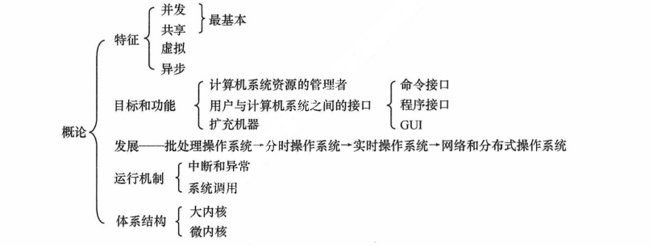

+ 计算机系统概述

  

  + 操作系统的基本概念

    **操作系统** 是指 **控制和管理**整个计算机系统的硬件与软件资源，合理地**组织、调度**计算机的工作与资源的分配，进而为用户和其他软件**提供方便接口与环境**的**程序集合**。**操作系统是计算机系统中最基本的系统软件**

    + 计算机系统**自下而上**分为4部分：**硬件、操作系统、应用程序、用户** （划分与计算机组成原理不同）

    + 操作系统的特征 （**并发、共享、虚拟、异步**，最基本的特征是**并发**和**共享**，两者互为存在条件）

      + 并发（**Concurrence**）

        + 操作系统的并发性是通过 **分时** 得以实现的

        + 并发：**同一时间间隔**

          > 9:00到9:30 吃饭，9:30到10:00 学习，则在 9:00到10:00这段间隔里面，吃饭与学习并发

        + 并行：**同一时刻**，并行性需要有相关硬件的支持，如**多流水线**、或 **多处理机硬件环境**

      + 共享（**Sharing**）（**互斥共享方式** 与 **同时访问方式**）

        + 指系统中的资源，可供内存中多个 **并发执行 **的进程共同使用

        + 互斥共享方式

          仅当进程访问完并释放该资源后，才允许另一个进程对该资源进行访问。

          一段时间内，只允许一个进程访问的资源，称为 **临界资源** 或 **独占资源**。计算机系统中的**大多数物理设备** 及某些软件中所用的 **栈、变量和表格**，都属于 **临界资源**。

        + 同时访问方式

          允许在一段时间内由多个进程**“同时”访问**，“同时”是宏观概念，微观上，这些进程是 **交替地对该资源进行访问，即“分时共享”**。典型资源是 **磁盘设备**。

          > 互斥共享 要求一种资源在一段时间内（哪怕是一段很小的时间）只能满足一个请求，否则就会出现严重问题。而 同时访问共享 通常要求一个请求分几个时间片段间隔地完成，其效果与连续完成的效果相同。

        + **并发** 和 **共享** 是操作系统两个最基本的特征，两者之间互为存在的条件

          + **资源共享**是以程序的并发为条件的，若系统不允许程序**并发执行**，则自然 **不存在资源共享问题**
          + 若系统不能对**资源共享**实施有效的管理，则必将影响到程序的**并发执行**，甚至根本无法**并发执行**

      + 虚拟（**Virtual**）

        把一个物理上的实体，变为若干逻辑上的对应物。实现虚拟的技术，称为 **虚拟技术**，虚拟技术可归纳为 **时分复用技术** （处理器的分时共享） 和 **空分复用技术** （虚拟存储器）

        + 虚拟处理器技术

          通过多道程序设计技术，让多道程序并发执行，来分时使用一个处理器

        + 虚拟存储器技术

          将一台机器的物理存储器变为虚拟存储器，以便从逻辑上扩充存储器的容量

        + 虚拟设备技术

          将一台物理I/O设备虚拟为多台逻辑上的I/O设备

      + 异步（**Asynchronism**）

        多道程序环境允许多个程序并发执行，但由于资源有限，进程的执行并不是一贯到底的，而是走走停停，它以不可预知的速度向前推进

    + 操作系统的目标和功能（**处理器管理、存储器管理、设备管理、文件管理、向用户提供接口、扩充机器**）

      + 操作系统作为计算机系统资源的管理者

        + 处理器管理

          + 多道程序环境下，处理机的分配和运行都以进程（**或线程**）为基本单位，因而对处理机的管理可归结为对进程的管理。
          + 并发是指在计算机内**同时运行多个进程**，因而进程的**创建、撤销、管理、避免冲突、合理共享**就是 **进程管理** 的最主要任务。**进程管理**的主要功能包括 **进程控制、进程同步、进程通信、死锁处理、处理机调度** 等

        + 存储器管理

          包括 **内存分配与回收、地址映射、内存保护与共享、内存扩充** 等功能

        + 文件管理

          包括 **文件存储空间的管理、目录管理、文件读写管理和保护**

        + 设备管理

          主要任务是 **完成用户的I/O请求，方便用户使用各种设备，提高设备的利用率**， 包括 **缓冲管理、设备分配、设备处理、虚拟设备** 等功能

      + 操作系统作为用户与计算机硬件系统之间的接口（**命令接口、程序接口**）

        + 命令接口

          + 联机命令接口（**交互式命令接口**）

            适用于 **分时或实时系统** 的接口

          + 脱机命令接口（**批处理命令接口**）

            适用于 **批处理系统**，脱机用户不能直接干预作业的运行。

        + 程序接口

          ​	由一组**系统调用（也称广义指令）**组成。用户通过在程序中使用这些系统调用来请求操作系统为其提供服务。如**使用各种外部设备**、**申请分配和回收内存**、及**其它各种要求**。
          
          > 图形接口GUI不是操作系统的一部分，但图形接口调用的系统调用命令是操作系统的一部分。
        
      + 操作系统用作扩充机器

        没有任何软件支持的计算机称为**裸机**，它仅构成计算机系统的物质基础，而实际呈现在用户面前的计算机系统是经过若干层软件改造的计算机。**裸机在最里层，其外面是操作系统**。通常把**覆盖了软件的机器**称为**扩充机器**或**虚拟机**。

  + 操作系统的发展与分类

    + 手工操作阶段（此阶段**无操作系统**）

      + 用户独占全机，虽然不会出现因资源被其他用户占用而等待的现象，但资源利用率低
      + CPU等待手工操作，CPU的利用不充分

    + 批处理阶段（**操作系统开始出现**）

      + `单道批处理系统`

        系统对作业的处理是成批进行的，但内存中始终保持**一道作业**。

        + **自动性**。顺利的情况下，磁带上的一批作业能自动的逐个运行，而无须人工干预
        + **顺序性**。磁带上的各道作业顺序地进入内存，各道作业的完成顺序与它们进入内存的顺序在正常情况下**应完全相同**，亦即先调入内存的作业先完成
        + **单道性**。内存中**仅有一道程序运行**，即监督程序每次从磁带上只调入一道程序进入内存运行，当该程序完成或发生异常情况时，才换入其后继程序进入内存运行。

  + 操作系统的运行环境

  + 操作系统的体系结构

  + 总结

  // TODO

+ 进程管理
  + 进程与线程
  + 处理机调度
  + 进程同步
  + 死锁
  + 总结

+ 内存管理
  + 内存管理概念
  + 虚拟内存管理

+ 文件管理
  + 文件系统基础
  + 文件系统实现
  + 磁盘组织与管理

+ 输入/输出管理
  + I/O管理概述
  + I/O核心子系统
