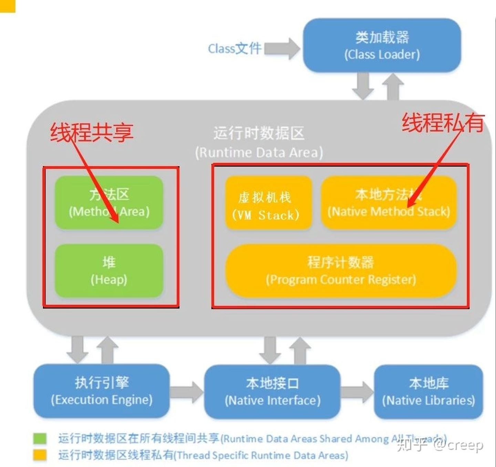
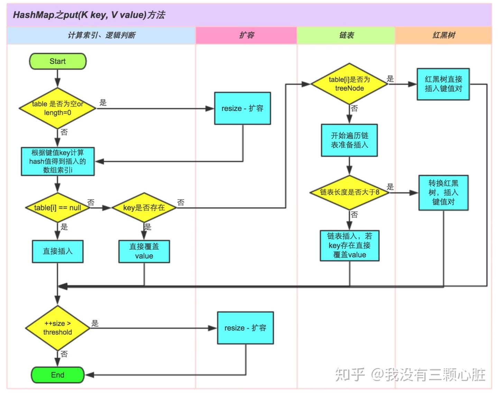

[TOC]

# 基础

## 关键字

### final

使用final修饰的方法无法被重写，类无法被继承。


## JVM与虚拟机

### JVM内存模型



####栈 Stack

线程私有的`内存区域`，每个方法执行的同时都会创建一个`栈帧 (Stack Frame)`，用于储存`局部变量表` (`基本数据类型`、`对象引用`)、`操作数栈`、`动态链接`、`方法出口`等信息。

#### 堆 Heap

`线程共享`。储存几乎所有的`实例对象`，由`垃圾收集器`自动回收，堆区由`各子线程共享使用`

#### 方法区 Method Area (`JDK8以后被元空间Metaspace替代`)

被`所有线程`共享的内存区域，用来储存已被虚拟机加载的`类信息`、`常量`、`静态变量`、`JIT编译后的代码`。`运行时常量池`是方法区的一部分，用于存放`编译期间`生成的各种`字面常量`和`符号引用`。

### 类加载机制

+ 加载

  + 通过类的完全限定名称获取定义该类的二进制字节流
  + 将该字节流表示的静态存储结构转换为方法区的运行时储存结构
  + 在内存中生成一个代表该类的Class对象，作为方法区中该类各种数据的访问入口

+ 验证

  + 确保Class文件的字节流中包含的信息符合当前虚拟机的要求，并且不会危害虚拟机自身的安全

+ 准备

  + 类变量是被static修饰的变量，准备阶段为类变量分配内存并设置初始值，使用的是方法区的内存
  + 实例变量不会在这阶段分配内存

  > 实例化不是类加载的一个过程，类加载发生在所有实例化操作之前，并且类加载只进行一次，实例化可以进行多次

+ 解析

  + 将常量池的符号引用替换为直接引用的过程

  > 解析过程在某些情况下可以在初始化阶段之后再开始，这是为了支持Java的动态绑定

+ 初始化

  + 初始化阶段才真正开始执行类中定义的Java程序代码。


### Java的GC

+ `垃圾分析算法` 判断一个对象是否可被回收
  + `引用计数算法`
    为对象添加一个`引用计数器`，当对象`增加一个引用时`，`计数器加1`，引用`失效`时`计数器减1`。引用`计数为0的对象可被回收`。在两个对象出现`循环引用`的情况下，此时引用计数器永远不为0，导致无法对他们进行回收。正是因为循环引用的存在，因此Java虚拟机不再使用计数算法
  + `可达性算法` **主流**
    以GC Roots为起始点进行搜索，可达的对象都是存活的，不可达的对象可被回收。Java虚拟机使用该算法来判断对象是否可回收，GC Roots一般包含以下内容
    + 虚拟机栈中局部变量表中引用的对象
    + 本地方法栈中JNI引用的对象
    + 方法区中类静态属性引用的对象
    + 方法区中常量引用的对象
+ 垃圾收集算法
  + `标记-清除`算法
    + 优点：简单
    + 缺点：垃圾回收后，内存变得不连续，造成很大零散的内存区域
  + `复制`算法 **大多数GC使用**
    + 优点：GC后的内存空间是连续的
    + 缺点：真正存放新对象的内存空间会变少
  + `标记-整理`算法
    + 缺点：效率低下
+ finalize()

用于关闭外部资源，但是try-finally等方式可以做的更好，并且该方法运行代价很高，不确定性大，无法保证各个对象的调用顺序，因此最好不要使用。

> 当一个对象可被回收时，如果需要执行该对象的finalize方法，那么就有可能在该方法中让对象重新被引用，从而实现自救。自救只能进行一次，如果回收的对象之前调用了finalize方法自救，后面回收时不会再调用该方法。

#### 引用类型

+ 强引用

被强引用关联的对象不会被回收。使用new一个新对象的方式来创建强引用

+ 软引用

被软引用关联的对象只有在内存不够的情况下才会被回收。使用SoftReference类来创建软引用。

```java
Object obj = new Object();
SoftReference<Object> sf = new SoftReference<Object>(obj);
obj = null;  // 使对象只被软引用关联
```

+ 弱引用
  被若引用关联的对象一定会被回收，也就是说它只能存活到下一次垃圾回收发生之前。使用WeakReference类来创建弱引用。

```java
Object obj = new Object();
WeakReference<Object> wf = new WeakReference<Object>(obj);
obj = null;
```

+ 虚引用

一个对象是否有虚引用的存在，不会对其生存时间造成影响，也无法通过虚引用得到一个对象。为一个对象设置虚引用的唯一目的是能在这个对象被回收时收到系统的一个通知。使用PhantomReference来创建虚引用。

```java
Object obj = new Object();
PhantomReference pf = new PhantomReference<Object>(obj, null);
obj = null;
```


### Java类加载器

> 双亲委派模型，该机制可以避免重复加载，当父亲已经加载了该类的时候，就没有必要子`ClassLoader`再加载一次。JVM根据`类名+包名+ClassLoader实例ID`来判定两个类是否相同，是否已经加载过。(可以通过创建不同的`ClassLoader`实例来实现类的热部署)

+ `BootStrapClassLoader`

最顶层的类加载器，由C++编写而成，已经内嵌到`JVM`中。在JVM启动时会初始化该`ClassLoader`，它主要用来读取`Java`的核心类库`JRE/lib/rt.jar`中所有的`class`文件，这个`jar`文件中包含了`java`规范定义的所有接口及实现。

+ `ExtensionClassLoader`

用来读取`Java`的一些扩展类库，如读取`JRE/lib/ext/*.jar`中的包

+ `AppClassLoader`

用来读取`classpath`下指定的所有`jar`包或目录的类文件，一般情况下，这个就是程序默认的类加载器

+ `CustomClassLoader`

用户自定义编写的，用来读取指定类文件。基于自定义的`ClassLoader`可用于加载非`classpath`中（如从网络上下载的`jar`或二进制）的`jar`及目录、还可以在加载前对`class`文件优化一些动作，如解密、编码等

> `ExtensionClassLoader`的父类加载器是`BootStrapClassLoader`，其实这里省掉了一句话，容易造成很多新手的迷惑。严格说，`ExtClassLoader`的父类加载器是`null`，只不过是在默认的`ClassLoader
> `的`loadClass`方法中，当`parent`为`null`时，是交给`BootStrapClassLoader`来处理的，而且`ExtClassLoader`没有重写默认的`loadClass`方法，所有，`ExtClassLoader`也会调用`BootStrapClassLoader`类加载器来加载。


# 集合

包含`Map接口`和`Collection接口`及其所有实现类

+ Collection接口	
  + Set接口
    + HashSet类
    + TreeSet类
    + LinkedHashSet类
  + List接口
    + ArrayList类
    + LinkedList类
    + Stack类
    + Vector类
+ Map接口
  + HashMap类
  + TreeMap类
  + Hashtable类
  + ConcurrentHashMap类
  + Properties类

## Collections

### HashSet

+ HashSet如何保证数据不可重复？

  底层是`HashMap`，**HashSet是实现了Set接口，并且把数据作为K值，而V值一直使用一个相同的虚值来保存**

```java
private static final Object PERSENT = new Object();

public boolean add(E e) {
  return map.put(e, PERSENT) == null;
}
```

### ArrayList


#### ArrayList VS Vector 区别

+ Vector线程安全，ArrayList线程不安全
+ 数据增长。Vector在数据满时(`加载因子为1`)，增长为原来的`两倍`。ArrayList在数据量达到容量的一半时(`加载因子为0.5`)，增长为原容量的`0.5倍 + 1`个空间。

#### ArrayList VS Array(即数组，非类) 区别

+ 数据可以包含`基本类型`和`对象类型`，ArrayList只能包含`对象类型`
+ 数据`大小固定`，ArrayList的大小不固定
+ ArrayList提供更多方法

## Map

+ 永远不要将可变对象类型用作HashMap中的键，因为hashCode()可能会随着变动，导致get出来为null

### Hashtable

##### Hashtable VS HashMap 区别

+ HashMap没有考虑同步，`线程不安全`；Hashtable使用了synchronized关键字，`线程安全`
+ HashMap允许`K/V都为null`；后者`K/V都不允许为null`
+ HashMap继承自`AbstractMap`类；而Hashtable继承自`Dictionary`类

#### Hashtable VS ConcurrentHashMap 区别

+ 都是线程安全
+ Hashtable锁住整个方法，ConcurrentHashMap锁级别更细粒度

###ConcurrentMap

当一个Map被多个线程访问时，通常使用`containsKey()`或者`get()`来查看给定键是否在存储键值对之前出现。但是即使有一个同步的Map，线程还是可以在这个过程中潜入，然后夺取对Map的控制权。问题是，在对put()的调用中，锁在get()开始时获取，然后在可以再次获取锁之前释放。它的结果是个竞争条件：`这是两个线程之间的竞争，结果也会因谁先运行而不同`。

###HashMap工作原理

####重要参数

+ loadFactor
  负载因子，会影响到HashMap的扩容，负载因子越大，HashMap的碰撞越剧烈，但是resize越少；负载因子越少，HashMap碰撞概率越小，但是resize越多。

+ threshold
  要扩容的阈值。当容量大小等于这个阈值的时候，HashMap就会扩容 

####重要方法

+ `put`
  + 取Key的hash值
  + 判断HashMap里面的槽是不是空的，如果是空的就需要初始化HashMap里面槽的数量
  + 判断这个Kay所对应的槽是否被占用，如果没有被占用，就将Key-Value生成一个新的节点，放到对应的槽中
  + 如果这个槽被占用了(`调用hash方法返回值一致，hash方法里面会调用hashCode方法`)，分成三步判断：
    + 判断Key是否相同(`调用equals方法返回一致`)，如果相同则返回原有的Node，如果不相同则进行下面的判断
    + 判断节点是否属于树节点（TreeNode），如果属于，则添加到红黑树中
    + 如果不是树节点，则一定是链表的Node，遍历链表，如果链表长度大于等于8了，则将链表转换成为红黑树，否则添加到链表中
  + 最后判断HashMap的大小是否大于阈值，如果大于，则进行扩容




+ `resize`
  + 判断当前的table里面的size是否大于0，如果大于0的话，就会判断当前的table里面的size是否超过了最大值，如果超过最大值，就不会再扩容，如果没有超过的话，就会将原有的size扩大到原来的两倍，并且判断扩容之后的size是否大于最大值，如果超过最大值就按照最大值来扩容。
  + 如果当前table里面的size等于0的话，并且当前table里面的阈值大于0的时候，就会将原有的阈值设置为新的table的size大小
  + 如果两个条件都不满足的话，则会对新的table设置默认的size(16)，和默认的阈值(16 * 0.75)
  + 如果这个时候新的table的阈值为空，则会重新计算新的阈值

> HashMap的容量始终为2的幂次。在扩容的时候，元素的位置要么是在原位置，要么是否原位置再移动2次幂的位置

+ `get`
  + 判断现在HashMap里面的table是否为空，以及要获取的key对应的槽是否为空，如果为空，就直接返回null
  + 如果都不为空，就判断槽里面的第一个node是不是想要找的key，如果是直接返回
  + 如果第一个不是，就判断node节点是不是树节点，如果是，就直接去红黑树里面查找
  + 如果也不是树节点，那就在链表里面循环查找

####与JDK7对比

+ 插入链表的时候，在JDK7的时候，HashMap插入链表是采用头插法，而在JDK8使用的是尾插法，之所以这么改变的原因是因为，头插法的链表在HashMap的resize()过程中可能因为多线程导致的逆序，让链表形成死循环。
+ 在JDK7的HashMap中，HashMap的数据结构是数组+单向链表，在JDK8的HashMap中，采用的是数组+单链表+红黑树的数据结构
+ 在resiez过程中，JDK7和JDK8的差别主要是在迁移时计算新的索引的位置。JDK7是重新计算Key的hash值，然后用（size-1） & hash得到新的索引位置，而JDK8时，是采用判断高一个bit位的位值，如果高一位的位值是0，那么索引位置就不变，如果是1那么就用原来的HashMap的size大小加上原有的索引位置（原索引+oldCap），这么改变是为了降低rehash带来的开销

####细节总结

+ 在HashMap中链表什么时候会转换成红黑树？
  链表在大于等于8个的时候
  
+ 怎么解决哈希冲突？

  + 链地址法，链接拥有相同hash值的数据
  + 使用2次扰动函数(hash函数)，降低哈希冲突概率，使数据分布更平均
  + 引入红黑树，降低遍历的时间复杂度

+ HashMap为什么不直接使用hashCode方法值用作table的下标？

  hashCode返回值是`int`数据类型，范围是`-(2^31) ~ 2^31 - 1`，而HashMap的容量范围是`16 ~ 2^30`，导致通过`hashCode`计算出的哈希值可能不在数组大小范围内，进而无法匹配存储位置。

+ 为什么数组长度要保证为2的幂次方？

  只有当数组长度为2的幂次方时，`h & (length-1)`才等价`h % length`。

+ 为什么String、Integer这样的类适合作为K？

  + 这些类能够保证Hash值的不可更改性和计算准确性
  + 都是final类型，即不可变性，保证key的不可更改性，不会存在获取hash值不同的情况
  + 内部已重写`equals`、`hashCode`等方法 (**想让自己的类作为Key，同理要重写这两个方法**)

  

####结构体系

+ HashMap结构实际上是由`数组`+`链表`+`红黑树`组成

# 序列化

java对象序列化是JDK1.1中引入的一组开创性特性之一，用于作为一种将Java对象的状态转换为字节数组，以便存储或传输的机制，以后，仍可以将字节数组转换回Java对象原有的状态。

### 序列化允许重构

序列化允许一定数量的变种泪，甚至重构之后也是如此，（新旧类保持同一个`序列化版本hash`，即`private static final serialVersionUID`字段）。`ObjectInputStream`仍可以很好的将其读出来。Java Object Serialization规范可以自动管理的关键任务是

+ 将`新字段`添加到类
+ 将字段从`static`改为`非static`
+ 将字段从`transient`改为`非transient`

### 序列化并不安全

序列化二进制格式完全编写在文档中，并且完全可逆。实际上，只需将二进制序列化流的内容转储到控制台，就足以看清类是什么样子。好在序列化允许`hook`序列化过程。可以通过在`Serializable对象`上提供一个`writeObject`方法来做到这一点。

```java
public class Person implements java.io.Serializable {
  private int age;
  // 这两个方法不是override，要求方法和参数与下面要求一致
  private void writeObject(java.io.ObjectOutputStream stream) throws java.io.IOException {
    age = age << 2;
    stream.defaultWriteObject();
  }
  
  private void readObject(java.io.ObjectInputStream stream) throws java.io.IOException, ClassNotFoundException {
    stream.defaultReadObject();
    age = age << 2;
  }
}
```

### 序列化的数据可以被签名和密封

可以通过`writeObject`和`readObject`实现密码加密和签名管理，但其实还有更好的方式。如果需要对整个对象进行加密和签名，最简单的是将它放在一个`javax.crypto.SealedObject`和`java.security.SignedObject`包装器中。两者都是可序列化的，所以将对象包装在`SealedObject`中可以围绕原对象创建一种“包装盒”。必须有对称密钥才能解密，而且密钥必须单独管理。同样，也可以将`SignedObject`用于数据验证，并且对称密钥也必须单独管理。

### 序列化允许将代理放在流中

很多情况下，类中包含一个核心数据元素，通过它可以派生或找到类中的其他字段。在此情况下，没有必要序列化整个对象。可以将字段标记为transient，但是每当有方法访问一个字段时，类仍然必须显式地产生代码来检查它是否被初始化。


如果首要问题是序列化，那么最好指定一个flyweight或代理放在流中。为原始person提供一个writeReplace方法，可以序列化不同类型的对象来代替它。类似地，如果反序列化期间发现一个readResolve方法，那么将调用方法，将替代对象提供给调用者。


```java
class PersonProxy implements java.io.Serializable {
  public String data;
  
  private Object readResolve() throws java.io.ObjectStreamException {
    String[] pieces = data.split(",");
    Person result = new Person(...);
    // do something
    return result;
  }
}

public class Person implements java.io.Serializable {
  // 
}
```


**注意，PersonProxy必须跟踪Person的所有数据。这通常意味着代理需要是Person的一个内部类，以便能访问private字段。有时候，代理还需要追踪其他对象引用并手动序列化他们。**


> 这种技巧是少数几种不需要读/写平衡的技巧之一。例如，一个类被重构成另一种类型后的版本可以提供一个readResolve方法，以便静默地将序列化的对象转换成新类型。类似地，它可以采用writeReplace方法将旧类序列化成新版本。


### 信任，但要验证

对于序列化的对象，这意味着验证字段，以确保在反序列化之后，它们仍具有正确的值。为此，可以实现`ObjectInputValidation`接口，并覆盖`validateObject`()方法，如果调用该方法时发现某处有错误，则抛出一个`InvalidObjectException`。


### 参考链接

[Java 对象序列化](https://developer.ibm.com/zh/articles/j-5things1/)


# Java特性列表

## Java5

+ 自动装箱拆箱
+ 泛型
+ 枚举
+ 变长参数
+ 注解
+ foreach循环
+ 静态导入
+ 新的线程模型和并发库 `java.util.concurrent`

## Java6

+ 脚本引擎
+ Java Compiler API
+ JDBC 4.0规范

## Java7

+ 字面常量数字的下划线
+ switch支持String
+ 泛型实例化类型自动推断

```java
// java7之前
Map<String,List<String>> map = new HashMap<String,List<String>>();
// java7之后
Map<String,List<String>> map = new HashMap<>();
```

+ `try-with-resources` 
+ 单个catch中捕获多个异常类型
+ NIO 2.0 (`AIO`)

```java
ByteBuffer buffer = ByteBuffer.allocate(32);
buffer.put(new byte[16]);
buffer.position();
```


## `Java8 (LTS)`

+ `Lambda`表达式
+ 新`Date Time API`
+ 接口的`默认方法`和`静态方法`

```java
public interface Test {
  default String defaultFunction() {
    return "default";
  }
  
  static String staticFunction() {
    return "static";
  }
}
```

+ 方法引用
+ 集合的`stream`操作
+ `Optional`处理空指针异常

## Java9

+ REPL工具 `jShell`
+ 模块系统
+ 增强Stream

## Java10

+ 局部变量类型推断

```java
var url = new URL("http://www.oracle.com/")
```

+ Optional新增`orElseThrow`方法

## `Java11 (LTS)`

+ 字符串、集合、Stream、Optional、InputStream增强
+ java直接编译运行

```shell
# before
javac Javastack.java; java Javastack

# after
java Javastack.java
```

## Java12

+ switch增强

```java
// 之前
switch (day) {
  case MONDAY:
    // XXX
}

// 之后
switch (day) {
    case MONDAY -> "monday";
}
```

+ 其他增强

## Java13

## Java14

+ 增强instanceof

```java
// 无需自己进行类型转换
public boolean isBadRequestError(Exception ex) {
  return (ex instanceof HttpClientErrorException rce) && HttpStatus.BAD_REQUEST == rce.getStatusCode();
}
```

+ JDK12引入的switch在JDK14变为正式版本。增强switch，提供`yield`在块中返回值，但不同于`return`

```java
String quantityString = switch (n) {
  case 1 : yield "one";
  case 2 -> "two";
}
```

+ 长文本字符串

```java
String name = """
  what's your name
  """;
```

##Java15

+ 关键字`sealed`、`permits`、`non-sealed`限定实现类，限定父类的使用。

## Java16

##`Java17 (LTS)`
