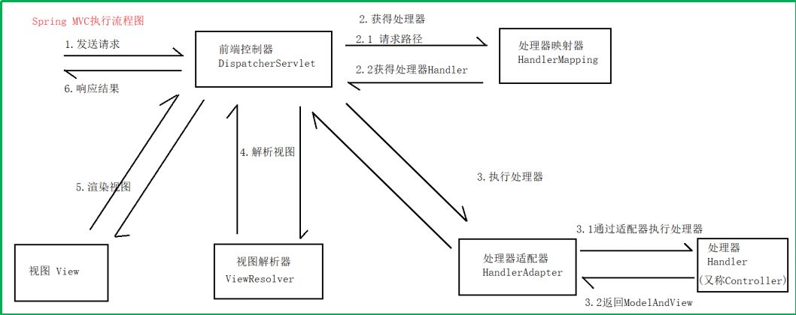

# Spring面试

## Spring框架

### 用了什么设计模式？

+ 工厂模式
    BeanFactory就是简单工厂模式的体现，用来创建对象的实例
+ 单例模式
    Bean默认为单例
+ 代理模式
    Spring的AOP功能用到了JDK的动态代理和CGLIB的字节码生成技术
+ 模板方法
    用来解决代码重复问题。比如，RestTemplate，JmsTemplate，JpaTemplate
+ 观察者模式
    定义对象建一种一对多的依赖关系，当一个对象的状态发生改变时，所有依赖于它的对象都会得到通过被制动更新，如Spring种Listern实现的ApplicationListener

### Spring框架中有哪些不同类型的事件？

+ 上下文更新事件 (ContextRefreshedEvent)
    在调用ConfigurableApplicationContext接口中的refresh()方法时被触发

+ 上下文开始事件 (ContextStartedEvent)
    当容器调用ConfigurableApplicationContext的start()方法开始/重新开始容器时触发该事件

+ 上下文停止事件 (ContextStoppedEvent)
    当容器调用ConfigurableApplicationContext的stop()方法停止容器时触发该事件

+ 上下文关闭事件 (ContextClosedEvent)
    当ApplicationContext被关闭时触发该事件。容器被关闭时，其管理的所有单例Bean都被销毁

+ 请求处理事件 （RequestHandledEvent)
    在Web应用中，当一个http请求(request)结束触发该事件。如果一个Bean实现了ApplicationListener接口，当一个ApplicationEvent被发布以后，bean会自动被通知

### 什么是Spring？

为了降低Java开发的复杂性，Spring采取了以下4种关键策略

+ 基于POJO的轻量级和最小侵入性编程
+ 通过依赖注入和面向接口实现松耦合
+ 基于切面和惯例进行声明式编程
+ 通过切面和模板减少样板式代码

### 什么是IOC？

由程序代码直接操控的对象的调用权交给容器，通过容器来实现对象组件的装配和管理。(通过工厂模式和反射机制实现)

### BeanFactory 与 ApplicationContext 有什么区别？

BeanFactory和ApplicationContext是Spring的两大核心接口，都可以当作Spring的容器。其中ApplicationContext是BeanFactory的子接口。

BeanFactory： 是Spring里面最底层的接口，包含了各种Bean的定义，读取bean配置文件，管理bean的加载，实例化，控制bean的生命周期，维护bean之间的依赖关系。

ApplicationContext： 作为BeanFactory的派生，除了提供BeanFactory所具有的功能外，还提供了更完整的框架功能。

### Spring Bean的生命周期

+ 实例化 **Instantiation**
+ 属性赋值 **Populate**
+ 初始化 **Initialization**
+ 销毁 **Destruction**

## SpringMVC
MVC是软件架构模式，是一种分离业务逻辑与显示页面的设计方法，他把软件系统分为三个基本部分：`模型(Model)`，`视图(View)`，`控制器(Controller)`。

+ 控制器
	对请求进行处理，负责选择视图
+ 视图
	用户与程序交互的界面
+ 模型
	用于业务处理

### 原理

#### 启动流程

+ 如果在web.xml中配置了ContextLoaderListener，那么Tomcat在启动的时候会先加载父容器，并将其放到ServletContext中
+ 然后加载DispatcherServlet，因为DispatcherServlet实质是一个Servlet，所以会先执行它的init方法。这个init方法在HttpServletBean这个类中实现，其主要工作是做一些初始化工作，将我们在web.xml中配置的参数书设置到Servlet中，然后再触发FrameWorkServlet的initServletBean方法
+ FrameworkServlet主要作用是初始化Spring子上下文，设置其父上下文，并将其放入ServletContext中
+ FrameworkServlet在调用initServletBean()的过程中，同时会触发DispatcherServlet的onRefresh()方法，这个方法会初始化SpringMVC的各个功能组件。比如异常处理器、视图处理器、请求映射处理

#### 执行流程

+ 发起请求到`前端控制器 DispatcherServlet`，该控制器就会过滤出你哪些请求可以访问该servlet
+ 前端控制器会找到`处理器映射器 HandlerMapping`，通过处理器映射器完成`url`到`controller`的映射
+ 通过`映射器`找到对应的`处理器 Handler` ，并将`处理器`返回给`前端控制器`。(`返回的处理器前有拦截器`)
+ `前端控制器`拿到`处理器`之后，找到`处理器适配器 HandlerAdapter`，通过适配器来访问和执行处理器。(`不能直接访问处理器，因为Spring的设计，不知道调用哪个方法，不知道处理器类如何创建出来的，如注解等等`)
+  执行处理器
+ 处理器返回`ModelAndView`对象给`处理器适配器 HandlerAdapter`
+ 通过`处理器适配器 HandlerAdapter`将`ModelAndView`对象返回给`前端控制器(DispatcherServlet)`
+ `前端控制器`请求`视图解析器 ViewResolver`进行解析，将`ModelAndView`的数据进行视图渲染。
+ 最后返回结果。

#### SpringMVC常用注解

+ @Controller/@RestController 标注一个控制器类
+ @RequestMapping 用来处理请求地址映射的注解
+ @Resource 非Spring注解，做Bean的注入，默认按照`名称`注入，也可指定类型
+ @Autowired 自动注入，按照类型装配依赖对象。如果想用按照`名称`，搭配`@Qualifier`
+ @ModelAttribute 该Controller所有方法调用前，先执行此@ModelAttribute方法，可用于注解和方法参数中
+ @SessionAttributes 把值放到session作用域中
+ @PathVariable 用于将请求URL中的模板变量映射到功能处理方法的参数上
+ @RequestParam 控制层获取参数
+ @RequsetBody, @ResponseBody 用于将Controller方法获取或返回的对象，通过适当的`HttpMessageConverter`转换为指定格式
+ @Componet 通用的注解，标注组件
+ @Repository 注解Dao层
+ @Service 标注业务层组件类

#### SpringMVC的拦截器

## SpringBoot

## SpringCloud

