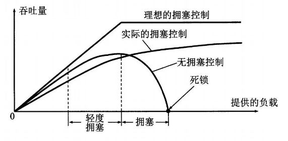
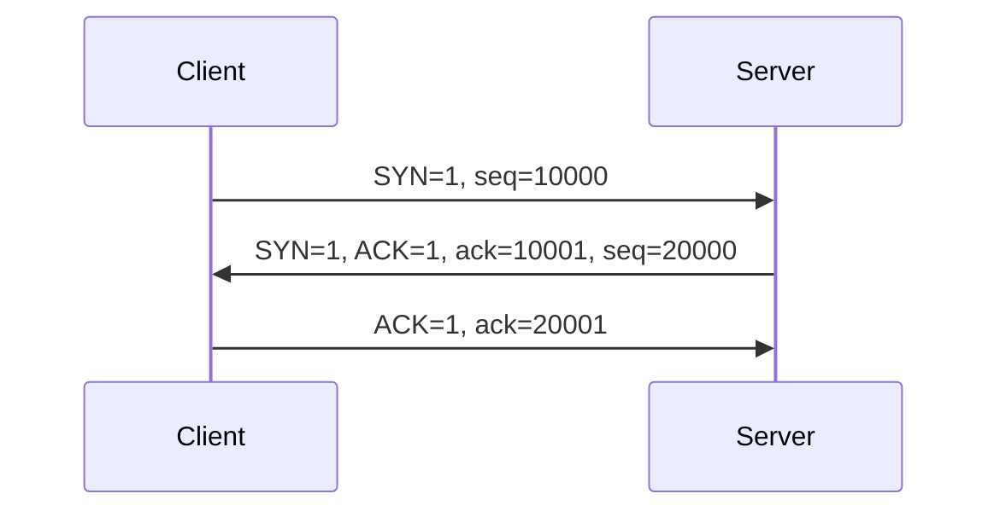
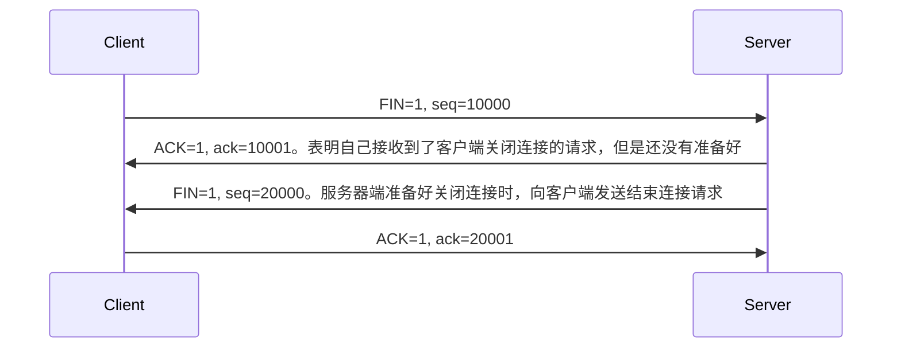

[TOC]

## 网络

### TCP/UDP

TCP 传输控制协议
  + 面向连接，提供可靠交付
  + 流量控制
  + 拥塞控制
    如果网络出现拥塞，分组将会丢失，此时发送方会继续重传，从而导致网络拥塞程度更高。因此当出现拥塞时，应当控制发送方的速率。这一点和流量控制很像，但是出发点不同。流量控制是为了让接收方能来得及接收，而拥塞控制是为了降低整个网络的拥塞程序。

  + 全双工通信
  + 面向字节流 (`应用层传下来的报文看成字节流，把字节流组织成大小不等的数据块`)
  + 点对点 (`一对一`)

UDP 用户数据报协议
  + 无连接，尽最大可能交付
  + 没有拥塞控制
  + 面向报文 (`应用层传下来的报文不合并也不拆分，只是添加UDP首部`)
  + 支持`一对一`，`一对多`，`多对一`，`多对多`的交互通信

#### 首部格式

#### 三次握手

SYN: 同步位
ACK：确认位
FIN: 结束位
ack：确认号，默认是对方发送序号+1
seq：发送序列号

#### 四次挥手

#### FAQ

+ 为什么要三次握手？
    验证双方的接收和发送请求的能力是正常的

+ 为什么要四次挥手？
    因为服务端在`LISTEN`状态下，收到建立连接请求的`SYN`报文后，把`ACK和SYN`放在一个报文里发送给客户端。而关闭连接时，当收到对方的`FIN`报文后，仅仅表示`对方不再发送数据了，但还是能接收数据`，服务端是否现在关闭发送数据通道，需要上层应用来决定，因此，服务端ACK和FIN一般都会分开发。

+ TIME_WAIT是什么？
    客户端接收到服务器端的FIN报文后进入此状态，此时并不是直接进入CLOSED状态，还需要等待一个时间计时器设置的时间2MSL。这么做有两个理由
    + 确保最后一个确认报文能够达到。如果B没收到A发送来的确认报文，那么就会重新发送连接释放请求报文，A等待一段时间就是为了处理这种情况的发生
    + 等待一段时间是为了让本连接持续时间内所产生的所有报文都从网络中消失，使得下一个新的连接不会出现旧的连接请求报文

### 参考链接

[一文搞定 UDP 和 TCP 高频面试题](https://zhuanlan.zhihu.com/p/108822858)

## 文件

## 存储