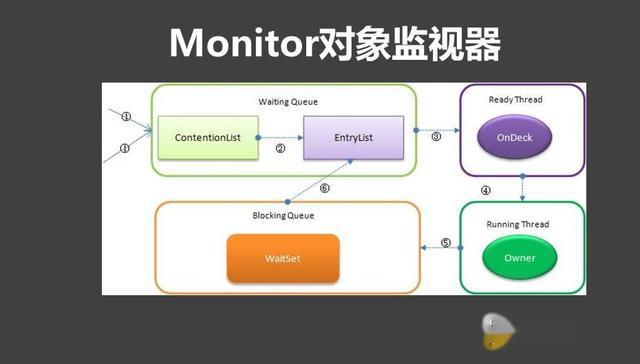
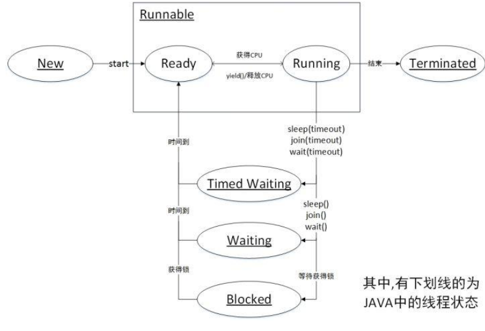
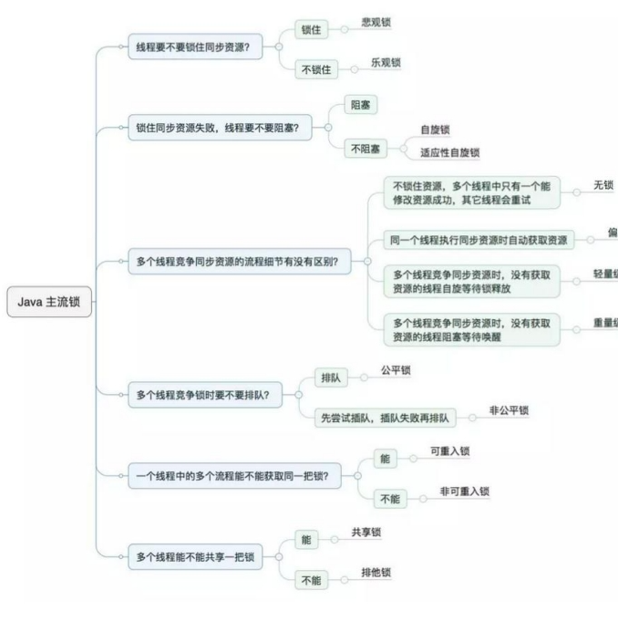
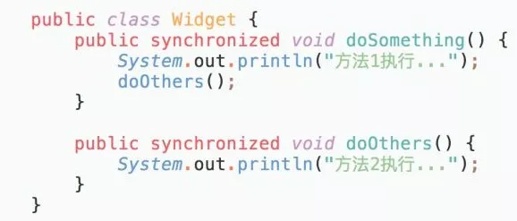
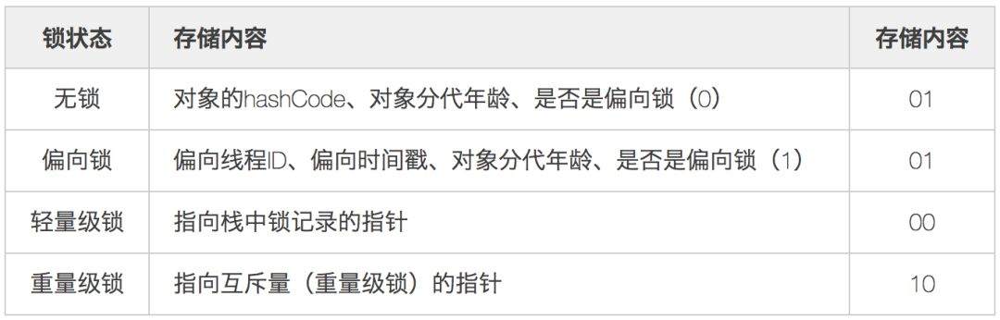
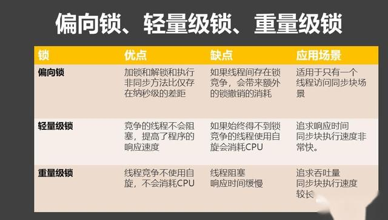
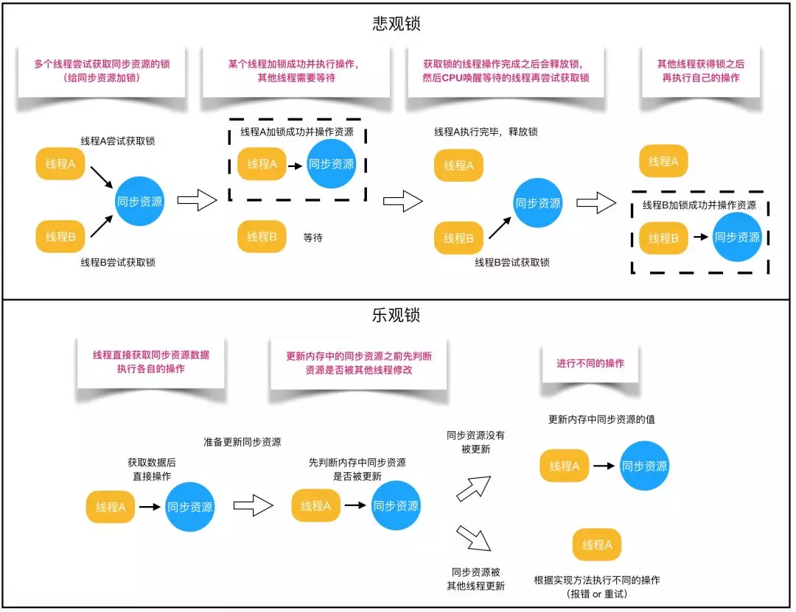
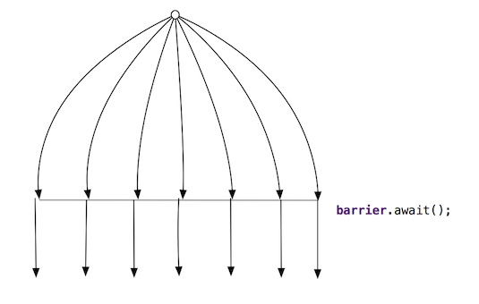
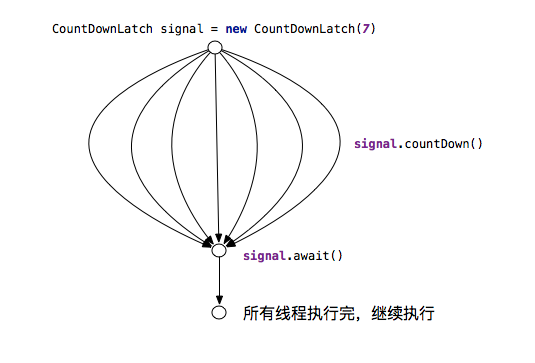

[TOC]

# 线程基础

## happen-before规则

+ 程序次序规则
  + 在一个线程内，一段代码的执行结果是有序的。就是还会指令重排，但是随便它怎么排，结果是按照我们代码的顺序生成的不会变。 (`指令重排，不是java代码重排，因为一行java代码，可能对应了多行指令`)
+ 管程锁定规则
  + 就是无论是在单线程环境还是多线程环境，对于同一个锁来说，一个线程对这个锁解锁之后，另一个线程获取了这个锁都能看到前一个线程的操作结果 (`管程是一种通用的同步原语，synchronized就是管程的实现`)
+ volatile变量规则
  + 就是如果一个线程先去写一个volatile变量，然后一个线程去读这个变量，那么这个写操作的结果一定对读的这个线程可见
+ 线程启动规则
  + 在主线程A执行过程中，启动子线程B，那么线程A在启动子线程B之前对共享变量的修改结果对线程B可见
+ 线程终止规则
  + 在主线程A执行过程中，子线程B终止，那么线程B在终止之前对共享变量的修改结果在线程A中可见。也称线程join()规则
+ 线程中断规则
  + 对线程interrupt()方法的调用先行发生于被中断线程代码检测到中断事件的发生，可以通过`Thread.interrupted()`检测到是否发生中断
+ 传递性规则
  + 这个简单的，就是happens-before原则具有传递性，即hb(A, B), hb(B, C), 那么hb(A, C)
+ 对象终结规则
  + 这个简单，就是一个对象的初始化的完成，也就是构造函数执行的结束一定happens-before它的finalize()方法


## 基础概念

+ 实现多线程的方式
  + 继承Thread类
  + 实现Runnable接口
  + 实现Callable接口和FutureTask类 (`本质上也是Runnable`)

+ Java对象头
  + 标记字段 (`Mark Work`)
    默认存储对象的`HashCode`、`分代年龄`和`锁标志位`信息。这些信息都是`与对象自身定义无关`的数据，所以`Mark Word`被设计成一个非固定的数据结构以便在极小的空间内存储尽量多的数据。它会根据对象的状态复用自己的储存空间，也就是说`运行期间，Mark Word里储存的数据会随着锁标志位的变化而变化`

  + 类型指针 (`Klass Pointer`)
    对象指向它的类元数据的指针，`虚拟机通过这个指针来确定这个对象是哪个类的实例`

+ Monitor
  可以理解为一个`同步工具`、或一种`同步机制`，通常被描述为一个对象。每一个Java对象就有一把看不见的锁，称为`内部锁`或`Monitor锁`

  Monitor是`线程`私有的数据结构，每一个线程都有一个可用monitor record列表，同时还有一个全局可用列表。每一个被锁住的对象都会和一个`monitor`关联，同时monitor中有一个`Owner`字段存放`拥有该锁的线程的唯一标识`，表示该锁被这个线程占用。


> Monitor描述为对象监视器，可以类比一个特殊的房间，这个房间中有一些被保护的数据，Monitor保证每次只能有一个线程能进入这个房间进行访问被保护的数据，进入房间即为持有Monitor，退出房间即为释放Monitor。使用synchronized加锁的同步代码块，主要就是通过锁对象的monitor的取用和释放来实现的。
>
> + 被*synchronized*修饰过的程序块，在编译前后被编译器生成了*monitorenter*和*monitorexit*两个字节码指令
> + 虚拟机执行到*monitorenter*指令时，首先要尝试获取对象的锁
>   + 如果这个对象没有锁定，或者当前线程已经拥有了这个对象的锁，把*锁的计数器+1*；当执行*monitorexit*指令时，将*锁的计数器-1*；当计数器为0时，锁就被释放了

  + 线程状态在Monitor上体现
    当多个线程同时请求某个对象监视器时，对象监视器会设置几种状态用来区分请求的线程
    + Contention List `所有请求锁的线程将被首先放置到该竞争队列`
    + Entry List `Contention List中那些有资格成为候选人的线程被移到Entry List`
    + Wait Set `调用wait方法被阻塞的线程，被放置到wait set`
    + OnDeck `任何时刻最多只有一个线程正在竞争锁，该线程称为OnDeck`
    + Owner `释放锁的线程`




> synchronized通过Monitor来实现线程同步，Monitor是依赖于底层的操作系统的`Mutex Lock (互斥锁)`来实现的线程同步

+ 同步方法或同步代码块

  + 当`JVM`执行一个同步方法时，执行中的线程识别该方法的`method_info`结构是否有`ACC_SYNCHRONIZED`标记设置，然后它自动获取对象锁，调用方法，最后释放锁。如果有异常发生，线程自动释放锁。

  + `字节代码`：创建`同步代码块`产生了16行字节码，而创建`同步方法`仅产生了5行。

  + 同步实例方法，则当前实例加锁。同步静态方法，则当前类加锁。同步方法块，则给定对象加锁

+ `volatile`关键字

> Java里只有`volatile`关键字是能实现禁止指令重排序的

  + volatile关键字两个作用
    + 保证变量的可见性
      + 当一个被`volatile`关键字修饰的变量被一个线程修改的时候，其它线程可以立刻得到修改之后的结果。当一个线程向被`volatile`关键字修饰的变量写入数据的时候，虚拟机会强制它被值刷新到主内存中。当一个线程用到被`volatile`关键字修饰的值的时候，虚拟机会强制要求它从主内存中读取。
    + 屏蔽指令重排序
      + 指令重排序是编译器和处理器为了高效对程序进行优化的手段，它只能保证程序执行的结果是正确的，但是无法保证程序的操作顺序与代码顺序一致。这在单线程中不会构成问题，但是在多线程中就会出现问题。

> 非常经典的例子是在单例方法中同时对字段加入`volatile`，就是为了防止指令重排序。

  + `synchronized`和`volatile`的有序性与可见性是两个角度来看的
    + `synchronized`是因为块与块之间看起来是原子操作，块与块之间有序可见
    + `volatile`是在底层通过内存屏障防止指令重排的，变量前后之间的指令与指令之间有序可见
  + `synchronized`和`volatile`有序性不同也是因为其实现原理不同
    + `synchronized`靠操作系统内核互斥锁实现的，相当于JMM中的`lock`和`unlock`。退出代码块时一定会刷新变量回主内存。
    + `volatile`靠插入内存屏障指令防止其后面的指令跑到它前面去了

  + 简言之，`volatile`关键字识别一个变量，意味着这个变量的值会被不同的线程修改
    + 既然*volatile*能够保证线程间的变量可见性，是不是就意味着基于*volatile*变量的运算就是并发安全的？
      + **显然不是的**，基于*volatile*变量的运算在并发下不一定是安全的。*volatile*变量在各个线程的*工作内存*，不存在一致性问题（各个线程的工作内存中volatile变量，每次使用前都要刷新到*主内存*）。但是Java里面的运算并非*原子操作*，导致*volatile*变量的运算在并发下一样是不安全的

  + 为了提高性能，`Java`语言规范允许`JRE`在`引用变量的每个线程`中`维护该变量的一个本地副本`。您可以将变量的这些“线程局部”副本看作是与缓存类似，在每次线程需要访问变量的值时帮助它避免检查主存储器。

  + 两个线程启动，第一个线程将变量A读取为5，第二个线程将变量A读取为10。如果变量A从5变到10，第一个线程将不会知道这个变化，因此会拥有错误的变量A的值。但是如果将变量A标记为`volatile`，那么不管线程何时读取A的值，它都会回`头查阅A的原版拷贝`并`读取当前值`。

  + 易失性变量与同步化

    + 如果一个变量被声明为`volatile`，这意味着它预计会由多个线程修改。当然，您会希望JRE会为易失性变量施加某种形式的`同步`。幸运的是，JRE在访问易失性变量时确实隐式地提供同步，但是有一条重要提醒：`读取易失性变量是同步的`，`写入易失性变量也是同步的`，但`非原子操作不同步`。
    + 像`AtomicIntegerFieldUpdater`之类的原子字段更新程序基本上是应用于易失性字段的封装器。`Java`类库在内部使用它们。虽然它们没有在应用程序代码中得到广泛应用，但是也没有不能使用它们的理由。

    + 换言之，如果一个易失性变量得到更新，这样其值就会在底层被读取、修改并分配一个新值，结果将是一个在`两个同步操作`之间执行的`非线程安全操作`。然后您可以决定是`使用同步化`还是依赖于`JRE的支持`来自动同步易失性变量。更好的方法取决于您的用例：如果分配给易失性变量的值取决于当前值（比如在一个递增操作期间），要想该操作是线程安全的，那么您必须使用同步化。

```java
// 线程不安全
myVolatile++	
  
// 上述语句也可写成
int temp = 0;
synchronized (myVolatileVar) {
  temp = myVolatileVar;
}

temp++;

synchronized (myVolatileVar) {
  myVolatileVar = temp;
}

// 在一个多线程环境中递增或递减一个原语类型时，使用在java.util.concurrent.atomic包中找到的其中一个新原子类比自己编写同步代码块要好得多。
```

+ 互斥同步

`Java`提供了两种锁机制来控制多个线程对共享资源的互斥访问，第一个是`JVM`实现的`synchronized`，另一个是`JDK`实现的`ReentrantLock`。 

两种同步机制的比较

+ 锁的实现

`synchronized`基于`JVM`实现，`ReentrantLock`基于`JDK`实现

+ 等待可中断

当持有锁的线程长期不释放锁的时候，正在等待的线程可以选择放弃等待，改为处理其他事情。

`ReentrantLock`可中断，`synchronized`不行

+ 公平锁

公平锁是指多个线程在等待同一个锁的时候，必须按照申请锁的时间顺序来一次获取锁。线程直接进入队列中排队，队列中的第一个线程才能获得锁。
`synchronized`中的锁是非公平的，`ReentrantLock`默认情况下也是非公平，但是也可以是公平的。

公平锁的优点是`等待锁的线程不会饿死`。缺点是`整体吞吐效率相对非公平锁要低，等待队列中除第一个线程以外的所有线程都会阻塞，CPU唤醒阻塞线程的开销比非公平锁大`

+ 锁绑定多个条件

一个`ReentrantLock`可以同时绑定多个`Condition`对象

> 除非需要使用`ReentrantLock`的高级功能，否则优先使用`synchronized`。这是因为`synchronized`是`JVM`实现的一种锁机制，`JVM`原生的支持它，而`ReentrantLock`不是所有的JDK版本都支持。并且使用`synchronized`不用担心没有释放锁而导致死锁问题，因为`JVM`会确保锁的释放。 

+ 多线程开发良好的实践
  + 给线程起个有意义的名字，方便找BUG
  + 缩小同步范围，减少锁争用。如`synchronized`，应尽可能使用`同步块`而不是`同步方法`
  + 多用同步工具，少用`wait`和`notify`。`CountDownLatch`、`CyclicBarrier`，`Semaphore`和`Exchanger`这些同步类简化了编码操作，而用`wait`和`notify`很难实现复杂控制流。
  + 使用`BlockingQueue`实现生产者消费者问题
  + 多用`并发集合`，少用`同步集合`
  + 使用`本地变量`和`不可变类`来保证线程安全
  + 使用线程池而不是直接创建线程

## 线程方法

+ 线程的静态方法，默认对当前执行的线程起作用。因此，这些静态方法，如果写在`main`方法里面，则一定作用到主线程，只有把它写到自定义线程里面，才一定是作用到自定义线程。

+ `join`
  在线程中调用另一个线程的`join`方法，会将当前线程挂起，而不是忙等待，直到目标线程结束。

+ `await/signal/signalAll`

  `JUC` (`java.util.concurrent`) 类库中提供了`Condition`类来实现线程之间的协调，可以在`Condition`上调用`await`方法使线程等待，其他线程调用`signal`或者`signalAll`方法唤醒等待的线程。当前线程进入等待状态直到被通知(`signal`)或中断，当前线程进入后台运行状态且从`await()`方法返回其他线程调用该`Condition`的`signal`或者`signalAll`方法，而当前线程被选中唤醒

  + 其他线程(`interrupt`)中断当前线程
  + 如果当前等待线程从`await`方法返回，那么表明当前线程已经获取了`Condition`对象的锁

> 相比`wait`这种等待方式，`await`可以指定等待的条件，因此更加灵活。

+ `wait`方法与`notify`
  
+ 调用`Thread.sleep()`方法使`当前线程`进入限期等待状态时，常常用"`使一个线程睡眠`"进行描述
  
+ 调用`Object.wait()`方法使`当前线程`进入限期等待或者无限等待状态，常常用"`挂起一个线程`"进行描述                                                                                                                                                                                             
  
+ `睡眠`和`挂起`用来描述行为，`阻塞`和`等待`用来描述状态。`阻塞`是被动的，等待获取一个排他锁，`等待`是主动的，通过调用`Thread.sleep()`和`Object.wait()`等方法进入                                                                                                                                                                                             
  
+ `wait` : 调用`wait`之前，线程必须获得该对象的锁（即必须拥有该对象的监视器），因此只能在同步方法/同步代码块中调用`wait`方法。只要该线程在等待队列中，就会一直处于闲置状态，不会被调度执行。**此方法使当前线程（称为T ）将自己置于该对象的等待集中，然后放弃对该对象的任何和所有同步声明。 出于线程调度的目的，线程T被立即禁用，并且处于休眠状态，不再往下执行其他代码。**       
```java
  synchronized(first) {
    try {
      	// 表示执行这段代码的线程， 获得了first对象的监视器，同时把自己添加到first对象的等待集中，等待2秒。这期间，该线程处于TIMED_WAITING状态。
      	// 虽然是first对象调用了wait方法，但实际上对first对象并无影响，哪怕first对象也是个线程对象。
      	// wait方法仅作用到当前线程，表示线程挂起，等待获取first对象。
        first.wait(2000);
    }
  }                                                                                                                            
```

+ `notify` : 和`wait`一样，`notify`也要在`同步方法/同步代码块`中调用。`notify`的作用是，如果有多个线程等待，那么线程规划器`随机`挑选出一个`wait`的线程，对其`发出通知`，并使它`等待获取`该对象的对象锁，注意，即使收到了通知，`wait`的线程也`不会马上获取对象锁`，必须等待`notify`方法的线程`释放锁`才可以。                                                                                                                                                                                                                                                                                                                                                                                                                                                                                                                                                                                                                                                                                                                                                                                                                                                                                                                                                                                                                                                   

|               进入方法               |                  退出方法                   |
| :----------------------------------: | :-----------------------------------------: |
|          Thread.sleep()方法          |                  时间结束                   |
| 设置了Timeout参数的Object.wait()方法 | 时间结束/Object.notify()/Object.notifyAll() |
| 设置了Timeout参数的Thread.join()方法 |        时间结束/被调用的线程执行完毕        |

+ `interrupted`与`isInterrupted`与`interrupt`方法

阻塞式方法抛出`InterruptedException`时，会清除中断中断状态。（会抛出`InterruptedException`异常的方法，称为阻塞式方法）

中断是一种合作机制。当一个线程打断另一个线程时，被中断的线程不一定立即停止它正在做的事情。相反，中断是一种礼貌地要求另一线程在方便时停止它正在做的事情的方式。一些方法，如`Thread.sleep()`，会认真对待此请求，但方法不需要注意中断。不阻塞但执行时间仍可能需要很长时间的方法可以通过轮询中断状态来尊重中断请求，如果中断，则提前返回。您可以自由地忽略中断请求，但这样做可能会损害响应。

中断的合作性质的好处之一是，它为安全构建可取消的活动提供了更大的灵活性。我们很少希望活动立即停止；如果活动在更新中被取消，程序数据结构可能会处于不一致的状态。中断允许可取消的活动清理任何正在进行的工作，恢复不变量，将取消通知其他活动，然后终止。

如果一个线程的`run`方法执行一个无限循环，并且没有执行`sleep`等会抛出`InterruptedException`的操作，那么调用线程的`interrupt`方法就无法使线程提前结束。但是调用`interrupt`方法会设置线程的中断标记，此时调用`interrupted`方法会返回`true`，因此可以在循环体中使用`interrupted()`方法来判断线程是否处于中断状态，从而提前结束线程。

```java
public class InterruptExample {
    private static class MyThread extends Thread {
        @Override
        public void run() {
          try{
            while (!interrupted()) {
                // ..
            }
          } catch (InterruptedException e) {
            
          }
            System.out.println("Thread end");
        }
    }
}
```


+ 如何处理中断异常
  + 通过不捕获中断异常，向调用者传播中断异常
  + 在重新抛出中断异常之前，执行特定任务的清理，处理完成后重新抛出该异常
```java
      @Override
      public void run() {
        try {
          // do something...
        } catch (InterruptedException e) {
          // do something cleanup
          throw e;
        }
      }
```
  + 不要吞下中断异常
    + 为什么不能吞下中断异常？
      + 单个中断请求，可能有多个接收者。如标准线程池（`ThreadPoolExecutor`），工作线程的实现是响应中断，因此中断在线程池中执行的任务，可能有`取消任务`和`通知执行线程该线程池正在关闭`的作用。如果任务吞下中断请求，则工作线程可能不会得知请求了中断，这会延迟应用程序或服务的关闭。
    + 禁止吞下中断异常，即不要同时做以下两件事
      + 捕获中断异常后，不重新抛出该异常
      + 捕获中断异常后，不恢复中断状态
      + 不必要对中断异常，做`catch`住并打`log`的操作，完全没作用
    + 有些任务只是拒绝被打断，使它们无法取消。 但是，即使不可取消的任务也应尝试保留中断状态，以防在不可取消任务完成后，调用堆栈上的较高代码希望对中断采取措施。
```java
      public Task getNextTask(BlockingQueue<Task> queue) {
        boolean interrupted = false;
        try {
          while (true) {
            try {
              return queue.take();
            } catch (InterruptedException e) {
              interrupted = true;
            }
          }
        } finally {
          if (interrupted) {
            Thread.currentThread().interrupt();
          }
        }
      }
```
+ 可吞下中断异常的一种情况
  + 当你知道线程即将退出时。

```java
        @Override
        public void run() {
          try {
            while (!Thread.currentThread.isInterrupted()) {
              queue.put(...)
            }
          } catch (InterruptedException e) {
            // allow thread to exit
          }
        }
```
+ 当不需要或没必要重新抛出该异常时，捕获中断异常后，恢复中断状态

```java
  @Override
  public void run () {
    try {
      // do something...
    } catch (InterruptedException e) {
      Thread.currentThread.interrupt();
    }
  }
```

## 线程状态转换



+ `新建 `-*New*：创建后尚未启动

+ `可运行`-*Runnable*：可能正在运行，也可能正在等待CPU时间片 (`Running/Ready`)。当`Thread`实例的`yield`方法被调用时，或者由于线程调度器的原因，相应线程的状态会由`RUNNING`转换为`READY`。

+ `阻塞 `-*Blocked*：等待获取一个排他锁，如果其线程释放了锁就会结束此状态。等待监控锁进入`synchronized`块或方法，或者在调用`Object.wait`方法后（源码注释）。该状态下不占用CPU资源。结束此状态后，转回`RUNNABLE`状态

+ `无限期等待 `-*Waiting*：等待其他线程显式地唤醒，否则不会分配CPU时间片。因为调用了以下三种方法

  + `Object.wait` 未设置 `timeout`
  + `Thread.join` 未设置 `timeout`
  + `LockSupport.park` 

  同样的道理，执行以下方法可以使`WAITING`转`RUNNABLE`

  - `Object.notify`
  - `Object.notifyAll`
  - `LockSupport.unpark(thread)`

+ `限期等待 `-*Timed Waiting*：无需等待其他线程显式的唤醒，在一定时间之后会被系统自动唤醒（但如果其他线程在指定时间内执行该线程所期望的特定操作后，能提早转换为`RUNNABLE`）。因为调用了以下方法

  + `Thread.sleep`
  + `Object.wait` 设置了 `timeout`
  + `Thread.join` 设置了 `timeout`
  + `LockSupport.parkNanos`
  + `LockSupport.parkUntil`

+ `执行结束 `-*Terminated*：线程执行完成

## 状态控制

+ *wait、notify、notifyAll*
  + 是定义在*Object*类的实例方法，用于控制*线程状态*，三个方法都必须在*synchronized*同步关键字所限定的作用域中调用，否则会报错**java.lang.IllegalMonitorStateException**
  + *wait*：线程状态由*Running*变为*Waiting*，并将当前线程放入*等待队列*中
  + *notify*：将*等待队列*中的一个等待线程移动到*同步队列*中
  + *notifyAll*：将所有*等待队列*中的线程移动到*同步队列*中
    + 被移动的线程状态由*Running*变为*Blocked*，*notifyAll*方法调用后，等待线程依旧不会从*wait*返回，需要调用*notify*或者*notifyAll*的线程释放掉锁后，等待线程才有机会从*wait*返回
+ *join、sleep、yield*
  + 在很多种情况，*主线程*创建并启动*子线程*，如果*子线程*中需要进行大量的耗时计算，*主线程*往往早于*子线程*结束。这时，如果*主线程*想等待*子线程*执行结束之后再结束，就要用*join*方法
  + *sleep*（long）方法在睡眠时*不释放对象锁*，而*join*方法在等待的过程中*释放对象锁*
  + *yield*方法会临时*暂停*当前正在执行的线程，来让有同样*优先级*的*正在等待*的线程有机会执行。如果没有正在等待的线程，或者所有正在等待的线程的*优先级*都比较低，那么该线程会继续运行。执行了*yield*方法的线程什么时候会继续运行由线程调度器来决定

## 参考链接

[多线程编程](https://developer.ibm.com/zh/articles/j-5things15/)

[Dealing with InterruptedException](https://www.ibm.com/developerworks/java/library/j-jtp05236/index.html?ca=drs-)

[【基本功】不可不说的Java“锁”事](https://mp.weixin.qq.com/s?__biz=MjM5NjQ5MTI5OA==&mid=2651749434&idx=3&sn=5ffa63ad47fe166f2f1a9f604ed10091&chksm=bd12a5778a652c61509d9e718ab086ff27ad8768586ea9b38c3dcf9e017a8e49bcae3df9bcc8&scene=38#wechat_redirect)

# 线程应用

## 线程安全

并发程序正确的执行，必须要保证`原子性`、`可见性`、`有序性`。只要有一个没有被保证，就有可能会导致程序运行不正确。


+ 原子性 (`synchronized`、`Lock` 实现)

  一个或多个操作要么全部执行完成、且执行过程不被中断。要么就不执行

+ 可见性 (`volatile`、`synchronized`、`Lock`保证)

  多个线程同时访问同一个变量时，一个线程修改了值，其他线程能够立即看得到新值

+ 有序性 (`volatile`、`synchronized`、`Lock`保证)

  程序执行的顺序按照代码的先后顺序执行 (Java内存模型的`happen-before`原则(即`先行发生原则`)保证有序性)

## 常用锁



### 独享锁 VS 共享锁

独享锁，又叫`排他锁`，是指该锁一次只能被一个线程所持有。如果`线程T`对`数据A`加上排他锁后，则`其他线程`不能再对A加任何类型的锁。获得排他锁的线程既能读数据又能修改数据。

> JDK的synchronized和JUC的Lock的实现类就是互斥锁，排他锁

共享锁，指该锁可被多个线程所持有。如果`线程T`对`数据A`加上共享锁后，则其他线程只能对A再加`共享锁`，不能加`排他锁`。获得`共享锁`的线程只能读取数据，不能修改数据。

| 模式      | 含义                           |
| :-------- | :----------------------------- |
| SHARED    | 表示线程以共享的模式等待锁     |
| EXCLUSIVE | 表示线程正在以独占的方式等待锁 |

### 自旋锁

`阻塞`或`唤醒`一个Java线程需要操作系统切换CPU状态来完成，这种状态切换需要耗费处理器时间。如果同步代码块中的内容过于简单，状态转换消耗的时间有可能比用户代码执行的时间还长。

> 许多场景中，同步资源的锁定时间很短，为了这一小段时间去切换线程，线程挂起和恢复现场的花费可能会让系统得不偿失。如果物理机器有多个处理器，能够让两个或以上的线程同时并行执行，就可以让后面那个请求锁的线程不放弃CPU的执行时间，看看持有锁的线程是否很快就会释放锁。

为了让当前线程`稍等一下`，让当前线程自旋，如果在自旋完成后，前面锁定同步资源的线程已经释放了锁，那么当前线程就可以不必阻塞而是直接获取同步资源，从而`避免切换线程的开销`。这就是自旋锁。

自旋锁本身是有缺点的，它不能代替`阻塞`。自旋等待虽然避免了线程切换的开销，但它要占用处理器时间。

### 可重入锁 VS 非可重入锁

可重入锁，又名`递归锁`。是指在同一个线程在外层方法获取锁的时候，再进入该线程的内层方法会自动获取锁 (`前提锁对象得是同一个对象或class`)，不会因为之前已经获取过还没释放而阻塞。（*解决自己锁死自己的情况*）

> *ReentrantLock*与*synchronized*都是可重入锁



`方法嵌套调用`：因为内置锁是可重入的，所以同一个线程在调用`doOthers`时可以直接获得当前对象的锁，进入`doOthers`进行操作。如果是一个不可重入锁，那么当前线程在调用`doOthers`之前需要将执行`doSomething`时获取当前对象的锁释放掉，实际上该对象锁已被当前线程所持有，且无法释放。所以此时会出现死锁。

### 锁的状态



#### 无锁

没有对资源进行锁定，所有的线程都能访问并修改同一个资源，但同时只有一个线程能修改成功。

#### 偏向锁

一段同步代码一直被一个线程所访问，那么该线程会自动获取锁，降低获取锁的代价。

在大多数情况下，锁总是由同一线程多次获得，不存在多线程竞争，所以出现了偏向锁。其目标就是在只有一个线程执行同步代码代码块时能够提高性能。

当一个线程访问同步代码块并获取锁时，会在`Mark Word`里存储`锁偏向的线程ID`。在线程进入和退出同步块时不再通过CAS操作来`加锁和解锁`。而是检测`Mark Word`里是否存储着指向当前线程的偏向锁。

引入偏向锁是为了在`无多线程竞争的情况下尽量减少不必要的轻量级锁执行路径`，因为`轻量级锁的获取及释放依赖多次CAS原子指令，而偏向锁只需要在置换ThreadID的时候依赖一次CAS原子指令即可`

偏向锁只有遇到其他线程尝试竞争偏向锁时，持有偏向锁的线程才会释放锁，线程不会主动释放偏向锁。`偏向锁的撤销，需要等待全局安全点(在这个时间点上，没有字节码正在执行)，它会首先暂停拥有偏向锁的线程，判断锁对象是否处于被锁定状态。`撤销偏向锁后恢复到无锁(`标志位为01`)或轻量级锁(`标志位为00`)的状态。

> 偏向锁在JDK 6及以后的JVM里是默认启用的。可以通过JVM参数关闭偏向锁：`-XX:-UseBiasedLocking=false`，关闭之后，程序默认会进入轻量级锁状态。

#### 轻量级锁

当锁是偏向锁的时候，被另外的线程所访问，偏向锁就会升级为轻量级锁，其他线程会通过自旋的形式尝试获取锁，不会阻塞，从而提高性能。

在代码进入同步块的时候，如果同步对象锁状态为无锁状态，虚拟机首先将在当前线程的栈帧中建立一个名为锁记录 (`Lock Record`)的空间，用于储存锁对象目前的`Mark Word`的拷贝，然后拷贝对象头中的`Mark Word`复制到锁记录中。

拷贝成功后，虚拟机将使用CAS操作尝试将对象的`Mark Word`更新为指向`Lock Record`的指针，并将`Lock Record`里的`owner`指针指向对象的`Mark Word`。

如果这个更新动作成功了，那么这个线程就拥有了该对象的锁，并且对象`Mark Word`的锁标志位设置，表示此对象处于轻量级锁定状态。

如果轻量级锁的更新操作失败了，虚拟机首先会检查对象的`Mark Word`是否指向当前线程的栈帧，如果是就说明当前线程已经拥有了这个对象的锁，那就可以直接进入同步块继续执行，否则说明多个线程竞争锁。

若当前只有一个等待线程，则该线程通过自旋进行等待。但是当自旋超过一定的次数，或者一个线程在持有锁，一个在自旋，又有第三个来访时，轻量级锁升级为重量级锁。

#### 重量级锁

`Mark Word`中存储的是指向重量级锁的指针，此时等待锁的线程都会进入阻塞状态。

#### 综述

`偏向锁`通过对比`Mark Word`解决加锁问题，避免执行CAS操作。而轻量级锁是通过用`CAS操作`和`自旋`来解决加锁问题，避免`线程阻塞`和`唤醒`而影响性能。重量级锁是`将除了拥有锁的线程以外的线程都阻塞`




### 公平锁

公平锁是指多个线程在等待同一个锁的时候，必须按照申请锁的时间顺序来一次获取锁。线程直接进入队列中排队，队列中的第一个线程才能获得锁。
`synchronized`中的锁是非公平的，`ReentrantLock`默认情况下也是非公平，但是也可以是公平的。

公平锁的优点是`等待锁的线程不会饿死`。缺点是`整体吞吐效率相对非公平锁要低，等待队列中除第一个线程以外的所有线程都会阻塞，CPU唤醒阻塞线程的开销比非公平锁大`

### 非公平锁

多个线程加锁时直接尝试获取锁，获取不到才会到等待队列的队尾等待。但如果此时锁刚好可用，那么这个线程可以无需阻塞直接获取到锁，所以非公平锁有可能出现`后申请锁的线程先获取锁`的场景。

优缺点与公平锁相反。

> ReentrantLock中，公平锁与非公平锁的lock()方法的唯一区别就在于`公平锁在获取同步状态时多了一个限制条件：hasQueuedPredecessors()`。这个方法主要是`判断当前线程是否位于同步队列中的第一个，如果是则返回true，否则返回false`。

### 同步锁

根据锁的添加到Java的时间，Java中的锁，可以分为`同步锁`和`JUC包中的锁`。即通过`synchronized`来进行同步，实现对竞争资源的互斥访问的锁。

### 乐观锁

一种思想。在操作数据时非常乐观，认为别人不会同时修改数据。因此`乐观锁不会上锁`，只是在执行更新的时候判断一下在此期间别人是否修改了数据；如果别人修改了数据则放弃操作，否则执行操作

+ CAS机制

  如果内存的值等于预期的值，则将该值更新，否则不进行操作。许多CAS操作是`自旋`的：如果操作不成功，会一直重试，直到成功为止。(`CAS只能保证单个变量操作的原子性，当涉及多个变量时，CAS无能为力`)

+ 版本号机制

  在数据中增加一个字段`version`，每当数据被修改，版本号+1。查询数据时，将版本号一起查出来；当更新数据时，判断当前版本号与读取的版本号是否一致，一致才进行操作。(`当query针对表1，update针对表2，很难通过简单的版本号实现乐观锁`)

### 悲观锁

一种思想。在操作数据时非常悲观，认为别人会同时修改数据。因此`操作数据时直接把数据锁住`，直到操作完成后才会释放锁；上锁期间其他人不能修改数据

+ 加锁(`代码块加锁`、`数据加锁 (MySQL的排它锁)`)

```sql
# 该查询语句会为这条数据加上排它锁，直到 事务提交 或 回滚 时才会释放排它锁；在此期间，如果其他线程试图 更新这条数据 或执行 select for update ，会被阻塞
select ... for update
```

### 对比

+ 当竞争不激烈(`出现并发冲突的概率小`)时，乐观锁更有优势。悲观锁需要`锁住代码块或数据`，而且`加锁和释放`需要消耗额外资源
+ 当竞争激烈(`出现并发冲突的概率大`)时，悲观锁更有优势。乐观锁执行更新失败时需要`不断重试`，浪费CPU资源 (`可引入退出机制，重试次数超过一定阈值后失败退出`)。
+ `悲观锁`适合`写`操作多的场景，先加锁可以保证写操作时数据正确。`乐观锁`适合`读`操作多的场景，不加锁的特点是能够使其操作的性能大幅提升。



## AQS

### 基础说明

AQS (`AbstractQueuedSynchronizer`)，队列同步器，用来构建`锁`和`其他同步组件`的基础框架。AQS是一个`抽象类`，仅仅只是定义了`同步状态的获取和释放的方法`来供自定义的同步组件使用。一般是`同步组件的静态内部类`，即通过`组合`的方式使用。(常用的`ReentrantLock/Semaphore/CountDownLatch`的实现都依赖AQS)

AQS维护了一个`volatile int state (代表共享资源)`和`FIFO (线程等待队列，多线程争用资源被阻塞时进入此队列)`

```java
public class ReentrantLock implements Lock, java.io.Serializable {
  private final Sync sync;
  
  abstract static class Sync extends AbstractQueuedSynchronizer {
    ...
  }
}
```

AQS框架架构图如下：**有颜色的是方法，无颜色的是属性**


### 原理概览

AQS核心思想是，如果被请求的`共享资源`空闲，那么就将当前请求资源的线程设置为有效的工作线程，将共享资源设置为`锁定状态`；如果`共享资源`被占用，就需要一定的阻塞等待唤醒机制来保证锁分配。这个机制主要用到的是`CLH队列的变体 (Craig、Landin and Hagersten队列，单向链表，AQS中的队列是CLH变体的虚拟双向队列(FIFO)，AQS是通过将每条请求共享资源的线程封装成一个节点来实现锁的分配)`实现的，将暂时获取不到锁的线程加入到队列中。


AQS使用一个`volatile的int类型的成员变量state`来表示`同步状态`，通过内置的FIFO队列来完成资源获取的排队工作，通过`CAS`完成对`state`值的修改。


通过修改state字段表示的同步状态来实现多线程的独占模式：


通过修改state字段表示的同步状态来实现多线程的共享模式：


### 常用方法

+ protected final int getState()

  **使用final修饰的方法无法被重写，类无法被继承**

+ protected final void setState(int newState)

+ protected final boolean compareAndSetState(int expetct, int update)

+ protected boolean isHeldExclusively()

  该线程是否正在独占资源。只有用到Condition才需要去实现它。

### 应用场景

| 同步工具               | 同步工具与AQS的关联                                          |
| :--------------------- | :----------------------------------------------------------- |
| ReentrantLock          | 使用`AQS`保存`锁重复持有的次数`。当一个线程获取锁时，ReentrantLock记录当前获得锁的线程标识，用于检测是否重复获取，以及错误线程试图解锁操作时异常情况的处理。 |
| Semaphore              | 使用AQS同步状态来`保存信号量的当前计数`。tryRelease会增加计数，acquireShared会减少计数。 |
| CountDownLatch         | 使用AQS同步状态来`表示计数`。计数为0时，所有的Acquire操作（CountDownLatch的await方法）才可以通过。 |
| ReentrantReadWriteLock | 使用AQS同步状态中的16位`保存写锁持有的次数`，剩下的16位用于`保存读锁的持有次数`。 |
| ThreadPoolExecutor     | Worker利用AQS同步状态实现`对独占线程变量的设置`（tryAcquire和tryRelease）。 |


## CAS

CAS是一种乐观锁思想。涉及到三个操作数

+ 需要读写的内存值V
+ 进行比较的值A (在`数据库读写`场景，这个一般是待写入新值时，之前读取出来的内存值，但CAS是通用思想，因此用这种说法表示)
+ 要写入的新值B

### 缺点

+ 功能限制

  CAS只能保证单个变量操作的原子性，这意味着

  + 原子性不一定能保证线程安全，Java中需要与volatile配合保证线程安全
  + 涉及多个变量时，CAS无能为力

  除此之外，CAS的实现需要`硬件层面处理器`的支持。在Java中普通用户无法直接使用，只能借助`atomic`包下的`原子类`使用，灵活性收到限制。

+ 循环时间长，开销大

  CAS操作如果长时间不成功，会导致其一直自旋，给CPU带来非常大的开销。

+ ABA问题

  + 线程1读取内存中数据为A

  + 线程2修改内存中数据为B

  + 线程2修改内存中数据为A

  + 线程1对数据进行CAS操作

    最后一步，由于内存中数据仍然为A，因此CAS操作成功，但实际上该数据已经被线程2修改过。

> 在AtomicInteger的例子中，ABA似乎无危害。在某些场景下，ABA却会带来隐患，如栈顶问题：一个栈的栈顶经过多次变化又恢复了原值，但是栈可能已发生了变化。

​	对于ABA问题，比较有效的方案是引入版本号，内存中的值每一次发生变化，版本号+1；进行CAS操作时，不仅比较内存中的值，也会比较版本号，只有当二者都没有变化时，CAS才能执行成功。

> Java中的AtomicStampedReference类就是用版本号解决ABA问题。

## Lock接口

支持语义不同(`重入`、`公平`等)的锁规则

+ 可重入

  同一个锁能够被一个线程多次获取

+ 公平机制

  不同线程获取锁的机制是公平的

```java
public interface Lock {
    void lock();
    void lockInterruptibly() throws InterruptedException;
    boolean tryLock();
    boolean tryLock(long time, TimeUnit unit) throws InterruptedException;
    void unlock();
    Condition newCondition();
}
```

+ *lock*
  + 用来*获取锁*，如果锁被其他线程获取，处于*等待*状态。如果采用*Lock*，必须主动去*释放锁*，并且在发生异常时，不会*自动释放锁*。因此一般来说，使用*Lock*必须在*try-catch*块中进行，并且将*释放锁*的操作放在*finally*块中进行，以保证*锁*一定被*释放*，防止*死锁*的发生
+ *lockInterruptibly*
  + 通过这个方法去*获取锁*时，如果线程正在*等待获取锁*，则这个线程能够*响应中断*，即中断线程的等待状态
+ *tryLock*
  + *tryLock*方法是有返回值的，它表示用来*尝试获取锁*，如果获取成功，则返回true，如果获取失败（即锁已被其它线程获取），则返回false，也就是说这个方法无论如何都会立即返回。在拿不到锁时，不会一直在那等待
+ *tryLock*（long，TimeUnit）
  + 与*tryLock*类似，只不过是有*等待时间*，在*等待时间*内获取到锁返回true，超时返回false

## ReadWriteLock接口

`读取者可以共享，写入者独占的锁`。JUC中仅`ReentrantReadWriteLock`实现了该接口。

## LockSupport阻塞原语

LockSupport的功能与`Thread`中的`Thread.suspend()`和`Thread.resume()`有点类似。LockSupport中的`park()`与`unpark()`的作用分别是`阻塞线程`和`解除阻塞线程`。但是`park()`和`unpark()`不会遇到可能引发的`死锁`问题。

## Condition条件

+ 搭配`ReentrantLock`实现`wait`和`notify`的功能。
+ 提供的`await`、`signal`、`signalAll`原理和`synchronized`锁对象的`wait`、`notify`、`notifyAll`是一致的。
+ 需要绑定一个Lock实例

> wait、notify、notifyAll的功能，需要synchronized锁定住一个资源对象，设为obj。则通过调用obj.wait来使当前线程挂起。
>
> 但是ReentrantLock特殊，其功能实现需要两个对象，lock本身和condition。lock本身只用来锁定资源，condition只用来协调线程。所以condition一定需要绑定一个Lock，表示被锁定住。

```java
class TaskQueue {
	private final Lock lock = new ReentrantLock();
	private final Condition condition = lock.newCondition();

	public void addTask(...) {
		lock.lock();
		try {
			...
			condition.signalAll();
		} finally {
			lock.unlock();
		}
	}

	public String getTask() {
		lock.lock();
		try {
			while (...) {
				condition.await();
			}
			return ...
		} finally {
			lock.unlock();
		}
	}
}
```


## ReentrantLock (`独占锁`，基于`AQS`)

`ReentrantLock`用于替代`synchronized`，和`synchronized`不同的是，`ReentrantLock`可以尝试获取锁

```java
// 线程在tryLock失败的时候，不会导致死锁

if (lock.tryLock(1, TimeUnit.SECONDS)) {
	try {
		...
	} finally {
		lock.unlock();
	}
}
```


## ReentrantReadWriteLock (读写锁，基于`AQS`)

## CyclicBarrier (基于`AQS`)

可以协同多个线程，让多个线程在这个屏障前等待，直到所有线程都达到了这个屏障时，再一起继续执行后面的动作。

CyclicBarrier适用于`多个线程有固定的多步需要执行，线程间互相等待，当都执行完了，再一起执行下一步`。



上图7个线程各有一个`barrier.await`，任何一个线程在执行到`await`时就会进入阻塞等待状态，直到7个线程都到了`await`时才会同时从`await`返回，继续后面的工作。

这个类比`CountDownLatch`和`Semaphore`两个类的一个好处是，有点类似切面编程，可以让我们在同类线程的某个切面切入一块逻辑，并且可以同步所有的线程的执行速度。

> 如果在构造CyclicBarrier时设置了一个Runnable实现，那么最后一个到await的线程会执行这个Runnable

#### FAQ

+ 设置了5个等待线程，结果await被调用了超过5次，会发生什么？

	仅5个以内的await有效？其余的一定无效吗？

## Semaphore (基于`AQS`)

信号量对象管理的信号就像令牌，构造时传入个数，总数就是控制并发的数量。

执行前先获取信号(通过`acquire`获取信号)，执行后归还信号(通过`release`归还信号)。

每次`acquire`成功返回后，可用的信号量就会减少一个，如果没有可用的信号量，acquire调用就会阻塞，等待有`release`调用释放信号后，`acquire`才会得到信号并返回。

### 方法列表

+ Semaphore(int permits)
+ Semaphore(int permits, boolean fair)
	fair表示公平机制，即等待时间越久的越先获取许可。
+ void acquire() throws InterruptedException
+ void acquire(int permits) throws InterruptedException
+ void acquireUninterruptibly()
+ void acquireUninterruptibly(int permits)
+ boolean tryAcquire()
+ boolean tryAcquire(int permits)
+ boolean tryAcquire(long timeout, TimeUnit unit)
+ boolean tryAcquire(int permits, long timeout, TimeUnit unit)
+ void release() 
+ void release(int permits)

```java
semaphore.acquire();

try {
	// 调用
} finally {
	semaphore.release();
}
```

### FAQ

+ 调用release或acquire的次数大于permits会怎样？
	调用多次release，会增加permits的数量


## CountDownLatch (`共享锁`，基于`AQS`)

> 在完成一组正在其他线程中执行的操作之前，它允许一个或多个线程一直等待。CountDownLatch只能触发一次，计数值不能被重置。

当多个线程都达到了预期状态时触发事件，其他线程可以等待这个事件来触发自己的后续工作。`等待的线程可以是多个，即CountDownLatch可以唤醒多个等待的线程`。`达到自己预期状态`的线程调用CountDownLatch的`countDown`方法，而`等待`的线程会调用CountDownLatch的`await`方法。




### 方法列表

+ void await()

  使当前线程在锁存器倒计数到零之前一直等待，除非线程被中断。

+ boolean await(long timeout, TimeUnit unit)

  同上，加入了超时时间

+ void countDown()

  递减锁存器的计数，如果计数到达零，则释放所有等待的线程。

### 对比

+ `CountDownLatch`的作用`是允许1或N个线程等待其他线程完成执行`；`CyclicBarrier`则是`允许N个线程相互等待``
+ `CountDownLatch`的计数器`无法被重置`；`CyclicBarrier`的计数器可以被`重置后使用`

```java
public class MyRunnable implements Runnable {
  private CyclicBarrier barrier;
  
  public MyRunnable(CyclicBarrier barrier) {
    this.barrier = barrier;
  }
  
  @Override
  public void run(){
    try {
      barrier.await();
    } catch (...)
  }
}

...
 
int count = 10;
final CyclicBarrier barrier = new CyclicBarrier(count + 1);
for(int i = 0;i < count; i++) {
  
}
```


##阻塞队列的实现

阻塞队列 (`BlockingQueue`)是`util.concurrent`包下重要的数据结构，`BlockingQueue`提供了线程安全的队列访问方式：`当阻塞队列进行插入数据时，如果队列已满，线程将会阻塞等待直到队列非满；从阻塞队列取数据时，如果队列已空，线程将会阻塞等待直到队列非空`。并发包下很多高级同步类的实现都是基于`BlockingQueue`实现的。阻塞队列被广泛应用在`生产者-消费者`问题中。

### 方法

+ 插入元素
  + add(E e)

    往队列插入数据。当队列满时，会抛出`IllegalStateException`异常

  + offer(E e)

    往队列插入数据。成功返回`true`，否则返回`false`。不会因为队列满就抛出`IllegalStateException`异常

  + `offer(E e, long timeout, TimeUnit unit)`

    往队列插入数据。当队列满时，在规定时间内阻塞插入数据的`线程`。超出时间，线程`退出`。

  + `put`

    往队列插入数据。当队列满时，插入数据的`线程`会被阻塞，直至队列有容量

+ 删除元素

  + remove(Object o)

    从队列中删除数据，成功返回`true`，否则返回`false`

  + poll

    从队列中删除数据，当队列为空时，返回`null`

  + `take`

    从队列中删除数据，当队列为空时，获取队头数据的`线程`会被阻塞。

  + `poll(long timeout, TimeUnit unit)`

    从队列中删除数据，当队列为空时，获取数据的`线程`会在给定时间内被阻塞。超出时间，线程`退出`。

+ 查看元素

  + element

    获取队头元素，队列为空则抛出`NoSuchElementException`异常

  + peek

    获取队头元素，队列为空则抛出`NoSuchElementException`异常

### 常用队列

+ ArrayBlockingQueue
  + 数组实现、有界阻塞(`有容量大小限制`)
  + FIFO

> 默认情况下，不保证线程访问队列的公平性。即队列有容量时，长时间阻塞的线程仍然无法访问到队列。如果保证公平性，通常会降低吞吐量。

```java
// 可使用如下方式获取保证公平性的队列
ArrayBlockingQueue<Integer> block = new ArrayBlockingQueue<Integer>(10, true);
```

+ DelayQueue
  + 无界阻塞
  + 元素必须实现`Delayed`接口
  + 创建元素时，可以指定多久才能从队列中获取当前元素。只有延时期满后才能从队列中获取元素。
+ LinkedBlockingQueue
  + 链表实现、可选无界阻塞(`可选容量，默认为无界，即Integer.MAX_VALUE，所以默认创建的该队列有容量危险`)
  + FIFO

> 为了防止容量迅速增大，通常在创建该对象时，会指定大小。如未指定，则容量等于Integer.MAX_VALUE

+ LinkedBlockingDueue
+ LinkedTransferQueue
+ PriorityBlockingQueue
  + 支持线程优先级排序的无界队列
  + 默认自然序进行排序，也可以自定义实现compareTo方法来制定元素排序规则，不能保证同优先级元素的顺序
+ SynchronousQueue


## 线程池

线程池的优点
+ 避免线程的创建和销毁带来的性能开销 **酱紫资源消耗**
+ 避免大量的线程间因互相抢占系统资源导致的阻塞现象 **提高响应速度**
+ 能够对线程进行简单的管理并提供定时执行、间隔执行等功能 **提高线程的可管理性**
+ 提供更多更强大的功能

线程池的运行状态

|运行状态|状态描述|
|:---:|:---:|
|**RUNNING**|能接受新提交的任务，并且也能处理阻塞队列中的任务|
|**SHUTDOWN**|关闭状态，不再接受新提交的任务，但却可以继续处理阻塞队列中已保存的任务|
|**STOP**|不能接受新任务，也不处理队列中的任务，会中断正在处理任务的线程|
|**TIDYING**|所有的任务都已经终止了，workerCount(`有效线程数`)为0|


### 复用原理


### 执行流程


### 参数说明

+ 拒绝策略


+ `corePoolSize`

创建了线程池后，默认初始没有任何线程，等待任务来后才创建线程。超过核心线程数后，放入阻塞队列。

+ `maxPoolSize`

当线程数大于等于`corePoolSize`，并且任务阻塞队列已满时，线程池会创建新的线程，直到线程数达到`maxPoolSize`。当线程数达到`maxPoolSize`，且任务阻塞队列已满，这时候线程池会根据`拒绝策略`来处理该任务，默认的处理方式是直接抛异常。

+ `keepAliveTime`

当线程空闲时间达到`keepAliveTime`，该线程会退出，直到线程数等于`corePoolSize`。如果设置了`allowCoreThreadTimeout`为true，则所有线程都会退出。

+ 参数设置说明
  + `tasks` 每秒的任务数，假设为500-1000
  + `taskcost` 每个任务花费的时间，假设为0.1s
  + `responsetime` 系统允许容忍的最大响应时间，假设为1s

`corePoolSize`：每秒需要处理多少个任务 => tasks * taskcost
`queueCapaticy`: 每秒可以缓存多少个任务 => 
`maxPoolSize`: 每秒可以缓存多少个任务 => tasks-corePoolSize

> 网上的例子没有权威性，全TM是国内的码农抄来抄去的代码和博客。

这里使用固定线程数线程池的创建，即`corePoolSize`与`maxPoolSize`数一致，该值使用如下获取

```java
Runtime.getRuntime().availableProcessors() * 50;
```

这种设置线程数的方式，在`StackOverFlow`看得有点多，而且`hsweb`开源项目也是使用这种方法的

### 写法

```java
package ...

import java.util.concurrent.TimeUnit;
import java.util.concurrent.BlockingQueue;
import java.util.concurrent.LinkedBlockingQueue;
import java.util.concurrent.ExecutorService;
import java.util.concurrent.ThreadPoolExecutor;

public class Main {

  public static void main(String[] args) {
      int coreSize = 10, maxSize = 40, keepAliveTime = 1000;
      TimeUnit keepAliveUnit = TimeUnit.SECONDS;
      BlockingQueue<Runnable> queue = new LinkedBlockingQueue<>(100_00);

      ExecutorService service = new ThreadPoolExecutor(coreSize, maxSize, keepAliveTime, keepAliveUnit, queue, r -> {
        Thread temp = new Thread(r);
        temp.setName("GROUP-"+System.currentTimeMillis());
        return temp;
      }, (runnable, executor)->{
        System.out.println(runnable+"直接放弃");
      });
  }
}

```

### FAQ

+ 阻塞队列如果使用无界队列会怎样？
  + 最大线程数的配置失效，因为阻塞队列很难达到最大值

## 参考链接

[从ReentrantLock的实现看AQS的原理及应用](https://tech.meituan.com/2019/12/05/aqs-theory-and-apply.html)


# 死锁如何产生？如何防范死锁

+ 死锁发生的情形

  + 一个线程两次申请锁 （`第一次申请成功，第二次重复申请，这时候无法获取到被第一次时申请到的锁，造成拥有锁的线程挂起`）

  + 两个线程互相申请对方的锁，但是对方都不释放锁

+ 死锁产生的必要条件

  + 互斥：一次只有一个进程可以使用一个资源。其他进程不能访问已分配给其他进程的资源。
  + 占有且等待：当一个线程在等待分配得到其他资源时其继续占有已分配得到的资源。
  + 非抢占：不能强行抢占进程中已占有的资源。
  + 循环等待：存在一个封闭的进程链，使得每个资源至少占有此链中下一个进程所需要的一个资源。

+ 处理死锁的四种方法

  + 死锁预防：通过确保死锁的一个必要条件不会满足，保证不会发生死锁
  + 死锁检测：允许死锁的发生，但是可以通过系统设置的检测结构及时的检测出死锁的发生，采取一些措施，将死锁清除掉
  + 死锁避免：在资源分配过程中，使用某种方法避免系统进入不安全的状态，从而避免发生死锁
  + 死锁解除：与死锁检测相配套的一种措施。当检测到系统中已发生死锁，需将进程从死锁状态中解脱出来。

+ 避免死锁的方法

  + 银行家算法：每一个线程进入系统时，它必须声明在运行过程中，所需的每种资源类型的最大数目，其数目不应超过系统所拥有每种资源总量，当线程请求一组资源，系统必须确定有足够资源分配给该线程，若有在进一步计算这些资源分配给进程后，是否会使系统处于不安全状态，不会的话则分配资源，否则等待。


# volatile的作用，与锁的区别，会有线程不安全的情况吗？

线程安全的两个方面：`执行控制`和`内存可见`

+ 执行控制：控制代码执行顺序及是否可以并发执行
+ 内存可见：控制线程执行结果在内存中对其他线程的可见性。根据`Java内存模型`的实现，线程在具体执行时，会先拷贝主存数据到线程本地，操作完成后再把结果从线程本地刷新到主存。


`synchronized` 解决的是执行控制的问题，他会阻止其他线程获取当前对象的监控锁，这样就使得当前对象中被`synchronized`关键字保护的代码块无法被其他线程访问，也就无法并发执行。更重要的是，`synchronized`还会创建一个`内存屏障`，内存屏障指令保证了所有CPU操作结果都会直接刷到主存中，从而保证了操作的内存可见性，同时也使得先获得这个锁的线程的所有操作，都`happens-before`于随后获得这个锁的线程的操作。

> 在JMM中，如果一个操作执行的结果需要对另一个操作可见，那么这两个操作之间必须存在 `happens-before` 关系

`happens-before`原则非常重要，它是判断数据是否存在竞争、线程是否安全的主要依据，依靠这个原则，我们解决在并发环境下两操作之间是否可能存在冲突的所有问题。下面就一个简单的例子稍微了解

```java
i = 1;  // 线程A执行
j = i;  // 线程B执行

```

j是否等于1呢？假定线程A的操作`happens-before`于线程B的操作，那么可以确定线程B执行后`j=1`一定成立。

+ 如果一个操作`happens-before`另一个操作，那么第一个操作的执行结果将对第二个操作可见，而且第一个操作的执行顺序排在第二个操作之前。
+ 两个操作之间存在`happens-before`关系，并不意味着一定要按照`happens-before`原则制定的顺序来执行。如果重排序之后的执行结果与按照`happens-before`关系来执行的结果一致，那么这种重排序并不非法。

`volatile`解决的是内存可见性的问题，会使得所有对`volatile`变量的读写都会直接刷到主存，即保证了变量的可见性。

> 使用`volatile`关键字仅能实现对原始变量(`如boolean、short、int、long等`)操作的原子性，但需要特别注意，`volatile`不能保证复合操作的原子性，即使只是`i++`，实际上也是由多个原子性操作组成。

对于`volatile`关键字，当且仅当满足以下所有条件时可使用：

+ 对变量的写入操作不依赖变量的当前值，或者你能确保只有单个线程更新变量的值
+ 该变量没有包含在具有其他变量的不变式中


`volatile`和`synchronized`的区别

+ `volatile`本质是在告诉jvm当前变量在寄存器中的值是不确定的，需要从主存中读取；`synchronized`则是锁定当前变量，只有当前线程可以访问该变量，其他线程被阻塞住。

+ `volatile`仅能使用在变量级别；`synchronized`则可以使用在变量、方法和类级别的
+ `volatile`仅能实现变量的修改可见性，不能保证原子性；而`synchronized`则可以保证变量的修改可见性和原子性
+ `volatile`不会造成线程的阻塞，`synchronized`可能会造成线程的阻塞
+ `volatile`标记的变量不会被编译器优化，`synchronized`标记的变量可以被编译器优化。


# ThreadLocal是怎么实现的？

理论上，用`map`存放线程对象和值的键值对就可以实现`ThreadLocal`的功能，但是性能上不是最优的，多线程访问`ThreadLocal`的`map`对象会导致并发冲突，用`synchronized`加锁会导致性能上的损失。因此，`JDK7`里是将map对象保存在线程里，这样每个线程去取自己的数据，就不需要加锁保护的。

+ 使用*ThreadLocal*要注意**remove**！
  + *ThreadLocal*的实现是基于一个所谓的*ThreadLocalMap*，在*ThreadLocalMap*中，它的*key*是一个*弱引用*。**通常弱引用都会和引用队列配合清理机制使用**，但是*ThreadLocal*是个例外，它并没有这么做。这意味着，废弃项目的回收依赖于*显式地触发*，否则就要等待线程结束，进而回收相应*ThreadLocalMap*，这就是很多**OOM**的来源，所以通常都会建议，应用一定要自己负责*remove*，并且不要和线程池配合，因为worker线程往往是不会退出的
  + 
