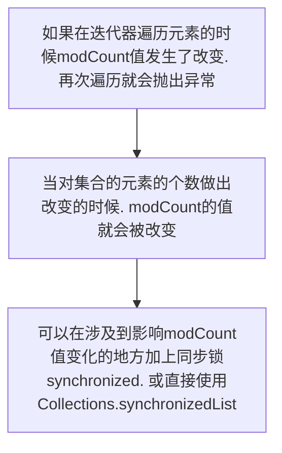

[TOC]

# 基础

## 基础数据类型

|类型|数据大小(位)|数据范围|
|:---:|:---:|:---:|
|int|32|-2^31 - 2^31-1|
|long|64|-2^63 - 2^63-1|
|float|32|^|
|double|64||
|boolean|||
|short|16|-2^15 - 2^15-1|
|byte|8|-128 - 127|
|char|16|存储unicode码|

## 内部类

+ 成员内部类
	+ 定义在一个类的内部，可以认为是外部类的一个成员变量，它可以`无条件访问成员内部类的所有成员属性和方法(包括私有和静态)`
	+ HashMap的EntrySet, KeySet等
	+ 需要注意的是，当成员内部类拥有和外部类同名的成员变量或者方法时，会发生隐藏现象。即默认情况下，访问的是成员内部类的成员。

+ 静态内部类
	+ HashMap的Node类

+ 局部内部类
	+ 

+ 匿名内部类
	+ 使用匿名内部类实现的多线程实例
```java
public class ThreadTest extends Thread {
	
	public static void main(String[] args) {
		new ThreadTest() {
			@Override
			public void run() {
				// ...
			}
		}.start();
	}
}
```

## Java IO

### IO多路复用

目前流行的多路复用IO实现主要包括四种：**select**, **poll**, **epoll**, **kqueue**

| IO模型 | 相对性能 | 关键思路         | 操作系统      | JAVA支持情况                                                 |
| ------ | -------- | ---------------- | ------------- | ------------------------------------------------------------ |
| select | 较高     | Reactor          | windows/Linux | 支持,Reactor模式(反应器设计模式)。Linux操作系统的 kernels 2.4内核版本之前，默认使用select；而目前windows下对同步IO的支持，都是select模型 |
| poll   | 较高     | Reactor          | Linux         | Linux下的JAVA NIO框架，Linux kernels 2.6内核版本之前使用poll进行支持。也是使用的Reactor模式 |
| epoll  | 高       | Reactor/Proactor | Linux         | Linux kernels 2.6内核版本及以后使用epoll进行支持；Linux kernels 2.6内核版本之前使用poll进行支持；另外一定注意，由于Linux下没有Windows下的IOCP技术提供真正的 异步IO 支持，所以Linux下使用epoll模拟异步IO |
| kqueue | 高       | Proactor         | Linux         | 目前JAVA的版本不支持                                         |

#### 重要概念 Channel **通道**
被建立的一个应用程序和操作系统交互事件、传递内容的渠道 (`注意是连接到操作系统`)。一个通道会有一个专属的文件状态描述符。那么既然是和操作系统进行内容的传递，那么说明应用程序可以通过通道读取数据，也可以通过通道向操作系统写数据。

#### 重要概念 Buffer **数据缓存区**
为了保证每个通道的数据读写速度，Java NIO框架为每一种需要支持数据读写的通道集成了Buffer的支持

#### 重要概念 Selector **选择器**


## 关键字

### final

使用final修饰的方法无法被重写，类无法被继承。

## 元注解

+ *@Retention*：保留的范围
  + *SOURCE*：注解将被*编译器*丢弃（该类型的注解信息只会保留在*源码*里，源码经过编译后，注解信息会被丢弃，不会保留在编译好的class文件里），如*@Override*
  + *CLASS*：注解在*class文件*中可用，但会被*VM*丢弃（该类型的注解信息会保留在*源码*里和*class*文件里，在执行的时候，不会加载到虚拟机中），请注意，当注解未定义*Retention*值时，默认是*CLASS*
  + *RUNTIME*：注解信息将在运行期（JVM）也保留，因此可以通过*反射机制*读取注解的信息（源码、class文件和执行的时候都有注解的信息），如*@Deprecated*
+ *@Target*：可以用来修饰哪些程序元素，如**TYPE、METHOD、CONSTRUCTOR、FIELD、PARAMETER**等，未标注则表示可修饰所有
+ *@Inherited*：是否可以被继承，默认为false
+ *@Documented*：是否会保存到Javadoc文档中

## 常用接口

+ *Comparable*和*Comparator*接口
  + *Comparable*
    + 只包含一个**compareTo**方法，可以给两个对象排序。具体来说，它返回*负数、0、正数*来表示输入对象*对于、等于、大于*已经存在的对象
  + *Comparator*
    + 包含**equals、compare**两个方法。*compare*方法用来给两个输入参数排序，返回*负数、0、正数*表示第一个参数是*小于、等于、大于*第二个参数。*equals*方法需要一个对象作为参数，它用来决定输入参数是否和*comparator*相等。只有当输入参数也是一个*comparator*并且输入参数和当前*comparator*的排序结果是相同的时候，这个方法才返回true

## 异常处理

+ *Error*类对象由Java虚拟机生成并抛出，*不可捕捉*
+ 不管有没有异常，*finally*中的代码都会执行
+ 当*try、catch*中有*return*时，*finally*中的代码依然会继续执行

### Error

+ OutOfMemoryError
+ StackOverflowError
+ NoClassDeffoundError

### Exception

+ 非检查性异常
  + ArithmeticException
  + ArrayIndexOutOfBoundsException
  + ClassCastException
  + IllegalArgumentException
  + IndexOutOfBoundsException
  + NullPointerException
+ 检查性异常
  + IOException
  + CloneNotSupportedException
  + IllegalAccessException
  + NoSuchFieldException
  + NoSuchMethodException

## JVM与虚拟机

### JVM内存模型


#### 本地方法栈

#### 虚拟机栈 Stack

线程私有的`内存区域`，每个方法执行的同时都会创建一个`栈帧 (Stack Frame)`，用于储存`局部变量表` (`基本数据类型`、`对象引用`)、`操作数栈`、`动态链接`、`方法出口`等信息。

#### 堆 Heap

+ `线程共享`。储存几乎所有的`实例对象`，由`垃圾收集器`自动回收，堆区由`各子线程共享使用`
+ Java中的堆是用来*存储对象本身*的以及*数组*（当然，数组引用是存放在Java栈中的），*堆*是被*所有线程*共享的，在JVM中只有一个*堆*。所有对象实例以及数组都要在*堆*上分配内存。
  + 随着JIT发展，*栈上分配，标量替换优化技术*，在*堆*上分配变得不那么绝对，只能在*server*模式下才能启用*逃逸分析*
  + *栈上分配*
    + *逃逸分析*
      + 目的是判断对象的作用域是否有可能逃逸出*函数体*
    + *标量替换*
      + 允许将对象打散分配在栈上
        + 比如，若一个对象拥有两个字段，会将这两个字段视作局部变量进行分配

+ 新生代 
  + Eden `minorGC后，未被回收的，到from区，每一次到from，age+1`
  + FromSurvivor
  + ToSurvivor
+ 老年代 

#### 方法区 Method Area (`JDK8以后被元空间Metaspace替代`)

+ 被`所有线程`共享的内存区域，用来储存已被虚拟机加载的`类信息`、`常量`、`静态变量`、`JIT编译后的代码`。`运行时常量池`是方法区的一部分，用于存放`编译期间`生成的各种`字面常量`和`符号引用`
+ *运行时常量池*，是每一个*类*或*接口*的常量池的运行时表示形式，在*类*和*接口*被加载到JVM后，对应的*运行时常量池*就会被创建出来。当然并非*Class文件常量池*中的内容才能进入*运行时常量池*，在运行期间也可将新的常量放入*运行时常量池*，比如String的**intern**方法

#### 程序计数器
指向当前线程所执行的字节码指令的(地址)行号

#### TLAB（*Thread Local Allocation Buffer*）

+ *线程*专用的内存分配区域
+ 由于对象一般会分配在*堆*上，而*堆*是全局共享的。因此在同一时间，可能会有*多个*线程在*堆*上申请空间。因此，每次对象分配都必须要进行同步（虚拟机采用*CAS*配上*失败重试*的方式保证更新操作的原子性），而在竞争激烈的场合，分配的效率又会进一步下降。JVM使用**TLAM**来避免*多线程冲突*，在给对象分配内存时，每个线程使用自己的*TLAB*，这样可以*避免线程同步*，提高了对象分配的效率

#### 内存间操作

+ *lock*和*unlock*
  + 把一个变量标识为一条线程*独占*的状态
  + 把一个处于*锁定*状态的变量释放出来，释放之后的变量才能被其它线程锁定
+ *read*和*write*
  + 把一个变量值从*主内存*传输到线程的*工作内存*，以便*load*
  + 把*store*操作从*工作内存*得到的变量的值，放入*主内存*的变量中
+ *load*和*store*
  + 把*read*操作从*主内存*得到的变量值放入*工作内存*的变量副本中
  + 把*工作内存*的变量值传送到*主内存*，以便*write*
+ *use*和*assign*
  + 把*工作内存*变量值传递给执行引擎
  + 将执行引擎值传递给*工作内存*变量值
+ volatile的实现基于这8种内存间操作，保证了一个线程对某个volatile变量的修改，一定会被另一个线程看见，即保证了可见性


### JVM的GC

+ *分代垃圾回收算法*
  + 试想，在不进行*对象存活时间区分*的情况下，每次垃圾回收都是对*整个堆空间*进行回收，花费时间相对会长，同时，因为每次回收都需要遍历所有存活对象，但实际上，对于生命周期长的对象而言，这种遍历是没有效果的，因为可能进行了很多次遍历，但是它们依旧存在。因此，分代垃圾回收采用*分治*的思想，进行代的划分，把不同生命周期的对象放在不同代上，不同代上采用最适合它的垃圾回收方式进行回收
  + *年轻代*（Young Generation）
    + 所有*新生成*的对象首先都是放在年轻代的
    + 目标就是尽快收集*生命周期短*的对象
    + 分三个区
      + *Eden区*
        + 大部分对象在这里生成，当Eden区满时，还存活的对象将被*复制*到*Servivor*区，当这个*Survivor*区满时，此区的存活对象将被复制到另外一个*Survivor*区，当所有*Survivor*区都满时，从第一个*Survivor*区复制过来的，且此时还*存活*的对象，将被复制到*年老区（Tenured）*
        + 两个*Survivor区*是*对称*的，没先后关系
      + *FromSurvivor区*
      + *ToSurvivor区*
  + *年老代*（Old Generation）
    + 在*年轻代*中经历了*N次垃圾回收后*仍然*存活*的对象，就会被放到年老代中。因此，可以认为年老代中存放的都是一些生命周期较长的对象
  + *持久代*（Permanent Generation）
    + 主要存放*Java类的类信息、方法*，与垃圾收集要收集的Java对象关系不大
+ 新生代Eden内存快超出时，触发`minor gc`，对象内存从Eden到from，对象回收次数age+1

+ 老年代内存快超出时，触发`full gc`
+ *Minor GC*和*Major GC*
  + Java内存分配与回收策略
    + 对象优先在堆的*Eden*区分配
    + 大对象直接进入*老年代*
    + *长期存活*的对象将直接进入老年代
  + 当*Eden*区没有足够的空间进行分配时，虚拟机会执行一次*Minor GC*。*Minor GC*通常发生在*新生代*的*Eden*区，在这个区的对象生存期*短*，往往发生*GC*的频率较高，回收速度比较快。*Full GC*/*Major GC*发生在*老年代*，一般情况下，触发*老年代*GC的时候不会触发*Minor GC*，但是通过配置，可以在*Full GC*之前进行一次*Minor GC*这样加快*老年代*的回收速度
  + 垃圾回收不会发生在*永久代*，如果*永久代*满了或者是超过了*临界值*，会触发*完全垃圾回收*（Full GC）
    + *Java 8*已经移除了*永久代*，新加了一个叫*元数据区*的native内存区
  + 

+ `垃圾分析算法` 判断一个对象是否可被回收
  + `引用计数算法`
    为对象添加一个`引用计数器`，当对象`增加一个引用时`，`计数器加1`，引用`失效`时`计数器减1`。引用`计数为0的对象可被回收`。在两个对象出现`循环引用`的情况下，此时引用计数器永远不为0，导致无法对他们进行回收。正是因为循环引用的存在，因此Java虚拟机不再使用计数算法
  + `可达性算法` **主流**
    以GC Roots为起始点进行搜索，可达的对象都是存活的，不可达的对象可被回收。Java虚拟机使用该算法来判断对象是否可回收，GC Roots一般包含以下内容
    + 虚拟机*栈*中局部变量表中引用的对象
    + 本地方法*栈*中JNI引用的对象
    + 方法区中*类静态属性*引用的对象
    + 方法区中*常量*引用的对象
  + 虽然*可达性算法*可以判定一个对象是否能够被回收，但是当满足上述条件时，一个对象*不一定*会被回收。当一个对象*不可达GC Root*时，这个对象并不会马上被回收，而是处于一个死缓的阶段，若要被真正的回收，需要经历*两次标记*
    + 如果对象在*可达性分析*中没有与*GC Root*的引用链，那么此时就会被*第一次标记*并且进行一次筛选，筛选的条件是*是否有必要执行finalize()方法*。当对象没有覆盖*finalize()方法*或者已被虚拟机调用过，那么就认为是没必要的。如果对象有必要执行finalize()方法，那么这个对象将会放在一个称为*F-Queue*的队列中，虚拟机会触发一个*Finalize()*线程去执行，此线程是*低优先级*的，并且虚拟机不会承诺一直等待它运行完，这是因为如果finalize()执行缓慢或者发生了死锁，那么就会造成F-Queue队列一直等待，造成了内存回收系统的崩溃。GC对处于F-Queue中的对象进行*第二次标记*，这时，该对象将被移除*即将回收*集合，等待回收
+ `垃圾收集算法`
  + `标记-清除`算法：*标记哪些要被回收的对象，然后统一回收*
    + ***优点***：简单
    + ***缺点***：垃圾回收后，内存变得不连续，造成很大零散的内存区域
  + `复制`算法 （**大多数GC使用**）：*将可用内存按容量划分为相等的两部分，然后每次只使用其中的一块，当一块内存用完时，就将还存活的对象复制到第二块内存上，然后一次性清除完第一块内存，再将第二块上的对象复制到第一块*
    + 这种方式，内存的代价太高，每次都要浪费一半的内存。于是将算法进行了改进，内存区域不再是按照*1：1*去划分，而是将内存划分为*8：1：1*三部分，较大的那份内存交*Eden*区，其余是两块较小的内存叫*Survivor*区。每次都会优先使用*Eden*区，若*Eden*区满，就将对象复制到第二块内存区上，然后清除*Eden*区，如果此时存活的对象太多，以至于*Survivor*不够时，会将这些对象通过分配担保机制复制到老年代中
    + ***优点***：GC后的内存空间是连续的
    + ***缺点***：真正存放新对象的内存空间会变少
  + `标记-整理`算法：*为了解决**标记-清除**算法产生大量内存碎片的问题；当对象存活率较高时，也解决了复制算法的效率问题。它的不同之处就是在清除对象的时候先将可回收对象移动到一端，然后清除掉端边界以外的对象，这样就不会产生内存碎片*
    + **缺点**：效率低下
+ finalize()
  + 用于关闭外部资源，但是try-finally等方式可以做的更好，并且该方法运行代价很高，不确定性大，无法保证各个对象的调用顺序，因此最好不要使用
    + 如果*内存*总是充足的，那么垃圾回收可能永远不会进行，也就是说finalize()可能*永远不会*被执行
  + 有一种*JNI*（Java Native Interface ）调用*non-java*程序（C或C++），finalize()的工作就是回收这部分内存

> 当一个对象可被回收时，如果需要执行该对象的finalize方法，那么就有可能在该方法中让对象重新被引用，从而实现自救。自救只能进行一次，如果回收的对象之前调用了finalize方法自救，后面回收时不会再调用该方法。

### 类加载机制

+ 加载（*Loading*）

  + 通过类的*完全限定名称*获取定义该类的二进制字节流
  + 将该*字节流*表示的*静态存储结构*转换为方法区的*运行时储存结构*
  + 在内存中生成一个代表该类的Class对象，作为方法区中该类各种数据的访问入口

+ 连接（*Linking*）

  + 验证（*Verification*）

    + 确保Class文件的字节流中包含的信息符合当前虚拟机的要求，并且不会危害虚拟机自身的安全
    + 从整体上看，大致上会完成下面4个阶段的检验动作
      + *文件格式验证*：验证*字节流*是否符合Class文件的规范，如*主次版本号是否在当前虚拟机范围内*、*常量池中的常量是否有不被支持的类型*
      + *元数据验证*：对*字节码*描述的信息进行语义分析，如*这个类是否有父类*、*是否集成了不被继承的类*等
      + *字节码验证*：是整个验证过程中最复杂的一个阶段，通过验证*数据流*和*控制流*的分析，确定程序语义是否正确，主要针对方法体的验证。如*方法中的类型转换是否正确*，*跳转指令是否正确*等
      + *符号引用验证*：这个动作在后面的解析过程中发生，主要是为了确保解析动作能正确执行

  + 准备（*Preparation*）

    + 类变量是被static修饰的变量，准备阶段为类变量分配内存并设置初始值，使用的是方法区的内存
    + 实例变量不会在这阶段分配内存
    > 实例化不是类加载的一个过程，类加载发生在所有实例化操作之前，并且类加载只进行一次，实例化可以进行多次
  + 解析（*Resolution*）

    + 将常量池的符号引用替换为直接引用的过程
    > 解析过程在某些情况下可以在初始化阶段之后再开始，这是为了支持Java的动态绑定

+ 初始化（*Initialization*）

  + 初始化阶段才真正开始执行类中定义的Java程序代码
  + 虚拟机规范严格规定了*有且只有*5种情况必须立即对类进行*初始化*（而*加载、验证、准备*自然需要在此之前开始）
    1. 遇到*new、getstatic、putstatic、invokestatic*这4条字节码指令时，如果类没有进行过初始化，则需要先触发其*初始化*。生成这4条指令的最常见的Java代码场景是：*使用new关键字实例化对象的时候、读取或设置一个类的静态字段（被final修饰、已在编译器把结果放入常量池的静态字段除外）的时候，以及调用一个类的静态方法的时候*
    2. 使用*java.lang.reflect*包的方法对类进行反射调用的时候，如果类没有进行过初始化，则需要先触发其初始化
    3. 当初始化一个类的时候，如果发现其*父类*还没有进行过初始化，则需要先触发其父类的初始化
    4. 当虚拟机*启动*时，用户需要指定一个要执行的主类（包含*main*方法的那个类），虚拟机会先初始化这个*主类*
    5. 当使用*JDK1.7*的动态语言支持时，如果一个*java.lang.invoke.MethodHandle*实例最后的解析结果*REF_getStatic、REF_putStatic、REF_invokeStatic*的方法句柄，并且这个方法句柄所对应的类没有进行过初始化，则需要先触发其初始化
  + 对于*静态字段*，只有直接定义这个字段的类才会被*初始化*，因此通过其子类来引用父类中定义的静态字段，只会触发*父类*的初始化而不会触发*子类*的初始化

+ 使用（*Using*）

+ 卸载（*Unloading*）

#### 类加载器

+ *启动类加载器*（Bootstrap ClassLoader）
  + 加载Java*核心类库*，无法被Java程序直接引用
+ *扩展类加载器*（Extensions ClassLoader）
  + 加载Java的*扩展库*。Java虚拟机的实现会提供一个*扩展库*目录。该类加载器在此目录里面查找并加载*Java类*
+ *系统类加载器*（System ClassLoader）
  + 根据Java应用的*类路径*（CLASSPATH）来加载Java类。一般来说，Java应用的类都是由它来完成加载的。可以通过*ClassLoader.getSystemClassLoader()*来获取它
+ *用户自定义类加载器*
  + 通过继承*java.lang.ClassLoader*类的方式实现

#### 引用类型

+ *强引用*
  + 被强引用关联的对象不会被回收。使用new一个新对象的方式来创建强引用
    + *非静态内部类*会在其整个生命周期中持有对它*外部类*的强引用


+ *软引用*
  + 被*软引用*关联的对象只有在*内存不够*的情况下才会被回收。使用SoftReference类来创建软引用。


```java
Object obj = new Object();
SoftReference<Object> sf = new SoftReference<Object>(obj);
obj = null;  // 使对象只被软引用关联
```

+ *弱引用*
  + 被*弱引用*关联的对象一定会被回收，也就是说它只能存活到下一次垃圾回收发生之前。使用WeakReference类来创建弱引用。
  

```java
Object obj = new Object();
WeakReference<Object> wf = new WeakReference<Object>(obj);
obj = null;
```

+ *虚引用*
  + 一个对象是否有虚引用的存在，不会对其生存时间造成影响，也无法通过虚引用得到一个对象。为一个对象设置虚引用的唯一目的是能在这个对象被回收时收到系统的一个通知。使用PhantomReference来创建虚引用
  + 只能通过是否*被加入到ReferenceQueue*来判断是否被GC，这也是唯一判断对象是否被GC的途径


```java
Object obj = new Object();
PhantomReference pf = new PhantomReference<Object>(obj, null);
obj = null;
```

### Java类加载器

+ 对于任意一个类，都需要由加载它的*类加载器*和这个类本身一同确立其在Java虚拟机中的唯一性，每一个类加载器，都拥有一个独立的类名称空间
  + 比较两个类是否*相等*，只有在这两个类是由*同一个类加载器*加载的前提下才有意义，否则，即使这两个类来源于同一个*Class文件*，被同一个虚拟机加载，只要加载它们的类加载器不同，那这两个类就必定不相等
    + 这里的*相等*，包括代表类的Class对象的*equals、isAssignableFrom、isInstance*方法返回的结果，也包括使用*instanceof*关键字做对象所属关系判定等情况
  + 在自定义*ClassLoader*的子类的时候，我们常见的会有两种做法，一种是重写*loadClass*方法，另一种是重写*findClass*。其实这两种方法本质上差不多，毕竟*loadClass*也会调用*findClass*，但是从逻辑上讲我们最好不要直接修改*loadClass*的内部逻辑，最好是只在*findClass*里重写自定义类的加载方法
    + *loadClass*这个方法是实现*双亲委托模型逻辑*的地方，擅自修改这个方法会导致模型被破坏，容易造成问题

> 双亲委派模型，该机制可以避免重复加载，当父亲已经加载了该类的时候，就没有必要子`ClassLoader`再加载一次。JVM根据`类名+包名+ClassLoader实例ID`来判定两个类是否相同，是否已经加载过。(可以通过创建不同的`ClassLoader`实例来实现类的热部署)

+ `BootStrapClassLoader`

最顶层的类加载器，由C++编写而成，已经内嵌到`JVM`中。在JVM启动时会初始化该`ClassLoader`，它主要用来读取`Java`的核心类库`JRE/lib/rt.jar`中所有的`class`文件，这个`jar`文件中包含了`java`规范定义的所有接口及实现。

+ `ExtensionClassLoader`

用来读取`Java`的一些扩展类库，如读取`JRE/lib/ext/*.jar`中的包

+ `AppClassLoader`

用来读取`classpath`下指定的所有`jar`包或目录的类文件，一般情况下，这个就是程序默认的类加载器

+ `CustomClassLoader`

用户自定义编写的，用来读取指定类文件。基于自定义的`ClassLoader`可用于加载非`classpath`中（如从网络上下载的`jar`或二进制）的`jar`及目录、还可以在加载前对`class`文件优化一些动作，如解密、编码等

> `ExtensionClassLoader`的父类加载器是`BootStrapClassLoader`，其实这里省掉了一句话，容易造成很多新手的迷惑。严格说，`ExtClassLoader`的父类加载器是`null`，只不过是在默认的`ClassLoader
> `的`loadClass`方法中，当`parent`为`null`时，是交给`BootStrapClassLoader`来处理的，而且`ExtClassLoader`没有重写默认的`loadClass`方法，所有，`ExtClassLoader`也会调用`BootStrapClassLoader`类加载器来加载。

### Tomcat类加载器

+ *Common ClassLoader*作为*Catalina ClassLoader*和*Shared ClassLoader*的*parent*，而*Shared ClassLoader*又可能存在多个*children*类加载器*WebApp ClassLoader*，一个*WebApp ClassLoader*实际上就对应一个Web应用，那Web应用可能存在*Jsp页面*，最终会转成*class类*被加载，因此也需要一个*Jsp*的类加载器
+ 在代码层面，*Catalina ClassLoader、Shared ClassLoader、Common ClassLoader*对应的实体类实际上都是*URLClassLoader*或者*SecureClassLoader*，一般我们只是根据加载内容的不同和加载父子顺序的关系，在逻辑上划分为这三个类加载器
+ 当*tomcat*启动时，会创建几种类加载器
  + *Bootstrap 引导类加载器*
    + 加载JVM启动所需的类，以及标准扩展类（位于 jre/lib/ext 下）
  + *System 系统类加载器*
    + 加载tocmat启动的类，比如bootstrap.jar，通常在 Catalina.bat 中指定。位于 CATALINA_HOME/bin 下
  + *Common 通用类加载器*
    + 加载tomcat使用以及应用通用的一些类，位于 CATALINA_HOME/lib 下，比如 servlet-api.jar
  + *webapp 应用类加载器*
    + 每个应用在部署后，都会创建唯一的类加载器。该类加载器会加载位于 WEB-INF/lib 下的jar文件中的class和 WEB-INF/classes 下的class文件

### FAQ

+ Java中的*内存泄漏*情况
  + *长*生命周期的对象持有*短*生命周期对象的引用就很可能发生内存泄漏，尽管*短*生命周期对象已经不再需要，但因为*长*生命周期*持有*它的引用而导致不能被回收
    + 如果一个*外部类*的实例对象的方法返回了一个*内部类*的实例对象，这个*内部类*

+ 虚拟机栈和本地方法栈区别？
  + 虚拟机栈为`虚拟机执行Java方法`服务
  + 本地方法栈为`虚拟机使用到的Native方法服务`服务
+ JVM内存区域哪些会发生OOM
  + 堆
    + 抛出`OutOfMemoryError: Java heap space`
    + 通过控制`-Xmx`和`-Xms`解决
  + `Java虚拟机栈`和`本地方法栈`
    + 如果线程请求的栈大于所分配的栈大小，则抛出`StackOverFlowError`错误，比如不会停止的递归调用
    + 如果虚拟机栈是可以动态拓展的，拓展时无法申请到足够的内存，则抛出`OutOfMemoryError`错误
  + 方法区
    + 抛出`OutOfMemoryError: Metaspace`
  + 永久代
    + 旧版本的JDK，因JVM对永久代的垃圾回收并不积极。抛出`OutOfMemoryError: PermGen space`

| 内存区域     | 是否线程私有 | 是否会发生OOM |
| ------------ | ------------ | ------------- |
| `程序计数器` | `是`         | `否`          |
| 虚拟机栈     | 是           | 是            |
| 本地方法栈   | 是           | 是            |
| 方法区       | 否           | 是            |
| 直接内存     | 否           | 是            |
| 堆           | 否           | 是            |

+ *System.gc()*会做什么事情
  + *提示*JVM要进行垃圾回收，但实际是否进行回收取决于JVM

+ 如果对象的引用被置为null，垃圾收集器是否会立即释放对象占用的内存
  + 不会，在*下一个*垃圾回收周期中，这个对象将是可被回收的

+ GC为什么要分代？
  + 减少stw次数，即减少`full gc`次数

+ 新生代为什么要替换to和from区？

+ 重载和重写的区别？
  + 重载，发生在同一个类中，方法名必须相同，返回值和访问修饰符可以不同，参数类型和个数，顺序不同
  + 重写**@Override**，发生在父子类中，方法名、参数列表必须相同，返回值范围小于等于父类，抛出的异常范围小于等于父类，访问修饰符范围大于等于父类；`如果父类方法访问修饰符为private，则子类不能重写`

+ Java面向对象编程三大特性：封装、继承、多态
  + 封装
  	把一个对象的属性私有化，同时提供一些可以被外界访问的属性的方法
  + 继承
  	使用已存在的类的定义作为基础简历新类
  + 多态
  	变量指向的具体类型和该变量发出的方法调用在编程时并不确定，而是在程序运行期间才确定。
  	Java中，通过两种形式实现多态

  	+ 继承 **多个子类对同一方法的重写**
  	+ 接口 **实现接口并覆盖接口中同一方法**


# 集合

包含`Map接口`和`Collection接口`及其所有实现类

+ Collection接口	
  + Set接口
    + HashSet类
    + TreeSet类
    + LinkedHashSet类
  + List接口
    + ArrayList类
    + LinkedList类
    + Stack类
    + Vector类
+ Map接口
  + HashMap类
  + TreeMap类
  + Hashtable类
  + ConcurrentHashMap类
  + Properties类

## Collections

### （快速失败）fail-fast VS （安全失败）fail-safe

+ *Iterator*的安全失败是基于对*底层集合*做拷贝，因此，它不受*源集合*上修改的影响。*java.util*包下面的所有的集合类都是*快速失败*的，而*java.util.concurrent*包下面的所有的类都是*安全失败*的。*快速失败*的迭代器会抛出*ConcurrentModificationException*异常，而*安全失败*的迭代器永远不会抛出这样的异常。

**fail-fast**: Java集合中的一种错误机制，在用迭代器`遍历`一个集合对象时，如果遍历过程中对集合对象的结构进行了修改(`增加`，`删除`)，则会抛出`ConcurrentModificationException 并发修改异常`，防止继续遍历，这就是快速失败机制。

> JDK官方注释：当Iterator这个迭代器被创建后，除了迭代器本身的方法(remove)可以改变集合的结构外，其它因素如若`改变了集合的结构`，都被抛出`ConcurrentModificationException`异常

> JDK官方注释：迭代器的快速失败行为是不一定能够得到保证的，一般来说，存在非同步的并发修改时，不可能做出任何坚决的保证的。但是快速失败迭代器会做出最大的努力来抛出`ConcurrentModificationException`。因此，编写依赖于此异常的程序的做法是不正确的。正确的做法应该是：`迭代器的快速失败行为应该仅用于检测程序中的bug`。

**fail-safe**: 
不会抛出异常

+ 复制时需要额外的空间和时间上的开销
+ 不能保证遍历的是最新内容

#### FAQ

+ 如何避免fail-fast抛异常？
  + 在遍历时修改集合，使用迭代器的remove等方法，不用集合的remove等方法  
  + 并发的环境，需要对`Iterator对象加锁`；也可以直接使用Collections.synchronizedList
  + 使用`CopyOnWriteArrayList` (`采用fail-safe`)



### HashSet

+ HashSet如何保证数据不可重复？

  底层是`HashMap`，**HashSet是实现了Set接口，并且把数据作为K值，而V值一直使用一个相同的虚值来保存**

```java
private static final Object PERSENT = new Object();

public boolean add(E e) {
  return map.put(e, PERSENT) == null;
}
```

### Enumeration VS Iterator

+ 两者都是`接口`
  + Iterator
    + boolean hasNext()
    + E next()
    + default void remove()
    + default void forEachRemaining(Consumer<? super E> action)
  + Enumeration
    + boolean hasMoreElements()
    + E nextElement()
+ Iterator支持`fail-fast机制`, Enumeration不支持
+ Enumeration遍历效率较高

### CopyOnWriteArrayList

写时复制，往一个容器添加元素的时候，先将当前容器复制出一个新的容器，然后新的容器里添加元素，添加完元素之后，再将原容器的引用指向新的容器。这样做的好处是，可以对CopyOnWriteArrayList进行并发的读，而无需加锁。所以CopyOnWriteArrayList也是一种读写分离的思想，读和写不同的容器。

+ 添加元素的时候需要加锁，否则多线程会复制N个副本
+ 多个线程在添加数据时，读到的是旧数据。因为写的时候，不会锁住旧的ArrayList

> 应用场景: 用于读多写少的并发场景。比如白名单、黑名单、商品类目的访问和更新场景

### ArrayList

+ 第一次添加元素时，数组大小将变化为*DEFAULT_CAPACITY*（10），不断添加元素后，会进行扩容。删除元素时，会按照位置关系把数组元素整体*复制移动*一遍

#### ArrayList VS Vector 区别

+ Vector线程安全，ArrayList线程不安全
+ 数据增长。Vector在数据满时(`加载因子为1`)，增长为原来的`两倍`。ArrayList在数据量达到容量的一半时(`加载因子为0.5`)，增长为原容量的`0.5倍 + 1`个空间。

#### ArrayList VS Array*(即数组，非类)* 区别

+ 数据可以包含`基本类型`和`对象类型`，ArrayList只能包含`对象类型`
+ 数据`大小固定`，ArrayList的大小不固定
+ ArrayList提供更多方法

## Map

+ 永远不要将可变对象类型用作HashMap中的键，因为hashCode()可能会随着变动，导致get出来为null

### Hashtable

##### Hashtable VS HashMap 区别

+ HashMap没有考虑同步，`线程不安全`；Hashtable使用了synchronized关键字(`直接锁方法`)，`线程安全`
+ HashMap允许`K/V都为null`；后者`K/V都不允许为null` (`HashMap存null时，hash值为0`)
+ HashMap继承自`AbstractMap`类；而Hashtable继承自`Dictionary`类
+ HashMap的迭代器(`Iterator`)是快速失败的迭代器，Hashtable的迭代器(`Enumeration`)不是。如果有其它线程对HashMap进行增删操作，将会抛出`ConcurrentModificationException`，但迭代器本身的`remove`方法移除元素不会抛出异常。这也是`Enumeration`和`Iterator`的区别。

#### Hashtable VS ConcurrentHashMap 区别

+ 都是线程安全
+ Hashtable锁住整个方法，ConcurrentHashMap锁级别更细粒度

### ConcurrentMap

#### JDK 7

当一个Map被多个线程访问时，通常使用`containsKey()`或者`get()`来查看给定键是否在存储键值对之前出现。但是即使有一个同步的Map，线程还是可以在这个过程中潜入，然后夺取对Map的控制权。问题是，在对put()的调用中，锁在get()开始时获取，然后在可以再次获取锁之前释放。它的结果是个竞争条件：`这是两个线程之间的竞争，结果也会因谁先运行而不同`


+ *ConcurrentHashMap* 最外层不是一个大的数组，而是一个*Segment*的数组。每个*Segment*包含一个与*HashMap*数据结构差不多的*链表数组*

+ 在*读写*某个key时，先取该key的*哈希值*，并将*哈希值*的*高N位*对*Segment个数*取模从而得到该key应该属于哪个Segment，接着如同操作HashMap一样操作这个Segment。Segment继承自*ReentrantLock*，可以很方便的对每一个Segment上锁

  + **读操作**

    + 获取key所在的Segment时，需要保证*可见性*。具体实现上，可以使用*volatile*关键字，也可使用*锁*。但使用*锁*开销太大，而使用*volatile*时每次*写*操作都会让所有CPU内*缓存无效*，也有一定开销

    + ConcurrentHashMap使用如下方法保证*可见性*，取得最新的Segment

      ```java
      Segment<K,V> s = (Segment<K,V>) UNSAFE.getObjectVolatile(segments, u)
      ```

      获取Segment中的*HashEntry*时也使用了类似方法

      ```java
      HashEntry<K,V> e = (HashEntry<K,V>) UNSAFE.getObjectVolatile(tab, ((long)(((tab.length - 1) & h)) << TSHIFT) + TBASE)
      ```

  + **写操作**

    + 不要求*同时*获取*所有*Segment的锁，因为那样相当于锁住了整个Map。它会先获取该*Key-Value对*所在的*Segment*的锁，获取成功后就可以像操作一个普通的HashMap一样操作该Segment，并保证该Segment的*安全性*，同时由于其它Segment的锁并未被获取，因此理论上可支持concurrencyLevel（等于*Segment的个数*）个线程安全的并发读写
    + *获取锁*时，并不直接使用*lock*来获取，因为该方法获取锁在*失败*时会挂起。事实上，它使用了*自旋锁*，如果tryLock获取锁失败，说明锁被其它线程占用，此时通过*循环*再次以tryLock的方式申请锁。如果在循环过程中，该Key所对应的链表头被修改，则重置retry次数。如果retry次数超过一定值，则使用lock方法申请锁
      + 这里使用*自旋锁*是因为自旋锁的效率比较高，但是它消耗CPU资源比较多，因此在自旋次数超过阈值时切换为*互斥锁*

#### JDK 8

+ JDK 7已经解决了*并发*问题，并且能支持N个Segment这么多次的并发，但依然存在HashMap在JDK 7中的问题：*查询遍历链表效率太低*，因此JDK 8做了一些数据结构上的调整
+ 
+ 抛弃了原有的*Segment分段锁*，采用了*CAS + synchronized*来保证并发安全性

### HashMap工作原理


#### 重要参数

+ loadFactor
  负载因子，会影响到HashMap的扩容
    + 负载因子越大，HashMap的碰撞越剧烈，但是resize越少
    + 负载因子越少，HashMap碰撞概率越小，但是resize越多。

+ threshold
  要扩容的阈值。当容量大小等于这个阈值的时候，HashMap就会扩容 

#### 重要方法

+ `put`
  + 取Key的hash值
  + 判断HashMap里面的槽是不是空的，如果是空的就需要初始化HashMap里面槽的数量
  + 判断这个Kay所对应的槽是否被占用，如果没有被占用，就将Key-Value生成一个新的节点，放到对应的槽中
  + 如果这个槽被占用了(`调用hash方法返回值一致，hash方法里面会调用hashCode方法`)，分成三步判断：
    + 判断Key是否相同(`调用equals方法返回一致`)，如果相同则返回原有的Node，如果不相同则进行下面的判断
    + 判断节点是否属于树节点（TreeNode），如果属于，则添加到红黑树中
    + 如果不是树节点，则一定是链表的Node，遍历链表，如果链表长度大于等于8了，则将链表转换成为红黑树 (`转红黑树条件有二`)，否则添加到链表中
      + 链表长度达到8
      + 数组长度大于等于64
  + 最后判断HashMap的大小是否大于阈值，如果大于，则进行扩容


+ `resize`
  + 判断当前的table里面的size是否大于0，如果大于0的话，就会判断当前的table里面的size是否超过了最大值，如果超过最大值，就不会再扩容，如果没有超过的话，就会将原有的size扩大到原来的两倍，并且判断扩容之后的size是否大于最大值，如果超过最大值就按照最大值来扩容。
  + 如果当前table里面的size等于0的话，并且当前table里面的阈值大于0的时候，就会将原有的阈值设置为新的table的size大小
  + 如果两个条件都不满足的话，则会对新的table设置默认的size(16)，和默认的阈值(16 * 0.75)
  + 如果这个时候新的table的阈值为空，则会重新计算新的阈值

> HashMap的容量始终为2的幂次。在扩容的时候，元素的位置要么是在原位置，要么是否原位置再移动2次幂的位置

+ `get`
  + 判断现在HashMap里面的`table`是否为空，以及要获取的key对应的槽是否为空，如果为空，就直接返回null
  + 如果都不为空，就判断槽里面的第一个node是不是想要找的key，如果是直接返回
  + 如果第一个不是，就判断node节点是不是树节点，如果是，就直接去红黑树里面查找
  + 如果也不是树节点，那就在链表里面循环查找

#### 与JDK7对比

+ 插入链表的时候，在JDK7的时候，HashMap插入链表是采用头插法，而在JDK8使用的是尾插法，之所以这么改变的原因是因为，头插法的链表在HashMap的resize()过程中可能因为多线程导致的逆序，让链表形成死循环。
+ 在JDK7的HashMap中，HashMap的数据结构是`数组+单向链表`，在JDK8的HashMap中，采用的是`数组+单链表+红黑树`的数据结构。JDK7中可能存在链表过长，时间复杂度为`O(n)`，导致查询时间变长的情况。
+ 在resiez过程中，JDK7和JDK8的差别主要是在迁移时计算新的索引的位置。JDK7是重新计算Key的hash值，然后用（size-1） & hash得到新的索引位置，而JDK8时，是采用判断高一个bit位的位值，如果高一位的位值是0，那么索引位置就不变，如果是1那么就用原来的HashMap的size大小加上原有的索引位置（原索引+oldCap），这么改变是为了降低rehash带来的开销

#### 细节总结

+ 为什么JDK8的阈值要选择8？
  链表特点是`插入快，查询慢`。红黑树是`插入慢，查询快`。理想情况下，使用随机的哈希码导致冲突的概率符合泊松分布，按照泊松分布的计算公式计算出了桶中元素个数和hash冲突概率的对照表，可以看到链表中元素个数为8时，概率已经非常小，再多的就更少了。红黑树本身就有维护成本，避免频繁维护红黑树，`红黑树变为链表`。

+ 红黑树的根节点不一定是`索引位置的头节点`
  HashMap通过`moveRootToFront`方法来维持红黑树的根结点就是索引位置的头结点，但是在`removeTreeNode`方法中，当`movable`为false时，不会调用`moveRootToFront`方法，此时红黑树的根节点不一定是索引位置的头节点，该场景发生在`HashIterator`的`remove`方法中。

+ 转为红黑树节点后，链表的结构还存在，通过next属性维持，红黑树节点在进行操作时都会维护链表的结构

+ 为链表结构时，是单向链表。为红黑树结构时，成为双向链表。双向链表主要是为了红黑树相关链表操作方便

+ 在HashMap中链表什么时候会转换成红黑树？
  + 链表在大于等于8个的时候 (`源码验证`)
  + 数组长度大于等于64

```java
// 链表长度大于等于8
static final int TREEIFY_THREESHOLD = 8;
if (binCount >= TREEIFY_THRESHOLD - 1) {
  treeifyBin(tab, hash)
}

// 数组长度大于等于64
if (tab == null || (n = tab.length) < MIN_TREEIFY_CAPACITY)
  resize();
else if ((e = tab[index = (n - 1) & hash]) != null) {
  ...
}
```

+ HashMap什么时候扩容？
  + 当前容量大于等于阈值
  + 在树化之前，当前数组的长度小于64，链表长度大于等于8
  + 每次扩容，阈值=旧阈值<<1，容量=旧容量<<1

+ HashMap为什么选择红黑树？
  + AVL(自平衡二叉搜索树)，插入节点/删除节点，整体性能不如红黑树。AVL每个左右节点的高度差不能大于1，维持这种结构比较消耗性能。红黑树好在改变节点颜色即可
  + 二分查找树，左右节点不平衡，一开始就固定root，极端情况下会成为链表结构

+ 怎么解决哈希冲突？

  + 链地址法，链接拥有相同hash值的数据
  + 使用2次扰动函数(hash函数)，降低哈希冲突概率，使数据分布更平均
  + 引入红黑树，降低遍历的时间复杂度

+ HashMap为什么不直接使用hashCode方法值用作table的下标？
  hashCode返回值是`int`数据类型，范围是`-(2^31) ~ 2^31 - 1`，而HashMap的容量范围是`16 ~ 2^30`，导致通过`hashCode`计算出的哈希值可能不在数组大小范围内，进而无法匹配存储位置。

+ HashMap中怎么计算key的hash值？

```java
static final int(Object key) {
  int h;
  return (key == null) ? 0 : (h == key.hashCode()) ^ (h >>> 16);
}
```

+ 为什么数组长度要保证为2的幂次方？
  只有当数组长度为2的幂次方时，`h & (length-1)`才等价`h % length`。

+ 为什么String、Integer这样的类适合作为K？
  + 这些类能够保证Hash值的不可更改性和计算准确性
  + 都是final类型，即不可变性，保证key的不可更改性，不会存在获取hash值不同的情况
  + 内部已重写`equals`、`hashCode`等方法 (**想让自己的类作为Key，同理要重写这两个方法**)

#### 结构体系

+ JDK8以后，HashMap结构实际上是由`数组`+`链表`+`红黑树`组成

# 序列化

java对象序列化是JDK1.1中引入的一组开创性特性之一，用于作为一种将Java对象的状态转换为字节数组，以便存储或传输的机制，以后，仍可以将字节数组转换回Java对象原有的状态。

### 序列化允许重构

序列化允许一定数量的变种泪，甚至重构之后也是如此，（新旧类保持同一个`序列化版本hash`，即`private static final serialVersionUID`字段）。`ObjectInputStream`仍可以很好的将其读出来。Java Object Serialization规范可以自动管理的关键任务是

+ 将`新字段`添加到类
+ 将字段从`static`改为`非static`
+ 将字段从`transient`改为`非transient`

### 序列化并不安全

序列化二进制格式完全编写在文档中，并且完全可逆。实际上，只需将二进制序列化流的内容转储到控制台，就足以看清类是什么样子。好在序列化允许`hook`序列化过程。可以通过在`Serializable对象`上提供一个`writeObject`方法来做到这一点。

```java
public class Person implements java.io.Serializable {
  private int age;
  // 这两个方法不是override，要求方法和参数与下面要求一致
  private void writeObject(java.io.ObjectOutputStream stream) throws java.io.IOException {
    age = age << 2;
    stream.defaultWriteObject();
  }
  
  private void readObject(java.io.ObjectInputStream stream) throws java.io.IOException, ClassNotFoundException {
    stream.defaultReadObject();
    age = age << 2;
  }
}
```

### 序列化的数据可以被签名和密封

可以通过`writeObject`和`readObject`实现密码加密和签名管理，但其实还有更好的方式。如果需要对整个对象进行加密和签名，最简单的是将它放在一个`javax.crypto.SealedObject`和`java.security.SignedObject`包装器中。两者都是可序列化的，所以将对象包装在`SealedObject`中可以围绕原对象创建一种“包装盒”。必须有对称密钥才能解密，而且密钥必须单独管理。同样，也可以将`SignedObject`用于数据验证，并且对称密钥也必须单独管理。

### 序列化允许将代理放在流中

很多情况下，类中包含一个核心数据元素，通过它可以派生或找到类中的其他字段。在此情况下，没有必要序列化整个对象。可以将字段标记为transient，但是每当有方法访问一个字段时，类仍然必须显式地产生代码来检查它是否被初始化。


如果首要问题是序列化，那么最好指定一个flyweight或代理放在流中。为原始person提供一个writeReplace方法，可以序列化不同类型的对象来代替它。类似地，如果反序列化期间发现一个readResolve方法，那么将调用方法，将替代对象提供给调用者。


```java
class PersonProxy implements java.io.Serializable {
  public String data;
  
  private Object readResolve() throws java.io.ObjectStreamException {
    String[] pieces = data.split(",");
    Person result = new Person(...);
    // do something
    return result;
  }
}

public class Person implements java.io.Serializable {
  // 
}
```


**注意，PersonProxy必须跟踪Person的所有数据。这通常意味着代理需要是Person的一个内部类，以便能访问private字段。有时候，代理还需要追踪其他对象引用并手动序列化他们。**


> 这种技巧是少数几种不需要读/写平衡的技巧之一。例如，一个类被重构成另一种类型后的版本可以提供一个readResolve方法，以便静默地将序列化的对象转换成新类型。类似地，它可以采用writeReplace方法将旧类序列化成新版本。


### 信任，但要验证

对于序列化的对象，这意味着验证字段，以确保在反序列化之后，它们仍具有正确的值。为此，可以实现`ObjectInputValidation`接口，并覆盖`validateObject`()方法，如果调用该方法时发现某处有错误，则抛出一个`InvalidObjectException`。


### 参考链接

[Java 对象序列化](https://developer.ibm.com/zh/articles/j-5things1/)


# Java特性列表

## Java5

+ 自动装箱拆箱
+ 泛型
+ 枚举
+ 变长参数
+ 注解
+ foreach循环
+ 静态导入
+ 新的线程模型和并发库 `java.util.concurrent`

## Java6

+ 脚本引擎
+ Java Compiler API
+ JDBC 4.0规范

## Java7

+ 字面常量数字的下划线
+ switch支持String
+ 泛型实例化类型自动推断

```java
// java7之前
Map<String,List<String>> map = new HashMap<String,List<String>>();
// java7之后
Map<String,List<String>> map = new HashMap<>();
```

+ `try-with-resources` 
+ 单个catch中捕获多个异常类型
+ NIO 2.0 (`AIO`)

```java
ByteBuffer buffer = ByteBuffer.allocate(32);
buffer.put(new byte[16]);
buffer.position();
```


## `Java8 (LTS)`

+ `Lambda`表达式
+ 新`Date Time API`
+ 接口的`默认方法`和`静态方法`

```java
public interface Test {
  default String defaultFunction() {
    return "default";
  }
  
  static String staticFunction() {
    return "static";
  }
}
```

+ 方法引用
+ 集合的`stream`操作
+ `Optional`处理空指针异常

## Java9

+ REPL工具 `jShell`
+ 模块系统
+ 增强Stream

## Java10

+ 局部变量类型推断

```java
var url = new URL("http://www.oracle.com/")
```

+ Optional新增`orElseThrow`方法

## `Java11 (LTS)`

+ 字符串、集合、Stream、Optional、InputStream增强
+ java直接编译运行

```shell
# before
javac Javastack.java; java Javastack

# after
java Javastack.java
```

## Java12

+ switch增强

```java
// 之前
switch (day) {
  case MONDAY:
    // XXX
}

// 之后
switch (day) {
    case MONDAY -> "monday";
}
```

+ 其他增强

## Java13

## Java14

+ 增强instanceof

```java
// 无需自己进行类型转换
public boolean isBadRequestError(Exception ex) {
  return (ex instanceof HttpClientErrorException rce) && HttpStatus.BAD_REQUEST == rce.getStatusCode();
}
```

+ JDK12引入的switch在JDK14变为正式版本。增强switch，提供`yield`在块中返回值，但不同于`return`

```java
String quantityString = switch (n) {
  case 1 : yield "one";
  case 2 -> "two";
}
```

+ 长文本字符串

```java
String name = """
  what's your name
  """;
```

##Java15

+ 关键字`sealed`、`permits`、`non-sealed`限定实现类，限定父类的使用。

## Java16

##`Java17 (LTS)`
