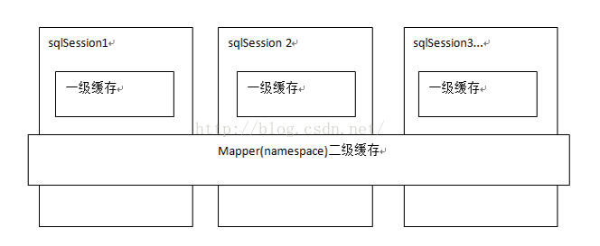
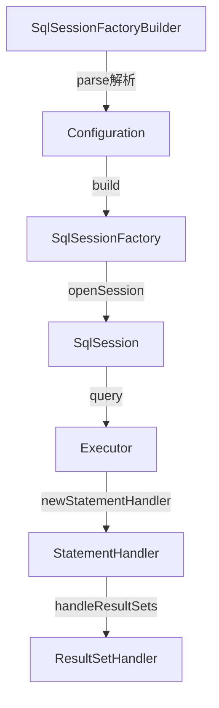

[TOC]

## 介绍

ORM框架：用于实现面向对象编程语言里，不同类型系统的数据之间的转换

+ columnName
+ jdbcType
+ className

## 原理

+ Mybatics框架的原理
  + 初始化
    + 解析配置文件，初始化Configuration对象
    + 创建SqlSessionFactory建造者对象，用来创建SqlSessionFactory
    + 解析mapper文件，结果存入configuration对象
    + 根据configuration对象，创建SqlSession
  + SQL查询流程
    + sqlSession调用执行器进行查询 (`优先使用缓存`)
  + MyBatis缓存
    + 一级缓存，sqlSession缓存，每个sqlSession都有一个`哈希表`缓存数据，不同SqlSession对象之间缓存不共享。**默认开启**

```java
protected boolean cacheEnabled = true;
```

+ MyBatis的一级、二级缓存
  + *一级缓存*
    + 基于PerpetualCache的*HashMap本地缓存*，其存储作用域为*Session*，当Session在*flush*或*close*之后，该Session中的所有Cache就将清空，默认*打开一级缓存*
  + *二级缓存*
    + 与*一级缓存*机制相同，默认也是采用PerpetualCache + HashMap 存储，不同在于其存储作用域为*Mapper（Namespace）*，并且可自定义存储源，如Ehcache。默认*不打开二级缓存*，要开启二级缓存，使用二级缓存属性类需要实现*Serializable*序列化接口（可用来保存对象的状态），可在它的映射文件中配置*\<cache/>*
    + mapper级别缓存，跨sqlSession，不同的SqlSession对象执行两次相同的SQL语句，第一次就将查询结果缓存，第二次返回缓存。**默认不开启**
  + 对于缓存数据*更新机制*，当某一个作用域（一级缓存 Session/ 二级缓存 Namespaces）进行了**C/U/D** 操作后，默认该作用域下所有*select*中的缓存将被*clear*



## FAQ

+ Mybatis如何获取数据源？
  + XMLConfigBuilder类读取Mybatis配置文件获取
  + SqlSessionFactoryBuilder.build
  + XMLConfigBuilder.parse
  + XMLConfigBuilder.parseConfiguration
  + XMLConfigBuilder.environmentsElement
  + XMLConfigBUilder.dataSourceElement
  + Configuration.setEnvironment

+ MyBatis加载资源文件的方式有几种？
  + <mapper resource="org/mybatis/builder/AuthorMapper.xml"/>
  + <mapper url="file:///var/mappers/AuthorMapper.xml"/>
  + <mapper class="org.mybatis.builder.AuthorMapper"/>
  + <package name="org.mybatis.builder"> **优先级最高**
    因为package有批量的获取配置文件的优点，所以默认

+ MyBatis有几种执行器？
  + SIMPLE
  + REUSE
  + BATCH

+ SqlSession线程安全吗？
  + 与Spring结合是线程安全，自己使用是线程不安全

+ MyBatis是如何操作的？
  + DefaultSqlSessionFactory.openSession()
  + Configuration.newExecutor
  + SimpleExecutor
  + DefaultSqlSession.selectOne()
  + DefaultSqlSession.selectList()
  + CachingExecutor.query()
  + BaseExecutor.queryFromDatabase
  + SimpleExecutor.doQuery
  + PreparedStatementHandler.query
  + DefaultResultSetHandler.handleResultSets




