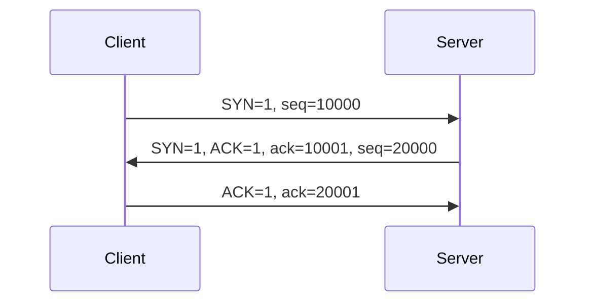
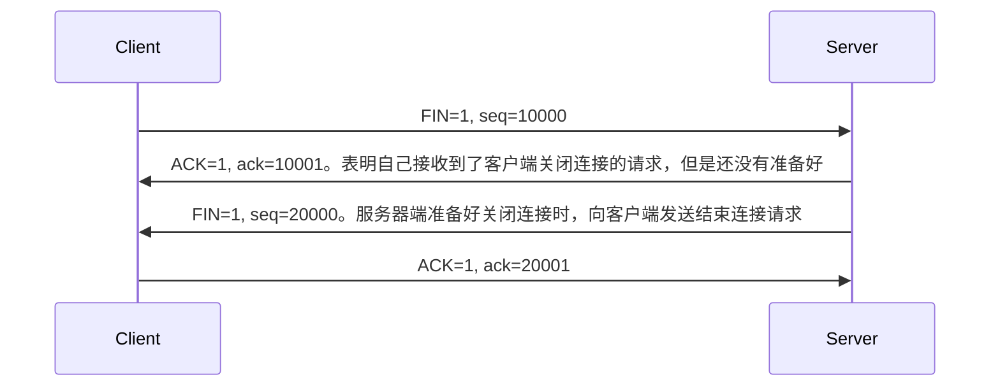
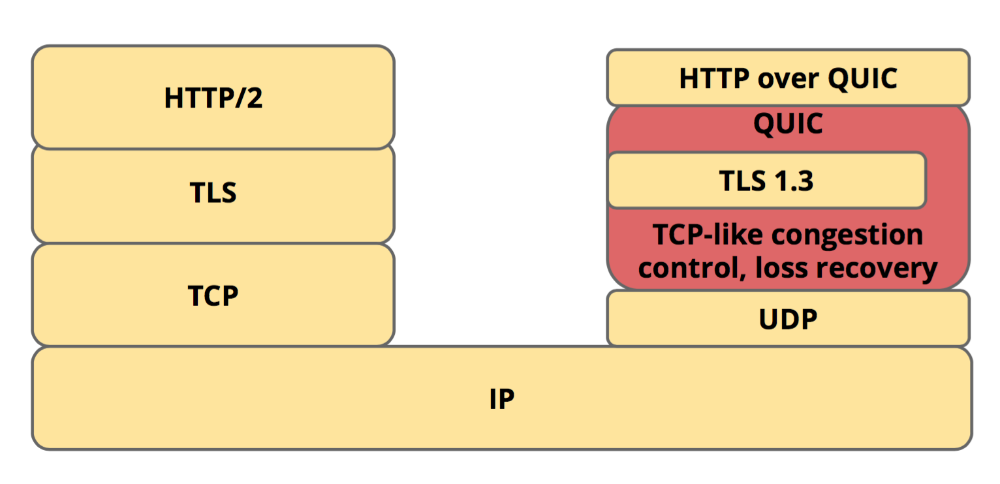

[TOC]

## 网络

### TCP/UDP

TCP 传输控制协议
  + 面向连接，提供可靠交付
  + 流量控制
  + 拥塞控制
    如果网络出现拥塞，分组将会丢失，此时发送方会继续重传，从而导致网络拥塞程度更高。因此当出现拥塞时，应当控制发送方的速率。这一点和流量控制很像，但是出发点不同。流量控制是为了让接收方能来得及接收，而拥塞控制是为了降低整个网络的拥塞程序。

  + 全双工通信
  + 面向字节流 (`应用层传下来的报文看成字节流，把字节流组织成大小不等的数据块`)
  + 点对点 (`一对一`)

UDP 用户数据报协议
  + 无连接，尽最大可能交付
  + 没有拥塞控制
  + 面向报文 (`应用层传下来的报文不合并也不拆分，只是添加UDP首部`)
  + 支持`一对一`，`一对多`，`多对一`，`多对多`的交互通信

#### 首部格式

#### 三次握手

SYN: 同步位
ACK：确认位
FIN: 结束位
ack：确认号，默认是对方发送序号+1
seq：发送序列号

#### 四次挥手

#### FAQ

+ 为什么要三次握手？
    验证双方的接收和发送请求的能力是正常的

+ 为什么要四次挥手？
    因为服务端在`LISTEN`状态下，收到建立连接请求的`SYN`报文后，把`ACK和SYN`放在一个报文里发送给客户端。而关闭连接时，当收到对方的`FIN`报文后，仅仅表示`对方不再发送数据了，但还是能接收数据`，服务端是否现在关闭发送数据通道，需要上层应用来决定，因此，服务端ACK和FIN一般都会分开发。

+ TIME_WAIT是什么？
    客户端接收到服务器端的FIN报文后进入此状态，此时并不是直接进入CLOSED状态，还需要等待一个时间计时器设置的时间2MSL。这么做有两个理由
    + 确保最后一个确认报文能够达到。如果B没收到A发送来的确认报文，那么就会重新发送连接释放请求报文，A等待一段时间就是为了处理这种情况的发生
    + 等待一段时间是为了让本连接持续时间内所产生的所有报文都从网络中消失，使得下一个新的连接不会出现旧的连接请求报文

#### HTTP协议

##### HTTP常见的状态码

+ 1XX `提示信息`
  + 协议处理中的一种中间状态，实际用到的比较少
+ 2XX `服务器成功处理了客户端的请求`
  + 200 **OK** 表示一切正常，如果是非HEAD请求，服务器返回的响应头都会有body数据
  + 204 **No Content** 与**OK**，但响应头没有body数据
  + 206 **Partial Content** 应用于HTTP分块下载或断点续传，表示响应返回的body数据并不是资源的全部，而是其中的一部分，也是服务器处理成功的状态
+ 3XX `表示客户端请求的资源发送了变动，需要客户端用新的URL重新发送请求获取资源，也就是重定向`
  + 301 **Moved Permanently** 表示永久重定向，说明请求的资源已经不存在了，需改用新的URL再次访问
  + 302 **Found** 表示临时重定向，说明请求的资源还在，但暂时需要用另一个URL来访问
    + 301和302都会在响应头里使用字段`Location`，指明后续要跳转的URL，浏览器会自动重定向新的URL
  + 304 **Not Modified** 不具有跳转的含义，表示资源未修改，重定向已存在的缓存文件，也称缓存重定向，用于缓存控制
+ 4XX `表示客户端发送的报文有误，服务器无法处理，也就是错误码的含义`
  + 400 **Bad Request** 表示客户端请求的报文有错误，但只是个笼统的错误
  + 403 **Forbidden** 表示服务器禁止访问资源，并不是客户端的请求出错
  + 404 **Not Found** 表示请求的资源在服务器上不存在或未找到，所以无法提供给客户端
+ 5XX `表示客户端请求报文正确，但是服务器处理时内部发生了错误，属于服务器端的错误码`
  + 500 **Internal Server Error** 与400类型，是个笼统通用的错误码，服务器发生了什么错误，我们并不知道
  + 501 **Not Implemented** 表示客户端请求的功能还不支持，类似'即将开业，敬请期待'的意思
  + 502 **Bad Gateway** 通常是服务器作为网关或代理时返回的错误码，表示服务器自身工作正常，访问后端服务器发生了错误
  + 503 **Service Unavailable** 表示服务器当前很忙，暂时无法响应服务器，类似`网络服务正忙，请稍后重试`的意思

### QUIC `Quick UDP Internet Connection`

QUIC采用的是较不靠谱的`UDP`当作`传输层`，再另外在QUIC层上做`Loss Recovery`和`Congestion Control`，并且引入新的设计以支持`多路复用`，`降低连线交握的延迟`，`解决重传歧义`和`支持Connection Migration`等等。

+ 连线建立
+ 多路复用
+ 封包遗失恢复
+ 流量控制
+ Connection Migration

### 参考链接

[一文搞定 UDP 和 TCP 高频面试题](https://zhuanlan.zhihu.com/p/108822858)
[HTTP/3 傳輸協議 - QUIC 原理簡介](https://medium.com/@chester.yw.chu/http-3-傳輸協議-quic-簡介-5f8806d6c8cd)

## 文件

## 存储