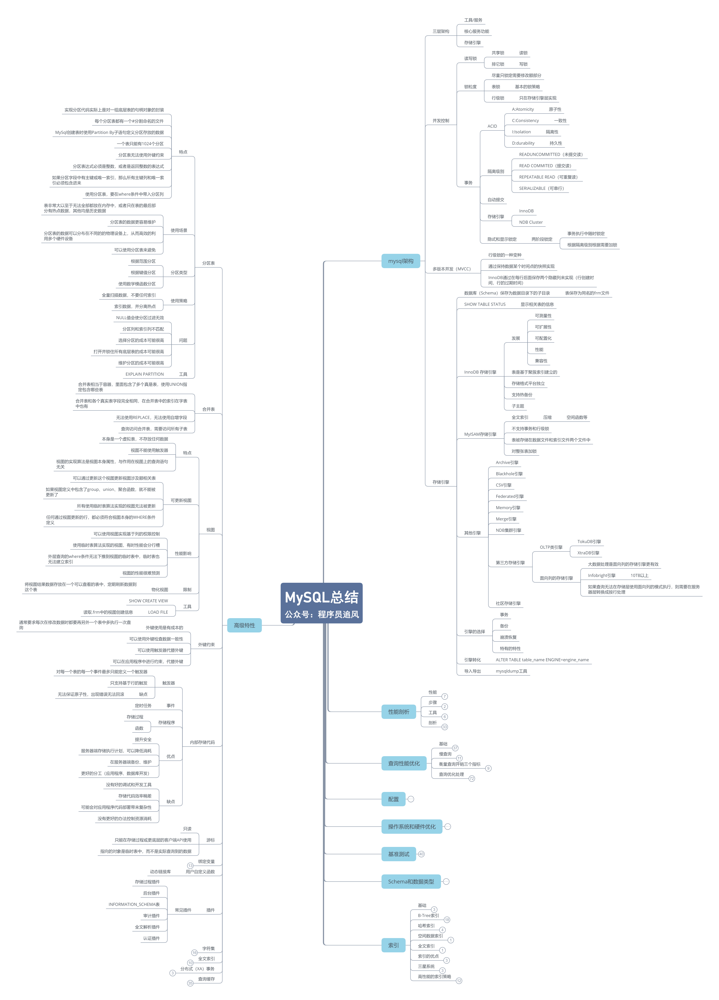

[TOC]

# 数据库

## 概述



## 基本概念

### 存储过程

在数据库中存储复杂程序，以便外部程序调用的一种数据库对象。存储过程是为了完成特定功能的SQL语句集，经编译创建并保存在数据库中，用户可通过指定存储过程的名称并给定参数来调用执行。

```sql
create procedure sp_name(IN p_in INT) ...

# 将语句的结束符号从分号临时改为两个$$（可以是自定义）
delimiter $$
create procedure delete_matches ...
delimiter;
# 将语句的结束符号恢复为分号
```

### 完整性约束

完整性约束是在`表`和`字段`上强制执行的`数据校验规则`，为了`防止不规范的数据进入数据库`，在用户对数据做增删改时，DBMS`自动按照一定的约束条件对数据进行监测`，主要是对`空值`和`重复值`的约束。

+ `实体`完整性
  + 规定表的`每一行`在表中是唯一的实体
+ `域`完整性
  + 表中的`列`必须满足`某种特定的数据类型约束`，包括`取值范围`、`精度`等
+ `参照`完整性
  + 两个表之间的`主键`与`外键`的数据应一致，保证表之间的数据一致性
+ `用户自定义`完整性
  + `约束条件`。如`列约束(NOT NULL)`和`表约束 (PRIMARY KEY)`

### 范式

+ `第一范式`
  + 对`属性`的`原子性`约束，要求属性具有原子性，不可再分割
+ `第二范式`
  + 数据库中的*非主属性*只依赖于*主属性*
    + 对`记录`的`唯一性`约束，要求记录有唯一标识，即`实体的唯一性`
+ `第三范式`
  + 不存在*非主属性*对*关键字*的*传递函数依赖*关系
    + 对`字段`的`冗余性`约束，要求任何字段不能由其他字段派生出来，要求字段没有冗余
  

> 满足第三范式，那就一定满足第二范式；满足第二范式，就一定满足第一范式

### FAQ
+ 超键，候选键，主键，外键是什么？
	+ 超键，`能唯一标识某条数据属性的集合`
	+ 候选键，`最小的超键`
	+ 主键，`人为规定的一个候选键`
	+ 外键，`用于描述两个表的关系`

+ delete和truncate，drop使用场景
	+ drop > truncate > delete
	+ `delete`语句是dml (`data maintain language`)，这个操作会放到`rollback segment`中，事务提交之后才生效，如果有相应的`trigger`，执行的时候将会被触发，执行时可带`where条件`。`truncate`和`drop`是ddl (`data define language`)，操作立即生效，原数据不放到`rollback segment`中，不能回滚，操作不触发`trigger`，执行时不可带`where条件`。

## 分布式锁
分布式模型下，数据只有一份，需要利用锁的技术控制某一时刻修改数据的进程数。

### Redis
+ setnx + expire

### MySQL
+ 乐观锁
  + select ... for update
  + 版本号机制
+ 唯一主键

### ZooKeeper
+ 创建临时节点

# 非关系型数据库

## Redis

### 数据结构

+ String **字符串**
  + set / get
  + mset / mget 一次存储或获取多个
  + incr / incrby (`将字符串值解析成整型，将其加一`)
  + decr / decrby
+ List **列表**
  + rpush / rpop / lpush / lpop
+ Hash **哈希表**
  + hset / hget
+ Set **无序集合**
  + sadd / spop
  + smembers / sismember
+ ZSet **有序集合**

### 限流
+ 计数器
  + 使用`INCRBY`和`EXPIRE`指令，不能做到平滑限制，第1秒的请求全部进去，后面的全部进不去

### 内存淘汰机制
+ *allkeys-lru*
  当内存超出限制，在`所有key`中，移除`最少使用的key`。**推荐**
+ *allkeys-random*
  当内存超出限制，在`所有key`中，随机移除某个key
+ *volatile-lru*
  当内存超出限制，在`设置了过期时间key的字典`中，移除最少使用的key

#### LRU 最近最少使用

除了需要key/value字典外，还需要附加一个链表，链表中的元素按照一定的顺序进行排列。当`空间满的时候，会踢掉链表尾部的元素`。当字典的`某个元素被访问`时，它在链表中的`位置会被移动到表头`。所以链表的`元素排列顺序`就是元素`最近被访问的时间顺序`。

#### LFU 最近经常使用

`redis4.0`后出现，LRU实际上并不精确。LFU使用了`莫里斯计数器`追踪了key的访问频率，根据频率来淘汰key。

### 过期策略

`redis`删除过期键的策略如下

+ 定时删除

  + 优点：保证内存被尽快释放
  + 缺点
    + 创建定时器耗时，影响性能

  给key设置过期时间

  > 缺点是为每一个键实现一个定时器，会耗费较多的资源

+ 定期删除

  + 优点
    + 解决惰性删除的缺点
    + 解决定时删除的缺点
  + 缺点
    + 内存友好方面，不如定时
    + CPU时间友好方面，不如惰性

  定期扫描一遍`expires`字典，将已过期的键删除。(`在redis.conf配置文件设置hs，1s刷新的频率`)

  > 因为不是扫描所有key，每次是随机抽取一部分，所以缺点是不能保证所有的键过期时被及时删除，需在下一个定期删除区间内被扫描并删除

+ 惰性删除

  + 优点：对CPU占用少，只在拿的时候判断，过期就删除，不返回值
  + 缺点：可能内存泄露，无用的值占用了大量内存

  获取每一个`key`的时候，判断一下该`key`是否已经过期，如果已经过期则删除。

  > 如果一个key一直不使用，即使过了过期时间也会一直占用内存，大量的不使用的`key`会使得内存暴增。

`redis`采用了`定期删除`和`惰性删除`两种策略


# 关系型数据库

## Generic SQL

### 数据类型

+ *TEXT*VS*BOLB*
  + TEXT是一个*不区分大小写*的BLOB，唯一区别是*对BLOB值进行排序和比较时区分大小写，对TEXT值不区分大小写*
+ 

### 索引

#### 负面影响

+ `创建索引`和`维护索引`需要耗费时间
+ 索引需要占用`物理空间`
+ 当对表进行`增、删、改`的时候，索引也要动态维护

#### 原则

+ 最左匹配
  对a，b，c三列建立联合索引。实际上建立了a、a，b、a，b，c三个索引。因为联合索引，实际查询的时候，多个索引在一个节点上，所以需要逐个字段匹配，先匹配最左边的字段值，即最左匹配

+ 索引个数
  MySQL最多可支持`单表创建16个索引`

#### 类型

索引仅能分为`聚集索引`和`非聚集索引`两种

+ 主键索引
  + 数据列不允许重复，不允许为NULL，一个表只能有一个主键
+ 唯一索引
  + 数据列不允许重复，允许为NULL，一个表允许多个列创建唯一索引
+ 普通索引
  + 数据列允许重复，允许为NULL
+ 全文索引

#### 结构

+ 二叉树
  + 容易退化成链表
  
+ 红黑树
  + 缺点
    + 要做很多次的IO
  + 优点
    + 解决了二叉树的平衡问题
  + 逻辑约束
    + 节点是红色或黑色
    + 根结点是黑色
    + 每个红色节点的两个字节点都是黑色
    + 新插入的节点默认是红色
    + (`同一层不要求同色`，`各层不要求红色黑色相间`)
  + 平衡措施
    + 变色
    + 自旋

+ B树与B+树索引
  + B树
    + 度(`Degree`) - 节点的数据存储个数
    + 叶节点具有相同的深度
    + 叶节点的指针为空
    + 节点中的数据key从左到右递增排列
  + 多路平衡搜索树(`每个节点有多个指向`)，节点有序
  + 不选择B树做索引结构，因为B树的非叶子节点会存储数据，因为空间问题，导致度可能减少，高度就增高
  + B+树
    + 非叶子结点不存储data，只储存key，可以增大度(`Degree`) **度增大，高度减少**
    + 叶子节点不存储指针
    + 顺序访问指针，提高区间访问的性能 (`双向链表`)
  + B树的优点：`一个节点可以储存多个元素，相对于完全平衡二叉树(也是有序，二叉树是有顺序的)，整个树的高度就降低了，磁盘IO效率提高了`
  + B+树是B树升级版，`在所有叶子结点中，增加了指向下一个叶子节点的指针，因此InnoDB建议为大部分表使用默认自增的主键作为主索引，提高范围查找的效率`
  

`

+ Hash索引
  + 可以快速的精确查询，但是不支持范围查询 (`不是有序的`)，不支持模糊查询
  + 可能存在hash冲突

#### FAQ

+ 索引下推是什么？
  + 在复合索引的查询中，针对特定的过滤条件而进行`减少回表次数`而做出的优化 (`MySQL 5.6以后`)

+ MYSQL查询非常慢怎么找原因？
  + 没有索引，或无法命中索引
  + 内存不足
  + 网络速度慢
  + 一次查询的数据量过大
  + 出现死锁

+ 什么情况下不宜建立索引？

  + `查询很少涉及到`的列，或`重复值`比较多的列
  + 特殊的数据类型，如`文本字段 text`

+ 回表查询是什么？

  InnoDB有`聚集索引`和`普通索引`，`聚集索引`必须有，且只有一个，索引的`叶子结点`存储`行记录`，所以主键查询非常快。`普通索引`的`叶子结点`存放`主键值`，所以`普通索引`需要先查`主键值`，再通过`聚集索引`查`行记录`。

+ 索引失效的场景？

  + 违反`最左匹配`原则 (`缺少左边的索引字段`)
  + 在`索引列上做任何操作` (计算、函数)
  + 索引`范围条件`右边的列 (> <, 本列如有索引则仍生效，总的来说，仍然是联合索引生效)
  + 使用`不等于`
  + `like`以`通配符`开头
  + 数据类型出现`隐式转换` (`如varchar不加单引号可能会自动转换为int`)

+ 锁的优化策略

  + 读写分离
  + 分段加锁
  + 减少锁持有的时间
  + 多个线程尽量以相同的顺序去获取资源

+ 如何实现索引覆盖？

  + 将被查询的字段，建立到`联合索引`里

+ 索引覆盖是什么？

  只需要在一棵索引树上，就能获取SQL所需的所有列数据，无需`回表`。(或`explain的输出结果，Extra字段为Using Index时，能够触发索引覆盖`)

  

### 事务

#### 隔离级别

+ Read uncommitted `读未提交`
+ Read committed `读已提交`
+ Repeatable read `可重复读` **MySQL默认隔离级别**
  + 如何防止幻读
    + 多版本并发控制`MVCC`
    + 间隙锁(`Next-Key Locking`)
+ Serializable `序列化`


#### 并发导致的问题

+ 脏读 (读未提交数据)
  + 事务A读取事务B未提交的数据，此时如果事务B回滚，事务A读到的就是脏数据。
+ 不可重复读
  + 前后多次读取，`数据内容`不一致
+ 幻读
  + 前后多次读取，`数据总量`不一致
+ 幻读 VS 不可重复读
  + 不可重复读针对`update操作`
  + 幻读针对`insert操作、delete操作`

##### ACID特性

+ 原子性 **Atomicity**

  + 指事务是一个不可分割的工作单位，其中的操作要么做，要么都不做

  + 实现原理：`undo log`。InnoDB引擎除了`二进制日志 bin log`、`错误日志`、`查询日志`、`慢查询日志`等，还提供了两种事务性日志：
    + `redo log (重做日志，是追加操作，有大小限制，在配置文件)`

      保证事务持久性

    + `undo log (回滚日志，有大小限制，在配置文件)`

      事务原子性和隔离性实现的基础。InnoDB实现`原子性`，靠的是`undo log`，当事务修改数据库时，InnoDB会生成对应的undo log，当需要回滚数据时，通过查看undo log进行数据回滚。

+ 一致性 **Consistency**

+ 隔离性 **Isolation**

  + 事务内部的操作与其他事务是隔离的，并发执行的各个事务之间不能相互干扰

  分两个方面讨论

  + (一个事务)写操作对(另一个事务)写操作的影响：`锁机制保证隔离性`

  + (一个事务)写操作对(另一个事务)读操作的影响：`MVCC保证隔离性`

    查询操作为了避免查询到`旧数据`、或`已经被其他事务更改过的数据`，需要满足一下条件

    + 查询时，当前事务的`版本号`需要`大于或等于创建版本号`
    + 查询时，当前事务的`版本号`需要`小于删除的版本号`

> MVCC，多版本并发控制，乐观锁为理论基础。利用在每条数据后面加了隐藏的两列(创建版本号、删除版本号)，每个事务在开始的时候都会有一个递增的版本号

+ 持久性 **Durability**
  + 事务一旦提交，它对数据库的改变就应该是永久性的 (`考虑到有缓存的存在，持久性是必须保证数据是写入到磁盘`)
  + 实现原理：`redo log`。InnoDB操作数据库时，会有一个`Buffer Pool (缓存池)`，缓存池的数据再定期刷新到磁盘中。为了预防MySQL宕机导致`刷脏`失败，InnoDB刷缓存的时候，同时写入`redo log`，保证数据不会丢失。

## MySQL

### 执行计划

```sql
# MySQL中的explain支持 SELECT、DELETE、INSERT、REPLACE、UPDATE
explain select ...
```

+ select_type **SELECT的类型**
	+ SIMPLE，不涉及UNION或者子查询的简单查询
	+ PRIMARY，最外层SELECT
	+ UNION，
+ table **数据行的来源表**
	+ <unionM,N>

### 常用函数

+ 聚合函数
	+ *COUNT* 统计查询结果的行树
	+ *MIN* 查询指定列的最小值
	+ *MAX* 查询指定列的最大值
	+ *SUM* 求和，返回指定列的总和
	+ *AVG* 求平均值，返回指定列数据的平均值

+ 数值型函数
	+ *ABS* 返回绝对值
	+ *BIN* 返回二进制
	+ *CEILING* 返回大于X的最小整数值
	+ *EXP* 返回E(自然对数的底)的X次方
	+ *FLOOR* 返回小于X的最大整数值
	+ *GREATEST* 返回集合中最大的值
	+ *LEAST* 返回集合中最小的值
	+ *LN* 返回X的自然对数
	+ *LOG* 返回x的以y为底的对数
	+ *MOD* 返回x/y的模
	+ *PI* 返回pi的值
	+ *RAND* 返回0到1内的随机值，可以通过提供一个参数种子，使RAND随机数生成器生成一个指定的值
	+ *ROUND* 返回参数x的四舍五入的有y位小数的值
	+ *TRUNCATE* 返回数字x截短为y位小数的结果

+ 字符串函数
	+ *LENGTH* 计算字符串长度函数，返回字符串的字节长度
	+ *CONCAT* 合并字符串函数
	+ *INSERT* 
	+ *LOWER* 
	+ *UPPER* 
	+ *LEFT* 返回字符串str中最左边的x个字符
	+ *RIGHT* 返回字符串str中最右边的x个字符


### 引擎
+ 引擎是针对`表`的
+ MyISAM 与 InnoDB 引擎 (`MySQL 5.5版本开始默认引擎为InnoDB`)
  + InnoDB`支持事务`，MyISAM不支持
  + InnoDB`支持外键`，MyISAM不支持
  + InnoDB最小的锁粒度是`行锁`，MyISAM最小的锁粒度是`表锁`。`MyISAM插入数据时锁全表`
  + InnoDB主键是`聚集索引`，MyISAM主键是`非聚集索引`
  + InnoDB`不存放表记录行树`，MyISAM会`存放表记录行数`
  + InnoDB文件，MyISAM会生成`frm 表定义文件`、`myd 数据文件`、`myi 索引文件`

> 聚集索引，每个InnoDB表都有一个特殊的索引，称为聚集索引，索引中保存了数据，避免直接读取磁盘。通常，聚集索引与`主键`义同。

+ 聚集索引
  + InnoDB将`primary key`列用作聚集索引。
  + 如果没有主键，InnoDB将`unique`和`not null`的列作为聚集索引
  + 如果都没有，InnoDB内部生成一个隐藏的聚集索引
+ 锁
  + *MyISAM*支持*表锁*，*InnoDB*支持*表锁*和*行锁*，默认为*行锁*
  + 表锁
    + 开销小，加锁快，不会出现死锁。锁定粒度大，发生锁冲突的概率最高，并发量最低

  + 行锁
    + 开销大，加锁慢，会出现死锁。锁粒度小，发生锁冲突的概率小，并发度最高


### FAQ

+ InnoDB怎么保证必有主键？
+ InnoDB用自增主键有什么好处？
  + 在储存和检索时，InnoDB会对主键进行物理排序，这对auto_increment_int是个好消息，因为后一次插入的主键位置总是在最后。但是对uuid来说，这却是个坏消息，因为uuid时杂乱无章的，每次插入的主键位置是不确定的，可能在开头，也可能在中间，在进行主键物理排序的时候，势必会造成大量的IO操作影响效率，在数据量不停增长的时候，特别是数据量上了千万条记录的时候，读写性能下降的非常厉害。
+ MySQL有几种锁？
  + 表锁 **InnoDB** **MyISAM**
    + 不会出现死锁，粒度较大
  + 行锁 **InnoDB**
    + 会出现死锁，粒度最小
  + 页面锁 **BDB**
    + 一次锁定相邻的一组记录
+ 优化专题
  + `SQL语句`与`索引`优化
    + 用`exists`替代`in`，用`not exists`替代`not in`
    + 避免索引失效
  + 数据库表结构优化
  + 系统配置优化
  + 硬件优化

## Oracle

### FAQ

+ 执行计划怎么看？
  + 先执行 `explain plan for ...`
  + 执行 `select * from table(dbms_xplan.display)` 获取结果
  + 结果说明
    + Id，序号，不是执行的先后顺序。执行的先后根据缩进来判断
    + Operation，当前操作的内容
      + table access full。全表扫描。使用多块读操作，一次I/O能读取多块数据块
      + table access by index rowid。通过ROWID的表存取，一次I/O只能读取一个数据块。通过rowid读取表字段，rowid可能是索引键值上的rowid。
      + index unique scan。索引唯一扫描，如果表字段有`UNIQUE`或`PRIMARY KEY`约束，Oracle实现索引唯一扫描。
      + index range scan。索引范围扫描，最常见的索引扫描方式。在非唯一索引上都使用索引范围扫描。
      + index full scan。索引全扫描，即查询的数据都属于索引字段，一般含有排序操作。
      + index fast full scan。索引快速扫描，如果查询的数据都属于索引字段，并且没有进行排序操作，那么是属于这种情况。条件比较极端，出现比较少。
    + Name，操作的对象名称
    + Rows，当前操作的基数，Oracle估计当前操作的返回结果集
    + Cost，Oracle计算出来的一个数值，用于说明SQL执行的代价
    + Time，Oracle估计当前操作的时间

+ NVL与NVL2两个函数的用法和区别？
  + NVL(expr1, expr2), expr1为null，返回expr2；不为NULL，返回expr1。`注意两者类型一致`
  + NVL2(expr1, expr2, expr3), expr1不为NULL，返回expr2；为NULL，返回expr3。expr2和expr3类型不同的话，expr3会转换为expr2的类型。
+ 


# 参考链接

[快速理解脏读、不可重复读、幻读和MVCC](https://cloud.tencent.com/developer/article/1450773)
