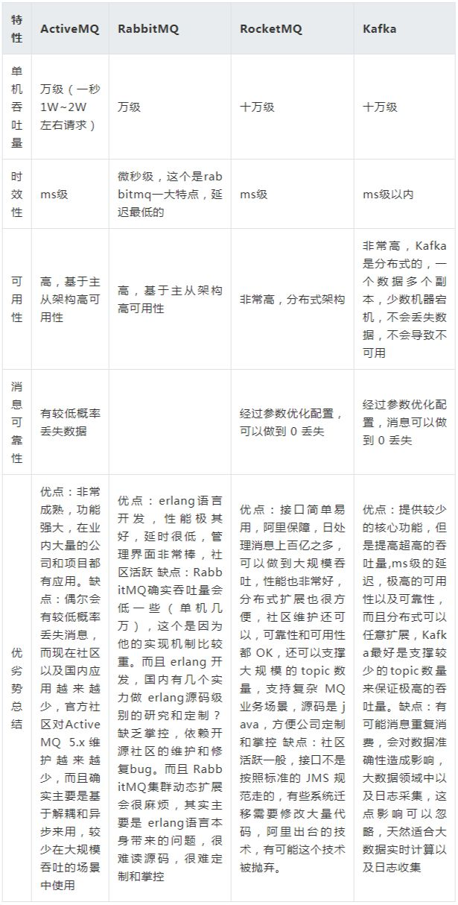

[TOC]

# 消息队列

+ 缺点

  + 系统可用性降低
    
    系统引入的外部依赖越多，越容易挂掉
    
  + 系统复杂性提高

    保证消息没有重复消费，处理消息丢失的情况，保证消息传递的顺序性

  + 一致性问题

    多个请求发送倒消息队列，其中几个处理失败了，几个处理成功

+ 解决的问题

  + 解耦

    + 不同系统之间，不再需要特定的对接开发，只需要将数据发布到消息队列上即可

  + 异步

    + 需要同步调用不同系统的接口时，通过消息队列异步调用。

  + 削峰

    + 请求放入消息队列，消费者按能力消费

## 通信方式

### ActiveMQ

+ *发布-订阅*模式（Publish-Subscribe）
+ *点对点*模式（Point-To-Point）

## 常见问题

+ 消息丢失怎么办
  + *发布-订阅*模式，默认情况下*只通知一次*，如果接收不到此消息就没有了
    + 这种场景只适用于对消息送达率要求不高的情况
    + 如果要求消息*必须送达*不可丢失的话，需要配置*持久订阅*，每个订阅端定义一个id。*发布消息*和*接收消息*需要配置发送模式为*持久化*。此时如果客户端接收不到消息，消息会*持久化*到服务端，直到客户端正常接收后为止
  + *点对点*模式，如果消息发送不成功，此消息*默认*会保存到服务器，直到有消费者将其消息，所以此时消息是不会丢失的
+ 消息重复接收问题
  + 业务端加一张表，用来存放消息是否执行成功，每次业务事务commit之后，告知服务端，已经处理过该消息
+ 

# RabbitMQ

## 应用

+ 高可用

  + 单机模式

  + 普通集群模式 **非高可用**

    队列的`元数据`存在于多个实例，但是`消息`不存在于多个实例。只是提高消费的吞吐量。

  + 镜像集群模式 **高可用，非分布式**

    队列的`元数据`和`消息`都会存在于多个实例中，每次写消息到队列时，都会自动把消息同步到多个实例的队列里

## FAQ

+ 消息怎么路由？

  消息路由有三部分：`交换器 (Exchange)`，`路由 (Routing)`，`绑定 (Binding)`

  + 生产者把消息发布到`交换器`，消息将拥有`路由键 (routing key)`，常用的交换器如下

    + direct

      如果路由键完全匹配，消息就被投递到相应的队列

    + fanout

      如果交换器收到消息，将会广播到所有绑定的队列上

    + topic

      可以使来自不同源头的消息能够到达同一个队列

  + `绑定`决定了消息如何从`交换器`到`特定的队列`

+ 如何避免消息重复投递或重复消费？

  在消息生产时，MQ内部针对每条生产者发送的消息生成一个inner-msg-id，作为去重和幂等的依据(`消息投递失败并重传`)，避免重复的消息进入队列。

  消息消费时，要求消息体中必须要有一个`业务ID`，作为去重和幂等的依据，避免同一条消息被重复消费。

+ `消息发送确认`与`消息接收确认`

  + `ConfirmCallback`

    实现`ConfirmCallback`接口，消息发送到Broker(`消息服务器`)后触发回调，确认消息是否到达Broker服务器，也就是`只确认是否正确到达Exchange中`

  + `ReturnCallback`

    实现`ReturnCallback`接口，启动消息失败返回，比如路由不到队列时触发回调 (`消息从交换器到队列投递失败`)

+ 生产者怎么知道，消费被消费者消费？

  + 如果消息处理耗时长，可使用另一个消息队列，来发布消费成功确认的消息

  + 消费成功后，把`消息id`写入redis，生产者在`confirmCallback`里面循环查询redis结果。

+ 如何保证消息在传送的过程中不会丢失？

  + 生产者弄丢了数据

    + `事务`机制 **同步**

      生产者发送数据之前开启`rabbitmq事务`，然后发送消息，如果`消息没有成功被rabbitmq接收到`，那么生产者会收到异常报错，此时就可以`回滚事务`，然后`重试发送消息`；如果收到了消息，那么可以`提交事务`。(`事务机制是同步，会降低吞吐量`)。事务可以针对多条消息。

    + 使用`confirm`机制 **异步** **推荐**

      生产者设置那里开启`confirm模式`之后，每次写的消息都会分配一个唯一的id，然后如果`写入了rabbitmq`中，rabbitmq会给你回传一个`ack消息`，告诉你说这个消息ok了。`confirm`机制只能针对一条消息。

      如果rabbitmq`没能处理这个消息`，会回调给你一个`nack`接口，告诉你这个消息接收失败，你可以重试。

      而且你可以结合这个机制，自己在内存里`维护每个消息id的状态`，如果`超过一定时间还没接收到这个消息的回调`，那么可以`重发`。

  + rabbitmq弄丢了数据

    + 开启rabbitmq`持久化`

      消息写入到rabbitmq后，持久化到磁盘，哪怕是rabbitmq自己挂了，恢复之后会自动读取之前存储的数据。(`rabbitmq还没持久化，自己就挂了，可能导致数据丢失`)。可以跟生产者的`confirm`机制配合起来，只有消息被持久化到磁盘后，才会通知生产者ack了。

      + 创建queue时设置持久化 **持久化queue的元数据，不会持久化queue里的数据**
      + 发送消息时，设置消息为持久化 (`deliveryMode设置为2`)

  + 消费者弄丢了数据

    + `ack机制`

      处理完逻辑后，动手ack。

  > rabbitmq不会为未ack的消息设置超时时间，它判断此消息是否需要重新投递给消费者的唯一依据是消费该消息的消费者连接是否已经**断开**。这么设计的原因是`rabbitmq允许消费者一条消息的时间可以很久很久`。重点：如果消费者没发送ACK，没有超时限制，rabbitmq也不会重复投递，只有`消费者的TCP连接或者channel关闭了，rabbitmq才会重复投递`

  > 如果出现重复投递消息，消费端要做好`幂等性`。如果不想处理重复投递的消息，可以通过业务ID去重。

  

  

  

  

# RocketMQ

# Kafaka

# 对比

